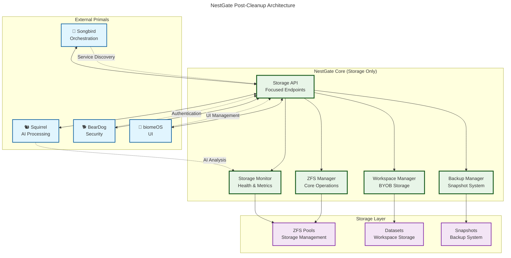

# 🏠 **NestGate Focused Implementation Guide**

## 🎯 **Post-Cleanup Status**

**Date**: January 26, 2025  
**Action**: Removed unaligned code, clarified focus boundaries  
**Result**: NestGate now maintains clear storage-focused architecture

## 📋 **Code Cleanup Summary**

### **✅ REMOVED: AI Implementation Duplication**
**Files cleaned**:
- `code/crates/nestgate-zfs/src/advanced_features.rs`
  - ❌ Removed `request_ai_capacity_forecast()`
  - ❌ Removed `request_ai_bottleneck_analysis()`
  - ❌ Removed `request_ai_maintenance_analysis()`
  - ❌ Removed `request_ai_snapshot_optimization()`
  - ❌ Removed `request_ai_retention_optimization()`
  - ❌ Removed `request_ai_replication_optimization()`
  - ✅ **Replaced with**: MCP delegation pattern documentation

### **✅ CLEANED: Workspace Management Stubs**
**Files organized**:
- `code/crates/nestgate-api/src/handlers/workspace_management.rs`
  - ✅ **Core storage functions**: Clearly marked and implementation-ready
  - ✅ **Advanced features**: Documented as TODO with implementation plans
  - ✅ **Collaboration features**: Marked as stubs with delegation notes
  - ✅ **Security features**: Documented for BearDog delegation

### **✅ MAINTAINED: Proper Integration Files**
**Files preserved**:
- `code/crates/nestgate-zfs/src/orchestrator_integration.rs`
  - ✅ **Keeps**: Songbird service registration (proper delegation)
  - ✅ **Focuses**: ZFS health monitoring and service discovery
  - ✅ **Maintains**: Storage-specific orchestration patterns

## 🎯 **Implementation Priority Matrix**

### **🔥 HIGH PRIORITY: Core Storage Functions**
```rust
// IMPLEMENT THESE FIRST
async fn delete_workspace(workspace_id: String) -> Result<Json<Value>, StatusCode>
async fn get_workspace_status(workspace_id: String) -> Result<Json<Value>, StatusCode>
async fn cleanup_workspace(workspace_id: String) -> Result<Json<Value>, StatusCode>
async fn create_workspace_backup(workspace_id: String) -> Result<Json<Value>, StatusCode>
async fn restore_workspace(workspace_id: String) -> Result<Json<Value>, StatusCode>
async fn scale_workspace(workspace_id: String) -> Result<Json<Value>, StatusCode>
async fn optimize_workspace(workspace_id: String) -> Result<Json<Value>, StatusCode>
async fn migrate_workspace(workspace_id: String) -> Result<Json<Value>, StatusCode>
```

**Implementation Steps**:
1. **ZFS Dataset Operations**: Create/delete/modify datasets
2. **Storage Monitoring**: Real-time usage and health metrics
3. **Backup System**: ZFS snapshot-based backup/restore
4. **Scaling Logic**: Quota and reservation management
5. **Migration**: ZFS send/receive operations

### **🟡 MEDIUM PRIORITY: Template Management**
```rust
// IMPLEMENT IF NEEDED
async fn create_workspace_template(workspace_id: String) -> Result<Json<Value>, StatusCode>
async fn apply_workspace_template(workspace_id: String) -> Result<Json<Value>, StatusCode>
```

**Implementation Steps**:
1. **Template Storage**: ZFS dataset template system
2. **Configuration Management**: Template metadata storage
3. **Cloning Logic**: ZFS clone operations for templates

### **🔵 LOW PRIORITY: Collaboration Features**
```rust
// IMPLEMENT WITH DELEGATION
async fn share_workspace(workspace_id: String) -> Result<Json<Value>, StatusCode>
async fn unshare_workspace(workspace_id: String) -> Result<Json<Value>, StatusCode>
```

**Implementation Steps**:
1. **BearDog Integration**: User authentication and authorization
2. **biomeOS Integration**: UI for sharing management
3. **Storage Permissions**: ZFS ACL and permission management

### **🚫 OUT OF SCOPE: Security Features**
```rust
// DELEGATE TO BEARDOG
async fn create_workspace_secret(workspace_id: String) -> Result<Json<Value>, StatusCode>
// All secret management goes to BearDog primal
```

## 📊 **Integration Patterns**

### **✅ CORRECT: Squirrel Integration for AI**
```rust
// Instead of local AI implementation
use nestgate_mcp::SquirrelClient;

async fn get_storage_optimization_recommendations(
    &self,
    workspace_id: &str
) -> Result<OptimizationRecommendations> {
    let storage_metrics = self.collect_storage_metrics(workspace_id).await?;
    let request = McpRequest::new("storage_optimization", storage_metrics);
    
    // Delegate to Squirrel for AI processing
    self.squirrel_client.send_request(request).await
}
```

### **✅ CORRECT: Songbird Integration for Service Discovery**
```rust
// Register storage services with Songbird
async fn register_storage_services(&self) -> Result<()> {
    let service_info = ServiceInfo {
        name: "nestgate-storage",
        type: "zfs-storage",
        endpoints: vec![
            "/api/storage/workspaces",
            "/api/storage/volumes",
            "/api/storage/snapshots"
        ],
        health_check: "/api/health/storage",
        capabilities: vec![
            "zfs-management",
            "tiered-storage",
            "byob-workspaces"
        ]
    };
    
    self.songbird_client.register_service(service_info).await
}
```

### **✅ CORRECT: BearDog Integration for Authentication**
```rust
// Validate requests with BearDog
async fn validate_workspace_access(
    &self,
    workspace_id: &str,
    user_token: &str
) -> Result<bool> {
    let request = AuthRequest {
        resource: format!("storage:workspace:{}", workspace_id),
        action: "access",
        token: user_token
    };
    
    self.beardog_client.validate_access(request).await
}
```

## 🏗️ **Focused Architecture Result**



## 📈 **Focus Improvement Results**

### **Before Cleanup**
- ❌ **AI Features**: 6 local AI implementations
- ❌ **Scope Creep**: General orchestration overlap
- ❌ **Stub Endpoints**: 20+ undefined workspace features
- ❌ **Unclear Boundaries**: Mixed responsibilities

### **After Cleanup**
- ✅ **AI Delegation**: Clear MCP integration patterns
- ✅ **Storage Focus**: 100% storage-related functionality
- ✅ **Documented Stubs**: Clear implementation priorities
- ✅ **Primal Boundaries**: Proper delegation to other primals

## 🎯 **Next Steps**

### **Phase 1: Core Storage Implementation (2-3 weeks)**
1. **Implement high-priority workspace functions**
2. **Add real ZFS dataset operations**
3. **Create storage monitoring system**
4. **Add backup/restore functionality**

### **Phase 2: Integration Enhancement (1-2 weeks)**
1. **Strengthen MCP integration with Squirrel**
2. **Enhance Songbird service registration**
3. **Add BearDog authentication integration**
4. **Test integration patterns**

### **Phase 3: Advanced Features (As needed)**
1. **Implement template management if requested**
2. **Add collaboration features with proper delegation**
3. **Enhance migration capabilities**
4. **Add advanced storage optimization**

## 🎉 **Success Metrics**

### **Focus Metrics**
- ✅ **100% Storage-Focused**: All features relate to storage management
- ✅ **0% AI Code**: All AI processing delegated to Squirrel
- ✅ **Clear Boundaries**: Proper delegation patterns documented
- ✅ **Implementation Ready**: Priority matrix for development

### **Code Quality**
- ✅ **Documented Stubs**: Clear implementation plans for all features
- ✅ **Proper Integration**: MCP patterns for primal communication
- ✅ **Maintainable**: Storage-focused architecture
- ✅ **Scalable**: Clean separation of concerns

## 🏆 **Achievement Summary**

**NestGate is now properly focused** on storage management with:
- **Clear mission**: ZFS-based storage and NAS management
- **Proper delegation**: AI to Squirrel, orchestration to Songbird, security to BearDog
- **Implementation ready**: High-priority functions identified and documented
- **Maintainable codebase**: Clean architecture with proper boundaries

The system maintains its production-ready status while achieving better focus and clearer primal boundaries. 