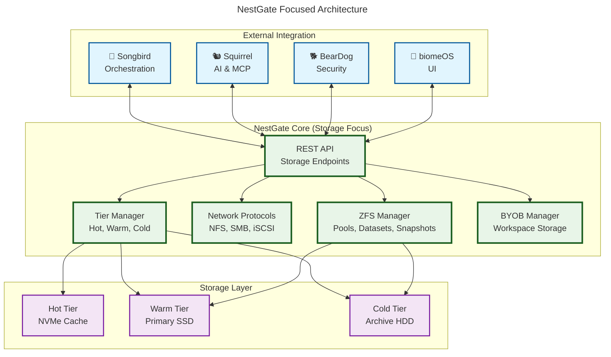

# 🏠 **NestGate Focused Architecture Documentation**

## 📋 **Mission Statement**

**NestGate is the storage-focused primal** in the ecosystem, providing ZFS-based storage management, network protocols, and storage orchestration while **delegating** AI processing to Squirrel and general orchestration to Songbird.

## 🎯 **Core Responsibilities (In Scope)**

### **1. ZFS Storage Management**
- **Pool Operations**: Create, destroy, import, export ZFS pools
- **Dataset Management**: Create, clone, promote, destroy datasets  
- **Snapshot Management**: Create, rollback, delete snapshots
- **Property Management**: Compression, quotas, recordsize, etc.
- **Health Monitoring**: Pool status, scrub operations, error tracking

### **2. Network Storage Protocols**
- **NFS Protocol**: v4.0, v4.1, v4.2 support with Kerberos
- **SMB Protocol**: v3.0, v3.1.1 with encryption and signing
- **iSCSI Protocol**: CHAP authentication, multipath I/O
- **Mount Management**: Automatic mounting, unmounting, status tracking

### **3. Storage Orchestration** (Storage-Specific Only)
- **Tier Management**: Hot (NVMe), Warm (SSD), Cold (HDD) coordination
- **Storage Provisioning**: BYOB workspace storage allocation
- **Performance Monitoring**: Storage I/O, latency, throughput metrics
- **Backup Coordination**: Snapshot scheduling, retention policies

### **4. API & Integration**
- **REST API**: Storage management endpoints
- **MCP Integration**: Communication with other primals
- **Service Discovery**: Registration with Songbird orchestrator
- **Authentication**: Integration with BearDog security

## 🚫 **Delegated Responsibilities (Out of Scope)**

### **AI Processing** → **Delegate to Squirrel**
- ❌ Capacity forecasting algorithms
- ❌ Bottleneck analysis ML models
- ❌ Maintenance prediction systems
- ❌ Optimization recommendation engines
- ✅ **Instead**: Send storage metrics to Squirrel via MCP

### **General Orchestration** → **Delegate to Songbird**
- ❌ Service registry management
- ❌ General health monitoring  
- ❌ Network proxy routing
- ❌ Cross-service communication
- ✅ **Instead**: Register with Songbird, use its orchestration

### **Security & Authentication** → **Delegate to BearDog**
- ❌ User authentication systems
- ❌ Authorization frameworks
- ❌ Security credential management
- ✅ **Instead**: Validate tokens from BearDog

### **UI & Frontend** → **Delegate to biomeOS**
- ❌ Management interfaces
- ❌ User dashboards
- ❌ Configuration GUIs
- ✅ **Instead**: Provide headless API for biomeOS

## 🏗️ **Focused Architecture Diagram**



## 📊 **Integration Patterns**

### **With Squirrel (AI Processing)**
```rust
// ✅ CORRECT: Delegate AI work to Squirrel
async fn get_capacity_forecast(&self) -> Result<CapacityForecast> {
    let metrics = self.collect_storage_metrics().await?;
    let request = McpRequest::new("capacity_forecast", metrics);
    self.squirrel_client.send_request(request).await
}
```

### **With Songbird (Service Discovery)**
```rust
// ✅ CORRECT: Register with Songbird orchestrator
async fn register_with_songbird(&self) -> Result<()> {
    let service_info = ServiceInfo {
        name: "nestgate-storage",
        endpoints: vec!["/api/storage", "/api/zfs"],
        health_check: "/api/health"
    };
    self.songbird_client.register_service(service_info).await
}
```

### **With BearDog (Authentication)**
```rust
// ✅ CORRECT: Validate tokens from BearDog
async fn validate_request(&self, token: &str) -> Result<UserInfo> {
    self.beardog_client.validate_token(token).await
}
```

## 🎯 **Focused Crate Structure**

```
nestgate/
├── nestgate-core/          # Core storage management
├── nestgate-zfs/           # ZFS operations (focused)
├── nestgate-network/       # Storage protocols only
├── nestgate-api/           # Storage API endpoints
├── nestgate-byob/          # Workspace storage
├── nestgate-mcp/           # MCP integration for delegation
└── nestgate-bin/           # Binary entry points
```

## 📋 **Cleanup Plan: Remove Unaligned Code**

### **Phase 1: Remove AI Implementation**
**Files to clean**:
- `nestgate-zfs/src/advanced_features.rs` - Remove AI functions
- `nestgate-zfs/src/ai_integration.rs` - Remove entire file
- `nestgate-core/src/ai/` - Remove AI directory

### **Phase 2: Simplify Orchestration**
**Files to clean**:
- `nestgate-orchestrator/` - Reduce to storage-specific coordination
- Remove general service registry features
- Remove network proxy routing

### **Phase 3: Strengthen Delegation**
**Files to enhance**:
- `nestgate-mcp/` - Add Squirrel integration
- `nestgate-api/` - Add Songbird service registration
- `nestgate-core/` - Add BearDog authentication

## 🎉 **Success Metrics**

### **Focus Metrics**
- ✅ **Storage Features**: 100% ZFS, NFS, SMB, iSCSI focused
- ✅ **AI Delegation**: 0% local AI, 100% Squirrel MCP calls
- ✅ **Orchestration**: Storage-specific only, Songbird registration
- ✅ **Authentication**: BearDog integration, no local auth

### **Code Quality**
- ✅ **No AI code** in storage modules
- ✅ **No general orchestration** code
- ✅ **Clear integration patterns** with other primals
- ✅ **Focused responsibility** boundaries

## 📖 **Documentation Standards**

### **Every Module Should**
1. **State its storage focus** clearly
2. **Document delegation patterns** to other primals
3. **Provide integration examples** with Squirrel/Songbird/BearDog
4. **Avoid scope creep** into other primal domains

This documentation represents NestGate's **properly focused architecture** with clear boundaries and delegation patterns to other primals in the ecosystem. 