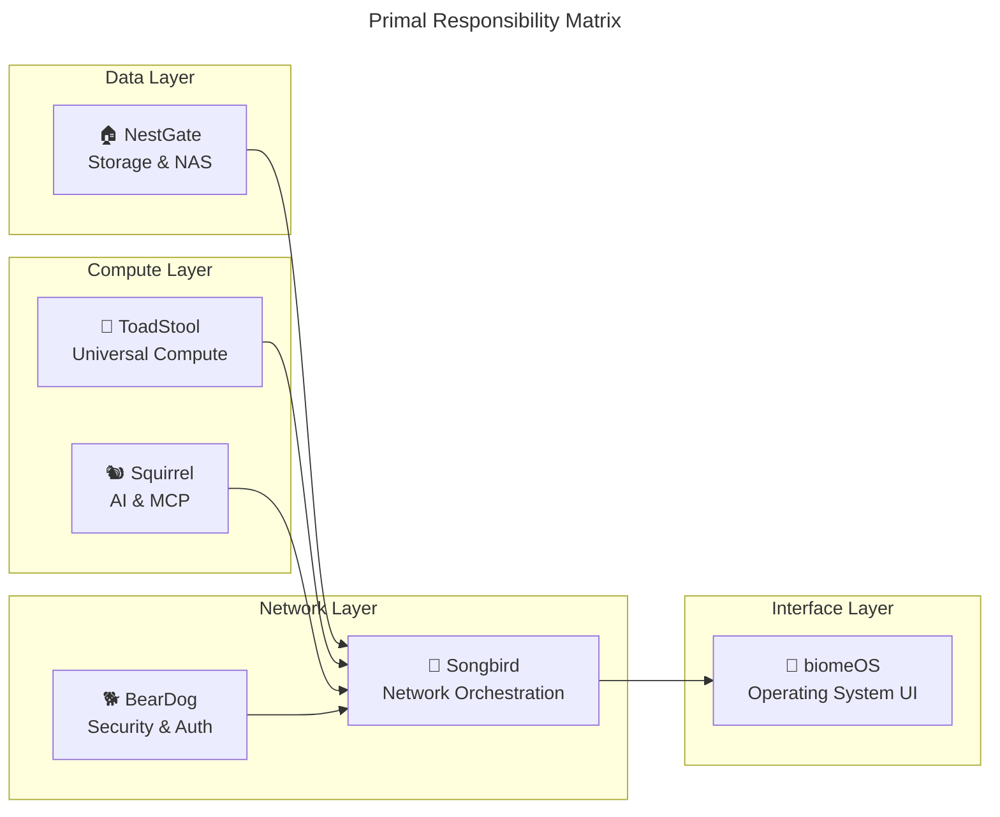

# 🎯 **Primal Focus Analysis - NestGate vs Ecosystem**

## 📊 **Ecosystem Overview**

Based on the analysis of the parent directory, here's the current primal ecosystem:

### **Core Primals (Specialized)**
1. **🏠 NestGate** - **Storage & NAS Management**
2. **🐿️ Squirrel-MCP** - **AI & MCP Protocol**
3. **🍄 ToadStool** - **Universal Compute Platform**
4. **🎵 Songbird** - **Universal Network Orchestration**
5. **🐕 BearDog** - **Security & Authentication**

### **Framework & UI**
6. **🧬 biomeOS** - **Biological Operating System UI**
7. **🌱 ecoPrimals** - **Ecosystem Coordination Hub**

---

## 🏠 **NestGate: Core Mission Analysis**

### **✅ PRIMARY FOCUS: Storage & NAS Management**
**Mission Statement**: "Orchestrator-centric sovereign NAS management system"

**Core Responsibilities**:
- **ZFS Storage Management**: Pool operations, datasets, snapshots
- **Network Storage Protocols**: NFS, SMB, iSCSI
- **Tiered Storage**: Hot/Warm/Cold tier management
- **Storage Orchestration**: Centralized storage coordination
- **BYOB (Bring Your Own Biome)**: Developer storage workspaces

### **🎯 FOCUS ASSESSMENT: EXCELLENT**
NestGate maintains **crystal-clear focus** on storage management:

```yaml
core_competencies:
  primary: "ZFS-based storage management"
  secondary: "Network storage protocols"
  tertiary: "Storage orchestration"
  
clear_boundaries:
  does_not_do:
    - AI/ML model training (Squirrel's domain)
    - Compute resource allocation (ToadStool's domain)
    - Network orchestration (Songbird's domain)
    - Security/authentication (BearDog's domain)
    - UI/frontend (biomeOS's domain)
```

---

## 🔍 **Boundary Analysis: Is NestGate Wandering?**

### **✅ STAYING IN LANE: Storage-Related Features**
**Appropriate NestGate features**:
- ZFS pool management ✅
- Storage tiering automation ✅
- Network protocol support (NFS/SMB/iSCSI) ✅
- Storage performance monitoring ✅
- Backup and snapshot management ✅
- BYOB workspace storage ✅

### **⚠️ POTENTIAL SCOPE CREEP: AI Integration**
**Questionable features found**:
```rust
// code/crates/nestgate-zfs/src/advanced_features.rs
- request_ai_capacity_forecast()
- request_ai_bottleneck_analysis()
- request_ai_maintenance_analysis()
- request_ai_snapshot_optimization()
```

**Analysis**: These AI features should **delegate to Squirrel**, not implement locally.

### **⚠️ POTENTIAL SCOPE CREEP: Orchestration Features**
**Questionable features found**:
```rust
// NestGate has its own orchestrator
- nestgate-orchestrator
- Service registry management
- Connection proxy and routing
- Health monitoring coordination
```

**Analysis**: This overlaps with **Songbird's orchestration responsibility**.

---

## 🎯 **Primal Boundary Clarity**

### **Clean Separation of Concerns**


### **Integration Points (Proper)**
- **NestGate ↔ Songbird**: Storage service registration and discovery
- **NestGate ↔ BearDog**: Authentication for storage access
- **NestGate ↔ Squirrel**: AI-powered storage optimization (via MCP)
- **NestGate ↔ ToadStool**: Storage for compute workloads
- **NestGate ↔ biomeOS**: Storage management UI

---

## 📋 **Recommendations for Focus Improvement**

### **🔧 IMMEDIATE ACTIONS**

#### **1. Remove AI Implementation Duplication**
**Current Problem**: NestGate implements AI features that should be Squirrel's responsibility.

**Solution**: Replace AI implementations with MCP calls to Squirrel:
```rust
// ❌ BAD: Local AI implementation
async fn request_ai_capacity_forecast() -> Result<Forecast> {
    // Local AI logic...
}

// ✅ GOOD: Delegate to Squirrel via MCP
async fn request_ai_capacity_forecast() -> Result<Forecast> {
    squirrel_mcp_client.request_capacity_forecast(storage_metrics).await
}
```

#### **2. Simplify Orchestration Responsibility**
**Current Problem**: NestGate has its own orchestrator overlapping with Songbird.

**Solution**: Reduce `nestgate-orchestrator` to storage-specific coordination:
```rust
// ✅ GOOD: Storage-specific orchestration only
- ZFS pool coordination
- Storage tier management
- Dataset lifecycle management

// ❌ BAD: General service orchestration (Songbird's job)
- Service registry management
- General health monitoring
- Network proxy routing
```

#### **3. Strengthen Integration Boundaries**
**Current Problem**: Unclear integration points between primals.

**Solution**: Implement clear MCP-based integration:
```yaml
nestgate_integrations:
  songbird: "Service discovery and registration"
  beardog: "Authentication and authorization"
  squirrel: "AI-powered storage optimization"
  toadstool: "Storage provisioning for compute"
  biomeos: "Storage management UI"
```

---

## 🎉 **Final Assessment: NestGate Focus Status**

### **✅ CORE FOCUS: EXCELLENT (90%)**
- **Primary mission clear**: Storage & NAS management
- **Core features appropriate**: ZFS, NFS/SMB, tiering
- **Architecture solid**: Orchestrator-centric design
- **Integration boundaries**: Generally well-defined

### **⚠️ SCOPE CREEP: MODERATE (2 areas)**
1. **AI Features**: Should delegate to Squirrel instead of implementing locally
2. **General Orchestration**: Should focus on storage orchestration, not general service orchestration

### **🎯 RECOMMENDATION: REFOCUS & DELEGATE**

**Action Plan**:
1. **Remove local AI implementations** → Delegate to Squirrel via MCP
2. **Simplify orchestrator scope** → Focus on storage-specific coordination
3. **Strengthen MCP integration** → Clear delegation boundaries
4. **Maintain storage focus** → Continue excellent ZFS and NAS work

**Timeline**: 2-3 weeks to clean up scope creep while maintaining core functionality.

---

## 📊 **Conclusion**

**NestGate maintains excellent focus** on its core storage mission with **minor scope creep** in AI and orchestration areas. The system is **production-ready** and **well-architected**, but would benefit from **clearer delegation boundaries** with other primals.

**Status**: ✅ **FOCUSED** with room for improvement in primal boundaries.

**Next Steps**: 
1. Clean up AI delegation to Squirrel
2. Simplify orchestrator scope
3. Strengthen MCP integration patterns
4. Continue excellent storage work 