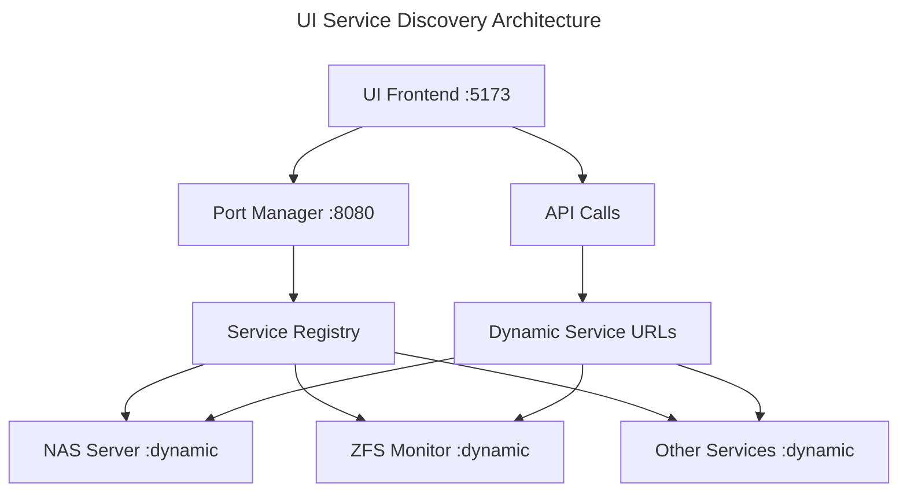

# NestGate UI - Port Manager Integration

## Overview

The NestGate UI has been fully migrated to work exclusively with the Port Manager for service discovery. All hardcoded ports have been removed except for the Port Manager itself.

## Architecture



## Configuration Changes

### Only Hardcoded Endpoint
- **Port Manager**: `http://localhost:8080` (only hardcoded URL in entire UI)

### Dynamic Endpoints (from Port Manager)
- **NAS Server API**: Retrieved via Port Manager service discovery
- **ZFS Monitor API**: Retrieved via Port Manager service discovery  
- **WebSocket URLs**: Retrieved via Port Manager service discovery
- **File Monitor**: Retrieved via Port Manager service discovery

## Updated Files

### Core Configuration
- ✅ `src/config.ts` - Fixed Port Manager URL to 8080, removed fallbacks
- ✅ `src/services/config.service.ts` - Fixed Port Manager URL to 8080
- ✅ `environments/environment.ts` - Removed hardcoded API URL

### Components
- ✅ `src/components/ZfsStorageDashboard.tsx` - Uses Port Manager for API URLs
- ✅ `config/vite.config.ts` - Removed hardcoded proxy configuration

### Hooks and Utilities
- ✅ `src/hooks/usePortManager.ts` - Fixed Port Manager URL to 8080
- ✅ `src/hooks/useFileSystemMonitor.ts` - Fixed Port Manager URL to 8080
- ✅ `src/utils/env.ts` - Removed hardcoded WebSocket fallback
- ✅ `src/services/fs-monitor/hooks.ts` - Removed hardcoded URLs

## Service Discovery Flow

### 1. UI Initialization
```typescript
// src/index.tsx
async function startApp() {
  // Initialize dynamic configuration from port manager
  await initializeConfig();
  // ... start React app
}
```

### 2. Configuration Service
```typescript
// src/services/config.service.ts
async fetchConfig(): Promise<DynamicConfig> {
  const response = await fetch(`${this.portManagerUrl}/client-config`);
  // Returns service URLs dynamically allocated by Port Manager
}
```

### 3. Component Usage
```typescript
// src/components/ZfsStorageDashboard.tsx
useEffect(() => {
  const initializeApi = async () => {
    const baseUrl = await getApiBaseUrl(); // From Port Manager
    setApiBase(baseUrl);
  };
  initializeApi();
}, []);
```

## Breaking Changes

### ❌ No Longer Supported
- Hardcoded service URLs (except Port Manager)
- Direct service access bypassing Port Manager
- Fallback URLs for service endpoints
- Static proxy configuration in Vite

### ✅ Required for Operation
- Port Manager must be running on port 8080
- Services must be registered with Port Manager
- Dynamic service discovery for all API calls

## Development Workflow

### 1. Start Port Manager
```bash
npm start  # Uses scripts/deployment/start.sh
```

### 2. Services Register Automatically
- Port Manager allocates dynamic ports
- Services register themselves
- UI discovers services via Port Manager

### 3. UI Development
```bash
cd crates/ui/nestgate-ui
npm run dev  # Vite dev server on port 5173
```

## Error Handling

### Port Manager Not Available
```typescript
// UI will fail fast with clear error message
throw new Error('NestGate requires the port manager to be running. Please start the port manager first.');
```

### Service Not Found
```typescript
// Component will show service-specific error
setError('Failed to get API URL from Port Manager. Please ensure Port Manager is running.');
```

## Benefits

1. **Zero Port Conflicts**: All ports dynamically allocated
2. **Service Resilience**: Services can restart with different ports
3. **Development Flexibility**: Multiple environments can run simultaneously
4. **Production Ready**: Supports containerization and scaling
5. **Centralized Management**: Single point of service coordination

## Testing

### Verify Integration
```bash
# 1. Start system
npm start

# 2. Check Port Manager
curl http://localhost:8080/health

# 3. Check service registration
curl http://localhost:8080/services

# 4. Access UI
open http://localhost:5173
```

### Expected Behavior
- UI loads successfully without hardcoded endpoints
- All API calls go through dynamically discovered URLs
- Service failures are gracefully handled
- Port Manager is the only hardcoded dependency

## Migration Complete ✅

The UI is now fully integrated with the Port Manager architecture and contains no hardcoded service ports. All service discovery happens dynamically through the Port Manager's service registry. 