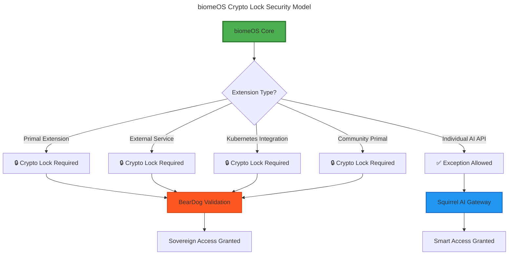

# biomeOS Crypto Lock Extension System

**Status:** Core Security Architecture | **Date:** January 2025 | **Version:** 1.0.0

---

## 🔒 **Executive Summary**

biomeOS implements **mandatory crypto locks** for all external integrations and Primal extensions, ensuring sovereign control over the distributed computing ecosystem. The **only exception** is AI API access for individual users through Squirrel, keeping the platform smart and accessible out-of-the-box.

**Core Principle:** *Complete sovereignty with intelligent accessibility*

---

## 🛡️ **Crypto Lock Architecture**

### **Universal Crypto Lock Requirement**



---

## 🔐 **Crypto Lock Implementation**

### **1. Extension Registration Protocol**

```rust
/// All Primal extensions must implement crypto lock validation
#[async_trait]
pub trait SecurePrimalExtension: Primal {
    /// Crypto lock validation - MANDATORY
    async fn validate_crypto_lock(&self, lock: &CryptoLock) -> BiomeResult<ValidationResult>;
    
    /// Extension capabilities (locked behind crypto validation)
    async fn get_locked_capabilities(&self) -> Vec<LockedCapability>;
    
    /// Initialize with crypto lock
    async fn initialize_with_lock(&mut self, config: PrimalConfig, lock: CryptoLock) -> BiomeResult<()>;
}

/// Crypto lock for securing extensions
#[derive(Debug, Clone, Serialize, Deserialize)]
pub struct CryptoLock {
    /// Unique lock identifier
    pub lock_id: Uuid,
    /// Lock type (sovereign, community, enterprise)
    pub lock_type: LockType,
    /// Cryptographic proof of ownership
    pub proof: CryptographicProof,
    /// Expiration (None for permanent)
    pub expires_at: Option<DateTime<Utc>>,
    /// Allowed capabilities
    pub capabilities: Vec<String>,
    /// Access restrictions
    pub restrictions: AccessRestrictions,
}

/// Types of crypto locks
#[derive(Debug, Clone, Serialize, Deserialize)]
pub enum LockType {
    /// Full sovereign control
    Sovereign,
    /// Community-validated access
    Community { validators: Vec<String> },
    /// Enterprise licensing
    Enterprise { license_key: String },
    /// Research/academic use
    Research { institution: String },
}
```

### **2. Primal Extension Security**

```yaml
# biome.yaml with crypto lock requirements
primals:
  # Standard Primal - crypto lock required
  kubernetes_integration:
    primal_type: "kubernetes/cluster-manager"
    version: ">=1.28.0"
    crypto_lock:
      lock_type: "sovereign"
      proof_file: "/secure/k8s.lock"
      capabilities: ["orchestration.*", "compute.*"]
    config:
      cluster_endpoint: "https://k8s.example.com"
      
  # Community Primal - crypto lock required
  community_storage:
    primal_type: "community/distributed-storage"
    version: "^2.1.0"
    crypto_lock:
      lock_type: "community"
      validators: ["storage-guild", "security-council"]
      proof_file: "/secure/storage.lock"
    config:
      node_count: 5
      
  # AI Platform - EXCEPTION for individual AI APIs
  ai_platform:
    primal_type: "squirrel"
    version: ">=1.5.0"
    ai_api_exception: true  # Special exception flag
    config:
      # Individual AI APIs allowed without crypto lock
      ai_apis:
        - provider: "anthropic"
          model: "claude-3-sonnet"
          individual_use: true
        - provider: "openai" 
          model: "gpt-4"
          individual_use: true
      # But enterprise AI features require lock
      enterprise_ai:
        crypto_lock_required: true
```

### **3. AI API Exception System**

```rust
/// Special handling for AI API access in Squirrel
pub struct AIApiGateway {
    /// Individual user allowlist
    individual_apis: Vec<IndividualAIProvider>,
    /// Enterprise/locked AI features
    enterprise_apis: HashMap<String, LockedAIProvider>,
}

/// AI provider that individuals can use freely
#[derive(Debug, Clone)]
pub struct IndividualAIProvider {
    pub provider: String,
    pub models: Vec<String>,
    pub rate_limits: RateLimits,
    pub safety_filters: bool,
}

/// AI provider requiring crypto lock
#[derive(Debug, Clone)]
pub struct LockedAIProvider {
    pub provider: String,
    pub models: Vec<String>,
    pub crypto_lock: CryptoLock,
    pub enterprise_features: Vec<String>,
}

impl AIApiGateway {
    /// Route AI request based on user type and crypto lock
    pub async fn route_ai_request(
        &self,
        request: AIRequest,
        user_context: UserContext,
    ) -> BiomeResult<AIResponse> {
        match user_context.user_type {
            UserType::Individual => {
                // Allow individual AI API usage without crypto lock
                self.handle_individual_request(request).await
            }
            UserType::Enterprise => {
                // Require crypto lock for enterprise features
                self.handle_enterprise_request(request, user_context.crypto_lock).await
            }
        }
    }
    
    async fn handle_individual_request(&self, request: AIRequest) -> BiomeResult<AIResponse> {
        // Validate against individual provider allowlist
        if let Some(provider) = self.find_individual_provider(&request.provider) {
            // Apply rate limits and safety filters
            self.apply_individual_safeguards(&request, provider).await?;
            // Route to AI provider
            self.call_ai_provider(request).await
        } else {
            Err(BiomeError::AIProviderNotAllowed(request.provider))
        }
    }
}
```

---

## 🎯 **Security Enforcement Points**

### **1. Extension Loading**
```rust
impl BiomeOrchestrator {
    /// All Primal loading goes through crypto lock validation
    async fn load_primal_with_security(
        &self,
        spec: &PrimalSpec,
    ) -> BiomeResult<Box<dyn Primal>> {
        match &spec.primal_type {
            // Special exception for Squirrel AI APIs
            primal_type if primal_type == "squirrel" && spec.ai_api_exception == Some(true) => {
                self.load_squirrel_with_ai_exception(spec).await
            }
            // All other Primals require crypto lock
            _ => {
                let crypto_lock = spec.crypto_lock
                    .as_ref()
                    .ok_or(BiomeError::CryptoLockRequired(spec.primal_type.clone()))?;
                
                self.validate_and_load_locked_primal(spec, crypto_lock).await
            }
        }
    }
    
    async fn validate_and_load_locked_primal(
        &self,
        spec: &PrimalSpec,
        crypto_lock: &CryptoLockSpec,
    ) -> BiomeResult<Box<dyn Primal>> {
        // 1. Load crypto lock proof
        let lock = self.load_crypto_lock_proof(&crypto_lock.proof_file).await?;
        
        // 2. Validate cryptographic proof
        self.beardog_validator.validate_crypto_lock(&lock).await?;
        
        // 3. Check capability permissions
        self.validate_capability_permissions(&lock, &spec.expose).await?;
        
        // 4. Load Primal with validated lock
        let mut primal = self.registry.create_primal(&spec.primal_type, spec.into()).await?;
        
        // 5. Initialize with crypto lock
        if let Some(secure_primal) = primal.as_any().downcast_mut::<dyn SecurePrimalExtension>() {
            secure_primal.initialize_with_lock(spec.into(), lock).await?;
        }
        
        Ok(primal)
    }
}
```

### **2. Runtime Access Control**
```rust
/// All external calls go through crypto lock validation
impl PrimalCapabilityRouter {
    async fn route_capability_request(
        &self,
        request: CapabilityRequest,
    ) -> BiomeResult<CapabilityResponse> {
        let target_primal = self.find_primal(&request.target_primal)?;
        
        // Check if this is an AI API request with individual exception
        if self.is_individual_ai_request(&request) {
            return self.route_to_ai_gateway(request).await;
        }
        
        // All other requests require crypto lock validation
        let crypto_lock = self.get_primal_crypto_lock(&request.target_primal)?;
        self.validate_request_against_lock(&request, &crypto_lock).await?;
        
        target_primal.execute_capability(&request.capability, request).await
    }
    
    fn is_individual_ai_request(&self, request: &CapabilityRequest) -> bool {
        request.capability.starts_with("ai.") &&
        request.context.user_type == UserType::Individual &&
        self.is_allowed_individual_ai_provider(&request)
    }
}
```

---

## 🔑 **Crypto Lock Types & Use Cases**

### **Sovereign Locks**
```yaml
crypto_lock:
  lock_type: "sovereign"
  proof_file: "/secure/sovereign.lock"
  capabilities: ["*"]  # Full access
  restrictions:
    geographic: ["self-hosted"]
    audit_trail: true
```

### **Community Locks**
```yaml
crypto_lock:
  lock_type: "community"
  validators: ["tech-council", "security-guild"]
  proof_file: "/secure/community.lock"
  capabilities: ["storage.*", "compute.basic"]
  restrictions:
    usage_limits: "reasonable"
    attribution_required: true
```

### **Enterprise Locks**
```yaml
crypto_lock:
  lock_type: "enterprise"
  license_key: "ENT-2024-ABCD-1234"
  proof_file: "/secure/enterprise.lock"
  capabilities: ["orchestration.*", "ai.enterprise"]
  restrictions:
    seat_limit: 1000
    support_level: "premium"
```

### **AI Exception (No Lock Required)**
```yaml
ai_platform:
  primal_type: "squirrel"
  ai_api_exception: true
  config:
    individual_ai_apis:
      - "anthropic/claude-3-sonnet"
      - "openai/gpt-4"
      - "google/gemini-pro"
    rate_limits:
      requests_per_minute: 60
      tokens_per_day: 100000
```

---

## 🎯 **Implementation Strategy**

### **Phase 1: Core Security (Immediate)**
1. Implement `CryptoLock` and `SecurePrimalExtension` traits
2. Add crypto lock validation to orchestrator
3. Create AI API exception system in Squirrel
4. Integrate with BearDog for lock validation

### **Phase 2: Extension Integration (4 weeks)**
1. Update all existing Primals for crypto lock compliance
2. Create lock generation tools
3. Implement community validation system
4. Add enterprise licensing support

### **Phase 3: Ecosystem Rollout (8 weeks)**
1. Document crypto lock requirements for community
2. Create lock marketplace for easy acquisition
3. Build automated compliance checking
4. Launch with security-first messaging

---

## 🌟 **Strategic Benefits**

### **Complete Sovereignty**
- **No vendor lock-in** - crypto locks ensure you control access
- **Security by design** - all extensions must prove legitimacy
- **Audit trail** - complete visibility into system access

### **Smart Accessibility**
- **Individual users** get AI intelligence out-of-the-box
- **No barriers** to trying the platform
- **Natural upgrade path** to enterprise features

### **Ecosystem Control**
- **Quality assurance** - crypto locks filter out malicious extensions
- **Economic model** - premium features behind locks
- **Community governance** - validators ensure standards

---

This crypto lock system ensures biomeOS maintains **complete sovereignty** while remaining **intelligently accessible** to individual users. It's the perfect balance of security and usability! 🔒✨ 