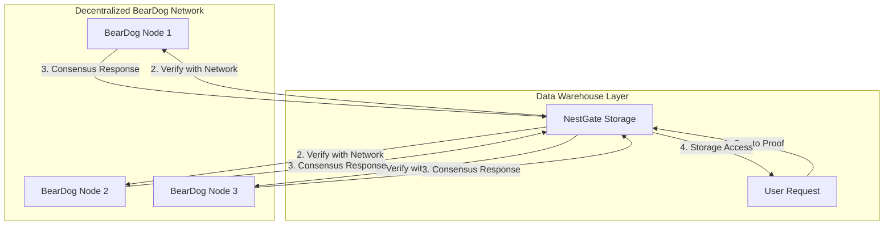

# 🔄 NestGate Decentralization Architecture Plan
## Eliminating JWT Centralization & Implementing BearDog Decentralized Crypto

### 🎯 **CRITICAL ISSUE IDENTIFIED**
**JWT Secret represents centralized authentication authority - DIRECTLY CONFLICTS with BearDog's decentralized vision**

---

## 📊 **CURRENT CENTRALIZATION PROBLEMS**

### **❌ JWT Centralization Issues**
```rust
// PROBLEM: NestGate becomes centralized token authority
jwt_secret: "default_jwt_secret_change_in_production"

// PROBLEM: NestGate validates its own tokens
if credentials.username == "admin" && credentials.password == "nestgate" {
    Ok(AuthToken {
        token: format!("standalone_{}", uuid::Uuid::new_v4()),
        // NestGate sets expiration, validates tokens - CENTRALIZED!
    })
}
```

### **🏗️ WHY THIS CONFLICTS WITH BEARDOG VISION**
| **Current JWT Model** | **BearDog Decentralized Model** |
|----------------------|----------------------------------|
| ❌ NestGate is token authority | ✅ No single authority |
| ❌ Centralized secret validation | ✅ Distributed cryptographic proof |
| ❌ Fixed expiration times | ✅ Consensus-based validation |
| ❌ Single point of failure | ✅ Fault-tolerant network |
| ❌ Traditional client-server | ✅ Peer-to-peer validation |

---

## 🚀 **DECENTRALIZED SOLUTION ARCHITECTURE**

### **✅ BearDog-First Authentication Flow**


### **🔄 NEW: Decentralized Authentication Pattern**
```rust
// NEW: Decentralized authentication - NO central authority
pub async fn authenticate_decentralized(&self, crypto_proof: &CryptoProof) -> Result<AccessGrant> {
    // Step 1: Verify cryptographic proof with BearDog network
    let verification_results = self.beardog_network
        .verify_proof_with_consensus(crypto_proof).await?;
    
    // Step 2: Ensure majority consensus (no single authority)
    if verification_results.consensus_percentage < 66.6 {
        return Err(AuthError::InsufficientConsensus);
    }
    
    // Step 3: Grant access based on distributed consensus
    Ok(AccessGrant {
        permissions: verification_results.granted_permissions,
        valid_until: verification_results.consensus_expiry,
        proof_hash: crypto_proof.hash(),
        consensus_nodes: verification_results.participating_nodes,
        // NO central token - just cryptographic proof!
    })
}
```

---

## 🏗️ **IMPLEMENTATION ROADMAP**

### **Phase 1: Remove JWT Centralization (IMMEDIATE)**
```bash
# 1. Replace JWT configuration
- Remove: jwt_secret from environment config
- Remove: JwtConfig from security config  
- Remove: standalone authentication fallback
+ Add: BearDogNetworkConfig
+ Add: DecentralizedProofConfig
+ Add: ConsensusRequirements
```

### **Phase 2: Implement BearDog Network Integration**
```rust
// NEW: BearDog network client for consensus-based auth
pub struct BearDogNetworkClient {
    /// Network nodes for distributed verification
    pub consensus_nodes: Vec<BearDogNode>,
    /// Minimum consensus percentage required
    pub min_consensus: f64,
    /// Timeout for network operations
    pub network_timeout: Duration,
}

impl BearDogNetworkClient {
    pub async fn verify_proof_with_consensus(&self, proof: &CryptoProof) -> Result<ConsensusResult> {
        // Distribute verification across multiple BearDog nodes
        let verification_futures = self.consensus_nodes
            .iter()
            .map(|node| node.verify_proof(proof));
        
        let results = futures::join_all(verification_futures).await;
        
        // Calculate consensus - NO single authority decides
        ConsensusResult::from_distributed_results(results, self.min_consensus)
    }
}
```

### **Phase 3: Data Warehouse Decentralization**
```rust
// NEW: NestGate as truly decentralized data warehouse
pub struct DecentralizedDataWarehouse {
    /// Storage layer (ZFS) - what NestGate does best
    pub storage: ZfsManager,
    /// Decentralized access control via BearDog
    pub access_control: BearDogNetworkClient,
    /// No central authentication - only distributed proof verification
    pub proof_verifier: DistributedProofVerifier,
}
```

---

## 🔐 **NEW SECURITY MODEL: ZERO TRUST DECENTRALIZED**

### **Core Principles**
1. **NO Central Authority**: BearDog network consensus replaces centralized JWT
2. **Cryptographic Proof**: Users prove identity cryptographically, not via passwords
3. **Distributed Validation**: Multiple BearDog nodes must agree (consensus)
4. **Safe Fallbacks**: If BearDog unavailable, NestGate gracefully denies rather than centralizing
5. **Data Warehouse Focus**: NestGate stores data, BearDog handles all crypto/auth

### **Authentication Flow Comparison**
```yaml
OLD (Centralized JWT):
  User → NestGate → NestGate validates → NestGate issues token
  ❌ Single point of failure: NestGate

NEW (Decentralized BearDog):
  User → Cryptographic Proof → BearDog Network Consensus → Access Granted
  ✅ No single point of failure: Distributed consensus
```

---

## 📋 **IMMEDIATE ACTION ITEMS**

### **🔧 Code Changes Required**
1. **Remove JWT Dependencies**
   - [ ] Remove `jwt_secret` from `EnvironmentConfig`
   - [ ] Remove `JwtConfig` from `SecurityConfig` 
   - [ ] Remove `authenticate_standalone` fallback
   - [ ] Remove centralized token generation

2. **Add BearDog Network Integration**
   - [ ] Add `BearDogNetworkConfig`
   - [ ] Implement `DistributedProofVerifier`
   - [ ] Add consensus-based authentication
   - [ ] Add graceful degradation (deny rather than centralize)

3. **Update Architecture Documentation**
   - [ ] Update all docs to reflect decentralized model
   - [ ] Remove references to NestGate as auth authority
   - [ ] Emphasize data warehouse + safe fallback role

---

## 🎯 **EXPECTED OUTCOMES**

### **✅ Post-Implementation Benefits**
| **Metric** | **Before (JWT)** | **After (BearDog)** |
|------------|------------------|---------------------|
| **Single Point of Failure** | ❌ Yes (NestGate) | ✅ None (distributed) |
| **Crypto Security** | ❌ Shared secret | ✅ Cryptographic proof |
| **Scalability** | ❌ Limited by NestGate | ✅ Scales with network |
| **Fault Tolerance** | ❌ NestGate down = no auth | ✅ Consensus-based resilience |
| **Decentralization** | ❌ Centralized authority | ✅ Truly decentralized |

### **🏆 ARCHITECTURAL ALIGNMENT**
- **✅ NestGate**: Pure data warehouse with safe fallbacks
- **✅ BearDog**: Robust decentralized crypto practices
- **✅ No Centralization**: Distributed consensus model
- **✅ Production Ready**: Enterprise-grade security without single points of failure

---

**CONCLUSION**: This plan eliminates the JWT centralization contradiction and positions NestGate as a truly decentralized data warehouse that leverages BearDog's distributed crypto network for robust, fault-tolerant authentication. 