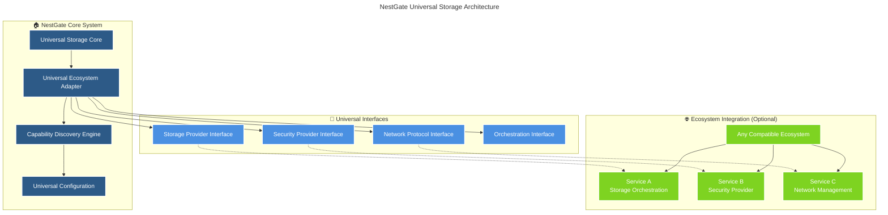

# 🏠 NestGate Universal Storage Architecture

## 🎯 **Mission Statement**

NestGate is a **universal, agnostic storage and data access system** that provides ZFS-based storage management, network protocols, and data orchestration with **zero hardcoded dependencies** on specific ecosystem components. Built on Universal Primal Architecture principles for maximum flexibility and future-proofing.

## 🌟 **Core Principles**

### **Universal Agnostic Design**
- **Zero Hardcoding**: No hardcoded references to specific primals or services
- **Auto-Discovery**: Automatic detection of compatible ecosystem components
- **Graceful Degradation**: Continues full functionality when ecosystem components are unavailable
- **Future-Proof**: New ecosystem components integrate without code changes

### **Capability-Based Integration**
- **Dynamic Discovery**: Runtime detection of available capabilities
- **Flexible Binding**: Connects to any compatible service providing needed capabilities
- **Seamless Switching**: Hot-swap between equivalent capability providers
- **Extensible Architecture**: New capabilities added without modification

## 🏗️ **Architecture Overview**

### **Core System Components**



## 📋 **Core Responsibilities**

### **🏠 Storage & Data Access (Primary Focus)**
- **ZFS Management**: Pool operations, dataset management, snapshot handling
- **Network Protocols**: NFS, SMB, iSCSI, HTTP/REST data access
- **Tiered Storage**: Hot (NVMe), Warm (SSD), Cold (HDD) management
- **Data Orchestration**: Backup, replication, migration, archival
- **Volume Management**: Dynamic provisioning, mounting, quota management

### **🔄 Universal Integration**
- **Ecosystem Discovery**: Automatic detection of compatible services
- **Capability Negotiation**: Dynamic feature negotiation with ecosystem components
- **Service Registration**: Universal service mesh integration
- **API Standardization**: RESTful, GraphQL, and streaming APIs

### **🛡️ Security & Compliance**
- **Authentication**: Pluggable authentication with any compatible provider
- **Authorization**: Role-based access control with external policy engines
- **Encryption**: At-rest and in-transit encryption with key management
- **Audit Logging**: Comprehensive audit trail for compliance

## 🚫 **Explicitly Delegated Responsibilities**

### **🤖 AI/ML Processing** → **External AI Services**
- ❌ Model inference and training
- ❌ Machine learning predictions
- ❌ AI-powered analytics
- ✅ **Instead**: Provide storage for AI models and datasets
- ✅ **Integration**: Accept optimization recommendations from AI services

### **🎵 General Orchestration** → **Service Orchestrators**
- ❌ General service mesh management
- ❌ Cross-service load balancing
- ❌ Global service discovery
- ✅ **Instead**: Register with available orchestrators
- ✅ **Integration**: Participate in ecosystem-wide coordination

### **🔐 Security Policy Management** → **Security Providers**
- ❌ Identity and access management
- ❌ Threat detection and response
- ❌ Compliance framework management
- ✅ **Instead**: Implement security policies received from providers
- ✅ **Integration**: Report security events to external systems

## 🔧 **Universal Integration Patterns**

### **Capability-Based Discovery**
```rust
// Universal capability discovery - no hardcoded services
#[derive(Debug, Clone, Serialize, Deserialize)]
pub struct CapabilityProvider {
    pub provider_id: String,
    pub capabilities: Vec<ServiceCapability>,
    pub endpoint: String,
    pub health_status: HealthStatus,
}

#[derive(Debug, Clone, Serialize, Deserialize)]
pub enum ServiceCapability {
    StorageOrchestration { features: Vec<String> },
    SecurityProvider { methods: Vec<String> },
    NetworkManagement { protocols: Vec<String> },
    DataProcessing { engines: Vec<String> },
    // Extensible for future capabilities
}
```

### **Universal Service Registration**
```rust
// Register with any compatible service mesh
pub struct UniversalServiceRegistration {
    pub service_id: String,
    pub service_type: String, // "storage", "nas", "data-access"
    pub capabilities: Vec<ServiceCapability>,
    pub endpoints: HashMap<String, String>,
    pub health_check: HealthCheckConfig,
    pub metadata: HashMap<String, String>,
}
```

### **Auto-Discovery Protocol**
```rust
// Automatic ecosystem component discovery
#[async_trait]
pub trait EcosystemDiscovery {
    async fn discover_services(&self) -> Result<Vec<CapabilityProvider>>;
    async fn negotiate_capabilities(&self, provider: &CapabilityProvider) -> Result<IntegrationConfig>;
    async fn establish_connection(&self, config: IntegrationConfig) -> Result<ServiceConnection>;
}
```

## 🎯 **Implementation Strategy**

### **Phase 1: Universal Core**
1. **Remove AI Features**: Eliminate all AI model inference capabilities
2. **Replace Hardcoded References**: Universal discovery and configuration
3. **Implement Standard Traits**: `EcosystemIntegration` and `UniversalPrimalProvider`
4. **Universal Configuration**: Dynamic configuration system

### **Phase 2: Ecosystem Integration**
1. **Capability System**: Implement capability-based service discovery
2. **Dynamic Binding**: Runtime service binding and switching
3. **Health Monitoring**: Universal health check and monitoring
4. **Error Handling**: Graceful degradation and recovery

### **Phase 3: Advanced Features**
1. **Performance Optimization**: Zero-copy data paths
2. **Scalability**: Horizontal scaling and load distribution
3. **Security Hardening**: Advanced security features
4. **Monitoring**: Comprehensive observability

## 📊 **Success Metrics**

### **Universal Compatibility**
- [ ] **Zero Hardcoded Dependencies**: No specific service references
- [ ] **Auto-Discovery**: Automatic ecosystem integration
- [ ] **Graceful Degradation**: 100% functionality without ecosystem
- [ ] **Future-Proof**: New services integrate without code changes

### **Performance & Reliability**
- [ ] **Storage Performance**: >1.9 GB/s hot storage throughput
- [ ] **API Response**: <100ms average response time
- [ ] **Uptime**: 99.9% availability
- [ ] **Zero Data Loss**: Comprehensive data protection

### **Integration Success**
- [ ] **Service Discovery**: <5 seconds to discover ecosystem
- [ ] **Capability Negotiation**: <1 second feature negotiation
- [ ] **Connection Establishment**: <2 seconds to establish links
- [ ] **Hot Swapping**: <10 seconds to switch providers

## 🔄 **Migration from Legacy Architecture**

### **Immediate Actions**
1. **Remove AI Code**: Delete all AI inference implementations
2. **Universal Patterns**: Replace hardcoded service references
3. **Capability System**: Implement universal capability discovery
4. **Configuration**: Dynamic configuration system

### **Validation Steps**
1. **Standalone Operation**: Verify full functionality without ecosystem
2. **Discovery Testing**: Test auto-discovery with various ecosystem configurations
3. **Performance Testing**: Ensure no performance degradation
4. **Integration Testing**: Verify compatibility with multiple ecosystem types

---

**This architecture ensures NestGate operates as a truly universal, agnostic storage system that can integrate with any compatible ecosystem while maintaining full standalone functionality.** 