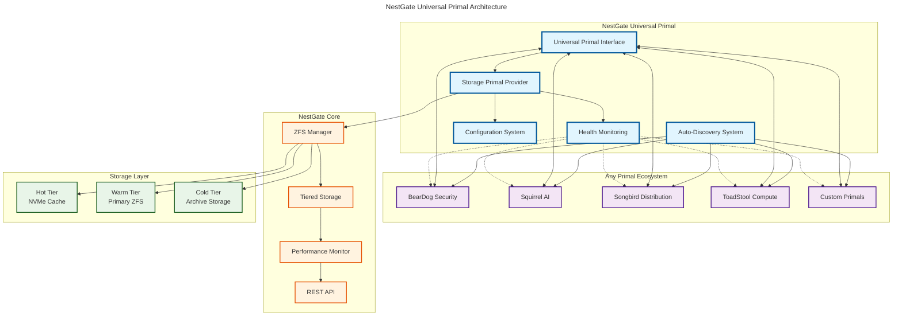
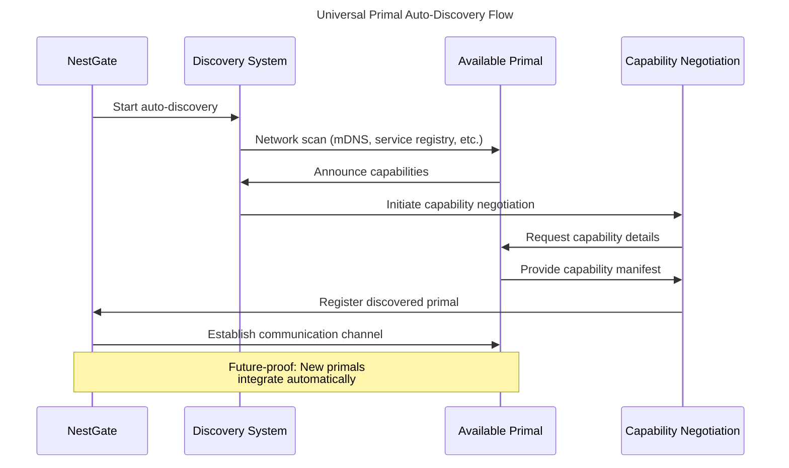
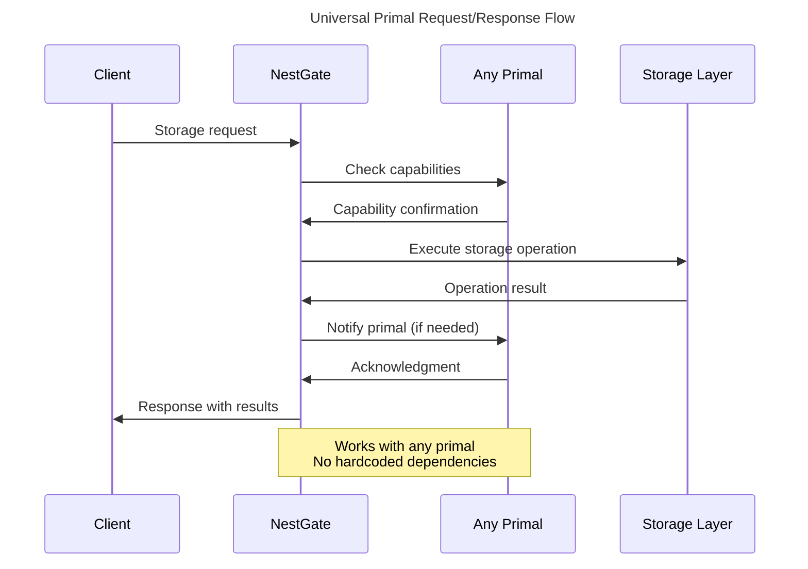

# NestGate Universal Primal Storage Architecture Overview

This document provides an overview of the NestGate Universal Primal Storage system architecture.

## **Universal Primal Architectural Philosophy**

NestGate follows the **Universal Primal Architecture** pattern used by beardog, squirrel, and songbird:

1. **Universal Interfaces**: Works with any primal ecosystem using capability-based discovery
2. **Auto-Discovery**: Automatically finds available primals on the network
3. **Capability-Based**: Dynamic feature negotiation rather than fixed interfaces
4. **Future-Proof**: New primals integrate without NestGate code changes
5. **Agnostic Design**: No hardcoded dependencies on specific primal ecosystems

## System Components

The NestGate Universal Primal system consists of these key components:

1. **Universal Primal Interface** - Core interface for any primal communication
2. **Auto-Discovery System** - Network scanning and service discovery
3. **Capability Negotiation** - Dynamic feature detection and agreement
4. **Storage Primal Provider** - NestGate's ZFS-based storage implementation
5. **Configuration System** - TOML-based universal configuration
6. **Health Monitoring** - Real-time primal health and performance tracking

## Universal Primal Architecture Diagram



## Universal Primal Communication Flow

### Auto-Discovery Process



### Capability-Based Request/Response



## Universal Benefits

### 1. **Future-Proof Design**
- New primals integrate automatically without code changes
- Capability-based discovery handles unknown primals gracefully
- Universal interface adapts to any primal ecosystem

### 2. **Zero Configuration**
- Auto-discovery eliminates manual configuration
- Capability negotiation handles feature detection
- Environment variable overrides for specific deployments

### 3. **Composable Architecture**
- Multiple primals can be combined for complex workflows
- Each primal contributes its unique capabilities
- NestGate orchestrates storage across all primals

### 4. **Production Ready**
- Comprehensive health monitoring
- Performance metrics for all primal interactions
- Audit logging and security built-in

## Configuration Architecture

### Universal Configuration Structure
```toml
[nestgate]
server.host = "0.0.0.0"
server.port = 8080
storage.pool_name = "nestpool"

[primal_ecosystem]
auto_discovery = true
discovery_timeout = 30
health_check_interval = 60

[integrations.beardog]
security_requests = true
encryption_level = "aes-256-gcm"

[integrations.squirrel]
ai_data_requests = true
vector_storage = true

[integrations.songbird]
network_storage = true
geo_distribution = true
```

## Universal Primal Capabilities

### Core Capabilities
- **Storage**: ZFS-based tiered storage management
- **Security**: Encryption, access control, audit trails
- **Network**: Multi-protocol access (NFS, SMB, iSCSI, S3)
- **AI**: Vector storage, model storage, training data
- **Custom**: User-defined capabilities for extensibility

### Dynamic Capability Detection
- Each primal announces its capabilities
- NestGate negotiates feature compatibility
- Runtime feature enablement based on available primals
- Graceful degradation when primals are unavailable

This architecture ensures NestGate remains agnostic, universal, and future-proof while providing enterprise-grade storage management capabilities. 