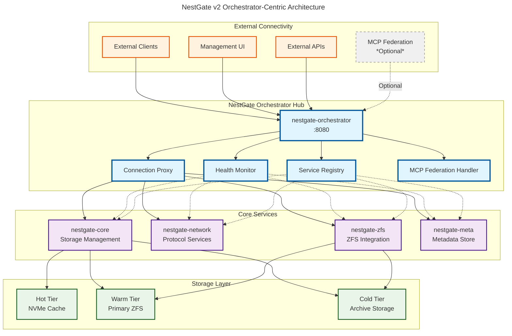
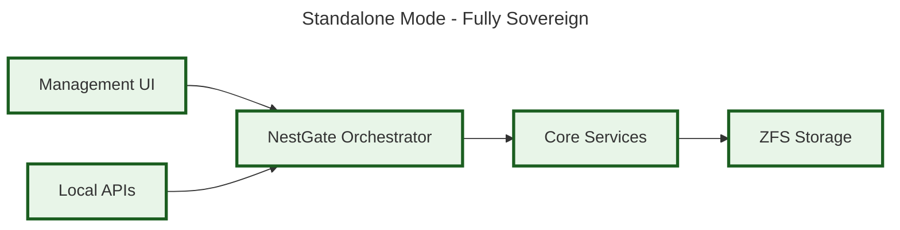
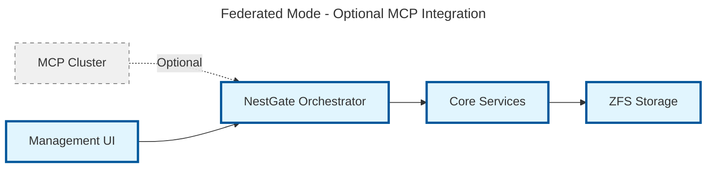
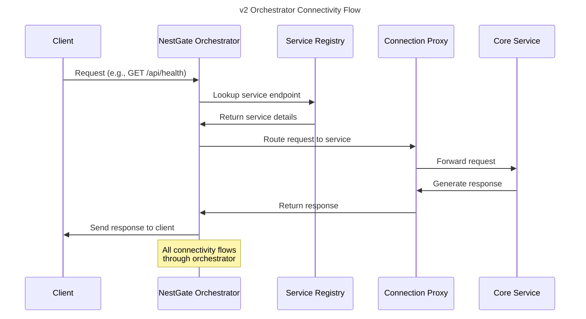
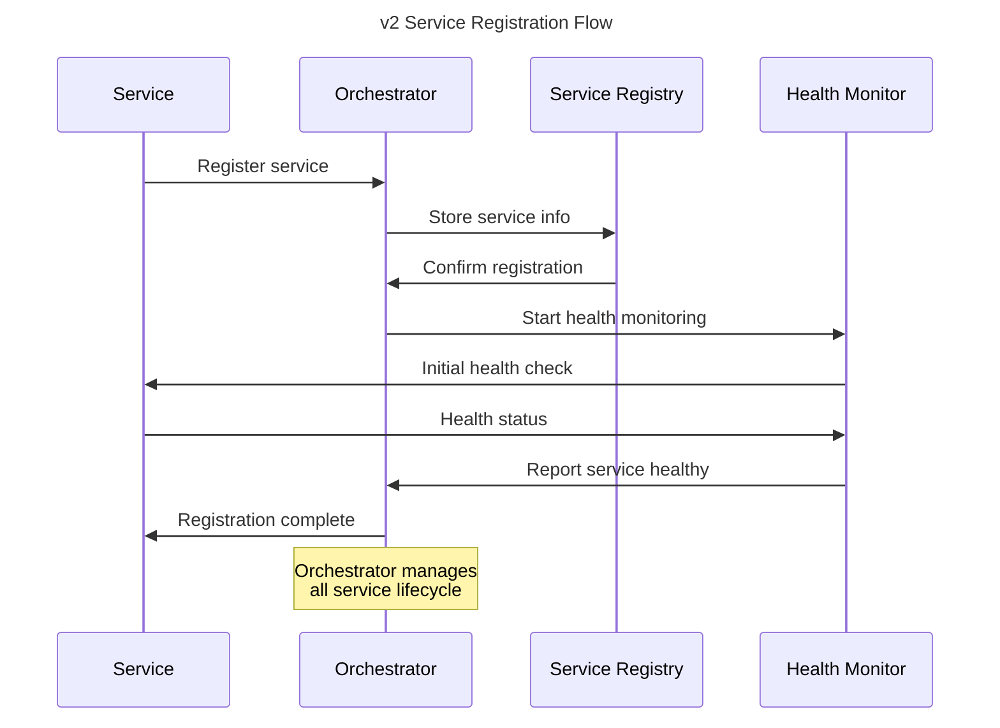
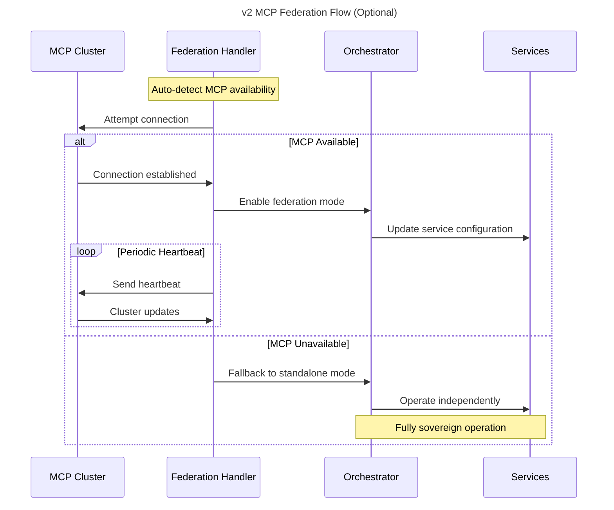
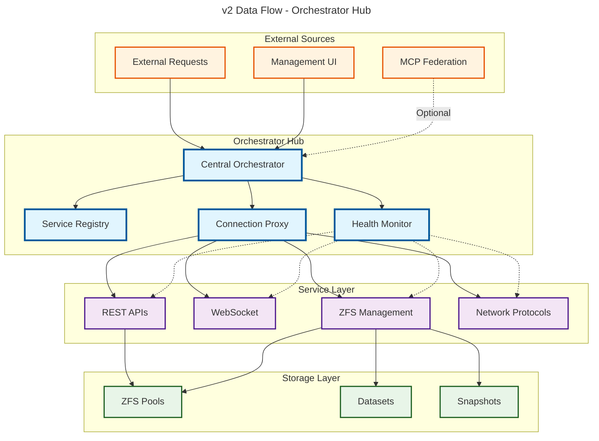
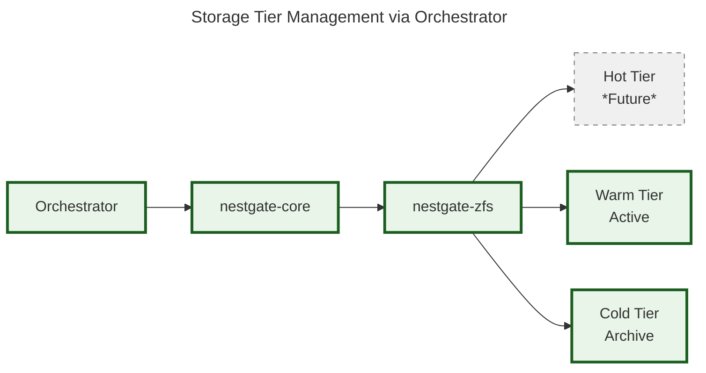
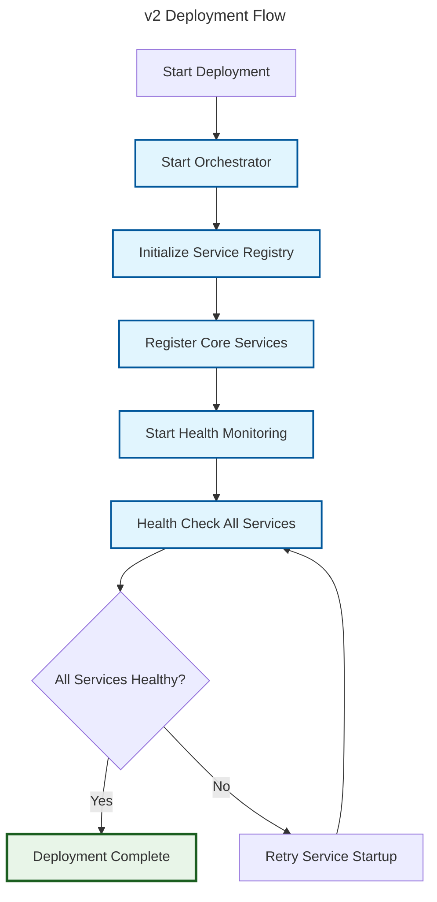

# NestGate v2 Architecture Overview - Orchestrator-Centric Sovereign Design

This document provides an overview of the NestGate v2 orchestrator-centric sovereign NAS management system architecture.

## **v2 Architectural Philosophy**

NestGate v2 is built on **orchestrator-centric connectivity** with **sovereign operation** as the primary design principle:

1. **Orchestrator-First Design**: ALL connectivity flows through nestgate-orchestrator
2. **Sovereign Operation**: Fully autonomous capability with no external dependencies
3. **Optional Federation**: MCP integration when available, graceful degradation when not
4. **Centralized Connectivity Hub**: Single point of control for all service communication
5. **Service Registry Management**: Orchestrator manages all service discovery and registration

## System Components

The NestGate v2 system consists of these key components:

1. **NestGate Orchestrator** - Central connectivity hub and service coordinator
2. **Service Registry** - Orchestrator-managed service discovery and registration  
3. **Connection Proxy** - Routes all external connections through orchestrator
4. **Health Monitor** - Orchestrator-based service health monitoring
5. **MCP Federation** - Optional connectivity to MCP clusters
6. **Core Services** - Storage, network, and management services
7. **Storage Layer** - ZFS-based tiered storage management

## v2 Architecture Diagram



## Sovereign Operation Modes

### 1. Standalone Mode (Default)
```yaml
mode: standalone
dependencies: NONE
connectivity: Internal orchestrator only
description: Fully autonomous operation
```



### 2. Federated Mode (Optional)
```yaml
mode: federated
dependencies: MCP cluster available
connectivity: Orchestrator + MCP federation
description: Connected to MCP cluster with fallback to standalone
```



## Component Interactions

### Orchestrator-Centric Connectivity Flow



### Service Registration Flow



### MCP Federation Flow (Optional)



## Data Flow Architecture



## Component Details

### NestGate Orchestrator (Core Hub)
```yaml
crate: nestgate-orchestrator
port: 8080 (fixed)
responsibility: Central connectivity hub
features:
  - Service registry management
  - Connection proxy and routing
  - Health monitoring coordination
  - MCP federation handling
  - Graceful degradation support
```

**Key Capabilities:**
- **Service Discovery**: Central registry for all system services
- **Connection Routing**: Proxy all external connections to appropriate services
- **Health Monitoring**: Continuous health checks with automatic recovery
- **Federation Support**: Optional MCP integration with standalone fallback

### Service Registry
```yaml
component: ServiceRegistry
managed_by: nestgate-orchestrator
responsibility: Service discovery and registration
```

**Service Types Managed:**
- **nestgate-core**: Storage management and tier coordination
- **nestgate-network**: Protocol services (NFS, SMB, HTTP)
- **nestgate-zfs**: ZFS integration and management
- **nestgate-meta**: Metadata and configuration storage

### Connection Proxy
```yaml
component: ConnectionProxy
managed_by: nestgate-orchestrator
responsibility: Route all external connectivity
```

**Routing Patterns:**
- External API calls → Appropriate service endpoints
- Management UI requests → Core services
- Protocol requests → Network services
- Health checks → Service health endpoints

### Health Monitor
```yaml
component: HealthMonitor
managed_by: nestgate-orchestrator
interval: 30 seconds (configurable)
responsibility: Service health coordination
```

**Health Check Types:**
- **HTTP Health Endpoints**: Service-specific health APIs
- **Process Monitoring**: Service process status
- **Resource Monitoring**: CPU, memory, disk usage
- **Custom Checks**: Service-specific health validation

### MCP Federation (Optional)
```yaml
component: McpFederation
managed_by: nestgate-orchestrator
mode: auto-detect (configurable)
responsibility: Optional cluster connectivity
```

**Federation Modes:**
- **Standalone**: No MCP dependency (default)
- **Auto-Detect**: Attempt MCP connection, fallback to standalone
- **Federated**: Active MCP cluster participation

## Storage Integration

### ZFS Management via Orchestrator
```yaml
storage_architecture: orchestrator_managed
tiers:
  hot: NVMe cache (future)
  warm: Primary ZFS pools
  cold: Archive storage
integration: All ZFS operations via orchestrator
```

**Storage Operations Flow:**
1. Client requests storage operation
2. Orchestrator routes to nestgate-core
3. Core service coordinates with nestgate-zfs
4. ZFS operations executed on storage layer
5. Results routed back through orchestrator

### Tiered Storage Management


## Security and Access Control

### Orchestrator-Managed Security
```yaml
security_model: orchestrator_centric
authentication: Centralized through orchestrator
authorization: Role-based access control (RBAC)
encryption: TLS for all external connections
```

**Security Flow:**
1. All external connections terminate at orchestrator
2. Authentication and authorization at orchestrator level
3. Authenticated requests routed to appropriate services
4. Services trust orchestrator authentication decisions

## Deployment Architecture

### Minimal Sovereign Deployment
```yaml
requirements:
  cpu: 4 cores minimum
  ram: 32GB ECC recommended
  storage: Single ZFS pool supported
  network: 1G minimum, 10G preferred
  dependencies: NONE (fully autonomous)
```

### Deployment Flow


## Performance Characteristics

### Orchestrator Overhead
```yaml
connection_latency: <5ms additional overhead
throughput_impact: <2% for data operations
cpu_overhead: <5% under normal load
memory_overhead: ~50MB for orchestrator
```

### Scaling Characteristics
- **Single Node**: Fully supported (current implementation)
- **Multi-Node**: Planned for future orchestrator coordination
- **Federation**: Optional MCP cluster participation
- **Storage**: Horizontal scaling via ZFS pool expansion

## Future Enhancements

### Phase 2: Enhanced Storage Tiers (2025 Q2)
- Hot tier (NVMe) integration via orchestrator
- Automated tier migration policies
- AI workload optimization

### Phase 3: Advanced Federation (2025 Q2-Q3)
- Multi-node orchestrator coordination
- Distributed storage management
- Cross-cluster replication

### Phase 4: AI Integration (2025 Q3-Q4)
- Model hosting infrastructure
- GPU integration via orchestrator
- AI-specific storage patterns

## Summary

NestGate v2 represents a **successful architectural evolution** from complex port management to **orchestrator-centric sovereign design**:

### Key Architectural Principles
1. **Orchestrator-Centric**: All connectivity flows through single hub
2. **Sovereign Operation**: Fully autonomous with no external dependencies
3. **Optional Federation**: MCP integration when available, standalone when not
4. **Simplified Design**: Single orchestrator vs complex port manager
5. **Production Ready**: Robust error handling and graceful degradation

### Implementation Success
- ✅ **Zero compilation errors** across all crates
- ✅ **Successful deployment** with orchestrator coordination
- ✅ **Standalone operation** verified and functional
- ✅ **Optional federation** ready for MCP integration
- ✅ **Simplified management** via central orchestrator

The v2 architecture successfully delivers on the **sovereign NAS vision** while maintaining flexibility for future enhancements and optional cluster participation. 