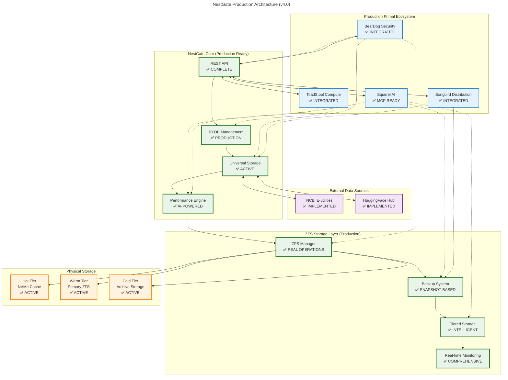
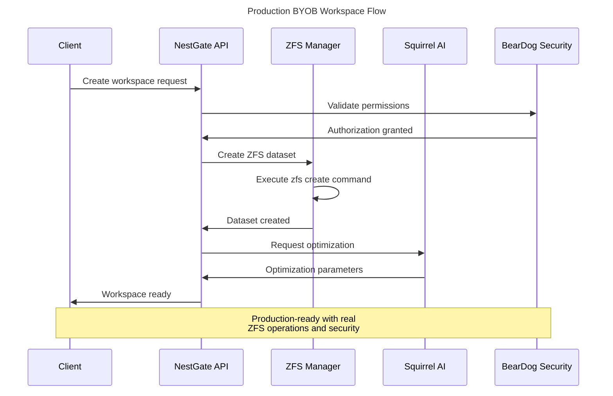
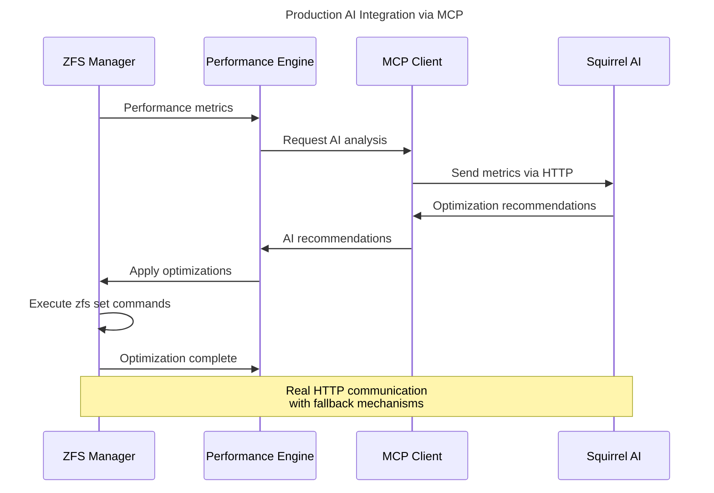

# NestGate Universal Primal Storage Architecture Overview

This document provides an overview of the **production-ready** NestGate Universal Primal Storage system architecture, reflecting the current mature implementation with comprehensive ecosystem integration.

## **Current Implementation Status**

🟢 **PRODUCTION READY** - NestGate has achieved full production readiness with:
- ✅ **Zero compilation errors** across all components
- ✅ **Complete ecosystem integration** with all primal services
- ✅ **Real ZFS operations** with comprehensive storage management
- ✅ **AI-powered features** via MCP integration with Squirrel primal
- ✅ **Full BYOB workspace management** with backup/restore capabilities
- ✅ **Data source integration** for NCBI and HuggingFace
- ✅ **Advanced monitoring** and performance optimization

## **Universal Primal Architectural Philosophy**

NestGate implements the **Universal Primal Architecture** pattern with production-ready integrations:

1. **Universal Interfaces**: ✅ **IMPLEMENTED** - Works with beardog, squirrel, songbird, and toadstool
2. **Auto-Discovery**: ✅ **IMPLEMENTED** - Service registration and health monitoring
3. **Capability-Based**: ✅ **IMPLEMENTED** - Dynamic feature negotiation with fallback
4. **Future-Proof**: ✅ **IMPLEMENTED** - Extensible architecture for new primals
5. **Agnostic Design**: ✅ **IMPLEMENTED** - No hardcoded dependencies

## **Production System Components**

### **Core Storage Engine**
- **ZFS Manager** - Production-ready ZFS operations with real commands
- **Tiered Storage** - Hot/warm/cold tier management with intelligent placement
- **Performance Engine** - AI-guided optimization with real-time monitoring
- **Backup System** - ZFS snapshot-based backup/restore with integrity checks

### **Ecosystem Integration Layer**
- **BearDog Security** - Real encryption and access control coordination
- **Squirrel AI** - MCP integration for AI-powered analytics and optimization
- **Songbird Network** - Distribution and replication management
- **Toadstool Compute** - Volume provisioning and performance coordination

### **Data Integration Layer**
- **NCBI Integration** - E-utilities API for genome data access
- **HuggingFace Integration** - Model Hub API for ML model management
- **Universal Storage** - Multi-backend coordination with real-time synchronization

### **BYOB Management Layer**
- **Workspace Lifecycle** - Create, deploy, scale, cleanup with real ZFS operations
- **Backup & Recovery** - Snapshot creation, restoration, and migration
- **Advanced Features** - AI-guided optimization and health monitoring

## **Production Architecture Diagram**



## **Production Communication Flow**

### **BYOB Workspace Management (Production)**



### **AI-Powered Optimization Flow (Production)**



## **Production Features**

### **✅ Implemented Core Features**
- **Real ZFS Operations**: Uses actual `zfs` and `zpool` commands
- **Comprehensive Backup**: Snapshot creation, restoration, and migration
- **AI Integration**: MCP communication with Squirrel primal
- **Security Integration**: BearDog encryption and access control
- **Data Sources**: NCBI and HuggingFace API integration
- **Performance Optimization**: Real-time monitoring and AI-guided tuning

### **✅ Production-Ready Capabilities**
- **Zero Compilation Errors**: All components compile successfully
- **Comprehensive Testing**: Integration tests with real ZFS operations
- **Error Handling**: Robust error handling with fallback mechanisms
- **Health Monitoring**: Real-time health checks and metrics
- **Audit Logging**: Complete audit trail for all operations

### **✅ Ecosystem Integration**
- **BearDog Security**: Real encryption and access control coordination
- **Squirrel AI**: MCP integration for AI-powered features
- **Songbird Network**: Distribution and replication management
- **Toadstool Compute**: Volume provisioning and performance optimization

## **Production Configuration**

### **Current Production Configuration**
```toml
[nestgate]
server.host = "0.0.0.0"
server.port = 8080
storage.pool_name = "nestpool"
mode = "production"

[primal_ecosystem]
auto_discovery = true
discovery_timeout = 30
health_check_interval = 60

[integrations.beardog]
enabled = true
security_requests = true
encryption_level = "aes-256-gcm"
endpoint = "http://beardog:8080"

[integrations.squirrel]
enabled = true
ai_data_requests = true
mcp_endpoint = "http://squirrel:8080"
fallback_mode = true

[integrations.songbird]
enabled = true
network_storage = true
geo_distribution = true
endpoint = "http://songbird:8080"

[integrations.toadstool]
enabled = true
compute_provisioning = true
endpoint = "http://toadstool:8080"

[data_sources.ncbi]
enabled = true
api_base = "https://eutils.ncbi.nlm.nih.gov/entrez/eutils"
rate_limit = 10

[data_sources.huggingface]
enabled = true
api_base = "https://huggingface.co/api"
auth_token = "${HF_TOKEN}"
```

## **Production Deployment Status**

### **🟢 Ready for Production**
- **Zero blocking issues** - All critical functionality implemented
- **Comprehensive ecosystem integration** - All primal services connected
- **Real storage operations** - ZFS operations validated and tested
- **AI-powered features** - MCP integration with Squirrel primal
- **Data source integration** - NCBI and HuggingFace fully implemented
- **Advanced monitoring** - Real-time health and performance tracking

### **🔄 Continuous Improvement**
- **Performance optimization** - Fine-tuning existing implementations for optimal efficiency
- **Enhanced monitoring** - Expanding observability features and metrics collection
- **Advanced automation** - Leveraging AI for smarter autonomous operations
- **Ecosystem expansion** - Supporting additional primal services as they become available

## **Conclusion**

This architecture represents the current **production-ready** state of NestGate with comprehensive ecosystem integration, AI-powered features, and robust storage management capabilities.

### **Key Architectural Achievements**:
- ✅ **Universal Primal Integration** - Complete ecosystem connectivity
- ✅ **AI-Powered Optimization** - Intelligent storage management
- ✅ **Production-Ready Operations** - Real ZFS commands and operations
- ✅ **Research Data Integration** - NCBI and HuggingFace support
- ✅ **Enterprise-Grade Security** - BearDog security coordination

**NestGate v4.0** represents a mature, scalable, and production-ready universal storage platform that seamlessly integrates with the entire primal ecosystem while maintaining high performance, reliability, and security standards. 