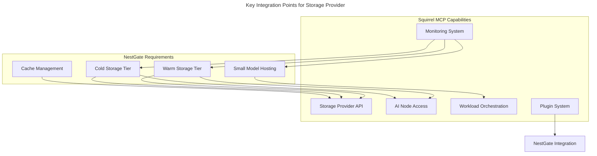

# Squirrel MCP Compatibility Requirements for NestGate

## Overview

This document outlines the requirements and expectations for Squirrel MCP to support integration with NestGate as a specialized storage provider. NestGate will implement warm and cold storage tiers for AI workloads, along with small model hosting capabilities via its RTX 2070 GPU.

## Key Integration Points



## Squirrel MCP Requirements

### 1. Tiered Storage Provider Interface

Squirrel MCP should expose interfaces for tiered storage management:

```rust
// Required tiered storage operations
pub trait TieredStorageOperations {
    // Tier management
    async fn register_storage_tier(&self, tier_config: TierConfig) -> Result<StorageTier>;
    async fn unregister_storage_tier(&self, tier_id: &str) -> Result<()>;
    async fn list_storage_tiers(&self) -> Result<Vec<StorageTier>>;
    async fn get_tier_status(&self, tier_id: &str) -> Result<TierStatus>;
    
    // Volume operations
    async fn create_volume(&self, tier_id: &str, config: VolumeConfig) -> Result<Volume>;
    async fn delete_volume(&self, volume_id: &str) -> Result<()>;
    async fn list_volumes(&self, tier_id: &str) -> Result<Vec<Volume>>;
    async fn get_volume(&self, volume_id: &str) -> Result<Volume>;
    async fn resize_volume(&self, volume_id: &str, new_size: u64) -> Result<Volume>;
    
    // Snapshot operations
    async fn create_snapshot(&self, volume_id: &str, name: &str) -> Result<Snapshot>;
    async fn delete_snapshot(&self, snapshot_id: &str) -> Result<()>;
    async fn list_snapshots(&self, volume_id: &str) -> Result<Vec<Snapshot>>;
    async fn restore_snapshot(&self, snapshot_id: &str) -> Result<Volume>;
    
    // Tier migration
    async fn migrate_volume(&self, volume_id: &str, target_tier_id: &str) -> Result<MigrationJob>;
    async fn get_migration_status(&self, job_id: &str) -> Result<MigrationStatus>;
    async fn cancel_migration(&self, job_id: &str) -> Result<()>;
}
```

### 2. AI Node Mount Interface

Squirrel MCP should provide capabilities for AI nodes to mount storage:

```rust
// Required AI node mount operations
pub trait AINodeMountOperations {
    // Mount operations
    async fn mount_volume(&self, volume_id: &str, node_id: &str, options: MountOptions) -> Result<Mount>;
    async fn unmount_volume(&self, mount_id: &str) -> Result<()>;
    async fn list_mounts(&self, node_id: &str) -> Result<Vec<Mount>>;
    async fn get_mount_status(&self, mount_id: &str) -> Result<MountStatus>;
    
    // Access control
    async fn grant_volume_access(&self, volume_id: &str, node_id: &str, access_level: AccessLevel) -> Result<AccessGrant>;
    async fn revoke_volume_access(&self, grant_id: &str) -> Result<()>;
    async fn list_access_grants(&self, volume_id: &str) -> Result<Vec<AccessGrant>>;
    
    // Performance optimization
    async fn optimize_mount(&self, mount_id: &str, optimization: MountOptimization) -> Result<()>;
    async fn get_mount_metrics(&self, mount_id: &str) -> Result<MountMetrics>;
}
```

### 3. Cache Management Interface

Squirrel MCP should provide cache management capabilities:

```rust
// Required cache operations
pub trait CacheOperations {
    // Cache allocation
    async fn register_cache_provider(&self, provider_config: CacheProviderConfig) -> Result<CacheProvider>;
    async fn allocate_cache(&self, node_id: &str, size: u64) -> Result<CacheAllocation>;
    async fn deallocate_cache(&self, allocation_id: &str) -> Result<()>;
    
    // Cache management
    async fn pin_data(&self, data_id: &str, cache_id: &str) -> Result<()>;
    async fn unpin_data(&self, data_id: &str, cache_id: &str) -> Result<()>;
    async fn list_pinned_data(&self, cache_id: &str) -> Result<Vec<PinnedData>>;
    
    // Cache monitoring
    async fn get_cache_stats(&self, cache_id: &str) -> Result<CacheStats>;
    async fn get_cache_efficiency(&self, cache_id: &str) -> Result<CacheEfficiency>;
}
```

### 4. Small Model Hosting Interface

Squirrel MCP should provide capabilities for small model integration:

```rust
// Required small model operations
pub trait SmallModelOperations {
    // Model registration
    async fn register_model_provider(&self, provider_config: ModelProviderConfig) -> Result<ModelProvider>;
    async fn list_model_providers(&self) -> Result<Vec<ModelProvider>>;
    
    // Model deployment
    async fn deploy_model(&self, provider_id: &str, model_config: ModelConfig) -> Result<ModelDeployment>;
    async fn undeploy_model(&self, model_id: &str) -> Result<()>;
    async fn list_models(&self, provider_id: &str) -> Result<Vec<ModelDeployment>>;
    
    // Model operations
    async fn get_model_status(&self, model_id: &str) -> Result<ModelStatus>;
    async fn update_model(&self, model_id: &str, update_config: ModelUpdateConfig) -> Result<ModelDeployment>;
    
    // Inference
    async fn create_inference_endpoint(&self, model_id: &str, config: EndpointConfig) -> Result<InferenceEndpoint>;
    async fn delete_inference_endpoint(&self, endpoint_id: &str) -> Result<()>;
    async fn get_endpoint_metrics(&self, endpoint_id: &str) -> Result<EndpointMetrics>;
}
```

### 5. Plugin System for Storage Provider

Squirrel MCP should provide a plugin system that allows NestGate to register as a storage provider:

```rust
// Storage provider plugin interface
pub trait StorageProviderPlugin {
    // Registration
    fn register(&self, registry: &mut Registry) -> Result<()>;
    
    // Lifecycle
    async fn initialize(&self) -> Result<()>;
    async fn start(&self) -> Result<()>;
    async fn stop(&self) -> Result<()>;
    
    // Capabilities
    fn storage_tiers(&self) -> Vec<TierCapability>;
    fn cache_capabilities(&self) -> Vec<CacheCapability>;
    fn model_hosting_capabilities(&self) -> Vec<ModelCapability>;
    
    // Monitoring
    fn register_metrics(&self, registry: &mut MetricsRegistry) -> Result<()>;
    
    // Health checks
    async fn health_check(&self) -> Result<HealthStatus>;
}
```

## Protocol Requirements

### 1. Tiered Storage Data Types

Squirrel MCP should support the following data types for tiered storage integration:

```yaml
tiered_storage_types:
  - StorageTier:
      properties:
        id: string
        name: string
        type: enum[warm, cold]
        total_capacity: integer
        available_capacity: integer
        status: enum[online, offline, maintenance]
        performance_class: enum[high_iops, high_throughput, archival]
        
  - Volume:
      properties:
        id: string
        tier_id: string
        name: string
        size: integer
        status: enum[creating, available, resizing, migrating, deleting, error]
        created_at: timestamp
        performance_metrics: VolumeMetrics
        
  - Snapshot:
      properties:
        id: string
        volume_id: string
        name: string
        created_at: timestamp
        size: integer
        status: enum[creating, available, deleting, error]
        
  - MigrationJob:
      properties:
        id: string
        volume_id: string
        source_tier_id: string
        target_tier_id: string
        started_at: timestamp
        status: enum[pending, running, completed, failed, cancelled]
        progress: float
        eta_seconds: integer
```

### 2. AI Node Mount Data Types

Squirrel MCP should support the following data types for AI node mounts:

```yaml
mount_types:
  - Mount:
      properties:
        id: string
        volume_id: string
        node_id: string
        path: string
        created_at: timestamp
        status: enum[mounting, mounted, unmounting, error]
        options: MountOptions
        
  - MountOptions:
      properties:
        read_only: boolean
        cache_mode: enum[write_through, write_back, none]
        sync_mode: enum[always, standard, disabled]
        performance_profile: enum[latency, throughput, balanced]
        
  - AccessGrant:
      properties:
        id: string
        volume_id: string
        node_id: string
        access_level: enum[read_only, read_write, admin]
        granted_at: timestamp
        expires_at: timestamp
        
  - MountMetrics:
      properties:
        read_iops: integer
        write_iops: integer
        read_throughput: integer
        write_throughput: integer
        read_latency: float
        write_latency: float
        cache_hit_ratio: float
```

### 3. Cache Management Data Types

Squirrel MCP should support the following data types for cache management:

```yaml
cache_types:
  - CacheProvider:
      properties:
        id: string
        name: string
        type: enum[nvme, memory, hybrid]
        total_capacity: integer
        available_capacity: integer
        status: enum[online, offline, degraded]
        
  - CacheAllocation:
      properties:
        id: string
        provider_id: string
        node_id: string
        size: integer
        allocated_at: timestamp
        status: enum[allocating, active, releasing, error]
        
  - PinnedData:
      properties:
        id: string
        cache_id: string
        data_id: string
        size: integer
        pinned_at: timestamp
        last_accessed: timestamp
        access_count: integer
        
  - CacheStats:
      properties:
        hit_count: integer
        miss_count: integer
        eviction_count: integer
        read_throughput: integer
        write_throughput: integer
        read_latency: float
        write_latency: float
```

### 4. Small Model Hosting Data Types

Squirrel MCP should support the following data types for small model hosting:

```yaml
small_model_types:
  - ModelProvider:
      properties:
        id: string
        name: string
        hardware: string  # e.g., "NVIDIA RTX 2070"
        memory: integer
        status: enum[online, offline, degraded]
        capabilities: ModelCapabilities
        
  - ModelDeployment:
      properties:
        id: string
        provider_id: string
        name: string
        model_type: string
        version: string
        memory_usage: integer
        loaded_at: timestamp
        status: enum[loading, ready, unloading, error]
        
  - ModelCapabilities:
      properties:
        max_model_size: integer
        concurrent_models: integer
        supported_frameworks: array[string]
        tensor_ops_per_second: integer
        precision: array[enum[fp32, fp16, int8]]
        
  - InferenceEndpoint:
      properties:
        id: string
        model_id: string
        url: string
        created_at: timestamp
        status: enum[creating, active, error]
        
  - EndpointMetrics:
      properties:
        requests_per_second: float
        average_latency: float
        p95_latency: float
        p99_latency: float
        error_rate: float
```

### 5. Error Handling

Squirrel MCP should provide detailed error information for NestGate storage operations:

```yaml
error_handling:
  - storage_error_codes:
      tier_not_found: "Storage tier not found"
      volume_not_found: "Volume not found"
      insufficient_capacity: "Insufficient storage capacity"
      tier_offline: "Storage tier is offline"
      migration_in_progress: "Volume migration already in progress"
      
  - mount_error_codes:
      node_not_found: "AI node not found"
      mount_failed: "Failed to mount volume"
      access_denied: "Access to volume denied"
      invalid_mount_options: "Invalid mount options"
      
  - cache_error_codes:
      cache_full: "Cache allocation failed due to insufficient space"
      pin_failed: "Failed to pin data in cache"
      cache_provider_offline: "Cache provider is offline"
      
  - model_error_codes:
      model_too_large: "Model exceeds maximum size"
      unsupported_model_format: "Unsupported model format"
      insufficient_gpu_memory: "Insufficient GPU memory"
```

### 6. Authentication & Security

Squirrel MCP should provide authentication and security mechanisms for NestGate:

```yaml
security_requirements:
  - authentication:
      methods:
        - oauth2_client_credentials
        - mutual_tls
        - api_key
      token_refresh: true
      
  - authorization:
      volume_access:
        roles:
          - storage_admin
          - storage_user
          - storage_readonly
        granularity: "volume-level"
      
  - network_security:
      transport_encryption: "TLS 1.3"
      network_isolation: "VLAN segmentation"
      
  - data_security:
      volume_encryption: "AES-256"
      secure_deletion: true
```

## Performance Requirements

Squirrel MCP should support the following performance characteristics for NestGate integration:

```yaml
performance_requirements:
  warm_storage:
    throughput: ">500MB/s"
    iops: ">10K"
    latency: "<5ms"
    concurrent_connections: ">50"
    
  cold_storage:
    throughput: ">250MB/s"
    access_time: "<30s for retrievals"
    capacity_efficiency: ">80% after compression"
    
  cache:
    throughput: ">2GB/s"
    latency: "<1ms"
    hit_ratio_target: ">80%"
    
  small_model:
    model_load_time: "<5s for 1GB model"
    inference_latency: "<50ms"
    model_switch_time: "<1s"
```

## Monitoring Integration

Squirrel MCP should provide monitoring integration capabilities for NestGate:

```yaml
monitoring_integration:
  - metrics_format:
      prometheus: true
      opentelemetry: true
      
  - metrics_collection:
      interval: "15s"
      push_gateway: true
      pull_endpoints: true
      
  - alerting:
      tier_status: true
      capacity_thresholds: true
      performance_degradation: true
      
  - logging:
      structured_logging: true
      log_levels:
        - error
        - warn
        - info
        - debug
```

## Technical Metadata
- Category: Compatibility Requirements
- Priority: Medium
- Last Updated: 2024-09-30
- Dependencies:
  - NestGate Core v0.8.0+
  - Squirrel MCP v1.5.0+
  - ZFS Storage
  - NVIDIA RTX 2070
- Validation Requirements:
  - Protocol compatibility tests
  - Performance benchmarks
  - Security validation
  - Integration certification 