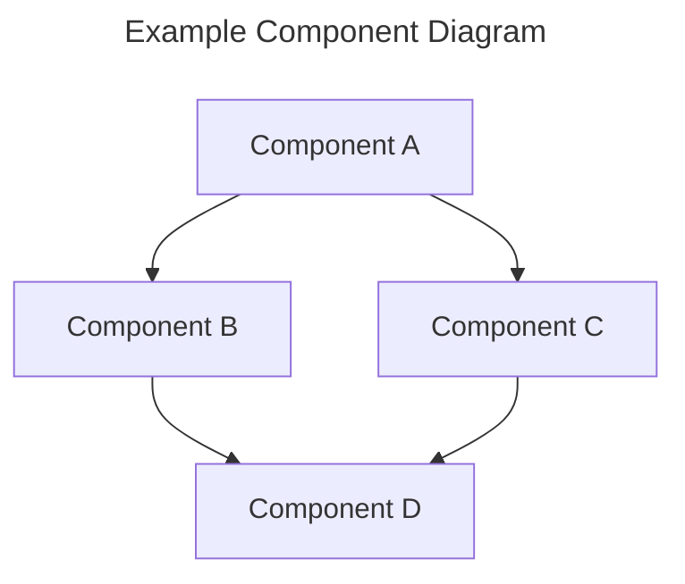
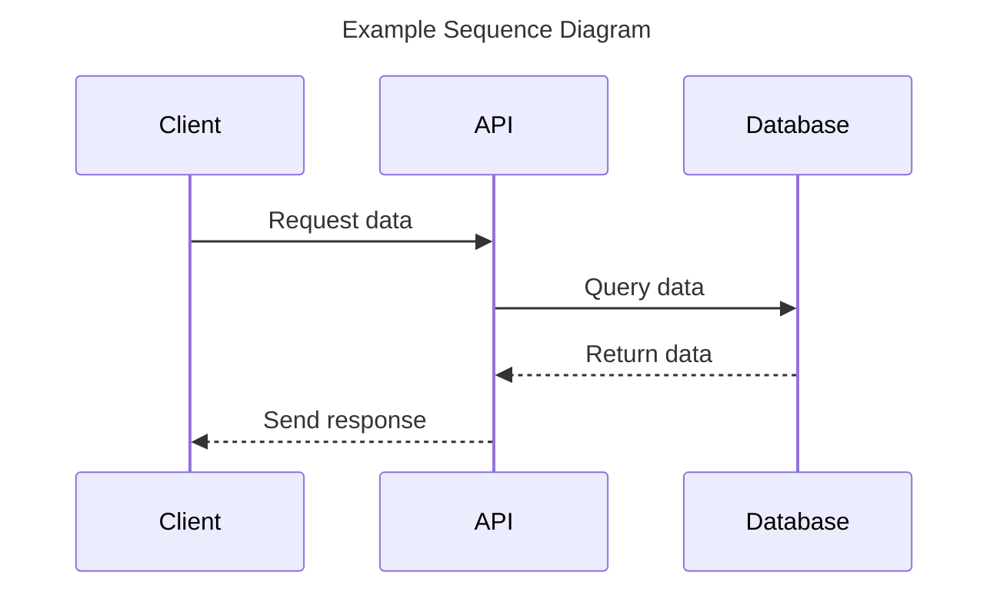
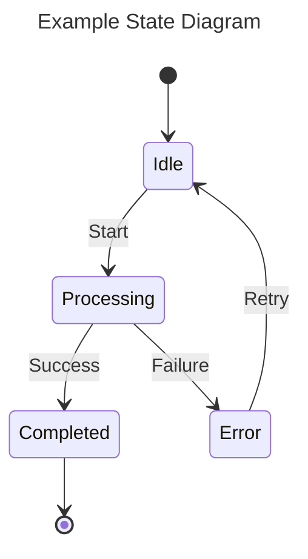

# Contributing to NestGate Specifications

This guide explains how to contribute to the NestGate specifications.

## Getting Started

1. **Understand the Structure**: Familiarize yourself with the [specification organization](./README.md).
2. **Identify the Component**: Determine which component your specification relates to.
3. **Use the Template**: Start with the [specification template](./TEMPLATE.md).

## Creating New Specifications

1. **Choose the Right Location**: 
   - Place specifications in the appropriate component directory
   - Use a descriptive filename in kebab-case (e.g., `zfs-snapshot-management.md`)

2. **Fill in the Template**:
   - Complete all sections
   - Use Mermaid diagrams for visual clarity
   - Include examples where appropriate
   - Document APIs and interfaces thoroughly

3. **Status Tracking**:
   - Start with "Draft" status
   - Update the status as the specification progresses
   - Keep the "Last Updated" date current

## Updating Existing Specifications

1. **Maintain Version History**:
   - Update the version number appropriately
     - Major version for breaking changes
     - Minor version for additions
     - Patch version for clarifications
   - Update the "Last Updated" date

2. **Document Changes**:
   - Add a "Change Log" section if not already present
   - Document the changes you've made

3. **Cross-Reference**:
   - Update related specifications that may be affected
   - Add/update links to related documents

## Quality Checklist

Ensure your specification:

- [ ] Uses the correct template
- [ ] Has a clear overview and goals
- [ ] Includes all required sections
- [ ] Has detailed functional requirements
- [ ] Defines interfaces clearly
- [ ] Includes diagrams where helpful
- [ ] Uses consistent terminology
- [ ] Follows Markdown formatting guidelines
- [ ] Has been spell-checked
- [ ] Includes working Mermaid diagrams

## Markdown Guidelines

- Use ATX-style headings (`#` for headlines)
- Use ordered lists for sequential steps
- Use unordered lists for collections
- Use code blocks with language indicators
- Use tables for structured data
- Use blockquotes for important notes

## Diagrams

Use Mermaid for diagrams. Common diagram types:

1. **Component Diagrams**:

2. **Sequence Diagrams**:

3. **State Diagrams**:

## Review Process

1. New specifications should be reviewed by at least one team member.
2. Updates to existing specifications should be reviewed if they involve substantial changes.
3. Use pull requests for all changes to enable proper review.

## Additional Resources

- [Markdown Guide](https://www.markdownguide.org/basic-syntax/)
- [Mermaid Documentation](https://mermaid-js.github.io/mermaid/)
- [NestGate Style Guide](./ORGANIZATION.md)

Thank you for your contributions to the NestGate documentation! 