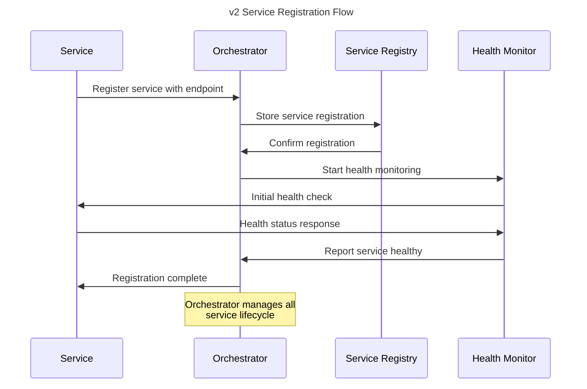
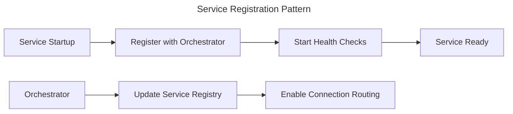
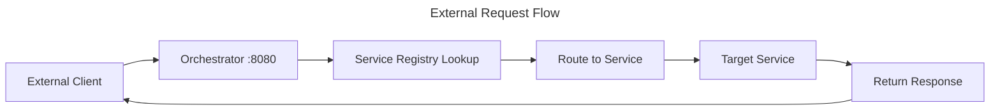
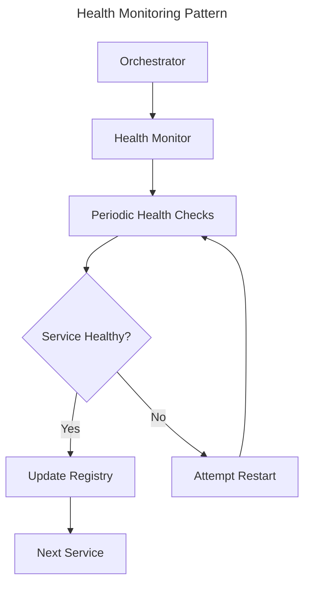

# NestGate v2 Orchestrator-Centric Service System

## Overview

NestGate v2 implements a **sovereign orchestrator-centric service system** that provides centralized service registration, discovery, and connectivity management. The orchestrator serves as the single hub for all service communication, eliminating complex service-to-service dependencies while supporting optional MCP federation.

## v2 Architectural Transformation

**v1 → v2 Evolution:**
- Port Manager → **NestGate Orchestrator** (central connectivity hub)
- Dynamic port allocation → **Centralized service routing**
- Service-to-service discovery → **Orchestrator-mediated communication**
- Required configuration → **Auto-discovery with graceful defaults**

## Key Benefits

✅ **Orchestrator-Centric Connectivity**
- ALL external connections flow through orchestrator
- Simplified service communication patterns
- Centralized service discovery and registration
- No direct service-to-service communication required

✅ **Sovereign Operation**
- Fully autonomous operation with no external dependencies
- Optional MCP federation with graceful degradation
- Standalone mode as default operational state
- Auto-detection of federation capabilities

✅ **Simplified Service Management**
- Services register with orchestrator on startup
- Orchestrator manages all service health and routing
- Automatic service discovery through central registry
- Graceful handling of service failures

✅ **Production Ready Architecture**
- Robust error handling and recovery
- Health monitoring with automatic restart capabilities
- Centralized logging and observability
- Security through orchestrator authentication

## Architecture

### NestGate Orchestrator (Port 8080)
- Central connectivity hub for all services
- Service registry and discovery management
- Connection proxy for all external requests
- Health monitoring and service lifecycle management
- Optional MCP federation handling

### Core Services Managed by Orchestrator
- **nestgate-core**: Storage management and tier coordination
- **nestgate-network**: Protocol services (NFS, SMB, HTTP)
- **nestgate-zfs**: ZFS integration and management
- **nestgate-meta**: Metadata and configuration storage

## Service Registration Flow



## API Endpoints

### Health Check
```bash
curl http://localhost:8080/api/health
```

### Service Registry
```bash
# List all registered services
curl http://localhost:8080/api/services

# Get specific service details
curl http://localhost:8080/api/services/nestgate-core

# Service discovery endpoint
curl http://localhost:8080/api/discovery
```

### System Status
```bash
# Overall system status
curl http://localhost:8080/api/status

# Federation status (if enabled)
curl http://localhost:8080/api/federation/status
```

## Service Discovery Response

### Standalone Mode (Default)
```json
{
  "mode": "standalone",
  "orchestrator": {
    "url": "http://localhost:8080",
    "status": "healthy",
    "version": "2.0.0"
  },
  "services": {
    "nestgate-core": {
      "endpoint": "http://localhost:8081",
      "status": "healthy",
      "type": "storage_management",
      "last_health_check": "2025-01-26T10:30:00Z"
    },
    "nestgate-network": {
      "endpoint": "http://localhost:8082",
      "status": "healthy", 
      "type": "protocol_services",
      "last_health_check": "2025-01-26T10:30:00Z"
    },
    "nestgate-zfs": {
      "endpoint": "http://localhost:8083",
      "status": "healthy",
      "type": "zfs_integration", 
      "last_health_check": "2025-01-26T10:30:00Z"
    }
  },
  "federation": {
    "status": "disabled",
    "mode": "standalone"
  }
}
```

### Federated Mode (Optional)
```json
{
  "mode": "federated",
  "orchestrator": {
    "url": "http://localhost:8080",
    "status": "healthy",
    "version": "2.0.0"
    },
    "services": {
    "nestgate-core": {
      "endpoint": "http://localhost:8081",
      "status": "healthy",
      "type": "storage_management"
    }
      },
  "federation": {
    "status": "connected",
    "mode": "federated",
    "mcp_cluster": {
      "endpoint": "https://mcp-cluster.example.com",
      "last_heartbeat": "2025-01-26T10:29:45Z",
      "cluster_id": "mcp-cluster-001"
    }
  }
}
```

## Implementation Details

### Orchestrator Service Registry
```rust
#[derive(Debug, Clone, Serialize, Deserialize)]
pub struct ServiceInfo {
    pub name: String,                    // Service name (e.g., "nestgate-core")
    pub endpoint: String,               // Service endpoint URL
    pub health_status: HealthStatus,    // Current health state
    pub last_health_check: Option<DateTime<Utc>>, // Last health check time
    pub metadata: HashMap<String, String>, // Service metadata
}

#[derive(Debug, Clone, Serialize, Deserialize)]
pub enum HealthStatus {
    Healthy,     // Service is operational
    Unhealthy,   // Service has issues
    Unknown,     // Health status unknown
}

impl ServiceRegistry {
    pub async fn register_service(&self, info: ServiceInfo) -> Result<(), ServiceError> {
        // Register service with orchestrator
        // Start health monitoring
        // Update service registry
    }
    
    pub async fn discover_services(&self) -> Vec<ServiceInfo> {
        // Return all healthy registered services
    }
}
```

### Connection Proxy Pattern
```rust
#[derive(Debug)]
pub struct ConnectionProxy {
    service_registry: Arc<ServiceRegistry>,
}

impl ConnectionProxy {
    pub async fn route_request(&self, path: &str, request: ProxyRequest) -> Result<ProxyResponse, ProxyError> {
        // 1. Parse request path to determine target service
        // 2. Lookup service in registry
        // 3. Verify service health
        // 4. Forward request to service
        // 5. Return response to client
    }
}
```

### Service Registration Example
```rust
// Service registers itself with orchestrator on startup
use nestgate_orchestrator::{ServiceInfo, ServiceRegistry, HealthStatus};

#[tokio::main]
async fn main() -> Result<(), Box<dyn std::error::Error>> {
    let service_info = ServiceInfo {
        name: "nestgate-core".to_string(),
        endpoint: "http://localhost:8081".to_string(),
        health_status: HealthStatus::Unknown,
        last_health_check: None,
        metadata: HashMap::new(),
    };
    
    let registry = ServiceRegistry::new("http://localhost:8080").await?;
    registry.register_service(service_info).await?;
    
    // Start service and maintain health check endpoint
    start_core_service().await?;
    
    Ok(())
}
```

## Comparison: v1 vs v2

### v1 Port Manager Architecture
```yaml
# Complex port allocation system
port_ranges:
  api: 3000-3099
  ui: 3100-3199
  websocket: 3200-3299
  database: 6000-6099

# Services discover each other directly
service_discovery:
  method: direct_lookup
  port_manager_dependency: required
```

### v2 Orchestrator Architecture
```yaml
# Simplified orchestrator-centric routing
orchestrator:
  port: 8080 (fixed)
  role: central_connectivity_hub

# All communication flows through orchestrator
service_communication:
  method: orchestrator_proxy
  direct_service_communication: disabled
  external_dependencies: none
```

## Orchestrator-Centric Patterns

### 1. Service Registration


### 2. External Request Routing


### 3. Health Monitoring


## MCP Federation Integration

### Federation Modes
```yaml
standalone_mode:
  description: "Default autonomous operation"
  dependencies: none
  mcp_integration: disabled
  
auto_detect_mode:
  description: "Attempt MCP connection, fallback to standalone"
  dependencies: optional_mcp
  mcp_integration: auto_detect
  
federated_mode:
  description: "Active MCP cluster participation"
  dependencies: mcp_cluster
  mcp_integration: enabled
```

### Federation Flow
```rust
#[derive(Debug)]
pub struct McpFederation {
    orchestrator: Arc<Orchestrator>,
    federation_mode: FederationMode,
}

impl McpFederation {
    pub async fn auto_detect_mcp(&self) -> FederationStatus {
        // Attempt to discover MCP cluster endpoints
        // Try to establish MCP connectivity
        // Register as storage provider if connected
        // Fall back to standalone if connection fails
    }
    
    pub async fn handle_federation_loss(&self) {
        // Gracefully degrade to standalone mode
        // Update service registry
        // Continue autonomous operation
    }
}
```

## Development Workflow

### 1. Start Orchestrator
```bash
# Start the NestGate orchestrator
cargo run --bin nestgate-orchestrator

# Orchestrator starts on port 8080
# Initializes service registry
# Begins health monitoring
```

### 2. Services Auto-Register
```bash
# Core services register themselves on startup
cargo run --bin nestgate-core     # Registers as storage management
cargo run --bin nestgate-network  # Registers as protocol services
cargo run --bin nestgate-zfs      # Registers as ZFS integration
```

### 3. External Access
```bash
# All external access goes through orchestrator
curl http://localhost:8080/api/storage/pools    # Routes to nestgate-core
curl http://localhost:8080/api/network/status   # Routes to nestgate-network
curl http://localhost:8080/api/zfs/health       # Routes to nestgate-zfs
```

## Deployment Patterns

### Standalone Deployment (Default)
```yaml
deployment_mode: standalone
components:
  - nestgate-orchestrator:8080
  - nestgate-core (auto-port)
  - nestgate-network (auto-port)
  - nestgate-zfs (auto-port)
dependencies: none
mcp_federation: disabled
```

### Federated Deployment (Optional)
```yaml
deployment_mode: federated
components:
  - nestgate-orchestrator:8080
  - nestgate-core (auto-port)
  - nestgate-network (auto-port) 
  - nestgate-zfs (auto-port)
  - mcp-federation-handler
dependencies:
  - mcp_cluster: optional
mcp_federation: auto_detect
```

## Future Enhancements

### Phase 2: Enhanced Service Coordination
- Multi-instance service support
- Load balancing through orchestrator
- Service dependency management
- Rolling updates and blue-green deployments

### Phase 3: Advanced Federation
- Multi-node orchestrator coordination
- Distributed service registry
- Cross-cluster service discovery
- Federation-aware load balancing

### Phase 4: AI-Optimized Services
- Model-specific service patterns
- GPU resource coordination
- AI workload-aware routing
- Performance optimization services

## Migration from v1

### v1 Port Manager → v2 Orchestrator
1. **Replace port manager** with orchestrator
2. **Update service registration** to use orchestrator endpoints
3. **Remove direct service-to-service** communication
4. **Implement health check endpoints** in all services
5. **Update deployment scripts** for orchestrator-centric patterns

## Files and Structure

```
code/crates/nestgate-orchestrator/src/
├── orchestrator.rs          # Main orchestrator implementation
├── service_registry.rs      # Service registration and discovery
├── connection_proxy.rs      # Request routing and proxying
├── health_monitor.rs        # Service health monitoring
├── mcp_federation.rs        # Optional MCP integration
└── lib.rs                   # Public API and exports
```

## Summary

The NestGate v2 service system represents a **fundamental architectural evolution** from complex port management to **orchestrator-centric simplicity**:

### Key Improvements
- **Simplified Architecture**: Single orchestrator vs complex port manager
- **Sovereign Operation**: Fully autonomous with optional federation
- **Centralized Management**: All connectivity through orchestrator
- **Production Ready**: Robust health monitoring and error handling

### Implementation Success
- ✅ **Zero external dependencies** for standalone operation
- ✅ **Orchestrator-centric** service communication
- ✅ **Optional MCP federation** with graceful degradation
- ✅ **Simplified deployment** and management

The v2 service system successfully delivers on the **sovereign NAS vision** while maintaining flexibility for optional cluster participation through MCP federation. 