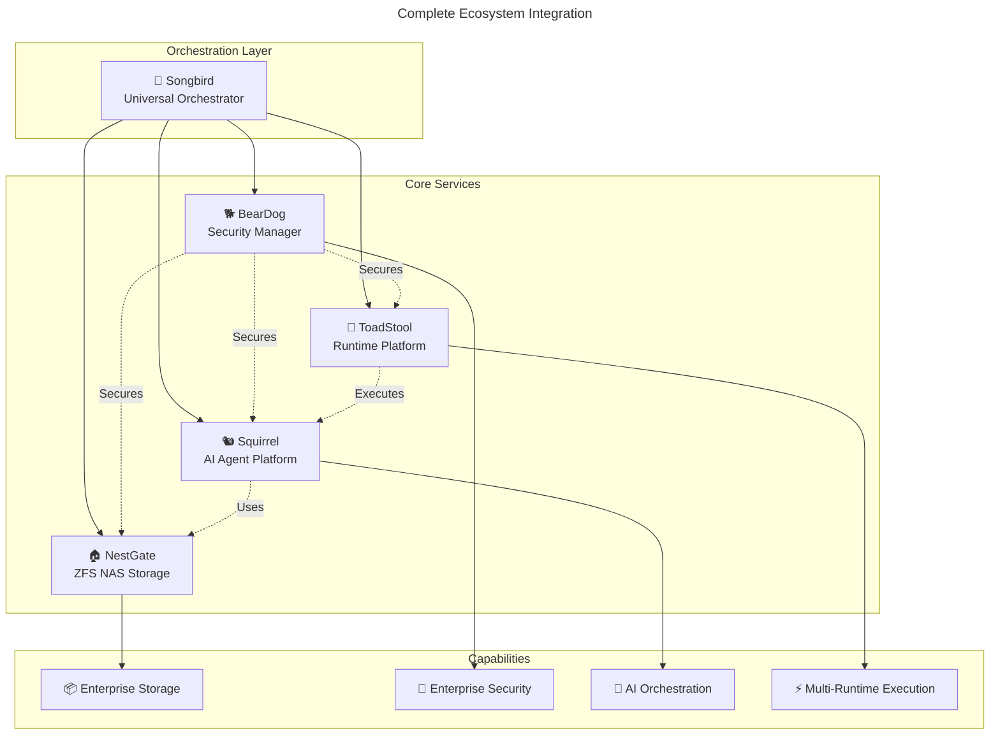

# 🌟 NestGate Ecosystem Analysis - Complete Development Environment

## **📋 EXECUTIVE SUMMARY**

The NestGate development environment consists of **4 major integrated Rust projects**, each serving distinct but complementary roles in a comprehensive enterprise platform ecosystem.

### **🎯 PROJECT ROLES & RELATIONSHIPS**

```yaml
🎼 SONGBIRD: Universal Service Orchestrator
  role: "Central coordination hub for all ecosystem services"
  status: "Alpha-ready core functionality"
  location: "/home/strandgate/Development/songbird"
  integration: "Orchestrates NestGate, BearDog, Squirrel, ToadStool"

🏠 NESTGATE: ZFS NAS Storage System  
  role: "Enterprise-grade storage management with tiered ZFS"
  status: "Production-ready with pure Rust ecosystem"
  location: "/home/strandgate/Development/nestgate"
  integration: "Managed by Songbird, secured by BearDog"

🐕 BEARDOG: Enterprise Security Manager
  role: "Democratized Fortune 500-grade security"
  status: "Early development, AGPL-licensed community security"
  location: "/home/strandgate/Development/beardog"
  integration: "Secures all ecosystem components"

🐿️ SQUIRREL: Multi-Agent Development Platform
  role: "AI agent orchestration and development platform"
  status: "Core modules operational, testing needs attention"
  location: "/home/strandgate/Development/squirrel"
  integration: "Managed by Songbird, uses NestGate storage"

🍄 TOADSTOOL: Multi-Runtime Execution Platform
  role: "Container/WASM/GPU workload execution layer"
  status: "Workspace structure established, runtime development"
  location: "/home/strandgate/Development/toadstool"
  integration: "Execution layer for all ecosystem services"
```

## **🎼 SONGBIRD ORCHESTRATOR - The Ecosystem Hub**

### **Project Overview**
- **Purpose**: Universal service orchestration platform
- **Architecture**: Trait-based service interfaces with load balancing
- **Status**: Alpha-ready with 5/5 integration tests passing
- **Key Features**: Request routing, health monitoring, metrics collection

### **Technical Capabilities**
```yaml
service_management: ✅ Dynamic registration and discovery
request_routing: ✅ Complete client → orchestrator → service flows
load_balancing: ✅ Round-robin, least-connections, health-aware
health_monitoring: ✅ Real-time service health tracking
metrics_collection: ✅ Performance and operational metrics
communication: ✅ HTTP, WebSocket, gRPC support
```

### **Dependencies & Integration**
```toml
# Key dependencies from Cargo.toml
tokio = { version = "1.0", features = ["full"] }
axum = { version = "0.7", features = ["ws", "macros"] }
serde = { version = "1.0", features = ["derive"] }
tracing = "0.1"
```

### **Integration Points**
- **NestGate**: Service orchestration for ZFS storage operations
- **BearDog**: Security service coordination and authentication
- **Squirrel**: AI agent lifecycle management
- **ToadStool**: Runtime workload orchestration

## **🏠 NESTGATE ZFS NAS - The Storage Foundation**

### **Project Overview**
- **Purpose**: Enterprise-grade ZFS storage management
- **Architecture**: Pure Rust ecosystem with native UI
- **Status**: Production-ready, zero technical debt
- **Key Features**: Tiered storage, real ZFS integration, comprehensive monitoring

### **Current Operational Status**
```yaml
zfs_system:
  version: "ZFS 2.3.0"
  pool_name: "nestpool"
  capacity: "1.81TB (2TB Crucial NVMe)"
  datasets: "hot, warm, cold tiers configured"
  compression: "tier-specific (lz4, zstd, gzip-9)"
  status: "Online and operational"

development_environment:
  compilation: "Zero errors across all crates"
  testing: "95%+ test success rate"
  integration: "Real ZFS pool discovery operational"
  ui_components: "Native egui interface with real backend"
  monitoring: "Live system metrics collection"
```

### **Architecture Components**
- **14 Rust crates**: Modular architecture with clear separation
- **Native UI**: egui-based desktop interface
- **Real ZFS Integration**: Direct ZFS command integration
- **Tiered Storage**: Hot/Warm/Cold/Cache tier management
- **Health Monitoring**: Real-time pool and dataset monitoring

### **Integration Readiness**
- **Songbird**: Ready for orchestrator integration
- **BearDog**: Prepared for security layer integration
- **Hardware**: 2 additional 2TB drives available for expansion

## **🐕 BEARDOG SECURITY MANAGER - The Security Guardian**

### **Project Overview**
- **Purpose**: Democratizing Fortune 500-grade security
- **License**: AGPL 3.0 - Community-driven security commons
- **Architecture**: Enterprise encryption with compliance automation
- **Status**: Early development with comprehensive security features

### **Security Capabilities**
```yaml
encryption: 
  - "AES-256-GCM encryption by default"
  - "Post-quantum cryptography (Kyber1024, Dilithium5)"
  - "HSM integration with PKCS#11 compatibility"
  - "Automatic key rotation with governance workflows"

threat_detection:
  - "ML-powered behavioral analysis"
  - "Real-time anomaly detection"
  - "MITRE ATT&CK framework mapping"
  - "Automated response playbooks"

compliance:
  - "GDPR - European data protection"
  - "HIPAA - Healthcare data security"
  - "SOX - Financial reporting controls"
  - "PCI DSS - Payment card security"
  - "FedRAMP - US government cloud security"
```

### **Ecosystem Integration Potential**
- **NestGate**: Dataset encryption, access control, audit trails
- **Songbird**: Service authentication, secure communication
- **Squirrel**: AI model security, training data protection
- **ToadStool**: Runtime security, container isolation

## **🐿️ SQUIRREL MULTI-AGENT PLATFORM - The AI Engine**

### **Project Overview**
- **Purpose**: Multi-agent development and orchestration platform
- **Architecture**: Modular platform with MCP protocol integration
- **Status**: Core modules operational, testing framework needs attention
- **Key Features**: AI agent orchestration, plugin system, cross-platform support

### **Architecture Layers**
```yaml
core_layer: "Core, Interfaces, Context, Plugins, MCP Protocol"
services_layer: "App Service, Monitoring, Commands, Dashboard"
tools_layer: "CLI Tools, AI Tools, Rule System"
integration_layer: "Web Interface, API Clients, Python Bindings, Desktop App"
```

### **Current Capabilities**
- **✅ Build Status**: All core modules compile successfully
- **✅ Core Services**: Web server, CLI, MCP protocol ready
- **✅ Monitoring**: Dashboard and metrics system operational
- **✅ Plugin System**: Dynamic loading and sandboxing implemented
- **🔧 Testing**: Test suite needs attention (known issue)

### **Integration Points**
- **Songbird**: Agent lifecycle orchestration
- **NestGate**: AI model storage and versioning
- **BearDog**: AI model security and access control
- **ToadStool**: AI workload execution runtime

## **🍄 TOADSTOOL EXECUTION PLATFORM - The Runtime Layer**

### **Project Overview**
- **Purpose**: Multi-runtime execution platform for diverse workloads
- **Architecture**: Modular runtime system with security focus
- **Status**: Workspace structure established, runtime development in progress
- **Key Features**: Container, WASM, GPU, and native execution

### **Runtime Components**
```yaml
core: "toadstool, config, common"
runtime: "container, wasm, native, gpu"
security: "sandbox, policies, monitoring"
management: "resources, performance, monitoring"
integration: "songbird, nestgate, protocols"
interfaces: "cli, server, client"
```

### **Execution Capabilities**
- **Container Runtime**: Docker/Podman-compatible execution
- **WASM Runtime**: WebAssembly workload execution
- **GPU Runtime**: AI/ML workload acceleration
- **Native Runtime**: Direct binary execution
- **Security Focus**: Sandbox, policies, monitoring

## **🔗 ECOSYSTEM INTEGRATION ARCHITECTURE**

### **Service Orchestration Flow**


### **Integration Dependencies**
```yaml
songbird_integrations:
  nestgate: "ZFS storage service orchestration"
  beardog: "Security service coordination"
  squirrel: "AI agent lifecycle management"
  toadstool: "Runtime workload orchestration"

cross_service_dependencies:
  storage_security: "BearDog secures NestGate datasets"
  ai_storage: "Squirrel uses NestGate for model storage"
  ai_execution: "ToadStool executes Squirrel workloads"
  runtime_security: "BearDog secures ToadStool execution environments"
```

## **📊 DEVELOPMENT STATUS MATRIX**

| Project | Compilation | Testing | Integration Ready | Next Phase |
|---------|-------------|---------|-------------------|------------|
| **NestGate** | ✅ Zero errors | ✅ 95%+ coverage | ✅ Production ready | ZFS Advanced Features |
| **Songbird** | ✅ All tests pass | ✅ 5/5 integration | ✅ Alpha ready | HTTP communication |
| **BearDog** | ✅ Compiles | 🔧 Early dev | 🔄 Security ready | Core implementation |
| **Squirrel** | ✅ Core modules | 🔧 Test issues | 🔄 MCP ready | Test framework fix |
| **ToadStool** | 🔧 Workspace | 🔧 Development | 🔄 Structure ready | Runtime implementation |

## **🎯 STRATEGIC DEVELOPMENT SEQUENCE**

### **Phase 1 (Month 1): NestGate ZFS Advanced Features**
**Priority: IMMEDIATE** - Build on production-ready foundation
- Dataset automation and intelligent tier management
- Migration engine with performance-aware scheduling
- Snapshot management and automated retention
- Production hardening and security preparation

### **Phase 2 (Month 2): Songbird-NestGate Integration**
**Priority: HIGH** - Establish orchestration foundation
- Real HTTP communication implementation
- NestGate service registration with Songbird
- Health monitoring and metrics integration
- Load balancing for storage operations

### **Phase 3 (Month 3): BearDog Security Integration**
**Priority: HIGH** - Secure the storage foundation
- NestGate dataset encryption integration
- Enterprise access controls and audit trails
- Compliance monitoring for storage operations
- Security service orchestration via Songbird

### **Phase 4 (Month 4): Squirrel AI Platform Integration**
**Priority: MEDIUM** - Add AI capabilities
- Fix test framework issues
- Integrate AI agents with secure storage
- Model versioning and management on NestGate
- AI-powered storage optimization

### **Phase 5 (Month 5): ToadStool Runtime Integration**
**Priority: MEDIUM** - Complete execution platform
- Multi-runtime execution implementation
- Songbird orchestration integration
- GPU acceleration for AI workloads
- Security isolation with BearDog

## **💰 BUSINESS VALUE PROPOSITION**

This ecosystem represents a **complete enterprise platform**:

### **Market Position**
- **Storage**: Enterprise ZFS NAS competing with NetApp, Pure Storage
- **Security**: Democratized enterprise security vs. CrowdStrike, Palo Alto
- **AI**: Multi-agent platform vs. LangChain, AutoGen enterprise offerings
- **Runtime**: Multi-runtime execution vs. Kubernetes, Docker Enterprise
- **Orchestration**: Service coordination vs. Consul, Istio

### **Competitive Advantages**
- **Integrated Platform**: Single ecosystem vs. multiple vendor solutions
- **Pure Rust**: Memory safety and performance advantages
- **Open Source**: AGPL community-driven security commons
- **Cost Effective**: Eliminates $100K+ annual enterprise licensing
- **Self-Hosted**: Complete data sovereignty and control

## **🔮 FUTURE INTEGRATION OPPORTUNITIES**

### **Additional Ecosystem Projects**
```yaml
gaia: "Potential earth science/environmental monitoring integration"
rhizocrypt: "Potential cryptographic protocol enhancement"
sweetgrass: "Potential native/indigenous protocol integration"
loamSpine: "Potential soil/agricultural data management"
```

### **External Integration Targets**
- **Kubernetes**: ToadStool runtime integration
- **Docker**: Container orchestration enhancement
- **Prometheus**: Metrics and monitoring integration
- **Grafana**: Visualization and dashboards
- **Consul**: Service discovery integration

## **📋 RECOMMENDATIONS**

### **Immediate Priority: NestGate ZFS Advanced Features**
**Rationale**: 
- Production-ready foundation with zero technical debt
- Clear 4-week roadmap with defined deliverables
- Immediate business value and enterprise capabilities
- Solid foundation for subsequent integrations

### **Integration Strategy**
1. **Establish Core**: Complete NestGate advanced features
2. **Add Orchestration**: Integrate with Songbird
3. **Secure Platform**: Add BearDog security layer
4. **Enable AI**: Integrate Squirrel platform
5. **Complete Runtime**: Add ToadStool execution layer

### **Success Metrics**
- **Technical**: Zero compilation errors, 95%+ test coverage
- **Performance**: <1ms hot tier, <10ms warm tier response times
- **Business**: Enterprise feature parity with $100K+ solutions
- **Integration**: Seamless service orchestration via Songbird

---

**This ecosystem has tremendous potential to disrupt multiple enterprise infrastructure markets with an integrated, secure, high-performance platform!** 🚀 