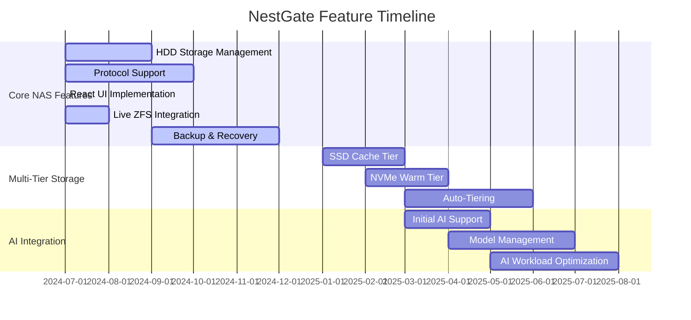

# NestGate Future Development Plans

## Overview

This document outlines features and capabilities that have been deliberately deferred from the initial NestGate release to focus on core NAS functionality. These features remain part of our long-term vision but will be implemented after the foundation of a stable, fully functional NAS platform is established.

## Current Development Focus

Before expanding to the deferred features outlined below, we are currently focused on completing the following high-priority items:

1. **React UI Integration**: Completing the integration of React UI components (NasMetrics and PerformanceOptimizer) with the ZFS backend to display live data and allow direct control of storage resources
2. **HDD Performance Optimization**: Fine-tuning ZFS parameters for optimal HDD performance to achieve network saturation on 1G/2.5G/10G connections
3. **Production-Ready Error Handling**: Ensuring comprehensive error handling, recovery, and user-friendly messaging

Once these foundational elements are complete, we will proceed with the future development plans outlined below.

## Deferred Feature Categories

## Multi-Tier Storage (2025 Q1)

The initial release focuses on a single HDD tier which can saturate typical 1G/2.5G/10G network connections. Future expansions will introduce a proper multi-tier storage architecture.

### Planned Features

1. **SSD Cache Tier**
   - L2ARC for read caching
   - SLOG for sync write acceleration
   - Automatic cache warming
   - Cache hit/miss analytics

2. **NVMe Warm Tier**
   - High-performance storage for active datasets
   - Automatic dataset promotion/demotion
   - Quality of service controls
   - Performance monitoring and reporting

3. **Auto-Tiering System**
   - Access pattern detection
   - Intelligent data placement
   - Scheduled tier migrations
   - Performance-based tier assignment

## AI Integration Features (2025 Q2-Q3)

After establishing stable NAS functionality, AI integration will add specialized capabilities for managing and serving ML/AI models and datasets.

### Planned Features

1. **AI Workload Detection**
   - Training vs. inference pattern recognition
   - Automatic ZFS tuning for detected workloads
   - Dataset access monitoring and optimization
   - Checkpoint write optimization

2. **Model Management**
   - Version tracking and lineage
   - Model metadata management
   - Training dataset association
   - Performance metrics collection

3. **Dataset Management**
   - Dataset versioning and tracking
   - Automatic preprocessing
   - Dataset cataloging
   - Feature extraction and indexing

4. **Inference Acceleration**
   - Small model hosting
   - Local inference capabilities
   - Optimized data paths for inference
   - Performance monitoring

## Advanced Network Features (2025 Q4)

Once core NAS and AI functionality is stable, advanced networking capabilities will be added.

### Planned Features

1. **Multi-Node Coordination**
   - Clustered storage nodes
   - Distributed metadata
   - Load balancing
   - High availability

2. **Advanced Protocol Support**
   - S3-compatible API
   - WebDAV integration
   - Advanced iSCSI features
   - Protocol performance analytics

3. **External Integration**
   - Cloud tiering
   - Remote replication
   - External service APIs
   - Third-party application integration

## Implementation Approach

Our approach to implementing these deferred features will maintain backward compatibility with the initial release:

1. **Compatibility Guarantees**
   - API stability for core functions
   - Non-disruptive upgrades
   - Data format compatibility
   - Configuration preservation

2. **Progressive Enhancement**
   - New features added non-disruptively
   - Optional capabilities that can be enabled/disabled
   - Performance improvements for existing workflows
   - Incremental adoption path

3. **User Experience**
   - Unified management interface based on React/Ant Design
   - Consistent design language across all features
   - Contextual help for new features
   - Guided wizards for complex setups

## Deferral Rationale

These features have been deferred to:

1. **Focus Development Resources**: Concentrate on delivering a high-quality core NAS system first
2. **Reduce Complexity**: Avoid overcomplicating the initial release
3. **Validate Core Architecture**: Ensure the foundation is solid before building advanced features
4. **Deliver Value Sooner**: Provide a functional storage system to users more quickly
5. **Gather Real-World Feedback**: Learn from actual usage before implementing advanced features

## Conclusion

While these features have been deferred, they remain an important part of our long-term vision. By focusing initially on core NAS functionality with an HDD-only tier, we can deliver a stable, high-performing storage platform that meets immediate needs while building a solid foundation for future enhancements. Our recent progress in developing the React UI components establishes the groundwork for a modern, responsive user interface that will scale well as we add more advanced features in the future. 