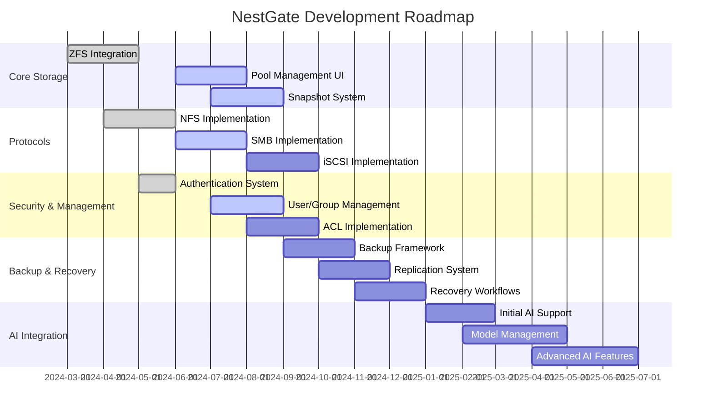

# NestGate NAS-First Development Roadmap

## Executive Summary

This roadmap outlines our revised strategic direction: focusing on completing all core NAS functionality before proceeding with AI integration. The goal is to deliver a stable, high-performance storage platform that meets the needs of general users while establishing a solid foundation for future AI capabilities.

### Home System Focus - Production Priority

For our current production as a home system, we will initially focus on a single HDD-based storage tier:

- **Single-Tier Storage**: Optimize for HDD performance, as this will fully saturate our 2.5G or 10G network interfaces
- **Simplified Storage Management**: Focus on robust management of a single storage tier before adding complexity
- **Maximize Network Throughput**: Ensure we fully utilize available network bandwidth before scaling to faster storage tiers
- **Future Expandability**: Design the system to allow future addition of SSD/NVMe tiers when network bandwidth increases

## Development Phases

## Phase 1: Core Storage Services (Q3 2024)

### Storage Management
- [ ] Complete ZFS pool management UI
- [ ] Implement dataset creation and management
- [ ] Develop quota management system
- [ ] **Optimize HDD performance for network saturation**
- [ ] Implement health monitoring dashboard
- [ ] Develop performance monitoring tools

### Snapshot System
- [ ] Implement basic snapshot creation/deletion
- [ ] Create snapshot scheduling interface
- [ ] Develop snapshot browsing and management UI
- [ ] Implement clone functionality
- [ ] Add snapshot retention policies
- [ ] Create snapshot search capabilities

### Network & Protocol Configuration
- [ ] Complete VLAN configuration UI
- [ ] Finalize network bonding interface
- [ ] **Optimize for 2.5G/10G NIC throughput**
- [ ] Implement protocol service management
- [ ] Add firewall configuration tools
- [ ] Create connection monitoring dashboard
- [ ] Implement network diagnostics

## Phase 2: Advanced Protocols & Security (Q4 2024)

### SMB Implementation
- [ ] Complete SMB3 protocol support
- [ ] Implement ACL management UI
- [ ] Add Windows integration features
- [ ] Create share management interface
- [ ] Implement user/group mapping
- [ ] Develop SMB-specific performance tuning

### iSCSI Implementation
- [ ] Complete iSCSI target configuration
- [ ] Implement LUN management
- [ ] Add CHAP authentication
- [ ] Create target group management
- [ ] Implement multipath I/O support
- [ ] Add snapshot-based LUN cloning

### Security Management
- [ ] Implement comprehensive user management
- [ ] Create role-based access control
- [ ] Develop permission management interfaces
- [ ] Implement encryption management
- [ ] Add certificate management
- [ ] Create access auditing system

## Phase 3: Backup & Recovery (Q1 2025)

### Backup Framework
- [ ] Implement backup job management
- [ ] Create backup scheduling interface
- [ ] Develop backup verification system
- [ ] Add backup catalogs and search
- [ ] Implement backup storage
- [ ] Create backup monitoring and reporting

### Replication System
- [ ] Implement local replication
- [ ] Add remote replication capabilities
- [ ] Create replication management UI
- [ ] Implement bandwidth throttling
- [ ] Add encryption for replicated data
- [ ] Develop replication health monitoring

### Recovery Workflows
- [ ] Implement file-level recovery
- [ ] Add dataset restore features
- [ ] Create disaster recovery workflows
- [ ] Implement recovery testing tools
- [ ] Add automation for routine recovery
- [ ] Create recovery verification system

## Phase 4: AI Integration (Q2 2025)

### Initial AI Support
- [ ] Add AI workload detection
- [ ] Implement specialized ZFS tuning
- [ ] Create model hosting infrastructure
- [ ] Develop dataset management tools
- [ ] Add basic inference capabilities
- [ ] Implement AI-specific monitoring

### Advanced AI Features
- [ ] Develop model versioning system
- [ ] Add advanced data path optimizations
- [ ] Implement AI acceleration support
- [ ] Create model lineage tracking
- [ ] Add dataset versioning capabilities
- [ ] Implement automated model deployment

## Technical Implementation Priorities

### 1. User Interface Improvements
- Complete the React-based management UI
- Implement responsive design for all device sizes
- Create consistent design language
- Develop contextual help system
- Implement accessibility features

### 2. API Integration
- Complete RESTful API documentation
- Implement comprehensive API security
- Create client libraries for popular languages
- Develop API management portal
- Implement rate limiting and monitoring

### 3. Performance Optimization
- **Optimize ZFS parameters for HDD-only pools**
- **Maximize network throughput utilization**
- Implement intelligent read caching
- Develop I/O scheduling optimization for sequential workloads
- Implement performance analytics

### 4. Testing Infrastructure
- Expand automated test coverage
- Implement integration test framework
- **Create performance benchmark suite for HDD and network throughput**
- Develop security testing framework
- Implement compatibility testing

## Success Metrics

### Phase 1 Metrics
- 100% of core ZFS functionality implemented and tested
- Complete UI for all storage management tasks
- Full NFS protocol support with optimizations
- **Network throughput at 90%+ of theoretical maximum**
- Comprehensive monitoring and alerting system

### Phase 2 Metrics
- Complete SMB protocol support with Windows integration
- Full iSCSI implementation meeting enterprise requirements
- Comprehensive security system implementation
- 90%+ test coverage of all core functionality

### Phase 3 Metrics
- Complete backup and recovery system
- Full replication capabilities with monitoring
- Disaster recovery workflows tested and documented
- Backup verification and reporting systems operational

### Phase 4 Metrics
- AI optimization providing measurable performance improvements
- Model hosting capabilities operational
- AI workflow integration complete
- Advanced data path optimizations implemented

## Timeline and Resources

### Q3 2024
- **Focus**: Core Storage Services with HDD optimization
- **Key Deliverables**: ZFS Management UI, Snapshot System, Network Configuration
- **Resources**: 3 Frontend, 4 Backend, 1 QA

### Q4 2024
- **Focus**: Advanced Protocols & Security
- **Key Deliverables**: SMB Implementation, iSCSI Support, Security Management
- **Resources**: 2 Frontend, 5 Backend, 2 QA

### Q1 2025
- **Focus**: Backup & Recovery
- **Key Deliverables**: Backup Framework, Replication, Recovery Workflows
- **Resources**: 2 Frontend, 4 Backend, 2 QA

### Q2 2025
- **Focus**: Initial AI Integration
- **Key Deliverables**: AI Workload Support, Model Hosting, Dataset Management
- **Resources**: 2 Frontend, 3 Backend, 2 ML, 1 QA

### Q3 2025
- **Focus**: Advanced AI Features
- **Key Deliverables**: Model Versioning, Data Path Optimization, Acceleration Support
- **Resources**: 2 Frontend, 3 Backend, 3 ML, 2 QA

## Risk Management

### Technical Risks
1. **ZFS Performance Tuning**: Mitigate through extensive benchmarking and testing
2. **Protocol Compatibility**: Address through comprehensive compliance testing
3. **Security Vulnerabilities**: Mitigate with regular security audits and testing
4. **Scaling Challenges**: Address through architecture reviews and performance testing

### Project Risks
1. **Resource Constraints**: Mitigate through prioritization and phased approach
2. **Scope Creep**: Address with clear requirements and change management
3. **Timeline Pressure**: Mitigate with modular implementation allowing partial releases
4. **Integration Complexity**: Address through well-defined interfaces and APIs

## Conclusion

By focusing on completing core NAS functionality first, we:
1. Deliver a fully functional storage platform faster
2. Establish a stable foundation for AI capabilities
3. Allow for real-world validation of core systems
4. Create immediate value while building toward advanced features
5. Reduce technical risk through incremental development 