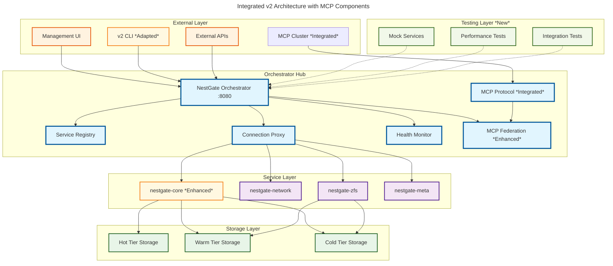

# NestGate v2 GitClone Integration Plan

## Overview

This document outlines the integration of valuable components from the `nestgate-gitclone` repository into our v2 orchestrator-centric architecture. The old codebase contains mature MCP protocol implementations, testing infrastructure, and development tools that can accelerate our v2 development.

## Integration Strategy

### Phase 1: Protocol Integration (Week 1-2)
- **MCP Protocol Implementation**: Adapt existing MCP client/server for v2 federation
- **Capability System**: Integrate capability-based architecture with orchestrator
- **Message Handling**: Reuse protocol buffer definitions and gRPC services

### Phase 2: Testing Infrastructure (Week 3-4)
- **Mock Services**: Adapt mock-nas tool for v2 orchestrator testing
- **Test Scenarios**: Create v2-specific test scenarios and fixtures
- **Performance Testing**: Integrate performance testing framework

### Phase 3: Development Tools (Week 5-6)
- **Dev Environment**: Adapt development setup scripts for v2
- **Build System**: Integrate workspace configuration and dependency management
- **CI/CD Pipeline**: Adapt GitHub Actions for v2 architecture

## Component Analysis

### High-Value Components for Integration

#### 1. MCP Protocol Implementation (`nestgate-protocol`)
```yaml
integration_value: HIGH
complexity: MEDIUM
alignment: EXCELLENT
components:
  - Protocol Buffer definitions
  - gRPC service implementation  
  - Message validation and handling
  - Capability management system
  - State synchronization
```

#### 2. Testing Infrastructure (`tools/mock-nas`, `tests/`)
```yaml
integration_value: HIGH
complexity: LOW
alignment: GOOD
components:
  - Mock NAS simulation
  - Integration test framework
  - Performance testing tools
  - Security test suites
```

#### 3. Development Tools (`tools/dev-setup`)
```yaml
integration_value: MEDIUM
complexity: LOW
alignment: GOOD
components:
  - Development environment setup
  - Docker configurations
  - Local testing infrastructure
```

#### 4. Core Utilities (`nestgate-core`)
```yaml
integration_value: MEDIUM
complexity: MEDIUM
alignment: GOOD
components:
  - Error handling patterns
  - Configuration management
  - Shared utilities and types
  - Logging and tracing setup
```

### Components Requiring Significant Adaptation

#### 1. Agent System (`nestgate-agent`)
```yaml
integration_approach: TRANSFORM
reason: "Agent pattern doesn't align with orchestrator-centric v2 architecture"
adaptation:
  - Extract monitoring and metrics components
  - Adapt state management for orchestrator
  - Transform command system to orchestrator APIs
```

#### 2. CLI Interface (`nestgate-cli`)
```yaml
integration_approach: REDESIGN
reason: "CLI needs to target orchestrator endpoints instead of direct service access"
adaptation:
  - Redesign commands for orchestrator API
  - Update output formatting for v2 responses
  - Adapt configuration for orchestrator-centric model
```

## Integration Architecture

### v2 Orchestrator + MCP Integration


## Detailed Integration Plans

### 1. MCP Protocol Integration

#### Current State (GitClone)
```rust
// nestgate-protocol/src/service.rs
pub struct McpService {
    capabilities: Vec<Capability>,
    state: SystemState,
    handlers: MessageHandlers,
}

impl McpService {
    pub async fn handle_message(&self, message: Message) -> Result<Response, McpError> {
        // Direct message handling
    }
}
```

#### v2 Integration Target
```rust
// code/crates/nestgate-orchestrator/src/mcp_protocol.rs
pub struct OrchestratorMcpService {
    orchestrator: Arc<Orchestrator>,
    capabilities: Vec<OrchestratorCapability>,
    federation_handler: Arc<McpFederation>,
}

impl OrchestratorMcpService {
    pub async fn handle_federation_message(&self, message: Message) -> Result<Response, McpError> {
        // Route through orchestrator
        self.orchestrator.route_mcp_message(message).await
    }
    
    pub async fn register_storage_capabilities(&self) -> Result<(), McpError> {
        // Register v2 storage capabilities with MCP cluster
    }
}
```

### 2. Testing Infrastructure Integration

#### Mock Services Adaptation
```rust
// tests/mock/orchestrator.rs
pub struct MockOrchestrator {
    service_registry: MockServiceRegistry,
    connection_proxy: MockConnectionProxy,
    health_monitor: MockHealthMonitor,
    mcp_federation: MockMcpFederation,
}

impl MockOrchestrator {
    pub async fn simulate_service_failure(&self, service_name: &str) -> Result<(), TestError> {
        // Simulate service failure and test orchestrator response
    }
    
    pub async fn simulate_federation_loss(&self) -> Result<(), TestError> {
        // Test graceful degradation to standalone mode
    }
    
    pub async fn simulate_high_load(&self, concurrent_requests: usize) -> Result<TestMetrics, TestError> {
        // Performance testing scenarios
    }
}
```

#### Test Scenario Framework
```rust
// tests/scenarios/mod.rs
pub enum TestScenario {
    ServiceRegistration,
    ServiceFailure,
    FederationConnection,
    FederationLoss,
    HighLoad,
    SecurityBreach,
}

pub struct ScenarioRunner {
    mock_orchestrator: MockOrchestrator,
    metrics_collector: MetricsCollector,
}

impl ScenarioRunner {
    pub async fn run_scenario(&self, scenario: TestScenario) -> Result<TestReport, TestError> {
        // Execute test scenario and collect metrics
    }
}
```

### 3. Development Tools Integration

#### Workspace Configuration
```toml
# Cargo.toml (Enhanced with GitClone dependencies)
[workspace]
members = [
    "code/crates/nestgate-orchestrator",
    "code/crates/nestgate-core", 
    "code/crates/nestgate-network",
    "code/crates/nestgate-zfs",
    "code/crates/nestgate-meta",
    "code/crates/nestgate-protocol",  # Integrated from GitClone
    "code/crates/nestgate-cli",       # Adapted from GitClone
    "tests/mock",                     # Adapted from GitClone
    "tools/dev-setup",                # Integrated from GitClone
]

[workspace.dependencies]
# Core runtime (from GitClone)
tokio = { version = "1.44.0", features = ["full"] }
futures = "0.3"
async-trait = "0.1"

# Logging and tracing (from GitClone)
tracing = "0.1.41"
tracing-subscriber = { version = "0.3.19", features = ["env-filter"] }

# Serialization (from GitClone)
serde = { version = "1.0.219", features = ["derive"] }
serde_yaml = "0.9"
serde_json = "1.0.140"

# Network and gRPC (from GitClone)
tonic = "0.10"
prost = "0.12"
axum = { version = "0.7", features = ["headers"] }

# ZFS integration (from GitClone)
libzfs = "0.8"

# Testing (from GitClone)
criterion = "0.5"
mockall = "0.12"
proptest = "1.4"
```

#### Development Setup Scripts
```bash
#!/bin/bash
# tools/dev-setup/v2-setup.sh (Adapted from GitClone)

set -euo pipefail

echo "Setting up NestGate v2 development environment..."

# Install Rust and dependencies
install_rust_deps() {
    echo "Installing Rust dependencies..."
    cargo install cargo-watch
    cargo install cargo-nextest
    cargo install protoc
}

# Setup mock services for testing
setup_mock_services() {
    echo "Setting up mock services..."
    cd tests/mock
    cargo build --release
    
    # Create test data directories
    mkdir -p test-data/{hot,warm,cold}
    
    # Setup mock ZFS pools
    ./mock-zfs-setup.sh
}

# Setup development database
setup_dev_database() {
    echo "Setting up development database..."
    # Setup metadata storage for testing
}

# Run all setup steps
main() {
    install_rust_deps
    setup_mock_services
    setup_dev_database
    
    echo "✅ NestGate v2 development environment ready!"
    echo "Run 'cargo run --bin nestgate-orchestrator' to start the orchestrator"
}

main "$@"
```

## Integration Milestones

### Milestone 1: MCP Protocol Integration (Week 1-2)
```yaml
deliverables:
  - MCP protocol crate integrated into v2 workspace
  - Orchestrator MCP service implementation
  - Federation capability registration
  - Protocol message routing through orchestrator
  
success_criteria:
  - Orchestrator can connect to MCP clusters
  - Storage capabilities registered with MCP
  - Messages routed correctly through orchestrator
  - Graceful degradation when MCP unavailable
```

### Milestone 2: Testing Infrastructure (Week 3-4)
```yaml
deliverables:
  - Mock orchestrator implementation
  - Test scenario framework
  - Integration test suites
  - Performance testing tools
  
success_criteria:
  - All v2 components can be mocked for testing
  - Test scenarios cover major failure modes
  - Performance benchmarks established
  - CI/CD pipeline validates all tests
```

### Milestone 3: Development Tools (Week 5-6)
```yaml
deliverables:
  - Integrated workspace configuration
  - Development setup scripts
  - Enhanced CLI for v2 orchestrator
  - Documentation and guides
  
success_criteria:
  - New developers can setup environment in <10 minutes
  - CLI provides full orchestrator management
  - Documentation covers all integrated components
  - Development workflow streamlined
```

## Risk Assessment

### High Risk Items
1. **MCP Protocol Compatibility**: Ensure GitClone MCP implementation works with target MCP clusters
2. **Performance Impact**: Verify integration doesn't degrade v2 orchestrator performance
3. **Security Implications**: Validate security model remains intact after integration

### Medium Risk Items
1. **Dependency Conflicts**: Resolve any version conflicts between GitClone and v2 dependencies
2. **Testing Complexity**: Ensure mock services accurately represent real orchestrator behavior
3. **Documentation Drift**: Keep documentation synchronized with integrated components

### Mitigation Strategies
1. **Incremental Integration**: Integrate components one at a time with full testing
2. **Compatibility Testing**: Extensive testing with real MCP clusters before production
3. **Performance Monitoring**: Continuous performance monitoring during integration
4. **Security Auditing**: Security review of all integrated components

## Success Metrics

### Technical Metrics
- **Integration Speed**: Complete integration within 6 weeks
- **Test Coverage**: Maintain >90% test coverage after integration
- **Performance**: No more than 5% performance degradation
- **Compatibility**: 100% compatibility with existing v2 features

### Developer Experience Metrics
- **Setup Time**: New developer environment setup <10 minutes
- **Build Time**: Full workspace build <5 minutes
- **Test Execution**: Full test suite <15 minutes
- **Documentation Quality**: All integrated components documented

## Next Steps

1. **Create detailed component specs** for each integration phase
2. **Setup integration branch** for development work
3. **Begin Phase 1 MCP protocol integration**
4. **Establish testing framework** for validation
5. **Document integration process** for future reference

## Files Structure After Integration

```
nestgate/
├── code/crates/
│   ├── nestgate-orchestrator/     # Enhanced with MCP integration
│   ├── nestgate-core/             # Enhanced with GitClone utilities
│   ├── nestgate-network/
│   ├── nestgate-zfs/
│   ├── nestgate-meta/
│   ├── nestgate-protocol/         # Integrated from GitClone
│   └── nestgate-cli/              # Adapted from GitClone
├── tests/
│   ├── mock/                      # Adapted from GitClone
│   ├── integration/               # Enhanced test suites
│   ├── performance/               # Integrated performance tests
│   └── scenarios/                 # New scenario framework
├── tools/
│   ├── dev-setup/                 # Integrated from GitClone
│   └── mock-services/             # Adapted mock-nas tool
├── specs/                         # Enhanced specifications
└── docs/                          # Integrated documentation
```

## Summary

The integration of the GitClone codebase represents a significant acceleration opportunity for NestGate v2 development. By carefully integrating the mature MCP protocol implementation, comprehensive testing infrastructure, and proven development tools, we can:

1. **Accelerate Development**: Reuse proven components instead of building from scratch
2. **Improve Quality**: Leverage existing test infrastructure and development practices
3. **Enhance Capabilities**: Add sophisticated MCP federation capabilities
4. **Streamline Workflow**: Benefit from mature development and testing tools

The integration plan ensures we maintain the v2 orchestrator-centric architecture while incorporating the best components from the GitClone codebase in a systematic, low-risk manner. 