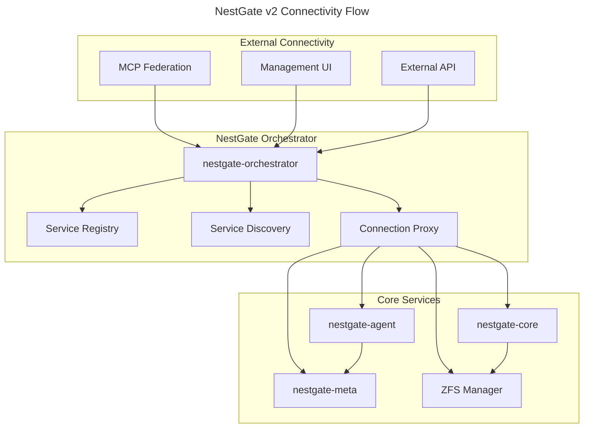

# Executive Summary

NestGate-NAS v2 is being rebuilt following the partial loss event during StrandGate bring-up. The rebuild allows for a full sovereign redesign of the NAS node architecture. The new design maintains the project's sovereign self-sustaining goal while improving system modularity, MCP agent integration, and offsite deployability.

# Design Goals

- Preserve fully standalone NAS operation mode
- Support seamless MCP federation when connected
- Simplify internal agent model to match MCP Orchestrator patterns
- Fully embed orchestrator architecture into MCP agent fabric
- Enable offsite cold storage replication deployment
- Simplify system startup, bootstrapping, and future scale

# Sovereign Deployment Modes

| Mode | Description | Federation Dependency |
|------|-------------|-----------------------|
| Standalone Mode | Fully independent NAS operation with no MCP connectivity | None |
| Federated MCP Mode | Active NAS provider within full MCP cluster | MCP-Orchestrator |
| Cold Storage Mode | Offsite mirror node for physical redundancy | Optional |
| Mobile Field NAS Mode | Portable NAS pod with full sovereign storage services | Optional |

# System Components (v2 Core)

## Core NAS Agent

- Language: Rust
- Async architecture (tokio)
- ZFS integration via libzfs
- Agent-driven task processing
- Integrated snapshot scheduler
- Tier management (hot/warm/cold)

## MCP Agent Interface

- Agent Bus protocol via gRPC
- Task registration with MCP-Orchestrator when present
- Self-registration fallback in standalone mode

## NestGate Orchestrator Integration

- **ALL connectivity flows through nestgate-orchestrator**
- Fully embedded inside agent process
- Local service management remains sovereign inside each node
- Service registration fully compatible with MCP Orchestrator extensions
- Handles all inter-service communication and discovery

## Metadata Store

- Embedded SQLite or RocksDB instance per node
- Local configuration, snapshot schedules, tier state tracking
- Self-sufficient without external database

## UI Layer

- Tauri + React UI
- Local management interface
- Integrated into agent authentication framework
- Secure management bridge (can operate standalone or via MCP)

# Storage Architecture

```yaml
storage_tiers:
  hot:
    hardware: NVMe
    use_case: AI scratch burst
    path: /nestpool/hot
    compression: lz4
    recordsize: 128K
    
  warm:
    hardware: ZFS pool (RAIDZ/mirror)
    use_case: active dataset
    path: /nestpool/warm
    compression: zstd
    recordsize: 1M
    
  cold:
    hardware: large capacity HDD ZFS
    use_case: archival long-term storage
    path: /nestpool/cold
    compression: zstd-19
    recordsize: 1M
```

# Connectivity Architecture



# Simplified Deployment Targets

## Minimal Hardware for Sovereign Cold Storage Unit

```yaml
cpu: 4 cores (x86_64)
ram: 32 GB ECC
storage:
  nvme: optional
  warm: optional
  cold: 16 TB+ recommended
network: 1G minimum / 10G preferred
gpu: none required
```

## Recommended Hardware for Full Deployment

```yaml
cpu: 8+ cores (x86_64)
ram: 64 GB ECC
storage:
  hot: 2TB NVMe SSD
  warm: 32TB (8x 4TB drives, RAIDZ2)
  cold: 64TB (4x 16TB drives, mirror)
network: 10G preferred
gpu: optional (for AI workload acceleration)
```

# Federation Behavior

* NAS node operates standalone by default
* On MCP connectivity, registers as agent:
  * Storage provider registration
  * Dataset inventory reporting  
  * Snapshot schedules synced via MCP if present
* Graceful degradation: operates fully local when disconnected
* **All external communication flows through nestgate-orchestrator**

# Immediate Build Priorities

1. MCP Agent compatibility scaffolding
2. NAS agent task framework rebuild
3. ZFS storage agent rebuild
4. Snapshot scheduler re-implementation
5. SQLite metadata layer initialization
6. MCP storage agent test hooks
7. Sovereign orchestrator subcomponent rebuild
8. Simplified sovereign boot mode profiles

# Codebase Starting Scaffolds

```bash
code/crates/
  nestgate-core/        # ZFS + tier control agent
  nestgate-agent/       # MCP agent interface layer
  nestgate-orchestrator/ # Central connectivity hub (renamed from port-manager)
  nestgate-meta/        # Local metadata store (SQLite)
  nestgate-ui/          # Tauri-React management UI
  nestgate-bin/         # CLI management tools
  nestgate-zfs/         # ZFS integration layer
  nestgate-network/     # Network protocols (via orchestrator)
```

# Orchestrator-Centric Connectivity

## All Services Connect Through Orchestrator

```yaml
connectivity_pattern:
  external_connections:
    - MCP Federation -> nestgate-orchestrator -> internal services
    - Management UI -> nestgate-orchestrator -> core services
    - API clients -> nestgate-orchestrator -> service endpoints
    
  internal_connections:
    - nestgate-core -> nestgate-orchestrator -> nestgate-zfs
    - nestgate-agent -> nestgate-orchestrator -> nestgate-meta
    - All inter-service communication via orchestrator
    
  no_direct_connections:
    - External clients cannot bypass orchestrator
    - Internal services use orchestrator for discovery
    - All ports managed centrally by orchestrator
```

# Simplified Agent Profile Example

```yaml
agent_mode: standalone
features:
  - nas_core
  - zfs_control
  - orchestrator_local
  - snapshot_scheduler
  - local_ui
  
orchestrator:
  bind_address: "0.0.0.0:8080"
  federation_mode: auto_detect
  local_services:
    - nestgate-core
    - nestgate-zfs
    - nestgate-meta
  
storage:
  tiers:
    - hot: /nestpool/hot
    - warm: /nestpool/warm  
    - cold: /nestpool/cold
```

# Migration from v1

## Workspace Updates Required

1. Rename `nestgate-port-manager` -> `nestgate-orchestrator`
2. Update all service references to use orchestrator
3. Centralize all connectivity through orchestrator
4. Simplify crate dependencies to go through orchestrator
5. Update build scripts and deployment configs

## Code Changes

```rust
// Old v1 pattern
use nestgate_port_manager::PortManager;

// New v2 pattern  
use nestgate_orchestrator::Orchestrator;

// All connectivity flows through orchestrator
let orchestrator = Orchestrator::new(config);
let core_service = orchestrator.get_service("nestgate-core").await?;
```

# Testing Strategy

## Standalone Mode Tests
- Boot without MCP connectivity
- All core NAS functions work independently
- Local UI operates correctly
- ZFS operations via orchestrator

## Federation Mode Tests  
- MCP agent registration
- Service discovery through orchestrator
- Federated storage operations
- Graceful degradation on federation loss

## Orchestrator Tests
- Service registration and discovery
- Connection proxying
- Port management
- Health monitoring

# Summary

* The rebuild **preserves full sovereignty**
* The system becomes **cleaner, safer, more deployable**
* MCP integration becomes **fully modularized**
* Field deployment and cold storage replication is fully supported
* All design follows original system intentions while removing deadweight from legacy v1 code
* **nestgate-orchestrator becomes the single point of connectivity control**

# Implementation Phases

## Phase 1: Core Scaffolding
- [ ] Rename port-manager to orchestrator
- [ ] Update workspace configuration
- [ ] Create basic agent interfaces
- [ ] Implement standalone mode

## Phase 2: Orchestrator Integration
- [ ] Central connectivity hub
- [ ] Service registration via orchestrator
- [ ] Inter-service communication proxy
- [ ] Health monitoring through orchestrator

## Phase 3: MCP Federation
- [ ] MCP agent interface
- [ ] Federation detection and registration
- [ ] Graceful degradation handling
- [ ] Remote management capabilities

## Phase 4: Production Readiness
- [ ] Comprehensive testing
- [ ] Performance optimization
- [ ] Security hardening
- [ ] Documentation completion

# End of Spec 