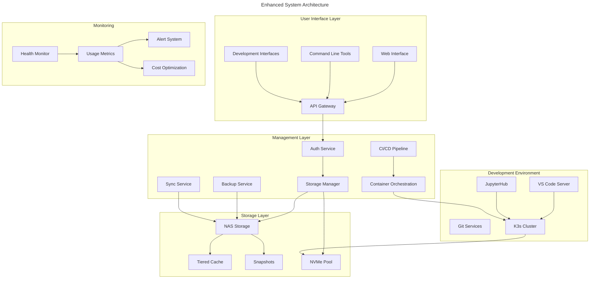

# Specification Directory Structure

```yaml
specs:
  core:
    path: specs/core/architecture.md
    content: Core system architecture and components
  network:
    path: specs/network/architecture.md
    content: Network configuration and VLAN setup
    protocols:
      mcp_home:
        path: specs/network/protocols/mcp_home.md
        content: MCP home integration specification
  storage:
    path: specs/storage/architecture.md
    content: Storage tiers and performance requirements
  security:
    path: specs/security/architecture.md
    content: Security measures and access control
  monitoring:
    path: specs/monitoring/architecture.md
    content: System monitoring and metrics
  dev:
    path: specs/dev/architecture.md
    content: Development environment setup
```

> 💡 **Note**: Detailed implementation specifications can be found in their respective subdirectories. See [CODEBASE.md](CODEBASE.md) for project structure and organization.

## Specification Format (70/30 Ratio)
```yaml
specification_balance:
  machine_parseable:
    ratio: 70%
    focus:
      - Structured YAML configurations
      - Explicit validation criteria
      - Measurable metrics
      - Testable requirements
      - Error conditions
      - Integration points
    format: "Always in YAML with clear key-value pairs"
  
  technical_context:
    ratio: 30%
    focus:
      - Implementation sequences
      - Critical constraints
      - Technical requirements
      - Integration notes
    format: "Clear, concise technical descriptions without narrative"
  
  rules_adherence:
    base_rules:
      - "@.cursor/rules/400-md-docs.mdc"
      - "@.cursor/rules/003-code-style-guide.mdc"
    validation:
      - "Follow rule-specific validation"
      - "Cross-reference related rules"
      - "Maintain consistent structure"
```

# Specification Style Guide

## Format Requirements
```yaml
specification_format:
  machine_parseable: 70%  # YAML configurations, validation criteria, metrics
  technical_context: 30%  # Implementation sequence, constraints, requirements
  template: "templates/SPECS-template.md"
```

## Implementation Notes
- Focus on machine-parseable YAML configurations
- Include clear validation criteria and metrics
- Provide technical context without narratives
- Follow implementation sequence format
- Reference template for structure

---

# NAS Management System

> 💡 **Purpose**: Define a robust architecture for a NAS system that serves both advanced development workflows and home storage needs with security, scalability, and AI/ML compatibility in mind.

## System Architecture



## Core Components

### Security Service (Rust)
```rust
nas_security/
├── src/
│   ├── main.rs           # Service entry point
│   ├── mount.rs          # Mount management
│   ├── security.rs       # Security operations
│   ├── audit.rs          # Audit logging
│   └── monitor.rs        # System monitoring
├── Cargo.toml
└── config/
    └── security.yaml     # Security configuration
```

### System Integration (PowerShell)
```powershell
integration/
├── SecurityIntegration.psd1  # Module manifest
├── SecurityIntegration.psm1  # Module implementation
├── public/                   # Public functions
└── private/                  # Private functions
```

### Automation Layer (Python)
```python
automation/
├── setup.py
├── requirements.txt
└── nas_automation/
    ├── __init__.py
    ├── environment.py
    ├── monitoring.py
    └── tools/
```

## Hardware Specifications

### Scalable Hardware Tiers

| Component | Minimum Recommended | Optimal | Future-Proof |
|:----------|:-------------------|:--------|:-------------|
| CPU | 6 cores, x86_64 | 12 cores, Ryzen/Xeon | 16+ cores, Thread Ripper |
| RAM | 16GB DDR4 | 64GB DDR4/5 | 128GB+ ECC |
| System Drive | 512GB NVMe | 1TB NVMe | 2TB NVMe |
| Cache Drive | 1TB NVMe | 2x 2TB NVMe RAID1 | 2x 4TB NVMe RAID1 |
| Data Drives | 2x 4TB NAS | 4x 8TB NAS | 8x 16TB NAS |
| Network | 2.5GbE | 10GbE | Dual 10GbE |
| GPU (Optional) | - | RTX 3060 12GB | RTX 4090 24GB |
| PCIe Expansion | 1x16 | 1x16 + 1x8 | 2x16 + 1x8 |

### Growth Planning

```yaml
scalability:
  storage_path:
    initial: 8TB raw (RAID1)
    increment: 8TB
    maximum: 160TB
    expansion_strategy: "Start RAID1, migrate to RAID6 when >4 drives"
  
  compute_path:
    initial: 6-8 cores
    increment: based on build times
    maximum: 64 cores
    strategy: "Upgrade within socket compatibility"
  
  memory_path:
    initial: 32GB DDR4/5
    increment: 32GB
    maximum: 128GB
    strategy: "Matched pairs, ECC optional"
  
  network_path:
    initial: 2.5GbE
    target: 10GbE
    strategy: "Upgrade when storage bandwidth limited"
```

## Storage Architecture

### Enhanced Storage Tiers

| Tier | Type | Purpose | Backup Frequency | Retention |
|:-----|:-----|:--------|:----------------|:----------|
| NVMe Pool | Ultra-Fast | Active Development, AI/ML | Hourly | 7 days |
| SSD Cache | Fast | Hot Data, Databases | Daily | 14 days |
| Primary HDD | Warm | User Data, Media | Weekly | 30 days |
| Archive HDD | Cold | Backups, Archives | Monthly | 90 days |

### Performance Targets

| Operation | Initial Target | Optimal | AI/ML Optimized |
|:----------|:--------------|:--------|:----------------|
| Sequential Read | 1000 MB/s | 2000 MB/s | 4000 MB/s |
| Sequential Write | 750 MB/s | 1500 MB/s | 3000 MB/s |
| Random Read (4K) | 100 MB/s | 200 MB/s | 400 MB/s |
| Random Write (4K) | 75 MB/s | 150 MB/s | 300 MB/s |
| IOPS | 50K | 100K | 200K |

## Security Features

### Access Control
```yaml
security:
  authentication:
    - Local accounts with 2FA
    - SSH key management
    - Optional LDAP integration
  
  network:
    - VLAN isolation for dev/prod
    - Firewall rules per service
    - Encrypted transport (TLS 1.3)
  
  monitoring:
    - Real-time access logging
    - Security event alerts
    - Automated threat response
```

### Data Protection
```yaml
data_security:
  encryption:
    - At-rest encryption
    - Secure mount points
    - Encrypted backups
  
  backup:
    strategy:
      - Hourly: Critical dev data
      - Daily: Active projects
      - Weekly: Full system
      - Monthly: Archives
    retention:
      - Hourly: 24 hours
      - Daily: 7 days
      - Weekly: 30 days
      - Monthly: 90 days
```

## Development Environment

### Workspace Configuration

```yaml
dev_environment:
  isolation:
    - containerized_workspaces
    - vlan_segregation:
        dev: VLAN 10
        test: VLAN 20
        prod: VLAN 30
    - resource_quotas:
        cpu: dynamic
        memory: dynamic
        storage: project-based
  
  core_services:
    ide:
      - vs_code_server:
          url: code.nas.local
          extensions: auto-sync
      - jupyter_hub:
          url: jupyter.nas.local
          gpu_support: optional
    
    git:
      - gitea:
          url: git.nas.local
          lfs_enabled: true
      - registry:
          url: registry.nas.local
    
    mcp:
      - proxy:
          url: mcp.nas.local
          deployment: container
          resources: dynamic
      - monitoring:
          metrics: true
          tracing: true
          
    ci_cd:
      - drone:
          url: ci.nas.local
      - artifacts:
          path: /volume1/artifacts
    
    orchestration:
      - k3s:
          ha: false
          monitoring: true
      - longhorn:
          replicas: 2
```

### Project Templates

```yaml
project_templates:
  rust_dev:
    - base_image: rust:latest
    - dev_tools: [cargo, rustfmt, clippy]
    - vscode_extensions: [rust-analyzer]
    - mount_points: 
        - /volume1/dev/rust
        - /volume1/cache/cargo
  
  python_ml:
    - base_image: pytorch/pytorch:latest
    - dev_tools: [conda, jupyter]
    - gpu_support: optional
    - mount_points:
        - /volume1/dev/ml
        - /volume1/datasets
```

## Cost Optimization

### Resource Management

```yaml
optimization:
  storage:
    - deduplication: enabled
    - compression: 
        algorithm: zstd
        level: adaptive
    - tiering:
        policy: access-based
        threshold: 30-days
  
  compute:
    - power_profiles:
        peak: all cores active
        normal: 50% cores
        eco: minimal cores
    - gpu_scheduling:
        mode: on-demand
        idle_timeout: 30min
  
  monitoring:
    - cost_tracking:
        metrics: [power, storage, bandwidth]
        alerts: usage thresholds
    - resource_analytics:
        interval: hourly
        retention: 90-days
```

### Automation Rules

```yaml
automation:
  storage_cleanup:
    - temp_files: 7-days
    - unused_images: 30-days
    - old_backups: policy-based
  
  resource_scaling:
    - cpu_governor: performance-based
    - memory: demand-based
    - storage_tiering: access-pattern
  
  maintenance:
    - health_checks: hourly
    - optimization: daily
    - deep_analysis: weekly
```

## Implementation Phases

### Phase 1: Foundation (Month 1)
1. Base hardware setup
   - Initial storage configuration
   - Network setup
   - Basic security implementation
2. Core services deployment
   - File sharing
   - Basic monitoring
   - Security services
3. Development environment basics
   - VS Code Server
   - Git server
   - Container support

### Phase 2: Development Environment (Month 2-3)
1. Container orchestration
   - K3s setup
   - Basic workload management
2. Development tools
   - JupyterHub
   - CI/CD basics
3. Project templates
   - Rust development
   - Python/ML setup
4. Security hardening
   - Access controls
   - Monitoring
   - Backup system

### Phase 3: Optimization (Month 4-5)
1. Performance tuning
   - Storage optimization
   - Network optimization
   - Service tuning
2. Cost optimization
   - Resource monitoring
   - Power management
   - Storage tiering
3. Automation implementation
   - Maintenance tasks
   - Backup automation
   - Update management

### Phase 4: Scaling (Month 6+)
1. Storage expansion
   - Capacity increase
   - Performance optimization
2. Compute enhancement
   - CPU/RAM upgrades
   - GPU integration
3. Network upgrade
   - 10GbE implementation
   - VLAN optimization
4. Service scaling
   - HA considerations
   - Load balancing
   - Advanced monitoring

## Technical Metadata
- Category: System Specification
- Priority: High
- Last Updated: 2024-03-20
- Next Review: 2024-06-20
- Dependencies:
  - Infrastructure setup
  - Security systems
  - Development tools
  - Monitoring stack
  - K3s/Container orchestration
  - AI/ML frameworks
- Validation Requirements:
  - Architecture review
  - Security audit
  - Performance testing
  - Cost efficiency analysis
  - Resource optimization
  - AI/ML compatibility testing

# NestGate Specifications

This directory contains specifications for all components of the NestGate system. The specifications are organized to mirror the structure of the codebase.

## Directory Structure

The specifications are organized into the following directories:

- `core/` - Core system components
- `services/` - Service components
- `storage/` - Storage components
- `network/` - Network components
- `ui/` - User interface components
- `middleware/` - Middleware components
- `ai/` - AI components
- `architecture/` - System architecture
- `integration/` - Integration specifications
- `project/` - Project documentation
- `environments/` - Environment specifications
- `completed/` - Completed specifications

## Guidelines for Specifications

When creating or updating specifications, please follow these guidelines:

1. Place specifications in the appropriate directory matching the component they describe
2. Use Markdown format for all specification documents
3. Include links to related specifications when appropriate
4. Keep specifications up-to-date with implementation changes
5. Use diagrams when they help clarify complex concepts
6. Include examples when they help illustrate usage
7. Include version information and last updated date

## Key Specification Documents

- [SPECS.md](./SPECS.md) - Overview of all specifications
- [ORGANIZATION.md](./ORGANIZATION.md) - System organization
- [IMPLEMENTATION.md](./IMPLEMENTATION.md) - Implementation guidelines
- [ERROR_HANDLING.md](./ERROR_HANDLING.md) - Error handling standards
- [COMPATIBILITY.md](./COMPATIBILITY.md) - Compatibility requirements

## Component Specifications

Each component directory contains specifications for the corresponding system component. For example:

- `core/` contains specifications for the core system components
- `services/` contains specifications for service components
- `ui/` contains specifications for user interface components

## Integration Specifications

The `integration/` directory contains specifications for how different components integrate with each other. These specifications are essential for understanding the interactions between components.

## Architecture Specifications

The `architecture/` directory contains specifications for the overall system architecture, including:

- System design
- Design patterns
- Architectural principles
- System boundaries
- Component interactions

## Migration to New Organization

We are currently in the process of migrating specifications to match the new codebase organization. All new specifications should be created in the appropriate component directory, and existing specifications will gradually be moved to their proper locations.

---

Last Updated: 2024-03-15
Version: 1.0.0 