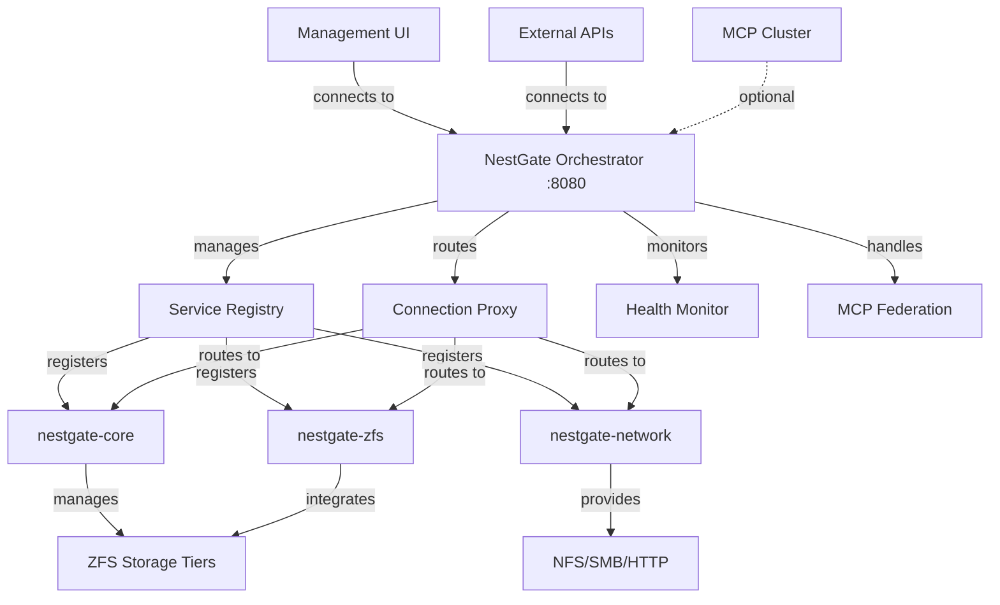
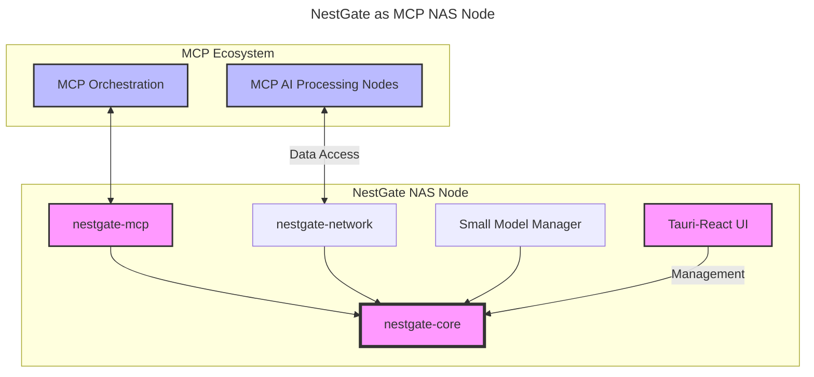
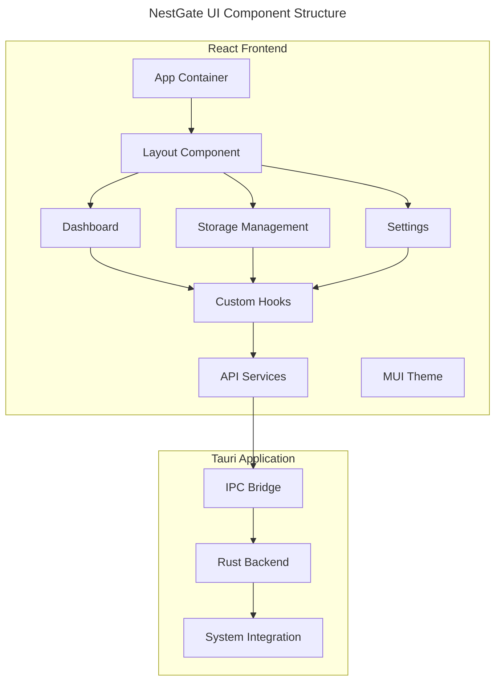

# NestGate v2 System Specifications

## Executive Summary

NestGate v2 is a **sovereign NAS orchestration system** that provides intelligent storage management through a **centralized Orchestrator architecture**. The system uses orchestrator-centric connectivity, centralized service registry, and optional MCP federation to ensure robust, autonomous operation with the capability for cluster participation when desired.

### v2 Architectural Transformation

**v1 → v2 Evolution:**
- Port Manager → **NestGate Orchestrator** (central connectivity hub)
- Required MCP integration → **Optional MCP Federation** (sovereign first)
- Complex port management → **Simplified orchestrator routing**
- Service-specific discovery → **Centralized service registry**

## Table of Contents

1. [Architecture Overview](#architecture-overview)
2. [Orchestrator Specifications](#orchestrator-specifications)
3. [Service Management](#service-management)
4. [Storage Integration](#storage-integration)
5. [Network Architecture](#network-architecture)
6. [Security Framework](#security-framework)
7. [Deployment Specifications](#deployment-specifications)
8. [Testing & Quality Assurance](#testing--quality-assurance)
9. [Performance Requirements](#performance-requirements)
10. [Monitoring & Observability](#monitoring--observability)

## Architecture Overview

### System Philosophy

NestGate v2 follows an **"Orchestrator-Centric Connectivity"** architecture where:
- **ALL connectivity flows** through the central Orchestrator
- **Sovereign operation** is the primary mode (no external dependencies)
- **Optional MCP federation** provides cluster connectivity when available
- **Centralized service registry** manages all service discovery
- **Graceful degradation** ensures continued operation when federation is lost

### Core Components



### Design Principles

1. **Orchestrator-Centric Design**: Every external connection flows through the orchestrator
2. **Sovereign Operation**: Fully autonomous capability with no required dependencies
3. **Optional Federation**: MCP integration when available, graceful standalone when not
4. **Centralized Service Discovery**: Single source of truth for all service locations
5. **Simplified Connectivity**: Orchestrator abstracts all service communication complexity
6. **Production Ready**: Robust error handling, health monitoring, and graceful degradation

## Orchestrator Specifications

### Core Responsibilities

#### 1. Service Registry
**Purpose**: Central registry and discovery for all system services

**Data Model**:
```rust
pub struct ServiceInfo {
    pub name: String,                    // Service name (e.g., "nestgate-core")
    pub endpoint: String,               // Service endpoint URL
    pub health_status: HealthStatus,    // Current health state
    pub last_health_check: Option<DateTime<Utc>>, // Last health check time
    pub metadata: HashMap<String, String>, // Service metadata
}

pub enum HealthStatus {
    Healthy,     // Service is operational
    Unhealthy,   // Service has issues
    Unknown,     // Health status unknown
}
```

**API Endpoints**:
- `GET /api/services` - List all registered services
- `GET /api/services/{name}` - Get specific service details
- `POST /api/services/register` - Register a new service
- `DELETE /api/services/{name}` - Unregister a service
- `GET /api/health` - Overall system health status

#### 2. Connection Proxy
**Purpose**: Route all external connections to appropriate services

**Routing Strategy**:
1. **Service Lookup**: Query service registry for target service
2. **Health Check**: Verify target service is healthy
3. **Request Forwarding**: Proxy request to service endpoint
4. **Response Routing**: Return service response to client
5. **Error Handling**: Graceful error handling and fallback

**Proxy Configuration**:
```rust
pub struct ProxyRequest {
    pub method: String,              // HTTP method
    pub path: String,               // Request path
    pub headers: HashMap<String, String>, // Request headers
    pub body: Vec<u8>,              // Request body
}

pub struct ProxyResponse {
    pub status_code: u16,           // HTTP status code
    pub headers: HashMap<String, String>, // Response headers
    pub body: String,               // Response body
}
```

#### 3. Health Monitor
**Purpose**: Continuous monitoring of all registered services

**Monitoring Configuration**:
```yaml
health_monitoring:
  interval_seconds: 30              # Health check frequency
  timeout_seconds: 5               # Health check timeout
  failure_threshold: 3             # Failures before marking unhealthy
  success_threshold: 2             # Successes before marking healthy
```

**Health Check Types**:
- **HTTP Health Endpoints**: GET requests to service health APIs
- **Service Registry**: Verify service registration is current
- **Process Monitoring**: Check if service processes are running
- **Resource Monitoring**: Monitor CPU, memory, and disk usage

#### 4. MCP Federation (Optional)
**Purpose**: Optional connectivity to MCP clusters with graceful degradation

**Federation Modes**:
```yaml
federation_modes:
  standalone:     # No MCP connectivity (default)
    dependencies: none
    operation: fully_autonomous
    
  auto_detect:    # Attempt MCP connection, fallback to standalone
    dependencies: optional_mcp
    operation: hybrid_autonomous
    
  federated:     # Active MCP cluster participation
    dependencies: mcp_cluster
    operation: cluster_participant
```

**Federation Flow**:
1. **Auto-Detection**: Attempt to discover MCP cluster endpoints
2. **Connection Attempt**: Try to establish MCP connectivity
3. **Registration**: Register as storage provider if connected
4. **Heartbeat**: Maintain connection with periodic heartbeats
5. **Graceful Degradation**: Fall back to standalone if connection lost

## Service Management

### Service Types

#### API Services
- **Purpose**: REST/GraphQL API endpoints
- **Port Range**: 3000-3099
- **Health Check**: HTTP GET /health
- **Examples**: NAS Server, Authentication Service

#### UI Services
- **Purpose**: Web interfaces and frontend applications
- **Port Range**: 3100-3199
- **Health Check**: HTTP GET / or TCP Connect
- **Examples**: React UI, Admin Dashboard

#### Database Services
- **Purpose**: Data storage and persistence
- **Port Range**: 5400-5499
- **Health Check**: TCP Connect + Custom
- **Examples**: PostgreSQL, Redis, InfluxDB

#### Monitor Services
- **Purpose**: System monitoring and metrics
- **Port Range**: 8000-8099
- **Health Check**: HTTP GET /metrics
- **Examples**: ZFS Monitor, Performance Monitor

### Service Lifecycle

#### Registration Process
1. **Service Registration**: Submit service definition to Orchestrator
2. **Service Discovery**: Orchestrator assigns service endpoint
3. **Dependency Check**: Verify service dependencies are available
4. **Configuration Update**: Update service endpoint with allocated port
5. **Service Record**: Store service in registry

#### Startup Process
1. **Pre-Start Validation**: Check dependencies and configuration
2. **Service Access**: Access service via Orchestrator
3. **Health Check Initialization**: Begin health monitoring
4. **Status Update**: Mark service as starting
5. **Ready Confirmation**: Wait for first successful health check

#### Shutdown Process
1. **Graceful Shutdown**: Send termination signal to service
2. **Grace Period**: Wait for service to terminate cleanly
3. **Force Termination**: Kill service if grace period exceeded
4. **Resource Cleanup**: Clean up ports, files, and resources
5. **Status Update**: Mark service as stopped

#### Restart Process
1. **Failure Detection**: Health check failures exceed threshold
2. **Restart Decision**: Check restart limits and cooldown
3. **Service Termination**: Stop existing service
4. **Restart Delay**: Wait for configured delay
5. **Service Restart**: Access service via Orchestrator

### Service Dependencies

**Dependency Types**:
- **Required**: Service cannot start without dependency
- **Optional**: Service can start but functionality may be limited
- **Circular Detection**: Prevent circular dependency chains

**Dependency Resolution**:
```yaml
dependencies:
  - service_name: "database_service"
    type: required
    timeout: 30s
    
  - service_name: "cache_service"
    type: optional
    timeout: 10s
```

## Storage Integration

### ZFS Integration

#### Storage Tiers
```yaml
storage_tiers:
  hot:
    path: /nestpool/hot
    compression: lz4
    recordsize: 128K
    atime: off
    
  warm:
    path: /nestpool/warm
    compression: zstd
    recordsize: 1M
    atime: off
    
  cold:
    path: /nestpool/cold
    compression: zstd-19
    recordsize: 1M
    atime: off
```

#### Dataset Management
- **Automatic Creation**: Create datasets as needed
- **Property Management**: Update ZFS properties via Orchestrator
- **Quota Management**: Set and enforce storage quotas
- **Snapshot Management**: Automated snapshot creation/cleanup

#### Performance Monitoring
- **Real-time Metrics**: Pool status, dataset usage, I/O statistics
- **Alert Thresholds**: Configurable alerts for capacity/performance
- **Historical Data**: Long-term trend analysis

### Storage API

#### Endpoints
- `GET /api/storage/tiers` - List storage tiers
- `GET /api/storage/usage` - Get usage statistics
- `POST /api/datasets` - Create dataset
- `PUT /api/datasets/{id}` - Update dataset properties
- `DELETE /api/datasets/{id}` - Delete dataset
- `POST /api/storage/migrate` - Start tier migration

#### Data Models
```typescript
interface StorageTier {
  id: string;
  name: string;
  path: string;
  usage: {
    total: number;
    used: number;
    available: number;
    compression_ratio: number;
  };
  properties: Record<string, string>;
  monitoring: {
    enabled: boolean;
    active_events: number;
    recent_events: number;
  };
}

interface Dataset {
  id: string;
  name: string;
  tier: string;
  mountpoint: string;
  available: number;
  used: number;
  compression: string;
  recordsize: string;
  readonly: boolean;
}
```

## Network Architecture

### Port Allocation Strategy

#### Static Assignments
- **Orchestrator**: 8080 (fixed)
- **Development UI**: 3000 (development only)

#### Dynamic Ranges
- **API Services**: 3000-3099
- **UI Services**: 3100-3199
- **WebSocket**: 3200-3299
- **Database**: 5400-5499
- **Monitor**: 8000-8099
- **Metrics**: 9000-9099
- **Admin**: 8100-8199

#### Conflict Resolution
1. **Preferred Port Check**: Attempt to use service's preferred port
2. **Range Search**: Search within service type's designated range
3. **Global Fallback**: Use any available port above 10000
4. **Allocation Retry**: Retry allocation with exponential backoff

### Communication Patterns

#### Service Discovery
- **Orchestrator Registry**: Central service directory
- **Health Status**: Real-time service health information
- **Endpoint Resolution**: Dynamic endpoint discovery

#### Inter-Service Communication
- **HTTP/REST**: Primary communication protocol
- **WebSocket**: Real-time data streaming
- **Health Checks**: Automated service monitoring
- **Event Bus**: Asynchronous event communication (future)

## Security Framework

### Authentication & Authorization

#### Service Authentication
- **Service Tokens**: JWT-based service authentication
- **Token Rotation**: Automatic token refresh
- **Permission Model**: Role-based access control

#### API Security
- **Rate Limiting**: Configurable rate limits per endpoint
- **Input Validation**: Comprehensive input sanitization
- **CORS Policy**: Configurable cross-origin policies

### Network Security

#### Port Security
- **Range Restrictions**: Services limited to designated port ranges
- **Firewall Integration**: Automatic firewall rule management
- **Network Isolation**: Service network segmentation

#### TLS/SSL
- **Certificate Management**: Automatic certificate provisioning
- **Secure Communication**: TLS for all inter-service communication
- **Certificate Rotation**: Automated certificate renewal

### Audit & Logging

#### Security Events
- **Authentication Events**: Login attempts, token usage
- **Authorization Events**: Permission checks, access denials
- **Service Events**: Service registration, health changes

#### Log Management
- **Structured Logging**: JSON-formatted logs
- **Log Aggregation**: Centralized log collection
- **Log Retention**: Configurable retention policies

## Deployment Specifications

### Development Deployment

#### Requirements
- **Rust 1.70+**: Latest stable Rust toolchain
- **Node.js 18+**: For React UI development
- **ZFS (Optional)**: For storage tier functionality

#### Startup Commands
```bash
# Start complete system with Orchestrator
npm start

# Development mode with verbose logging
npm run dev

# Force restart all services
npm run start:force
```

#### Development Workflow
1. **Code Changes**: Edit source code
2. **Automatic Rebuild**: Cargo watch rebuilds on changes
3. **Service Restart**: Orchestrator restarts affected services
4. **Health Verification**: Automatic health checks verify deployment

### Production Deployment

#### System Requirements
```yaml
minimum_requirements:
  cpu: 2 cores
  memory: 4GB RAM
  storage: 100GB available
  network: 1Gbps network interface

recommended_requirements:
  cpu: 4+ cores
  memory: 8GB+ RAM
  storage: 1TB+ available (SSD preferred)
  network: 10Gbps network interface
```

#### Production Configuration
```yaml
production_config:
  orchestrator:
    bind: "0.0.0.0:8080"
    security:
      enabled: true
      tls: true
      auth_required: true
    
  services:
    auto_restart: true
    max_restart_attempts: 10
    health_check_interval: 15
    
  logging:
    level: "info"
    format: "json"
    output: "/var/log/nestgate/"
    
  monitoring:
    enabled: true
    metrics_port: 9090
    alert_manager: "http://alertmanager:9093"
```

#### Deployment Process
1. **System Preparation**: Install dependencies, configure system
2. **Binary Deployment**: Deploy compiled binaries
3. **Configuration**: Update production configuration
4. **Service Registration**: Register services with Orchestrator
5. **Health Verification**: Verify all services are healthy
6. **Monitoring Setup**: Configure monitoring and alerting

### Container Deployment

#### Docker Configuration
```dockerfile
# Multi-stage build for production
FROM rust:1.70 AS builder
WORKDIR /app
COPY . .
RUN cargo build --release

FROM ubuntu:22.04
RUN apt-get update && apt-get install -y zfsutils-linux
COPY --from=builder /app/target/release/ /usr/local/bin/
EXPOSE 8080
CMD ["orchestrator", "--config", "/etc/nestgate/orchestrator.yaml"]
```

#### Kubernetes Deployment
```yaml
apiVersion: apps/v1
kind: Deployment
metadata:
  name: nestgate-orchestrator
spec:
  replicas: 1
  selector:
    matchLabels:
      app: nestgate-orchestrator
  template:
    metadata:
      labels:
        app: nestgate-orchestrator
    spec:
      containers:
      - name: orchestrator
        image: nestgate/orchestrator:latest
        ports:
        - containerPort: 8080
        env:
        - name: RUST_LOG
          value: "info"
        volumeMounts:
        - name: config
          mountPath: /etc/nestgate
      volumes:
      - name: config
        configMap:
          name: nestgate-config
```

## Testing & Quality Assurance

### Testing Strategy

#### Unit Testing
- **Coverage Target**: 90%+ code coverage
- **Test Types**: Function tests, error handling, edge cases
- **Mock Dependencies**: Isolated testing with mocks

#### Integration Testing
- **Service Integration**: Test service-to-service communication
- **Orchestrator Integration**: Test service registration/discovery
- **Storage Integration**: Test ZFS operations

#### End-to-End Testing
- **Full System Tests**: Complete workflow testing
- **Failure Scenarios**: Service failure and recovery testing
- **Performance Tests**: Load and stress testing

### Test Automation

#### Continuous Integration
```yaml
test_pipeline:
  - lint: Cargo clippy, ESLint, Prettier
  - unit_tests: Cargo test, Jest tests
  - integration_tests: Service integration tests
  - e2e_tests: Full system tests
  - security_tests: Vulnerability scanning
  - performance_tests: Load testing
```

#### Test Scripts
```bash
# Run all tests
npm run test:full-robustness

# Run specific test suites
npm run test:concurrent     # Concurrent operation tests
npm run test:file-ops      # File operation tests
npm run test:robustness    # Failure scenario tests
```

### Quality Gates

#### Code Quality
- **Linting**: Zero linter warnings
- **Type Safety**: Strict TypeScript configuration
- **Documentation**: 100% public API documentation

#### Performance Benchmarks
- **Service Startup**: < 5 seconds
- **Port Allocation**: < 100ms
- **Health Check Response**: < 1 second
- **API Response Time**: < 200ms (95th percentile)

## Performance Requirements

### Scalability Targets

#### Service Limits
- **Maximum Services**: 100 concurrent services
- **Service Startup Time**: < 5 seconds average
- **Port Allocation Time**: < 100ms
- **Health Check Frequency**: Every 30 seconds

#### Resource Usage
- **Orchestrator Memory**: < 100MB base usage
- **CPU Usage**: < 5% during normal operation
- **Network Overhead**: < 1MB/s for health checks

### Performance Monitoring

#### Key Metrics
- **Service Uptime**: % time services are healthy
- **Response Time**: API response time percentiles
- **Resource Usage**: CPU, memory, network utilization
- **Error Rate**: Service failure and restart frequency

#### Alerting Thresholds
```yaml
alerts:
  service_down:
    threshold: 1 service down
    severity: critical
    
  high_restart_rate:
    threshold: 5 restarts/hour
    severity: warning
    
  resource_usage:
    cpu_threshold: 80%
    memory_threshold: 90%
    severity: warning
```

## Monitoring & Observability

### Metrics Collection

#### System Metrics
- **Service Status**: Running, stopped, failed services
- **Port Allocation**: Available, allocated, and free ports
- **Health Check Status**: Success/failure rates and response times
- **Resource Usage**: CPU, memory, and network per service

#### Business Metrics
- **Storage Usage**: Tier utilization and capacity trends
- **API Usage**: Request rates and response times
- **User Activity**: UI usage patterns and user actions

### Logging Strategy

#### Log Levels
- **ERROR**: Service failures, critical errors
- **WARN**: Service restarts, performance degradation
- **INFO**: Service lifecycle events, user actions
- **DEBUG**: Detailed operation logs (development only)

#### Log Structure
```json
{
  "timestamp": "2025-01-26T10:30:00Z",
  "level": "INFO",
  "service": "orchestrator",
  "component": "service_registry",
  "message": "Service registered successfully",
  "context": {
    "service_name": "nas_server_123",
    "service_type": "API",
    "allocated_port": 3030
  }
}
```

### Dashboards & Visualization

#### Orchestrator Dashboard
- **Service Status Grid**: Visual status of all services
- **Port Allocation Map**: Visual representation of port usage
- **Health Check Timeline**: Historical health check results
- **Performance Metrics**: Response times and resource usage

#### Storage Dashboard
- **Tier Utilization**: Capacity usage across storage tiers
- **Performance Metrics**: IOPS, throughput, latency
- **Health Status**: ZFS pool and dataset health
- **Trend Analysis**: Historical usage and performance trends

### Alerting Framework

#### Alert Types
- **Service Alerts**: Service down, restart loops, health failures
- **Resource Alerts**: High CPU/memory usage, disk space
- **Performance Alerts**: Slow response times, high error rates
- **Security Alerts**: Authentication failures, unauthorized access

#### Notification Channels
- **Email**: Critical alerts and daily summaries
- **Slack/Teams**: Real-time alert notifications
- **Webhook**: Integration with external monitoring systems
- **SMS**: Critical alerts requiring immediate attention

---

## Implementation Status

### Completed Components
- ✅ Orchestrator core architecture
- ✅ Service registry and discovery
- ✅ Dynamic port allocation
- ✅ Health monitoring system
- ✅ Service process lifecycle management
- ✅ NAS server integration
- ✅ ZFS storage integration
- ✅ React UI integration

### In Progress
- 🚧 Security framework implementation
- 🚧 Container deployment configurations
- 🚧 Comprehensive test suite
- 🚧 Performance optimization

### Planned Features
- 📋 Event bus system
- 📋 Advanced monitoring dashboard
- 📋 Automated scaling
- 📋 Service mesh integration
- 📋 Multi-tenant support

---

## Revision History

| Version | Date | Author | Changes |
|---------|------|--------|---------|
| 1.0.0 | 2025-01-26 | NestGate Team | Initial specification |

---

*This document serves as the authoritative specification for the NestGate system architecture and implementation. All development should align with these specifications.*

# NestGate Specification Documentation

*Last Updated: 2025-01-26*

## Project Overview

NestGate is a specialized Network Attached Storage (NAS) solution optimized for AI workloads within the Machine Context Protocol (MCP) ecosystem. It provides high-performance, tiered storage services with a focus on the unique requirements of AI model training and inference operations.

## Codebase Structure

NestGate has been migrated to a modular crate-based architecture for better organization and maintainability:

```
crates/
├── nestgate-core/     # Core functionality and utilities
├── nestgate-mcp/      # MCP protocol integration adapter 
├── nestgate-network/  # Network protocols and communication
└── nestgate-ui/       # Tauri-React user interface
```

For a detailed explanation of the migration process, see [MIGRATION_COMPLETE.md](../MIGRATION_COMPLETE.md) in the project root.

## Role in MCP System

NestGate serves as a dedicated NAS node within the MCP ecosystem, providing specialized tiered storage services optimized for AI workloads, plus auxiliary small model hosting capabilities.



## Core Components

### UI Architecture

```yaml
ui_architecture:
  framework: "Tauri-React"
  features:
    - "Cross-platform desktop application"
    - "Native system integration"
    - "Secure IPC communication"
    - "Hardware acceleration"
  
  frontend:
    framework: "React 18+"
    state_management: "React Query"
    ui_components: "Material-UI (MUI)"
    styling: "MUI Theme + CSS-in-JS"
    features:
      - "Real-time monitoring"
      - "Storage management"
      - "System configuration"
      - "Performance analytics"
  
  backend:
    framework: "Tauri"
    features:
      - "Rust-based backend"
      - "System API integration"
      - "Security sandboxing"
      - "Native performance"
  
  communication:
    - "Tauri IPC bridge"
    - "REST API integration"
    - "WebSocket for real-time updates"
    - "Secure command execution"
```

### Network Layer

- [Network Architecture](../crates/nestgate-network/docs/architecture.md) - Core network architecture for NestGate's MCP NAS node implementation
- [Deployment Scale](../crates/nestgate-network/docs/deployment_scale.md) - Scaling capabilities from small to large deployments
- [ZFS Integration](../crates/nestgate-core/docs/zfs_integration.md) - ZFS storage architecture and AI workload optimizations
- [MCP Integration](../crates/nestgate-mcp/docs/mcp_integration.md) - Machine Context Protocol integration specifications

### System Architecture

```yaml
components:
  nestgate-core:
    purpose: "Storage provider for MCP AI nodes"
    features:
      - Warm and cold storage tier management
      - Cache optimization for AI workloads
      - ZFS-based storage backend
      - MCP mount management
    location: "crates/nestgate-core/"
  
  nestgate-network:
    purpose: "Network protocol and data access"
    features:
      - AI node connection management
      - Protocol handling (NFS/SMB)
      - Security layer
      - Performance monitoring
    location: "crates/nestgate-network/"
  
  nestgate-mcp:
    purpose: "MCP integration adapter"
    features:
      - MCP protocol implementation
      - Storage provider abstraction
      - Resource registration
      - State synchronization
    location: "crates/nestgate-mcp/"
  
  nestgate-bin:
    purpose: "Management tools"
    features:
      - Storage administration
      - Configuration management
      - Monitoring utilities
      - Diagnostic tools
    location: "crates/nestgate-bin/"

  small-model-manager:
    purpose: "Management model hosting"
    features:
      - Workload optimization models
      - Resource prediction models
      - Cache optimization models
      - RTX 2070 utilization
    location: "crates/nestgate-mcp/model/"
  
  tauri-ui:
    purpose: "Desktop management interface"
    features:
      - Cross-platform compatibility
      - Real-time monitoring
      - System configuration
      - Performance analytics
      - Storage management
    location: "crates/nestgate-ui/"
```

### Storage Management

#### Storage Tier Architecture

```yaml
storage:
  tiers:
    hot:
      purpose: "High-speed data access layer"
      hardware: "NVMe storage"
      performance:
        throughput: ">2GB/s"
        iops: ">50K"
        latency: "<0.5ms"
      features:
        - "AI workload prefetching"
        - "Hot data pinning"
        - "Workload-aware allocation"
    
    warm:
      purpose: "Active AI workload data"
      hardware: "ZFS pool (mirror/RAIDZ)"
      performance:
        throughput: ">500MB/s"
        iops: ">10K"
        latency: "<2ms"
      features:
        - "Dataset management"
        - "Snapshot versioning"
        - "Direct AI node mounting"
    
    cold:
      purpose: "Archival and infrequent access"
      hardware: "ZFS pool (RAIDZ2/RAIDZ3)"
      performance:
        throughput: ">250MB/s"
        iops: ">5K"
        latency: "<10ms"
      features:
        - "Compression optimization"
        - "Long-term snapshots"
        - "Selective retrieval"
```

#### UI Features

```yaml
ui_features:
  dashboard:
    - "System status overview"
    - "Storage utilization metrics"
    - "Performance monitoring"
    - "Alert notifications"
  
  storage_management:
    - "ZFS pool management"
    - "Dataset operations"
    - "Snapshot management"
    - "Quota configuration"
  
  monitoring:
    - "Real-time performance metrics"
    - "Historical data analysis"
    - "Alert configuration"
    - "System logs viewer"
  
  configuration:
    - "System settings"
    - "Network configuration"
    - "Security settings"
    - "Service management"
```

## Implementation Status

| Component | Status | Version | Crate Location |
|-----------|--------|---------|----------------|
| Network Architecture | Implemented | 0.4.0 | crates/nestgate-network/ |
| ZFS Integration | Implemented | 0.1.0 | crates/nestgate-core/ |
| MCP Integration | In Progress | 0.1.0 | crates/nestgate-mcp/ |
| Deployment Scale | Designed | 0.1.0 | crates/nestgate-network/ |
| NFS Protocol | Implemented | 0.2.0 | crates/nestgate-network/ |
| Security Model | Implemented | 0.3.0 | crates/nestgate-core/ |
| Tauri-React UI | In Progress | 0.1.0 | crates/nestgate-ui/ |

## UI Component Architecture



## MCP Integration

```yaml
mcp_integration:
  role: "Specialized NAS Node"
  
  storage_services:
    - "Warm tier for active AI datasets"
    - "Cold tier for archival data"
    - "Cache tier for performance optimization"
    - "Small model hosting for management functions"
  
  provider_interfaces:
    - name: "WarmStorageProvider"
      operations:
        - "create_volume"
        - "delete_volume"
        - "list_volumes"
        - "mount_for_ai_node"
        - "create_snapshot"
    
    - name: "ColdStorageProvider"
      operations:
        - "archive_data"
        - "retrieve_archive"
        - "list_archives"
        - "mount_archive"
        
    - name: "CacheManager"
      operations:
        - "allocate_cache"
        - "release_cache"
        - "optimize_cache"
        - "pin_to_cache"
        
    - name: "SmallModelManager"
      operations:
        - "deploy_model"
        - "unload_model"
        - "run_inference"
```

## Implementation Phases

### Phase 1: Core Storage Provider Implementation (Current)
1. Implement MCP adapter interfaces
2. Develop ZFS storage providers for warm and cold tiers
3. Set up cache management system
4. Create basic mount management

### Phase 2: MCP Protocol Integration
1. Implement MCP protocol handlers
2. Create storage registration services
3. Set up mount request handling
4. Develop resource reporting

### Phase 3: AI Node Optimization
1. Optimize data access for AI workloads
2. Implement cross-tier migration based on usage
3. Develop prefetching for common patterns
4. Create performance monitoring systems

### Phase 4: Small Model Integration
1. Optimize RTX 2070 for management models
2. Deploy storage optimization models
3. Implement workload prediction
4. Set up anomaly detection

## Technical Requirements

### Hardware Requirements
```yaml
minimum_requirements:
  cpu: "8 cores, x86_64"
  ram: "32GB DDR4"
  storage:
    cache: "2TB NVMe"
    warm: "16TB (e.g., 4x 4TB NAS drives)"
    cold: "32TB (e.g., 4x 8TB NAS drives)"
  network: "10GbE"
  gpu: "NVIDIA RTX 2070 8GB"
```

### Software Stack
```yaml
core_stack:
  os: "Linux"
  storage: "ZFS"
  network: "TCP/IP, TLS 1.3"
  
dependencies:
  nestgate-core:
    - "tokio = { version = '1.36', features = ['full'] }"
    - "serde = { version = '1.0', features = ['derive'] }"
    - "tracing = '0.1'"
    - "libzfs = '0.8'"
    - "nix = '0.28'"
  
  nestgate-mcp:
    - "async-trait = '0.1'"
    - "uuid = { version = '1.6', features = ['v4', 'serde'] }"
    - "chrono = { version = '0.4', features = ['serde'] }"
    - "axum = '0.6'"
    - "tracing-subscriber = '0.3'"
    
  nestgate-network:
    - "warp = '0.3'"
    - "dashmap = '5.5'"
    
  ai:
    - "tch = '0.13'"  # PyTorch bindings for Rust
    - "ort = '1.15'"  # ONNX Runtime
```

## Validation Requirements

```yaml
validation:
  performance:
    warm_tier:
      throughput: ">500MB/s"
      iops: ">10K"
      latency: "<2ms"
    cold_tier:
      throughput: ">250MB/s"
      iops: ">5K"
      latency: "<10ms"
    cache_tier:
      throughput: ">2GB/s"
      iops: ">50K"
      hit_ratio: ">85%"
    small_model:
      loading_time: "<5s"
      inference_latency: "<50ms"
      concurrency: "3-5 models"
  
  mcp_compliance:
    - "Storage provider interface conformance"
    - "MCP protocol compatibility"
    - "Resource registration verification"
    - "Mount request handling"
    
  reliability:
    uptime: "99.9%"
    data_integrity: "ZFS verification"
    recovery_time: "<30 minutes"
```

## Technical References

- [Migration Complete Report](../MIGRATION_COMPLETE.md) - Summary of crate-based architecture migration
- [Changes and Evolution](../CHANGES.md) - Project evolution and implementation progress
- Network Protocol References:
  - [NFS Protocol RFC](https://datatracker.ietf.org/doc/html/rfc1813) - NFS Version 3 Protocol Specification
- [ZFS Administration](https://openzfs.github.io/openzfs-docs/)
- [Squirrel MCP Documentation](https://squirrel-mcp.org/docs)
- [NestGate-Squirrel Integration Spec](integration/squirrel_integration.md)

## Development Guidelines

- Use Rust for core components
- Follow tokio async patterns for IO-bound operations
- Implement comprehensive error handling
- Document all public APIs
- Write tests for all critical paths
- Optimize for both performance and reliability
- Maintain proper crate-based architecture separation of concerns

## Next Steps

1. Complete MCP Integration API implementation in the `nestgate-mcp` crate
2. Enhance ZFS tuning for specific AI workload patterns in the `nestgate-core` crate
3. Implement automated tier migration based on workload detection
4. Add detailed performance metrics collection and analysis
5. Expand test coverage for large-scale deployment scenarios
6. Complete migration of remaining files in the `src/` directory

## Version History

### v0.9.2 (2024-05-14)
- Migrated to crate-based architecture for better organization
- Updated specifications to reference the new crate locations
- Cleaned up the original source directory structure
- Added documentation for the migration process

### v0.9.1 (2024-11-10)
- Updated specifications to focus on AI workload optimization
- Added ZFS integration and MCP integration documentation
- Incorporated multi-scale deployment specifications
- Enhanced documentation for tiered storage implementation
- Added comprehensive hardware and software requirements

### v0.9.0 (2024-10-15)
- Refocused specifications for MCP NAS node role
- Updated architecture diagrams for MCP integration
- Standardized storage tier terminology and performance metrics
- Revised small model hosting focus for management models
- Aligned implementation phases with MCP integration timeline

### v0.8.0 (2024-09-30)
- Revised system role to focus on MCP storage provider capabilities
- Updated architecture for integration with larger MCP system
- Added RTX 2070 specifications for small model hosting
- Enhanced warm and cold storage tier definitions

## Technical Metadata
- Category: System Specification
- Priority: High
- Last Updated: 2025-01-26
- Dependencies:
  - Squirrel MCP system v1.5.0+
  - NVIDIA RTX 2070
  - ZFS storage
- Validation Requirements:
  - MCP integration compliance
  - Storage performance metrics
  - Small model hosting verification