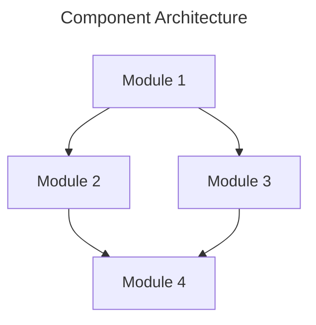

# Component Name Specification

**Component Type:** [Core|Service|Storage|Network|UI|Middleware|AI]  
**Version:** 0.1.0  
**Last Updated:** YYYY-MM-DD  
**Status:** [Draft|In Review|Approved|Implemented|Deprecated]  
**Author:** NestGate Team

## Overview

[Brief description of the component and its purpose]

## Goals and Objectives

- [Primary goal of the component]
- [Secondary objectives]
- [Success criteria]

## Requirements

### Functional Requirements

- [Requirement 1]
- [Requirement 2]
- [Requirement 3]

### Non-Functional Requirements

- **Performance:**
  - [Performance requirements]
  
- **Security:**
  - [Security requirements]
  
- **Reliability:**
  - [Reliability requirements]
  
- **Scalability:**
  - [Scalability requirements]

## Architecture

### Component Structure

[Description of the component's internal structure]



### Interfaces

| Interface | Type | Description |
|-----------|------|-------------|
| [Interface 1] | [REST/gRPC/WebSocket/etc.] | [Description] |
| [Interface 2] | [REST/gRPC/WebSocket/etc.] | [Description] |

### Dependencies

| Dependency | Version | Purpose |
|------------|---------|---------|
| [Dependency 1] | [Version] | [Purpose] |
| [Dependency 2] | [Version] | [Purpose] |

## Implementation Details

### Data Model

[Description of the data model]

```rust
struct Example {
    field1: String,
    field2: u32,
    field3: Option<Vec<String>>,
}
```

### Algorithms

[Description of key algorithms]

### Error Handling

| Error Condition | Response | Recovery |
|-----------------|----------|----------|
| [Condition 1] | [Response] | [Recovery] |
| [Condition 2] | [Response] | [Recovery] |

## Testing Strategy

### Unit Testing

[Description of unit testing approach]

### Integration Testing

[Description of integration testing approach]

### Performance Testing

[Description of performance testing approach]

## Deployment

### Requirements

[Deployment requirements]

### Configuration

[Configuration options]

## Example Usage

```rust
// Example code showing how to use the component
let component = Component::new();
component.do_something();
```

## Open Issues

- [Issue 1]
- [Issue 2]

## Future Enhancements

- [Enhancement 1]
- [Enhancement 2]

## References

- [Reference 1]
- [Reference 2] 