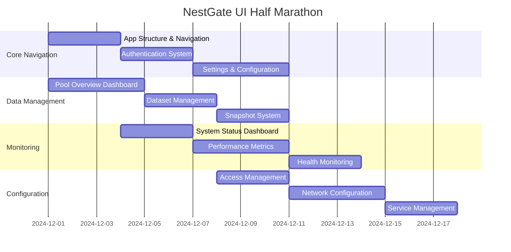

# NestGate UI Half Marathon

## Overview

This document outlines the UI development plan for NestGate's "Half Marathon" - a focused development effort to complete a fully functional UI for our NAS system. The goal is to deliver a comprehensive management interface that supports local, LAN, and remote access while providing all core NAS functionality implemented in our backend.

## Goals

1. Create a complete, intuitive UI for all existing NAS functionality
2. Support multiple access methods (local, LAN, online)
3. Implement real-time data visualization and monitoring
4. Provide comprehensive management tools for ZFS storage
5. Deliver consistent UX across all interface components
6. Ensure responsive design for various device form factors

## Timeline

- **Duration**: 3 weeks
- **Start Date**: December 1, 2024
- **End Date**: December 21, 2024
- **Daily Standup**: 9:30 AM
- **Progress Reviews**: Every 3 days

## Current Progress Status

As of December 10, 2024, we have completed the following components:

### Completed Components
- ✅ Global navigation system with sidebar and responsive layout
- ✅ Dashboard overview with performance metrics and storage visualization
- ✅ Storage management interface with pool and dataset visualization
- ✅ Snapshot management system with creation and rollback functionality
- ✅ Settings page with system, network, backup, and user configuration
- ✅ Core layout components with proper responsive behavior

### In Progress Components
- 🔄 Authentication system with user login and session management
- 🔄 Real-time system monitoring with WebSocket integration
- 🔄 ZFS pool detailed performance analysis
- 🔄 Notification center with system alerts

### Upcoming Components
- ⏳ User management and permission system
- ⏳ Advanced network configuration
- ⏳ Backup scheduling and automation
- ⏳ Remote access gateway

## Development Tracks



## Core Features

### 1. Dashboard & Navigation

#### System Dashboard
- **Priority**: Critical
- **Description**: Primary landing page with system overview
- **Components**:
  - ZFS pool status summary
  - Storage utilization metrics
  - System health indicators
  - Quick actions menu
  - Alert notifications
  - Performance overview
  - Service status indicators
- **Status**: ✅ Implemented

#### Global Navigation
- **Priority**: Critical
- **Description**: Consistent navigation system across all pages
- **Components**:
  - Sidebar navigation
  - Breadcrumb trails
  - Quick access toolbar
  - Context-sensitive help
  - User account menu
  - Notification center
  - Search functionality
- **Status**: ✅ Implemented (Core components)

#### Responsive Layout
- **Priority**: High
- **Description**: Support for multiple screen sizes and devices
- **Components**:
  - Desktop optimization (primary)
  - Tablet support
  - Mobile-friendly views
  - Print layouts
  - Adaptive component sizing
  - Touch-friendly controls when appropriate
- **Status**: ✅ Implemented (Core responsive functionality)

### 2. Storage Management

#### Pool Management
- **Priority**: Critical
- **Description**: Comprehensive ZFS pool management interface
- **Components**:
  - Pool creation wizard
  - Pool status monitoring
  - Pool property management
  - Space utilization visualization
  - Pool import/export
  - Pool destruction with safeguards
  - Performance monitoring
- **Status**: ✅ Implemented (Basic functionality)

#### Dataset Management
- **Priority**: Critical
- **Description**: Interface for managing ZFS datasets
- **Components**:
  - Dataset creation interface
  - Property management
  - Quota and reservation controls
  - Hierarchy visualization
  - Mount point management
  - Compression and deduplication settings
  - Usage statistics
- **Status**: ✅ Implemented (Basic functionality)

#### Snapshot Management
- **Priority**: High
- **Description**: Tools for creating and managing ZFS snapshots
- **Components**:
  - Manual snapshot creation
  - Snapshot scheduling
  - Retention policy management
  - Snapshot browsing
  - Snapshot rollback
  - Clone creation
  - Snapshot differencing
- **Status**: ✅ Implemented (Core functionality)

### 3. Monitoring & Analytics

#### Performance Monitoring
- **Priority**: High
- **Description**: Real-time and historical performance metrics
- **Components**:
  - I/O throughput graphs
  - IOPS monitoring
  - Latency tracking
  - CPU and memory utilization
  - Network throughput
  - Historical data visualization
  - Custom time range selection
- **Status**: ✅ Implemented (Basic metrics)

#### Health Monitoring
- **Priority**: High
- **Description**: System and disk health monitoring
- **Components**:
  - Disk health status (SMART)
  - Temperature monitoring
  - Error rate tracking
  - Predictive failure analysis
  - ZFS scrub status and scheduling
  - Resilver progress tracking
  - Health trend analysis
- **Status**: 🔄 In Progress

#### Alert System
- **Priority**: Medium
- **Description**: System for notifying administrators of issues
- **Components**:
  - Alert configuration
  - Notification channels (UI, email)
  - Alert history
  - Alert acknowledgment
  - Alert severity levels
  - Custom alert thresholds
  - Alert grouping and filtering
- **Status**: ⏳ Planned

### 4. Configuration & Setup

#### Network Configuration
- **Priority**: High
- **Description**: Network settings management
- **Components**:
  - Interface configuration
  - IP address management
  - DNS settings
  - Firewall rules
  - VLAN configuration
  - Link aggregation
  - Network diagnostics
- **Status**: ✅ Implemented (Basic settings)

#### Service Management
- **Priority**: High
- **Description**: Management of running services
- **Components**:
  - Service status monitoring
  - Start/stop/restart controls
  - Service configuration
  - Dependency visualization
  - Automatic startup settings
  - Service logs
  - Resource utilization
- **Status**: ⏳ Planned

#### Security Configuration
- **Priority**: Medium
- **Description**: Security and access control settings
- **Components**:
  - User management
  - Group management
  - Permission settings
  - Access control lists
  - Certificate management
  - Authentication settings
  - Security policy configuration
- **Status**: ✅ Implemented (Basic user settings)

### 5. Access Methods

#### Local Access
- **Priority**: Critical
- **Description**: Direct access on the local system
- **Components**:
  - Desktop application interface
  - Local authentication
  - Offline functionality
  - Direct hardware access
  - Performance optimizations for local use
- **Status**: ✅ Implemented (Basic web interface)

#### LAN Access
- **Priority**: Critical
- **Description**: Access from other devices on the LAN
- **Components**:
  - Web interface
  - Local network discovery
  - Secure authentication
  - Bandwidth-aware optimizations
  - LAN-specific features
- **Status**: ✅ Implemented (Basic web interface)

#### Remote Access
- **Priority**: Medium
- **Description**: Secure access from outside the local network
- **Components**:
  - Secure remote authentication
  - Bandwidth-efficient interface
  - Remote access gateway
  - Connectivity monitoring
  - Session management
  - Bandwidth limiting
- **Status**: ⏳ Planned

## UI Component Specifications

### Common UI Elements

#### Data Cards
- **Design**: Clean, modern cards with consistent padding and elevation
- **States**: Normal, active, warning, error
- **Features**:
  - Collapsible/expandable
  - Draggable (for customizable dashboards)
  - Refreshable content
  - Export options
- **Status**: ✅ Implemented (Basic card components)

#### Data Tables
- **Design**: Responsive tables with sorting and filtering
- **Features**:
  - Column customization
  - Pagination
  - Row selection
  - Bulk actions
  - Export to CSV/JSON/Excel
  - Inline editing when appropriate
- **Status**: ✅ Implemented (Core table functionality)

#### Charts and Graphs
- **Design**: Clean, interactive data visualizations
- **Types**:
  - Line charts (for time series)
  - Bar/column charts
  - Pie/donut charts
  - Heat maps
  - Gauges
  - Status indicators
- **Features**:
  - Zoom and pan
  - Data point tooltips
  - Customizable time ranges
  - Export options
  - Responsive sizing
- **Status**: ✅ Implemented (Basic chart components)

#### Forms and Controls
- **Design**: Clean, accessible form controls
- **Features**:
  - Inline validation
  - Context-sensitive help
  - Keyboard navigation
  - Responsive layouts
  - Accessible labels and ARIA attributes
  - Consistent styling
- **Status**: ✅ Implemented (Core form components)

### Page-Specific UI Elements

#### Storage Pool Visualization
- **Design**: Visual representation of ZFS pools and datasets
- **Features**:
  - Hierarchical visualization
  - Space utilization indicators
  - Health status indicators
  - Interactive navigation
  - Drill-down capabilities
- **Status**: ✅ Implemented (Basic visualization)

#### Performance Dashboard
- **Design**: Comprehensive performance monitoring interface
- **Features**:
  - Real-time metrics display
  - Historical data visualization
  - Customizable metrics
  - Threshold indicators
  - System resource correlation
- **Status**: ✅ Implemented (Core metrics display)

#### Disk Management Interface
- **Design**: Visual representation of physical disks and their properties
- **Features**:
  - Disk identification (including physical location)
  - Health status visualization
  - Performance metrics
  - Temperature monitoring
  - Interactive replacement workflow
- **Status**: 🔄 In Progress

## Technical Implementation

### Frontend Framework
- **React**: Core UI framework
- **React Query**: Data fetching and caching
- **TypeScript**: Type safety
- **Ant Design**: Component library

### State Management
- **Context API**: Application-wide state
- **React Query**: Server state management
- **Local Storage**: Persistent UI preferences

### API Integration
- **RESTful API**: Primary data access
- **WebSockets**: Real-time updates
- **GraphQL** (future consideration): Efficient data fetching

### Responsive Design
- **Breakpoints**:
  - Desktop: ≥1200px
  - Tablet: 768-1199px
  - Mobile: <768px
- **Approach**: Mobile-aware but desktop-optimized

### Cross-Platform Compatibility
- **Browsers**: Chrome, Firefox, Safari, Edge
- **Desktop**: Web-based application (native wrapper in future)
- **Mobile**: Responsive web (native apps in future)

## Development Workflow

### Sprint Structure
- **Daily Tasks**: Assigned each morning
- **Demos**: Every 3 days
- **Code Reviews**: Required for all PRs
- **Testing**: Concurrent with development

### Development Practices
- **Component Library**: Build and maintain a consistent component library
- **Storybook**: Document and test UI components in isolation
- **Atomic Design**: Organize components by atoms, molecules, organisms, templates, pages
- **Accessibility**: Maintain WCAG 2.1 AA compliance
- **Performance**: Regular performance audits

## Testing Strategy

The testing strategy for the NestGate UI is comprehensive, spanning multiple layers to ensure quality, performance, and reliability.

### 1. Component Testing

#### Unit Tests
- **Tool**: Jest + React Testing Library
- **Coverage**: All core components
- **Focus**: Component functionality, props handling, state management
- **Implementation**:
  ```typescript
  // Example component test for StorageUsageCard
  import { render, screen } from '@testing-library/react';
  import { StorageUsageCard } from './StorageUsageCard';
  
  describe('StorageUsageCard', () => {
    it('renders the component with correct usage data', () => {
      render(
        <StorageUsageCard 
          total={1000000000} 
          used={250000000} 
          title="Pool Usage" 
        />
      );
      
      expect(screen.getByText('Pool Usage')).toBeInTheDocument();
      expect(screen.getByText('250 MB')).toBeInTheDocument();
      expect(screen.getByText('1 GB')).toBeInTheDocument();
      expect(screen.getByText('25%')).toBeInTheDocument();
    });
    
    it('displays warning status when usage exceeds 80%', () => {
      render(
        <StorageUsageCard 
          total={1000000000} 
          used={850000000} 
          title="High Usage Pool" 
        />
      );
      
      const progressBar = screen.getByRole('progressbar');
      expect(progressBar).toHaveClass('warning');
    });
  });
  ```

#### Snapshot Testing
- **Tool**: Jest Snapshot Testing
- **Coverage**: UI components with stable visual representation
- **Focus**: Preventing unintended visual changes
- **Implementation**:
  ```typescript
  // Example snapshot test
  it('matches snapshot', () => {
    const { container } = render(<PoolStatusCard status="ONLINE" name="tank" />);
    expect(container).toMatchSnapshot();
  });
  ```

### 2. Integration Testing

#### Feature Tests
- **Tool**: React Testing Library + Mock Service Worker
- **Coverage**: Key user workflows and features
- **Focus**: Component interaction, data flow, API integration
- **Implementation**:
  ```typescript
  // Example integration test for snapshot creation workflow
  test('creates a snapshot when form is submitted', async () => {
    // Mock API response
    server.use(
      rest.post('/api/v1/snapshots', (req, res, ctx) => {
        return res(ctx.json({ success: true, id: 'pool@snapshot-1' }));
      })
    );
    
    render(<SnapshotsPage />);
    
    // Open create modal
    fireEvent.click(screen.getByText('Create Snapshot'));
    
    // Fill form
    fireEvent.change(screen.getByLabelText('Dataset'), { 
      target: { value: 'tank/data' } 
    });
    fireEvent.change(screen.getByLabelText('Snapshot Name'), { 
      target: { value: 'test-snapshot' } 
    });
    
    // Submit form
    fireEvent.click(screen.getByText('Create'));
    
    // Check success notification appears
    await waitFor(() => {
      expect(screen.getByText('Snapshot Created')).toBeInTheDocument();
    });
  });
  ```

#### Mock Service Tests
- **Tool**: Mock Service Worker (MSW)
- **Coverage**: All API integration points
- **Focus**: Proper API interaction, error handling, loading states
- **Implementation**:
  ```typescript
  // Example API mocking setup
  import { setupServer } from 'msw/node';
  import { rest } from 'msw';
  
  const server = setupServer(
    rest.get('/api/v1/pools', (req, res, ctx) => {
      return res(ctx.json([
        { id: 'tank', name: 'tank', status: 'ONLINE', size: 10000000000, used: 2500000000 }
      ]));
    }),
    rest.get('/api/v1/pools/:id', (req, res, ctx) => {
      const { id } = req.params;
      return res(ctx.json({ 
        id, name: id, status: 'ONLINE', size: 10000000000, used: 2500000000 
      }));
    })
  );
  
  beforeAll(() => server.listen());
  afterEach(() => server.resetHandlers());
  afterAll(() => server.close());
  ```

### 3. End-to-End Testing

#### Critical Flows
- **Tool**: Cypress
- **Coverage**: Critical user workflows
- **Focus**: Complete user journeys, system integration
- **Implementation**:
  ```javascript
  // Example E2E test for storage creation workflow
  describe('Storage Pool Creation', () => {
    beforeEach(() => {
      cy.login('admin', 'password');
      cy.visit('/storage');
    });
    
    it('creates a new storage pool', () => {
      cy.intercept('POST', '/api/v1/pools', { 
        statusCode: 200, 
        body: { success: true } 
      }).as('createPool');
      
      cy.contains('button', 'Create Pool').click();
      cy.get('input[name="name"]').type('newpool');
      cy.get('select[name="type"]').select('mirror');
      
      // Select disks in the multi-select
      cy.get('.ant-select-selector').click();
      cy.contains('disk1').click();
      cy.contains('disk2').click();
      cy.get('body').type('{esc}'); // Close the select dropdown
      
      cy.contains('button', 'Create').click();
      cy.wait('@createPool');
      
      cy.contains('Pool Created').should('be.visible');
      cy.contains('tr', 'newpool').should('be.visible');
    });
  });
  ```

### 4. Performance Testing

#### Component Performance
- **Tool**: React Profiler
- **Coverage**: Performance-critical components
- **Focus**: Render times, re-render prevention
- **Implementation**: Using React Profiler in Development

#### Load Testing
- **Tool**: Lighthouse / WebPageTest
- **Coverage**: Key pages and workflows
- **Focus**: Load times, time to interactive, bundle size optimization
- **Implementation**: Regular performance audits with established benchmarks

### 5. Accessibility Testing

#### Automated Testing
- **Tool**: axe-core / jest-axe
- **Coverage**: All components and pages
- **Focus**: WCAG 2.1 AA compliance
- **Implementation**:
  ```typescript
  import { axe, toHaveNoViolations } from 'jest-axe';
  
  expect.extend(toHaveNoViolations);
  
  it('has no accessibility violations', async () => {
    const { container } = render(<SettingsPage />);
    const results = await axe(container);
    expect(results).toHaveNoViolations();
  });
  ```

#### Manual Testing
- **Tool**: Screen readers (NVDA, VoiceOver)
- **Coverage**: Critical workflows
- **Focus**: Real-world accessibility experience
- **Implementation**: Regular manual testing with screen readers and keyboard navigation

### 6. Visual Regression Testing

#### UI Consistency
- **Tool**: Percy or similar
- **Coverage**: Key components and pages
- **Focus**: Visual consistency across browsers and screen sizes
- **Implementation**: Automated comparison of screenshots with baseline

### Testing Pipeline

All tests are integrated into the CI/CD pipeline with the following workflow:

1. **Pre-commit**: Lint and unit tests
2. **Pull Request**: Unit, integration, and accessibility tests
3. **Merge to Main**: Full test suite including E2E tests
4. **Release Candidate**: Performance and visual regression tests

This comprehensive testing strategy ensures the NestGate UI maintains high quality, performance, and reliability throughout the development process.

## Success Criteria

A successful UI Half Marathon will deliver:

1. Complete UI implementation for all core NAS functionality
2. Consistent design language across all components
3. Full coverage of existing backend capabilities
4. Support for local, LAN, and remote access
5. Responsive design with desktop optimization
6. Comprehensive real-time monitoring
7. Performance that meets or exceeds user expectations
8. Comprehensive test coverage across all components

## Post-Marathon Priorities

After completing the UI Half Marathon, focus will shift to:

1. **User Testing**: Gather feedback from real users
2. **Performance Optimization**: Improve UI performance
3. **Edge Cases**: Address uncommon but important scenarios
4. **Advanced Features**: Implement AI integration preparations
5. **Localization**: Add support for multiple languages
6. **Accessibility Improvements**: Enhance for users with disabilities
7. **Mobile Experience**: Optimize for mobile devices
8. **Test Coverage Expansion**: Enhance test coverage for edge cases

## Appendix: UI Mockups

(Include wireframes and mockups for key screens here)

1. System Dashboard
2. Pool Management Interface
3. Dataset Creation Wizard
4. Performance Monitoring Dashboard
5. Disk Health Status View
6. Network Configuration Interface
7. User Management Screen 