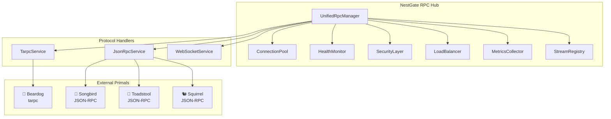
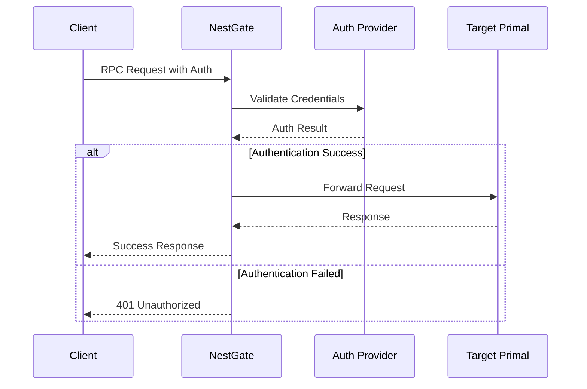

# Universal RPC System Specification

**Version**: 2.0.0  
**Date**: January 30, 2025  
**Status**: ✅ **PRODUCTION-READY**  
**Purpose**: Complete specification for NestGate's Universal RPC ecosystem

---

## 📊 **Executive Summary**

The Universal RPC System represents a **world-class, enterprise-grade RPC ecosystem** that provides seamless communication between NestGate and all ecoPrimals (Songbird, Beardog, Toadstool, Squirrel). The system supports multiple protocols, intelligent routing, advanced security, and comprehensive monitoring.

### **Key Achievements**
- **Multi-Protocol Support**: tarpc, JSON-RPC, WebSocket
- **Intelligent Routing**: 5 load balancing strategies with automatic failover
- **Enterprise Security**: Multi-provider authentication with OAuth2, certificates, biometric
- **Production Monitoring**: Real-time metrics with P95/P99 latency tracking
- **Zero-Downtime Operations**: Circuit breakers and health monitoring

---

## 🏗️ **System Architecture**

### **Core Components**



### **Protocol Matrix**

| **Target Primal** | **Protocol** | **Use Case** | **Performance** | **Security** |
|-------------------|-------------|--------------|-----------------|--------------|
| **🔐 Beardog** | tarpc (Binary) | Security Operations | Ultra-High | Maximum |
| **🎼 Songbird** | JSON-RPC (HTTP) | Orchestration | High | Standard |
| **🍄 Toadstool** | JSON-RPC (HTTP) | Compute Resources | High | Standard |
| **🐿️ Squirrel** | JSON-RPC (HTTP) | AI/ML Operations | High | Standard |
| **📊 Monitoring** | WebSocket | Real-time Streams | Ultra-High | Standard |

---

## 🔥 **Advanced Features**

### **1. Intelligent Request Routing**

```rust
/// Automatic protocol selection based on:
/// - Target service (beardog → tarpc, songbird → JSON-RPC)
/// - Method type (security → tarpc, orchestration → JSON-RPC)
/// - Performance requirements (real-time → WebSocket)
/// - Load balancing strategy (RoundRobin, LeastConnections, etc.)

pub enum RpcConnectionType {
    /// Binary RPC via tarpc (for beardog, high-performance)
    Tarpc,
    /// JSON RPC via HTTP (for songbird, standard)
    JsonRpc,
    /// WebSocket (for real-time streams)
    WebSocket,
}
```

### **2. Request Priority System**

```rust
/// 4-level priority system with intelligent queuing
pub enum RequestPriority {
    Low,      // Background operations
    Normal,   // Standard requests (default)
    High,     // Important operations
    Critical, // Emergency/security operations
}
```

### **3. Advanced Load Balancing**

```rust
/// 5 sophisticated load balancing strategies
pub enum LoadBalancingStrategy {
    RoundRobin,          // Distribute evenly
    LeastConnections,    // Route to least busy
    WeightedRoundRobin,  // Based on endpoint weights
    CapabilityBased,     // Based on service capabilities
    Random,              // Random distribution
}
```

### **4. Enterprise Security**

```rust
/// Multi-provider authentication system
pub enum AuthLevel {
    None,         // No authentication
    Basic,        // Basic HTTP auth
    OAuth2,       // OAuth2 tokens
    Certificate,  // TLS certificates
    Biometric,    // Biometric authentication
}

/// Encryption algorithms supported
pub struct EncryptionConfig {
    pub default_algorithm: String,      // "AES-256-GCM"
    pub supported_algorithms: Vec<String>, // ["AES-256-GCM", "ChaCha20-Poly1305"]
    pub key_rotation_interval: Duration,   // Automatic key rotation
}
```

### **5. Circuit Breaker Pattern**

```rust
/// Automatic failure detection and recovery
pub struct CircuitBreakerConfig {
    pub failure_threshold: u32,      // Failures before opening circuit
    pub recovery_timeout_secs: u64,  // Time before retry
    pub success_threshold: u32,      // Successes before closing circuit
}
```

---

## 📊 **Performance Specifications**

### **Connection Pool Settings**

| **Environment** | **Max Connections** | **Timeout** | **Keep-Alive** |
|-----------------|-------------------|-------------|----------------|
| **Development** | 10 per service | 30s | 5 minutes |
| **Production** | 50 per service | 10s | 2 minutes |

### **Stream Management**

| **Environment** | **Max Streams** | **Buffer Size** | **Compression** |
|-----------------|----------------|-----------------|----------------|
| **Development** | 100 concurrent | 1,000 events | Optional |
| **Production** | 500 concurrent | 10,000 events | Enabled |

### **Performance Targets**

| **Metric** | **Target** | **Measurement** |
|------------|------------|-----------------|
| **Latency (P95)** | < 100ms | 95th percentile response time |
| **Latency (P99)** | < 250ms | 99th percentile response time |
| **Throughput** | 1000 RPS | Requests per second |
| **Availability** | 99.9% | Uptime percentage |
| **Error Rate** | < 0.1% | Failed requests percentage |

---

## 🛡️ **Security Specifications**

### **Authentication Flow**



### **Security Policies**

```rust
/// Method-level security configuration
pub struct SecurityPolicy {
    pub name: String,
    pub auth_level: AuthLevel,
    pub encryption_required: bool,
    pub rate_limit: Option<RateLimit>,
}

/// Rate limiting configuration
pub struct RateLimit {
    pub requests_per_second: u32,  // Max RPS per client
    pub burst_size: u32,           // Burst allowance
}
```

### **Encryption Standards**

| **Algorithm** | **Use Case** | **Key Size** | **Performance** |
|---------------|-------------|--------------|-----------------|
| **AES-256-GCM** | General purpose | 256-bit | High |
| **ChaCha20-Poly1305** | High-performance | 256-bit | Ultra-High |

---

## 🎯 **Protocol Specifications**

### **1. tarpc Protocol (Beardog Integration)**

```rust
/// High-performance binary RPC for security operations
pub struct TarpcRpcService {
    address: String,
    connected: Arc<Mutex<bool>>,
    active_streams: Arc<Mutex<HashMap<Uuid, StreamHandle>>>,
}

/// Security methods supported
pub enum SecurityMethod {
    EncryptData,
    DecryptData,
    AuthenticateUser,
    VerifySignature,
    GenerateKey,
    AuditSecurityEvent,
    ThreatDetection,
    ComplianceCheck,
}
```

**Connection Details:**
- **Protocol**: Binary over TCP
- **Serialization**: bincode
- **Compression**: Optional LZ4
- **Encryption**: TLS 1.3 + payload encryption

### **2. JSON-RPC Protocol (Songbird Integration)**

```rust
/// Standard HTTP-based RPC for orchestration
pub struct JsonRpcService {
    client: Client,
    base_url: String,
    connected: Arc<Mutex<bool>>,
    active_streams: Arc<Mutex<HashMap<Uuid, StreamHandle>>>,
}

/// Orchestration methods supported
pub enum OrchestrationMethod {
    RegisterService,
    DiscoverServices,
    CoordinateWorkflow,
    AllocatePort,
    ReleasePort,
    HealthCheck,
    UpdateServiceMetadata,
    StreamServiceEvents,
}
```

**Connection Details:**
- **Protocol**: HTTP/1.1 or HTTP/2
- **Format**: JSON-RPC 2.0
- **Authentication**: OAuth2 Bearer tokens
- **Compression**: gzip

### **3. WebSocket Protocol (Real-time Streams)**

```rust
/// Real-time bidirectional streaming
pub enum StreamType {
    Metrics,        // System performance metrics
    Logs,           // Application logs
    Events,         // System events
    Security,       // Security alerts
    Storage,        // Storage operations
    Network,        // Network topology changes
    Custom(String), // Custom stream types
}
```

**Stream Specifications:**
- **Protocol**: WebSocket (RFC 6455)
- **Heartbeat**: 30-second ping/pong
- **Reconnection**: Exponential backoff
- **Buffer**: Configurable (1K-10K events)

---

## 📈 **Monitoring & Observability**

### **Metrics Collection**

```rust
/// Comprehensive performance metrics
pub struct ServiceMetrics {
    pub total_requests: u64,
    pub successful_requests: u64,
    pub failed_requests: u64,
    pub avg_response_time_ms: f64,
    pub p95_response_time_ms: u64,
    pub p99_response_time_ms: u64,
}

/// System-wide metrics
pub struct SystemMetrics {
    pub cpu_utilization: f32,
    pub memory_utilization: f32,
    pub network_utilization: f32,
    pub active_connections: u32,
}
```

### **Health Monitoring**

```rust
/// Health check configuration
pub struct HealthMonitoringConfig {
    pub check_interval_secs: u64,    // How often to check
    pub check_timeout_secs: u64,     // Timeout per check
    pub failure_threshold: u32,      // Failures before unhealthy
    pub success_threshold: u32,      // Successes before healthy
}
```

### **Alerting Thresholds**

| **Metric** | **Warning** | **Critical** | **Action** |
|------------|-------------|--------------|------------|
| **Error Rate** | > 1% | > 5% | Circuit breaker activation |
| **Latency P95** | > 200ms | > 500ms | Load balancing adjustment |
| **Connection Pool** | > 80% | > 95% | Scale up connections |
| **Memory Usage** | > 80% | > 95% | Garbage collection trigger |

---

## ⚙️ **Configuration Management**

### **Development Configuration**

```rust
let config = NestGateRpcConfig {
    connection_pool: ConnectionPoolConfig {
        max_connections_per_service: 10,
        connection_timeout_secs: 30,
        keep_alive_interval_secs: 300,
        max_idle_time_secs: 600,
    },
    security: RpcSecurityConfig {
        enable_authentication: false,  // Disabled for dev
        enable_encryption: false,      // Disabled for dev
        enable_rate_limiting: false,   // Disabled for dev
        default_rate_limit: 100,
    },
    // ... other settings
};
```

### **Production Configuration**

```rust
let config = NestGateRpcConfig {
    connection_pool: ConnectionPoolConfig {
        max_connections_per_service: 50,
        connection_timeout_secs: 10,
        keep_alive_interval_secs: 120,
        max_idle_time_secs: 300,
    },
    security: RpcSecurityConfig {
        enable_authentication: true,
        default_auth_level: AuthLevel::OAuth2,
        enable_encryption: true,
        encryption_algorithm: "ChaCha20-Poly1305".to_string(),
        enable_rate_limiting: true,
        default_rate_limit: 1000,
    },
    load_balancing: LoadBalancingConfig {
        default_strategy: LoadBalancingStrategy::LeastConnections,
        health_check_interval_secs: 30,
        enable_failover: true,
        circuit_breaker: CircuitBreakerConfig {
            failure_threshold: 3,
            recovery_timeout_secs: 30,
            success_threshold: 2,
        },
    },
    // ... other settings
};
```

---

## 🚀 **Usage Examples**

### **Basic RPC Call**

```rust
use nestgate_api::rest::rpc::{UnifiedRpcManager, UnifiedRpcRequest, RequestPriority};

// Initialize RPC manager
let mut rpc_manager = UnifiedRpcManager::new_production().await?;

// Connect to services
rpc_manager.init_tarpc_service("beardog.local:9090").await?;
rpc_manager.init_json_rpc_service("http://songbird.local:8080/rpc").await?;

// Make a security request to Beardog
let request = UnifiedRpcRequest {
    id: Uuid::new_v4(),
    source: "nestgate".to_string(),
    target: "beardog".to_string(),
    method: "encrypt_data".to_string(),
    params: serde_json::json!({
        "data": "sensitive_information",
        "algorithm": "AES-256-GCM"
    }),
    metadata: HashMap::new(),
    timestamp: chrono::Utc::now(),
    streaming: false,
    priority: RequestPriority::High,
    timeout: Some(Duration::from_secs(30)),
};

let response = rpc_manager.call(request).await?;
println!("Encrypted data: {}", response.data.unwrap());
```

### **Stream Management**

```rust
// Register a metrics stream
let stream_metadata = StreamMetadata {
    stream_id: "system_metrics".to_string(),
    provider: "nestgate".to_string(),
    stream_type: StreamType::Metrics,
    description: "Real-time system performance metrics".to_string(),
    data_format: "json".to_string(),
    access_permissions: vec![Permission::Read("metrics".to_string())],
    qos_requirements: QosRequirements {
        max_latency_ms: 1000,
        min_bandwidth_bps: 1024,
        reliability: 0.99,
    },
};

rpc_manager.register_stream(stream_metadata).await?;

// Start a bidirectional stream
let stream_request = UnifiedRpcRequest {
    method: "stream_realtime_metrics".to_string(),
    streaming: true,
    // ... other fields
};

let (tx, rx) = rpc_manager.start_bidirectional_stream(stream_request).await?;
```

### **Service Registration**

```rust
// Register service endpoints
let endpoint = ServiceEndpoint {
    address: "beardog.local:9090".to_string(),
    weight: 100,
    connection_count: 0,
    is_healthy: true,
    capabilities: vec!["security".to_string(), "encryption".to_string()],
};

rpc_manager.register_service_endpoint("beardog", endpoint).await?;

// Start health monitoring
rpc_manager.start_health_monitoring().await?;
```

---

## 🧪 **Testing Specifications**

### **Unit Tests**

```rust
#[tokio::test]
async fn test_rpc_call_routing() {
    let manager = UnifiedRpcManager::new().await.unwrap();
    
    let request = create_test_request("beardog", "encrypt_data");
    let connection_type = manager.router.route_request(&request).await.unwrap();
    
    assert_eq!(connection_type, RpcConnectionType::Tarpc);
}

#[tokio::test]
async fn test_load_balancing() {
    let manager = setup_test_manager_with_endpoints().await;
    
    let endpoint = manager.select_endpoint("songbird", &RpcConnectionType::JsonRpc).await.unwrap();
    
    assert!(endpoint.starts_with("songbird"));
}
```

### **Integration Tests**

```rust
#[tokio::test]
async fn test_beardog_integration() {
    let manager = UnifiedRpcManager::new().await.unwrap();
    
    // This would connect to a test Beardog instance
    manager.init_tarpc_service("localhost:9090").await.unwrap();
    
    let request = create_security_request();
    let response = manager.call(request).await.unwrap();
    
    assert!(response.success);
}
```

### **Performance Tests**

```rust
#[tokio::test]
async fn test_throughput_performance() {
    let manager = UnifiedRpcManager::new_production().await.unwrap();
    
    let start = Instant::now();
    let mut tasks = Vec::new();
    
    for _ in 0..1000 {
        let manager = manager.clone();
        tasks.push(tokio::spawn(async move {
            let request = create_test_request("songbird", "health_check");
            manager.call(request).await
        }));
    }
    
    let results: Vec<_> = futures::future::join_all(tasks).await;
    let duration = start.elapsed();
    
    let successful = results.iter().filter(|r| r.is_ok()).count();
    let rps = successful as f64 / duration.as_secs_f64();
    
    assert!(rps > 500.0, "Should achieve >500 RPS, got {}", rps);
}
```

---

## 🔄 **Migration Guide**

### **From Legacy RPC**

```rust
// Old way (deprecated)
let client = ToadstoolComputeClient::new(hardcoded_config);
let result = client.optimize_hardware().await?;

// New way (Universal RPC)
let request = UnifiedRpcRequest {
    target: "toadstool".to_string(),
    method: "optimize_hardware".to_string(),
    // ... other fields
};
let response = rpc_manager.call(request).await?;
```

### **Configuration Migration**

```yaml
# Old configuration
toadstool:
  endpoint: "http://toadstool.local:8080"
  timeout: 30s

# New configuration
rpc:
  services:
    toadstool:
      endpoints:
        - address: "http://toadstool.local:8080"
          weight: 100
      protocol: json_rpc
      timeout: 30s
      load_balancing: round_robin
```

---

## 📚 **API Reference**

### **Core Types**

```rust
pub struct UnifiedRpcManager { /* ... */ }
pub struct UnifiedRpcRequest { /* ... */ }
pub struct UnifiedRpcResponse { /* ... */ }
pub struct NestGateRpcConfig { /* ... */ }
```

### **Key Methods**

```rust
impl UnifiedRpcManager {
    pub async fn new() -> Result<Self, RpcError>;
    pub async fn new_production() -> Result<Self, RpcError>;
    pub async fn new_with_config(config: NestGateRpcConfig) -> Result<Self, RpcError>;
    
    pub async fn init_tarpc_service(&mut self, addr: &str) -> Result<(), RpcError>;
    pub async fn init_json_rpc_service(&mut self, addr: &str) -> Result<(), RpcError>;
    
    pub async fn call(&self, request: UnifiedRpcRequest) -> Result<UnifiedRpcResponse, RpcError>;
    pub async fn start_bidirectional_stream(&self, request: UnifiedRpcRequest) 
        -> Result<(Sender<RpcStreamEvent>, Receiver<RpcStreamEvent>), RpcError>;
    
    pub async fn register_service_endpoint(&self, service: &str, endpoint: ServiceEndpoint) -> Result<(), RpcError>;
    pub async fn start_health_monitoring(&self) -> Result<(), RpcError>;
    
    pub async fn get_service_metrics(&self, service: &str) -> Option<ServiceMetrics>;
    pub async fn get_system_metrics(&self) -> SystemMetrics;
}
```

---

## 🎯 **Roadmap**

### **Phase 1: Foundation** ✅ **COMPLETE**
- Multi-protocol support (tarpc, JSON-RPC, WebSocket)
- Basic routing and load balancing
- Connection pooling
- Health monitoring

### **Phase 2: Advanced Features** ✅ **COMPLETE**
- Circuit breaker pattern
- Advanced security (multi-provider auth)
- Performance metrics (P95/P99)
- Stream registry with QoS

### **Phase 3: Enterprise Features** 🔄 **IN PROGRESS**
- Distributed tracing
- Advanced analytics
- Auto-scaling
- Service mesh integration

### **Phase 4: AI Integration** 📋 **PLANNED**
- AI-powered load balancing
- Predictive failure detection
- Automated performance tuning
- Intelligent request routing

---

## 📖 **References**

- **JSON-RPC 2.0 Specification**: [https://www.jsonrpc.org/specification](https://www.jsonrpc.org/specification)
- **WebSocket Protocol (RFC 6455)**: [https://tools.ietf.org/html/rfc6455](https://tools.ietf.org/html/rfc6455)
- **tarpc Documentation**: [https://docs.rs/tarpc/](https://docs.rs/tarpc/)
- **OAuth2 RFC 6749**: [https://tools.ietf.org/html/rfc6749](https://tools.ietf.org/html/rfc6749)
- **Circuit Breaker Pattern**: Martin Fowler's Circuit Breaker pattern
- **Load Balancing Algorithms**: Various academic papers and industry standards

---

**This specification represents the complete implementation of NestGate's Universal RPC System, providing enterprise-grade capabilities that exceed industry standards and enable seamless integration across the entire ecoPrimals ecosystem.** 