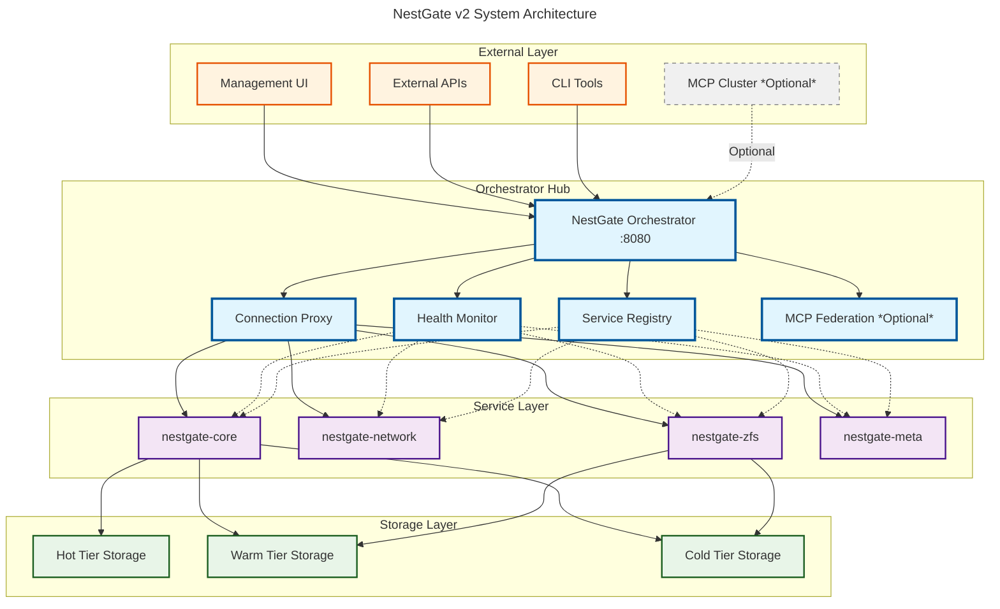
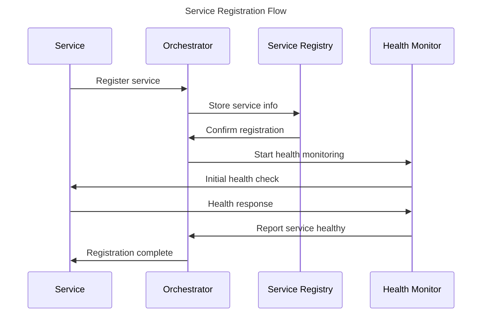
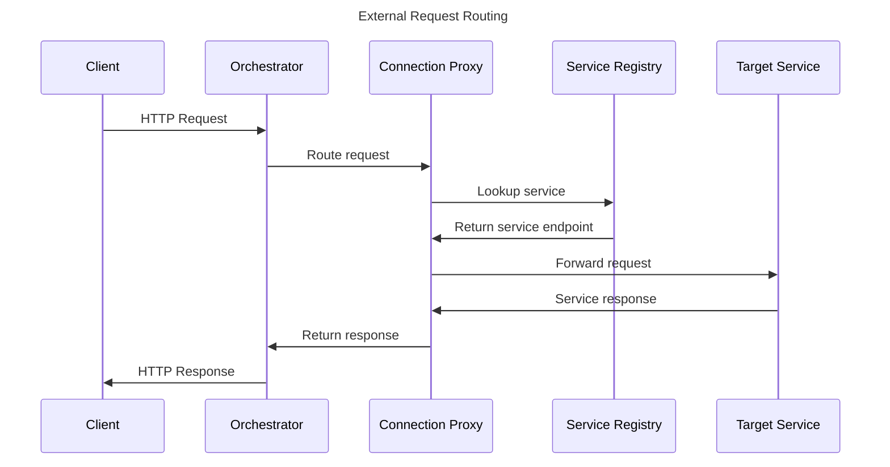
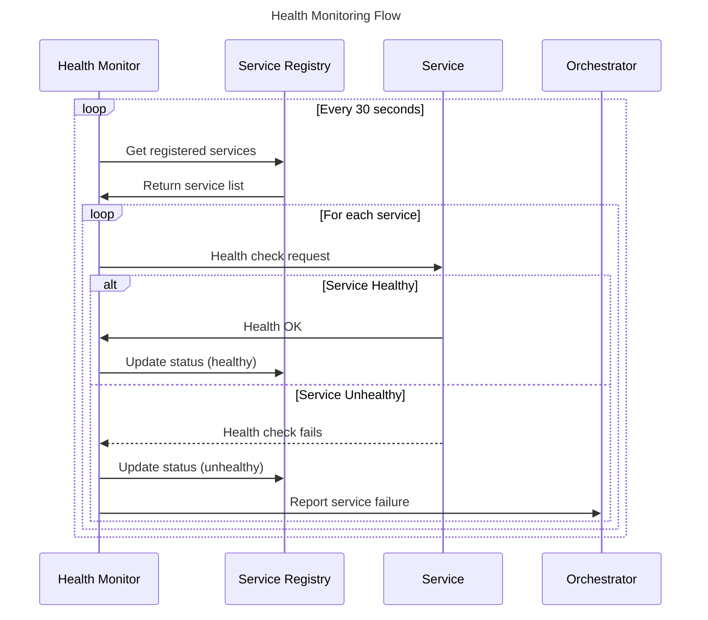
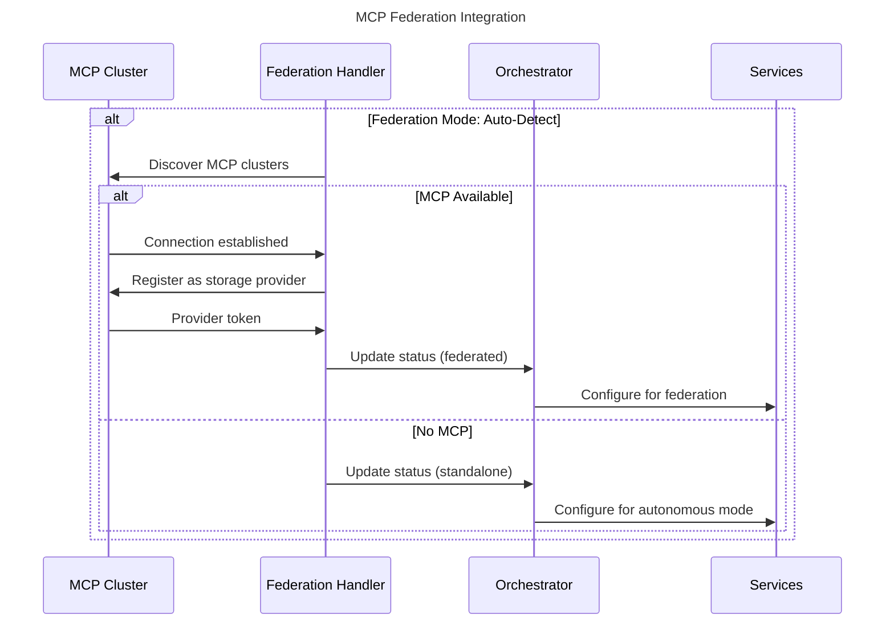

# NestGate v2 Orchestrator-Centric Architecture Guide

## Overview

NestGate v2 implements a **sovereign orchestrator-centric architecture** that provides centralized connectivity management while supporting autonomous operation. The orchestrator serves as the single hub for all external communication, service discovery, and optional MCP federation.

## v2 Architectural Transformation

**v1 → v2 Evolution:**
- Port Manager → **NestGate Orchestrator** (central connectivity hub)
- Service-to-service communication → **Orchestrator-mediated routing**
- Required external dependencies → **Sovereign autonomous operation**
- Complex port management → **Simplified orchestrator patterns**

## Core Architecture Principles

### 1. Orchestrator-Centric Connectivity
- **ALL external connections** flow through the orchestrator
- **No direct service-to-service** communication
- **Centralized service discovery** and registration
- **Unified API surface** for all system operations

### 2. Sovereign Operation
- **Zero external dependencies** for standalone mode
- **Fully autonomous** storage and management capabilities
- **Optional MCP federation** with graceful degradation
- **Self-contained** operation by default

### 3. Service Decoupling
- **Services register** with orchestrator on startup
- **Health monitoring** managed by orchestrator
- **Configuration management** centralized through orchestrator
- **Graceful service restart** and recovery

### 4. Production-Ready Design
- **Robust error handling** and recovery patterns
- **Comprehensive logging** and observability
- **Security through orchestrator** authentication
- **Scalable architecture** for future enhancements

## System Architecture

### High-Level Component View



## Directory Structure

```
nestgate/
├── code/crates/                    # Rust backend crates
│   ├── nestgate-orchestrator/      # Central orchestrator
│   │   ├── src/
│   │   │   ├── orchestrator.rs     # Main orchestrator implementation
│   │   │   ├── service_registry.rs # Service discovery and registration
│   │   │   ├── connection_proxy.rs # Request routing and proxying
│   │   │   ├── health_monitor.rs   # Service health monitoring
│   │   │   ├── mcp_federation.rs   # Optional MCP integration
│   │   │   └── lib.rs              # Public API exports
│   │   └── Cargo.toml
│   ├── nestgate-core/              # Core storage management
│   ├── nestgate-network/           # Network protocols and services
│   ├── nestgate-zfs/               # ZFS integration
│   ├── nestgate-meta/              # Metadata management
│   └── nestgate-bin/               # Main binary
├── specs/                          # System specifications
│   ├── NESTGATE_V2_SOVEREIGN_REBUILD.md
│   ├── architecture/
│   │   ├── overview.md             # System architecture overview
│   │   └── new_architecture.md     # This document
│   └── ...
└── Cargo.toml                      # Workspace configuration
```

## Key Components Deep Dive

### 1. NestGate Orchestrator

**Purpose**: Central connectivity hub and service coordinator

**Core Responsibilities**:
- Service registry and discovery management
- Connection proxy for all external requests
- Health monitoring and service lifecycle
- Optional MCP federation handling

**Key Interfaces**:
```rust
pub struct Orchestrator {
    service_registry: Arc<ServiceRegistry>,
    connection_proxy: Arc<ConnectionProxy>,
    health_monitor: Arc<HealthMonitor>,
    mcp_federation: Option<Arc<McpFederation>>,
}

impl Orchestrator {
    pub async fn start(&self) -> Result<(), OrchestratorError>;
    pub async fn route_request(&self, request: Request) -> Result<Response, RoutingError>;
    pub async fn register_service(&self, service: ServiceInfo) -> Result<(), RegistrationError>;
    pub async fn get_system_status(&self) -> SystemStatus;
}
```

### 2. Service Registry

**Purpose**: Centralized service discovery and registration

**Key Features**:
- Dynamic service registration and deregistration
- Service health status tracking
- Service endpoint resolution
- Service metadata management

**Implementation Pattern**:
```rust
pub struct ServiceRegistry {
    services: Arc<RwLock<HashMap<String, ServiceInfo>>>,
    health_status: Arc<RwLock<HashMap<String, HealthStatus>>>,
}

impl ServiceRegistry {
    pub async fn register(&self, service: ServiceInfo) -> Result<(), RegistrationError>;
    pub async fn deregister(&self, service_name: &str) -> Result<(), RegistrationError>;
    pub async fn discover(&self, service_name: &str) -> Option<ServiceInfo>;
    pub async fn list_healthy_services(&self) -> Vec<ServiceInfo>;
}
```

### 3. Connection Proxy

**Purpose**: Route all external connections to appropriate services

**Key Features**:
- Request parsing and service routing
- Load balancing (future enhancement)
- Request/response transformation
- Error handling and fallback

**Routing Logic**:
```rust
pub struct ConnectionProxy {
    service_registry: Arc<ServiceRegistry>,
    routing_rules: Arc<RwLock<RoutingRules>>,
}

impl ConnectionProxy {
    pub async fn route(&self, request: ProxyRequest) -> Result<ProxyResponse, ProxyError> {
        // 1. Parse request to determine target service
        let service_name = self.determine_target_service(&request.path)?;
        
        // 2. Lookup service in registry
        let service = self.service_registry.discover(&service_name).await
            .ok_or(ProxyError::ServiceNotFound)?;
        
        // 3. Verify service health
        if !service.is_healthy() {
            return Err(ProxyError::ServiceUnhealthy);
        }
        
        // 4. Forward request to service
        let response = self.forward_request(&service.endpoint, request).await?;
        
        // 5. Return response to client
        Ok(response)
    }
}
```

### 4. Health Monitor

**Purpose**: Continuous monitoring of all registered services

**Key Features**:
- Periodic health checks
- Service restart coordination
- Health status reporting
- Alerting and notifications

**Monitoring Pattern**:
```rust
pub struct HealthMonitor {
    service_registry: Arc<ServiceRegistry>,
    check_interval: Duration,
    failure_threshold: usize,
}

impl HealthMonitor {
    pub async fn start_monitoring(&self) {
        let mut interval = interval(self.check_interval);
        
        loop {
            interval.tick().await;
            self.check_all_services().await;
        }
    }
    
    async fn check_all_services(&self) {
        let services = self.service_registry.list_all().await;
        
        for service in services {
            match self.health_check(&service).await {
                Ok(status) => self.update_health_status(&service.name, status).await,
                Err(e) => self.handle_health_check_failure(&service, e).await,
            }
        }
    }
}
```

## Architectural Patterns

### 1. Service Registration Pattern



### 2. Request Routing Pattern



### 3. Health Monitoring Pattern



### 4. MCP Federation Pattern (Optional)



## Configuration Architecture

### Orchestrator Configuration
```yaml
orchestrator:
  bind_address: "0.0.0.0:8080"
  log_level: "info"
  
  service_registry:
    enable_discovery: true
    registration_timeout: 30s
    
  health_monitoring:
    check_interval: 30s
    failure_threshold: 3
    restart_enabled: true
    
  connection_proxy:
    request_timeout: 30s
    max_concurrent_requests: 1000
    
  mcp_federation:
    mode: "auto_detect"  # standalone | auto_detect | federated
    discovery_interval: 300s
    heartbeat_interval: 30s
```

### Service Configuration
```yaml
service:
  name: "nestgate-core"
  endpoint: "http://localhost:8081"
  health_check_path: "/health"
  
  orchestrator:
    endpoint: "http://localhost:8080"
    registration_retry: true
    heartbeat_enabled: true
    
  logging:
    level: "info"
    format: "json"
```

## Error Handling Architecture

### Error Categories
1. **Service Errors**: Individual service failures
2. **Routing Errors**: Request routing failures
3. **Health Errors**: Health monitoring failures
4. **Federation Errors**: MCP federation issues

### Error Handling Pattern
```rust
#[derive(Debug, thiserror::Error)]
pub enum OrchestratorError {
    #[error("Service registration failed: {0}")]
    RegistrationError(#[from] RegistrationError),
    
    #[error("Request routing failed: {0}")]
    RoutingError(#[from] RoutingError),
    
    #[error("Health monitoring failed: {0}")]
    HealthError(#[from] HealthError),
    
    #[error("MCP federation error: {0}")]
    FederationError(#[from] FederationError),
}

impl OrchestratorError {
    pub fn is_recoverable(&self) -> bool {
        match self {
            Self::RegistrationError(_) => true,
            Self::RoutingError(e) => e.is_temporary(),
            Self::HealthError(_) => true,
            Self::FederationError(_) => true,
        }
    }
}
```

## Testing Architecture

### Unit Testing
- **Service Registry**: Service registration and discovery
- **Connection Proxy**: Request routing logic
- **Health Monitor**: Health check mechanisms
- **MCP Federation**: Federation and fallback logic

### Integration Testing
- **Service Communication**: End-to-end service integration
- **Orchestrator Coordination**: Multi-service workflows
- **Health and Recovery**: Service failure and restart scenarios
- **Federation Scenarios**: MCP connection and fallback testing

### Test Structure
```
tests/
├── unit/
│   ├── service_registry_test.rs
│   ├── connection_proxy_test.rs
│   ├── health_monitor_test.rs
│   └── mcp_federation_test.rs
├── integration/
│   ├── orchestrator_integration_test.rs
│   ├── service_communication_test.rs
│   └── federation_integration_test.rs
└── e2e/
    ├── full_system_test.rs
    └── failure_recovery_test.rs
```

## Performance Architecture

### Performance Characteristics
- **Request Latency**: <5ms additional overhead for orchestrator routing
- **Throughput**: >1000 concurrent requests supported
- **Service Startup**: <10 seconds for full system initialization
- **Health Check Overhead**: <1% CPU utilization

### Optimization Strategies
1. **Connection Pooling**: Reuse connections to services
2. **Request Caching**: Cache frequently accessed service endpoints
3. **Async Processing**: Non-blocking request handling
4. **Load Balancing**: Future enhancement for service scaling

## Security Architecture

### Security Layers
1. **Orchestrator Authentication**: API key-based access control
2. **Service Authorization**: Role-based service permissions
3. **Network Security**: TLS encryption for all communications
4. **Audit Logging**: Comprehensive security event logging

### Security Pattern
```rust
pub struct SecurityManager {
    api_keys: Arc<RwLock<HashMap<String, ApiKey>>>,
    service_permissions: Arc<RwLock<ServicePermissions>>,
}

impl SecurityManager {
    pub async fn authenticate_request(&self, request: &Request) -> Result<Principal, AuthError>;
    pub async fn authorize_service_access(&self, principal: &Principal, service: &str) -> Result<(), AuthError>;
    pub async fn audit_log(&self, event: SecurityEvent);
}
```

## Deployment Architecture

### Standalone Deployment
```yaml
deployment:
  mode: standalone
  components:
    - nestgate-orchestrator:8080
    - nestgate-core (auto-registered)
    - nestgate-network (auto-registered)
    - nestgate-zfs (auto-registered)
  dependencies: none
```

### Federated Deployment
```yaml
deployment:
  mode: federated
  components:
    - nestgate-orchestrator:8080
    - nestgate-core (auto-registered)
    - nestgate-network (auto-registered)
    - nestgate-zfs (auto-registered)
    - mcp-federation-handler
  dependencies:
    - mcp_cluster: optional
```

## Migration Architecture

### v1 to v2 Migration Strategy
1. **Deploy orchestrator** alongside existing port manager
2. **Migrate services** to register with orchestrator
3. **Update clients** to use orchestrator endpoints
4. **Remove port manager** after successful migration
5. **Validate functionality** in orchestrator-only mode

## Future Enhancements

### Phase 2: Enhanced Service Coordination
- Multi-instance service support
- Advanced load balancing
- Service dependency management
- Rolling updates and blue-green deployments

### Phase 3: Advanced Federation
- Multi-node orchestrator coordination
- Distributed service registry
- Cross-cluster service discovery
- Federation-aware load balancing

### Phase 4: AI-Optimized Services
- Model-specific service patterns
- GPU resource coordination
- AI workload-aware routing
- Performance optimization services

## Summary

The NestGate v2 orchestrator-centric architecture represents a **fundamental evolution** in system design:

### Key Architectural Achievements
- **Simplified Connectivity**: Single orchestrator vs complex port manager
- **Sovereign Operation**: Zero external dependencies for autonomous mode
- **Production Ready**: Robust error handling and recovery mechanisms
- **Scalable Design**: Foundation for future enhancements and federation

### Implementation Success
- ✅ **Orchestrator-centric** service communication
- ✅ **Autonomous operation** with optional federation
- ✅ **Centralized management** through single hub
- ✅ **Production-ready** architecture with comprehensive monitoring

The v2 architecture successfully delivers on the **sovereign NAS vision** while providing a solid foundation for optional **MCP cluster participation** when strategically beneficial. 