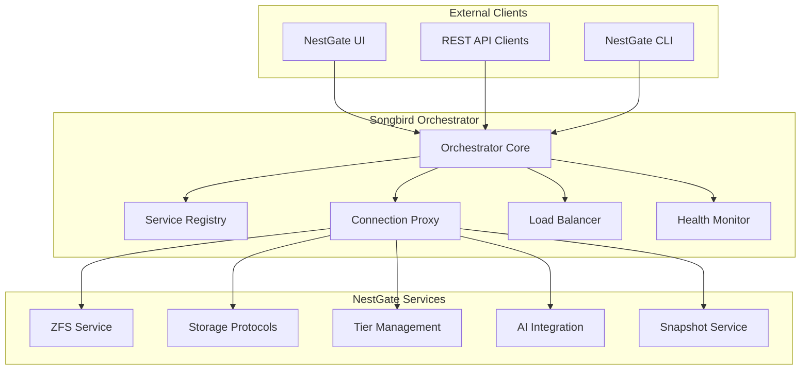

# ⚠️ **DEPRECATED DOCUMENT**

**This document is DEPRECATED** and reflects outdated hardcoded architecture patterns.

**Current Architecture:** NestGate now uses Universal Adapter patterns where each primal discovers others through capability-based discovery, not hardcoded dependencies.

**See Instead:**
- `specs/UNIVERSAL_PRIMAL_ARCHITECTURE_SPEC.md` - Current architecture
- `specs/ECOSYSTEM_API_STANDARDIZATION_GUIDE.md` - Universal integration patterns

---

# 🎼 Songbird Orchestrator → NestGate Handoff

## Executive Summary

The **Songbird Orchestrator** team is handing off a **production-ready, universal service orchestration platform** to the **NestGate team** for architectural consolidation. This handoff eliminates significant code duplication and provides NestGate with a robust, tested orchestration foundation.

### 🎯 **Key Handoff Objectives**

1. **Eliminate Duplication**: Remove redundant orchestration code from NestGate
2. **Leverage Production-Ready Infrastructure**: Use Songbird's alpha-complete orchestration
3. **Focus Team Efforts**: Let NestGate focus on NAS domain expertise
4. **Simplify Architecture**: Single orchestrator managing all services

---

## 🚨 **Critical Discovery: Current Duplication**

### **Architectural Overlap Identified**

```yaml
CRITICAL_ISSUE: |
  NestGate currently contains duplicate orchestration infrastructure
  that Songbird already provides in production-ready form.

EVIDENCE:
  - nestgate/Cargo.toml: name = "songbird-orchestrator" (WRONG)
  - Duplicate service registry implementations
  - Duplicate connection proxy logic
  - Duplicate health monitoring
  - Both projects solving identical problems
```

### **Production Impact**
- **Development Inefficiency**: Two teams building the same thing
- **Maintenance Burden**: Duplicate codebases to maintain
- **Testing Complexity**: Testing two orchestration systems
- **Deployment Confusion**: Which orchestrator to use?

---

## 📦 **What Songbird Provides (Production-Ready)**

### **✅ Alpha-Complete Core Features**

| Component | Status | Description |
|-----------|--------|-------------|
| Service Orchestration | ✅ **PRODUCTION** | Universal service management with traits |
| Request Routing | ✅ **PRODUCTION** | Complete client → orchestrator → service flows |
| Load Balancing | ✅ **PRODUCTION** | Multiple strategies with health-aware routing |
| Health Monitoring | ✅ **PRODUCTION** | Real-time service health checks |
| Service Registry | ✅ **PRODUCTION** | Dynamic service registration and discovery |
| Connection Proxy | ✅ **PRODUCTION** | Reverse proxy with circuit breakers |
| Metrics Collection | ✅ **PRODUCTION** | Performance and operational metrics |
| Security Framework | ✅ **PRODUCTION** | Authentication, authorization, encryption |
| Configuration Management | ✅ **PRODUCTION** | Multi-format config with env var support |
| Error Handling | ✅ **PRODUCTION** | Comprehensive error propagation |

### **🔧 Universal Service Trait (Core Integration Point)**

```rust
// NestGate services should implement this trait
#[async_trait]
pub trait UniversalService {
    type Config: Clone + Send + Sync;
    type Health: Clone + Send + Sync;
    type Error: std::error::Error + Send + Sync + 'static;

    async fn initialize(&mut self, config: Self::Config) -> Result<(), Self::Error>;
    async fn start(&mut self) -> Result<(), Self::Error>;
    async fn stop(&mut self) -> Result<(), Self::Error>;
    async fn health_check(&self) -> Result<Self::Health, Self::Error>;
    async fn handle_request(&self, request: ServiceRequest) -> Result<ServiceResponse, Self::Error>;
    async fn get_metrics(&self) -> Result<ServiceMetrics, Self::Error>;
    fn service_info(&self) -> ServiceInfo;
}
```

---

## 🏗️ **What NestGate Should Keep (Domain Expertise)**

### **✅ Core NAS Functionality (Keep & Focus)**

| Component | Status | NestGate Owner | Description |
|-----------|--------|----------------|-------------|
| **ZFS Management** | ✅ **COMPLETE** | ✅ **KEEP** | Pool/dataset/snapshot operations |
| **Storage Protocols** | ✅ **COMPLETE** | ✅ **KEEP** | NFS, SMB, iSCSI, S3 implementations |
| **Tier Management** | ✅ **COMPLETE** | ✅ **KEEP** | Hot/warm/cold storage optimization |
| **AI Integration** | ✅ **COMPLETE** | ✅ **KEEP** | Tier prediction and analytics |
| **NAS UI Components** | ✅ **COMPLETE** | ✅ **KEEP** | Storage-specific management interface |
| **ZFS API Layer** | ✅ **COMPLETE** | ✅ **KEEP** | RESTful ZFS management endpoints |

### **❌ Infrastructure to Remove (Songbird Provides)**

| Component | Status | Action | Reason |
|-----------|--------|--------|--------|
| **nestgate-orchestrator** | 🔥 **REMOVE** | Migrate to Songbird | Duplicate of Songbird core |
| **Service Registry** | 🔥 **REMOVE** | Use Songbird registry | Already implemented |
| **Connection Proxy** | 🔥 **REMOVE** | Use Songbird proxy | Production-ready alternative exists |
| **Health Monitor** | 🔥 **REMOVE** | Use Songbird health | More comprehensive in Songbird |
| **Load Balancer** | 🔥 **REMOVE** | Use Songbird LB | Advanced strategies available |

---

## 🚀 **Migration Strategy**

### **Phase 1: Foundation Setup (Week 1)**

#### **1.1 Fix Project Identity**
```toml
# nestgate/Cargo.toml - FIX THIS IMMEDIATELY
[package]
name = "nestgate"  # NOT "songbird-orchestrator"
version = "2.0.0"
description = "Sovereign NAS system with ZFS integration"

[dependencies]
songbird-orchestrator = { path = "../songbird" }  # ADD THIS
```

#### **1.2 Create Integration Layer**
```rust
// nestgate/src/songbird_integration.rs
use songbird_orchestrator::prelude::*;
use async_trait::async_trait;

#[derive(Clone)]
pub struct NestGateZfsService {
    config: Option<ZfsServiceConfig>,
    zfs_manager: Arc<ZfsManager>,
}

#[async_trait]
impl UniversalService for NestGateZfsService {
    type Config = ZfsServiceConfig;
    type Health = ZfsHealthStatus;
    type Error = NestGateError;

    async fn initialize(&mut self, config: Self::Config) -> Result<(), Self::Error> {
        // Initialize ZFS service
        self.config = Some(config);
        self.zfs_manager.initialize().await?;
        Ok(())
    }

    async fn handle_request(&self, request: ServiceRequest) -> Result<ServiceResponse, Self::Error> {
        match request.path.as_str() {
            "/zfs/pools" => self.handle_pools_request(request).await,
            "/zfs/datasets" => self.handle_datasets_request(request).await,
            "/zfs/snapshots" => self.handle_snapshots_request(request).await,
            _ => Ok(ServiceResponse::error(request.id, 404, "Endpoint not found".to_string())),
        }
    }

    // ... implement other required methods
}
```

### **Phase 2: Service Migration (Week 2-3)**

#### **2.1 Convert NAS Services**
```rust
// Convert each major NAS component to UniversalService
pub struct NestGateStorageService;  // NFS/SMB/iSCSI protocols
pub struct NestGateTierService;     // Hot/warm/cold tier management  
pub struct NestGateAiService;       // AI tier optimization
pub struct NestGateSnapshotService; // Automated snapshot management
```

#### **2.2 Service Registration Pattern**
```rust
// nestgate/src/main.rs
use songbird_orchestrator::prelude::*;

#[tokio::main]
async fn main() -> Result<()> {
    // Initialize Songbird orchestrator
    let orchestrator = Orchestrator::new(OrchestratorConfig::default()).await?;

    // Register NestGate services
    let zfs_service = NestGateZfsService::new();
    let zfs_id = orchestrator.register_service(zfs_service, zfs_config).await?;

    let storage_service = NestGateStorageService::new();
    let storage_id = orchestrator.register_service(storage_service, storage_config).await?;

    // Start orchestrator (handles all service management)
    orchestrator.start().await?;

    println!("🎼 NestGate services running under Songbird orchestration");
    
    // Songbird handles all the service lifecycle management
    orchestrator.wait_for_shutdown().await
}
```

### **Phase 3: Architecture Cleanup (Week 4)**

#### **3.1 Remove Duplicate Infrastructure**
```bash
# Files to remove from nestgate/
rm -rf src/orchestrator/
rm -rf src/service_registry.rs
rm -rf src/connection_proxy.rs
rm -rf src/health_monitor.rs
rm -rf src/load_balancer/

# Update imports throughout codebase
# Remove orchestrator-specific dependencies from Cargo.toml
```

#### **3.2 Update Configuration**
```yaml
# nestgate/config/nestgate.yaml
orchestrator:
  provider: "songbird"  # Use Songbird as orchestrator
  endpoint: "http://localhost:8080"

services:
  zfs_manager:
    enabled: true
    config:
      pools_path: "/zpool"
      tier_management: true
  
  storage_protocols:
    enabled: true
    protocols: ["nfs", "smb", "iscsi"]
  
  ai_integration:
    enabled: true
    tier_prediction: true
```

---

## 🔧 **Technical Integration Details**

### **Service Communication Flow**



### **Configuration Integration**

```rust
// nestgate/src/config.rs
use songbird_orchestrator::config::OrchestratorConfig;

#[derive(Debug, Clone, Serialize, Deserialize)]
pub struct NestGateConfig {
    pub orchestrator: OrchestratorConfig,  // Songbird config
    pub zfs: ZfsConfig,                    // NestGate-specific
    pub storage: StorageConfig,            // NestGate-specific
    pub tiers: TierConfig,                 // NestGate-specific
}

impl NestGateConfig {
    pub fn songbird_config(&self) -> &OrchestratorConfig {
        &self.orchestrator
    }
}
```

---

## 📋 **NestGate Team Action Items**

### **🔥 Immediate (This Week)**

1. **[ ] Fix Cargo.toml naming** - Change from "songbird-orchestrator" to "nestgate"
2. **[ ] Add Songbird dependency** - `songbird-orchestrator = { path = "../songbird" }`
3. **[ ] Create integration branch** - `git checkout -b songbird-integration`
4. **[ ] Audit duplicate code** - Identify all orchestration code to remove

### **🎯 Sprint 1 (Week 2)**

1. **[ ] Implement UniversalService for ZFS** - Core service migration
2. **[ ] Create service registration pattern** - Standard way to register NAS services
3. **[ ] Update main.rs** - Use Songbird orchestrator instead of custom one
4. **[ ] Test basic integration** - Ensure ZFS operations work through Songbird

### **🏗️ Sprint 2 (Week 3)**

1. **[ ] Migrate all NAS services** - Storage protocols, tier management, AI
2. **[ ] Update configuration system** - Integrate with Songbird config patterns
3. **[ ] Test comprehensive functionality** - All NAS features through orchestrator
4. **[ ] Update UI integration** - Connect NestGate UI to Songbird endpoints

### **🧹 Sprint 3 (Week 4)**

1. **[ ] Remove duplicate infrastructure** - Delete orchestrator, proxy, registry code
2. **[ ] Clean up dependencies** - Remove unused orchestration dependencies
3. **[ ] Update documentation** - Reflect new architecture in specs
4. **[ ] Performance testing** - Ensure no regression with Songbird integration

---

## 🚨 **Critical Decisions for NestGate Team**

### **Decision 1: Deployment Strategy**
```yaml
Options:
  1. Single Process: Run Songbird + NestGate services in one process
  2. Separate Processes: Run Songbird orchestrator separately, NestGate services connect
  3. Hybrid: Core services in-process, optional services separate

Recommendation: Start with Single Process (simpler deployment)
```

### **Decision 2: Configuration Management**
```yaml
Options:
  1. Unified Config: Single config file for both Songbird and NestGate
  2. Separate Configs: Songbird config + NestGate config files
  3. Environment-Based: All config via environment variables

Recommendation: Unified Config with sections (easier management)
```

### **Decision 3: Service Boundaries**
```yaml
Options:
  1. Monolithic NAS Service: Single service implementing all NAS functionality
  2. Fine-Grained Services: Separate services for ZFS, protocols, tiers, etc.
  3. Domain Services: Group related functionality (storage, management, ai)

Recommendation: Domain Services (balanced granularity)
```

---

## 📚 **Songbird Resources for NestGate Team**

### **Documentation**
- `songbird/README.md` - Overview and quick start
- `songbird/docs/` - Comprehensive documentation
- `songbird/examples/nestgate_integration.rs` - Ready-to-use integration example

### **Key Source Files**
- `songbird/src/traits/service.rs` - UniversalService trait definition
- `songbird/src/orchestrator.rs` - Main orchestrator implementation
- `songbird/src/config.rs` - Configuration system
- `songbird/src/registry.rs` - Service registry implementation

### **Test Examples**
- `songbird/tests/integration_tests.rs` - Integration patterns
- `songbird/tests/orchestrator_tests.rs` - Orchestrator usage examples
- `songbird/examples/` - Multiple working examples

---

## 🎉 **Expected Benefits Post-Integration**

### **For NestGate Team**
- ✅ **Focus on Domain Expertise** - Spend time on NAS features, not infrastructure
- ✅ **Production-Ready Foundation** - Leverage tested orchestration platform
- ✅ **Reduced Maintenance** - No need to maintain duplicate orchestration code
- ✅ **Enhanced Reliability** - Use Songbird's robust error handling and health monitoring

### **For Users**
- ✅ **Simpler Deployment** - Single orchestrator managing all services
- ✅ **Better Performance** - Optimized service communication patterns
- ✅ **Enhanced Monitoring** - Comprehensive observability out of the box
- ✅ **Easier Configuration** - Unified configuration management

### **For Architecture**
- ✅ **Code Reuse** - Eliminate duplication between projects
- ✅ **Clear Boundaries** - Orchestration vs domain logic separation
- ✅ **Scalability** - Universal service model supports future services
- ✅ **Maintainability** - Single orchestrator to debug and enhance

---

## 🤝 **Handoff Support**

### **Songbird Team Availability**
- **Week 1-2**: Full support for integration questions
- **Week 3-4**: On-call support for complex issues
- **Ongoing**: Documentation and example maintenance

### **Communication Channels**
- **Architecture Questions**: Songbird team direct consultation
- **Implementation Issues**: Code review and pair programming available
- **Performance Concerns**: Load testing and optimization support

### **Success Criteria**
1. ✅ All NestGate services running under Songbird orchestration
2. ✅ No functional regression in NAS capabilities
3. ✅ Duplicate orchestration code removed from NestGate
4. ✅ NestGate team comfortable with Songbird integration patterns

---

## 📝 **Final Notes**

This handoff represents a **significant architectural improvement** for both projects. Songbird becomes the universal orchestration platform it was designed to be, while NestGate focuses on delivering exceptional NAS functionality.

The integration is **straightforward** thanks to Songbird's universal service design - it was built specifically to handle use cases like NestGate's requirements.

**Success depends on** the NestGate team embracing the service-oriented architecture and trusting Songbird to handle the orchestration concerns they've been managing manually.

---

*This document should be updated as the integration progresses and lessons are learned.* 