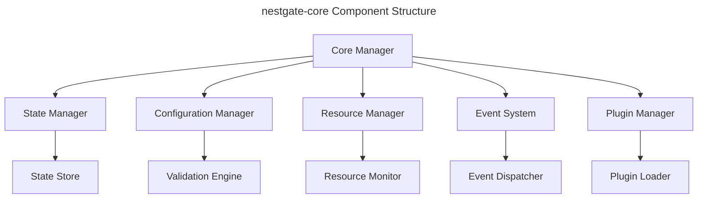

# nestgate-core Specification

**Component Type:** Core  
**Version:** 0.8.0  
**Last Updated:** 2024-05-20  
**Status:** Implemented  
**Author:** NestGate Team

## Overview

The `nestgate-core` component is the central system manager for the NestGate platform. It provides core functionality for state management, component coordination, and system configuration.

## Goals and Objectives

- Provide a centralized system state management
- Coordinate activities between different system components
- Manage system-wide configuration
- Handle resource allocation and lifecycle management
- Implement core business logic for storage operations

## Requirements

### Functional Requirements

- System state persistence and recovery
- Configuration management with validation
- Inter-component communication
- Resource allocation and monitoring
- Event dispatching and subscription
- Core storage operations
- System health monitoring
- Plugin architecture support

### Non-Functional Requirements

- **Performance:**
  - State operations complete within 50ms
  - Startup time under 2 seconds
  - Minimal memory footprint (<100MB base)
  
- **Security:**
  - Secure storage of system configuration
  - Access control for system operations
  - Audit logging for state changes
  
- **Reliability:**
  - Automatic recovery from component failures
  - Transaction-based state changes
  - Data consistency guarantees
  
- **Scalability:**
  - Support for distributed operation
  - Dynamic resource allocation
  - Stateless operation where possible

## Architecture

### Component Structure

The nestgate-core component is structured into several modules:



### Interfaces

| Interface | Type | Description |
|-----------|------|-------------|
| SystemAPI | Rust API | Core system management functions |
| StateAPI | Rust API | State management operations |
| ConfigAPI | Rust API | Configuration operations |
| EventAPI | Rust API | Event subscription and publication |
| PluginAPI | Rust API | Plugin registration and lifecycle |
| ResourceAPI | Rust API | Resource allocation and monitoring |

### Dependencies

| Dependency | Version | Purpose |
|------------|---------|---------|
| tokio | 1.32.0 | Async runtime |
| serde | 1.0.188 | Serialization |
| tracing | 0.1 | Logging and tracing |
| dashmap | 5.5 | Concurrent data structures |
| config | 0.13 | Configuration management |

## Implementation Details

### Data Model

Key data structures in the system:

```rust
struct SystemState {
    components: HashMap<ComponentId, ComponentState>,
    resources: ResourceState,
    configuration: SystemConfig,
    status: SystemStatus,
}

struct ComponentState {
    id: ComponentId,
    status: ComponentStatus,
    health: HealthMetrics,
    resources: ResourceUsage,
}

struct ResourceState {
    cpu: CpuResources,
    memory: MemoryResources,
    disk: DiskResources,
    network: NetworkResources,
}

enum SystemStatus {
    Starting,
    Running,
    Stopping,
    Maintenance,
    Error(SystemError),
}
```

### Key Algorithms

- **State Propagation**: Ensures consistent state across components
- **Resource Allocation**: Prioritizes and allocates system resources
- **Event Routing**: Routes events to appropriate subscribers
- **Configuration Validation**: Validates configuration against schema

### Error Handling

| Error Condition | Response | Recovery |
|-----------------|----------|----------|
| Component Failure | Isolate component, log error | Restart component, revert to last good state |
| Resource Exhaustion | Throttle operations, reduce allocation | Free resources, scale down non-critical components |
| Configuration Error | Reject changes, maintain previous state | Provide detailed validation errors, suggest corrections |
| State Corruption | Switch to backup state, log issue | Rebuild state from transactions, verify consistency |

## Integration

### Storage Integration

The core component integrates with storage systems via:

```rust
// Storage manager API
pub trait StorageManager {
    async fn create_volume(&self, config: VolumeConfig) -> Result<VolumeId>;
    async fn delete_volume(&self, id: VolumeId) -> Result<()>;
    async fn list_volumes(&self) -> Result<Vec<VolumeInfo>>;
    async fn get_volume_info(&self, id: VolumeId) -> Result<VolumeInfo>;
    // Additional operations...
}
```

### Network Integration

Network integration is handled through:

```rust
// Network manager API
pub trait NetworkManager {
    async fn configure_interface(&self, config: InterfaceConfig) -> Result<()>;
    async fn get_interface_status(&self, name: &str) -> Result<InterfaceStatus>;
    async fn list_interfaces(&self) -> Result<Vec<InterfaceInfo>>;
    // Additional operations...
}
```

## Deployment

### Requirements

- Linux-based operating system (Ubuntu 22.04 LTS recommended)
- Rust toolchain 1.70+
- 2GB RAM minimum
- 1GB disk space for core component

### Configuration

The core component is configured via a YAML configuration file:

```yaml
system:
  name: "NestGate System"
  id: "ng-system-01"
  log_level: "info"

components:
  autostart:
    - "storage-manager"
    - "network-manager"
    - "api-server"

resources:
  memory:
    reservation: "512MB"
    limit: "1GB"
  cpu:
    reservation: 1.0
    limit: 2.0

state:
  persistence: true
  location: "/var/lib/nestgate/state"
  backup_interval: "1h"
```

## Future Enhancements

- **Distributed State Management**: Support for multi-node operation
- **Enhanced Metrics**: More detailed performance and health metrics
- **Advanced Caching**: Improved caching for configuration and state
- **Reactive Programming Model**: Event-driven component integration

## References

- [System Architecture](../../architecture/system-architecture.md)
- [State Management Design](../../architecture/state-management.md)
- [Error Handling Standards](../../ERROR_HANDLING.md) 