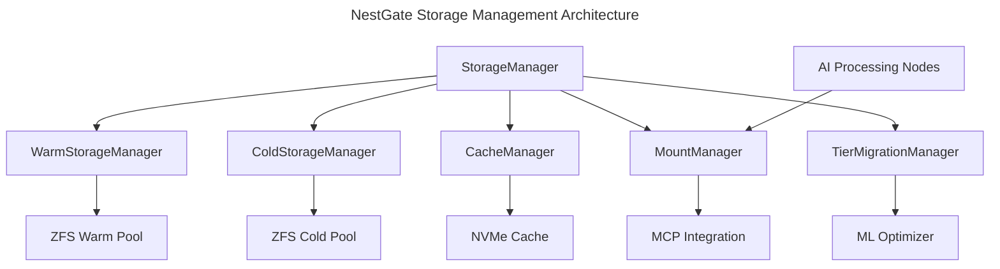

# NestGate Core Storage Management

## Overview

The storage management subsystem provides optimized tiered storage for MCP AI workloads, including:

1. **Warm Storage Tier** - High-performance storage for active AI datasets and models
2. **Cold Storage Tier** - Efficient capacity storage for archived data and models
3. **Cache Tier** - Ultra-performance NVMe cache for critical access patterns
4. **Mount Management** - Optimized mount handling for AI node access
5. **Tier Migration** - Intelligent movement between tiers based on access patterns

## Architecture



## Storage Tier Configuration

```yaml
storage_management:
  components:
    storage_manager:
      purpose: "Coordinate storage operations across tiers"
      responsibilities:
        - "Tier selection for operations"
        - "Volume lifecycle management"
        - "Storage utilization tracking"
        - "Quota enforcement"
      interfaces:
        - "create_volume(config) -> Result<Volume>"
        - "delete_volume(id) -> Result<()>"
        - "resize_volume(id, size) -> Result<Volume>"
        - "list_volumes() -> Result<Vec<Volume>>"
        
    warm_storage_manager:
      purpose: "Manage warm storage tier for active AI workloads"
      performance_targets:
        throughput: ">500MB/s"
        iops: ">10K"
        latency: "<2ms"
      operations:
        - "Create ZFS datasets for AI workloads"
        - "Set appropriate ZFS properties for AI access patterns"
        - "Manage warm storage snapshots"
        - "Handle clone operations for dataset versions"
      interfaces:
        - "create_dataset(config) -> Result<Dataset>"
        - "create_snapshot(id, name) -> Result<Snapshot>"
        - "clone_dataset(snapshot, name) -> Result<Dataset>"
        
    cold_storage_manager:
      purpose: "Manage cold storage tier for archive data"
      performance_targets:
        throughput: ">250MB/s"
        iops: ">5K"
        latency: "<10ms"
      operations:
        - "Archive datasets with compression"
        - "Manage long-term snapshots"
        - "Handle selective retrieval"
        - "Optimize for storage efficiency"
      interfaces:
        - "archive_dataset(id, config) -> Result<Archive>"
        - "retrieve_archive(id, target) -> Result<()>"
        - "list_archives() -> Result<Vec<Archive>>"
        
    cache_manager:
      purpose: "Optimize data locality for critical datasets"
      performance_targets:
        throughput: ">2GB/s"
        iops: ">50K"
        hit_ratio: ">85%"
      operations:
        - "Pin critical datasets to cache"
        - "Manage cache eviction policies"
        - "Optimize for AI workload patterns"
        - "Coordinate with ML predictors"
      interfaces:
        - "pin_to_cache(dataset_id) -> Result<()>"
        - "evict_from_cache(dataset_id) -> Result<()>"
        - "optimize_cache() -> Result<OptimizationResult>"
      
    mount_manager:
      purpose: "Manage mounts for AI node access"
      operations:
        - "Establish NFS/SMB mounts for AI nodes"
        - "Track mount status and performance"
        - "Optimize mount parameters for AI workloads"
        - "Coordinate with MCP for node access"
      interfaces:
        - "mount_for_ai_node(volume_id, node_id) -> Result<MountInfo>"
        - "unmount_from_ai_node(mount_id) -> Result<()>"
        - "list_mounts() -> Result<Vec<MountInfo>>"
        
    tier_migration_manager:
      purpose: "Coordinate data movement between tiers"
      operations:
        - "Plan and execute tier migrations"
        - "Track migration progress"
        - "Optimize migration scheduling"
        - "Integrate with ML predictions"
      interfaces:
        - "migrate_to_warm(dataset_id) -> Result<MigrationJob>"
        - "migrate_to_cold(dataset_id) -> Result<MigrationJob>"
        - "get_migration_status(job_id) -> Result<MigrationStatus>"
```

## Technical Implementation

### ZFS Storage Backend

NestGate uses ZFS as the primary storage backend for warm and cold tiers:

```rust
// ZFS storage implementation (pseudocode)
pub struct ZfsStorageManager {
    zfs: Arc<libzfs::Zfs>,
    pool_name: String,
    config: ZfsConfig,
}

impl ZfsStorageManager {
    // Create a new ZFS dataset
    pub async fn create_dataset(&self, name: &str, size: u64, tier: StorageTier) -> Result<Dataset> {
        // Select appropriate ZFS properties based on tier
        let properties = match tier {
            StorageTier::Warm => self.config.warm_tier_properties.clone(),
            StorageTier::Cold => self.config.cold_tier_properties.clone(),
            _ => return Err(Error::UnsupportedTier),
        };
        
        // Construct ZFS dataset path
        let dataset_path = format!("{}/{}", self.pool_name, name);
        
        // Create dataset with appropriate properties
        let dataset = self.zfs.create_dataset(
            &dataset_path,
            libzfs::DatasetType::Filesystem,
            properties,
        )?;
        
        // Set quota
        dataset.set_property("quota", &size.to_string())?;
        
        // Add metadata about creation
        dataset.set_property("com.nestgate:tier", &tier.to_string())?;
        dataset.set_property("com.nestgate:created", &Utc::now().to_rfc3339())?;
        
        Ok(Dataset {
            id: dataset_path,
            name: name.to_string(),
            size,
            tier,
            created_at: Utc::now(),
            properties: properties.into_iter().collect(),
        })
    }
    
    // Create a snapshot of a dataset
    pub async fn create_snapshot(&self, dataset_id: &str, name: &str) -> Result<Snapshot> {
        // Get dataset
        let dataset = self.zfs.dataset(dataset_id)?;
        
        // Create snapshot name
        let snapshot_name = format!("{}@{}", dataset_id, name);
        
        // Create snapshot
        let snapshot = dataset.snapshot(&snapshot_name, false)?;
        
        // Add metadata
        snapshot.set_property("com.nestgate:created", &Utc::now().to_rfc3339())?;
        
        Ok(Snapshot {
            id: snapshot_name,
            dataset_id: dataset_id.to_string(),
            name: name.to_string(),
            created_at: Utc::now(),
        })
    }
    
    // Clone a dataset from a snapshot
    pub async fn clone_dataset(&self, snapshot_id: &str, name: &str) -> Result<Dataset> {
        // Get snapshot
        let snapshot = self.zfs.dataset(snapshot_id)?;
        
        // Create clone name
        let clone_path = format!("{}/{}", self.pool_name, name);
        
        // Clone the snapshot
        let clone = snapshot.clone(&clone_path)?;
        
        // Get original dataset to determine tier
        let parts: Vec<&str> = snapshot_id.split('@').collect();
        let original_dataset = self.zfs.dataset(parts[0])?;
        let tier = StorageTier::from_str(
            &original_dataset.property("com.nestgate:tier")?.value
        )?;
        
        // Set properties
        clone.set_property("com.nestgate:tier", &tier.to_string())?;
        clone.set_property("com.nestgate:created", &Utc::now().to_rfc3339())?;
        clone.set_property("com.nestgate:cloned_from", snapshot_id)?;
        
        // Get size
        let size = clone.property("quota")?.parsed::<u64>()?;
        
        Ok(Dataset {
            id: clone_path,
            name: name.to_string(),
            size,
            tier,
            created_at: Utc::now(),
            properties: HashMap::new(), // Would need to collect actual properties
        })
    }
}
```

### Cache Management

The cache manager optimizes data locality using NVMe storage:

```rust
// Cache management implementation (pseudocode)
pub struct NvmeCacheManager {
    cache_device: String,
    zfs: Arc<libzfs::Zfs>,
    pinned_datasets: Arc<RwLock<HashSet<String>>>,
    small_model_manager: Arc<SmallModelManager>,
}

impl NvmeCacheManager {
    // Pin a dataset to cache
    pub async fn pin_to_cache(&self, dataset_id: &str) -> Result<()> {
        // Verify dataset exists
        let dataset = self.zfs.dataset(dataset_id)?;
        
        // Set ZFS cache properties
        dataset.set_property("primarycache", "all")?;
        dataset.set_property("secondary cache", "all")?;
        
        // If L2ARC is used, set specific property
        if self.config.use_l2arc {
            dataset.set_property("l2arc_enable", "1")?;
        }
        
        // Mark as pinned in our registry
        let mut pinned = self.pinned_datasets.write().await;
        pinned.insert(dataset_id.to_string());
        
        // Log pin operation
        tracing::info!("Pinned dataset {} to cache", dataset_id);
        
        Ok(())
    }
    
    // Evict a dataset from cache
    pub async fn evict_from_cache(&self, dataset_id: &str) -> Result<()> {
        // Verify dataset exists
        let dataset = self.zfs.dataset(dataset_id)?;
        
        // Modify ZFS cache properties
        dataset.set_property("primarycache", "metadata")?;
        
        // If using L2ARC, disable for this dataset
        if self.config.use_l2arc {
            dataset.set_property("l2arc_enable", "0")?;
        }
        
        // Remove from pinned registry
        let mut pinned = self.pinned_datasets.write().await;
        pinned.remove(dataset_id);
        
        // Log eviction
        tracing::info!("Evicted dataset {} from cache", dataset_id);
        
        Ok(())
    }
    
    // Optimize cache using ML model
    pub async fn optimize_cache(&self) -> Result<OptimizationResult> {
        // Get cache usage statistics
        let usage = self.get_cache_usage().await?;
        
        // If cache pressure is high, evict less important datasets
        if usage.pressure > 0.9 {
            // Get predictions from ML model about dataset importance
            let model = self.small_model_manager.get_model(ModelType::CacheOptimizer).await?;
            let predictions = self.small_model_manager
                .run_inference(model.id, usage.into())
                .await?;
            
            // Parse predictions
            let cache_decisions = CacheDecisions::from_tensor(predictions)?;
            
            // Apply decisions
            let mut pin_count = 0;
            let mut evict_count = 0;
            
            for pin in cache_decisions.to_pin {
                self.pin_to_cache(&pin.dataset_id).await?;
                pin_count += 1;
            }
            
            for evict in cache_decisions.to_evict {
                self.evict_from_cache(&evict.dataset_id).await?;
                evict_count += 1;
            }
            
            Ok(OptimizationResult {
                optimized_at: Utc::now(),
                pin_count,
                evict_count,
                estimated_hit_ratio_improvement: cache_decisions.estimated_improvement,
            })
        } else {
            // Cache pressure is acceptable, no optimization needed
            Ok(OptimizationResult {
                optimized_at: Utc::now(),
                pin_count: 0,
                evict_count: 0,
                estimated_hit_ratio_improvement: 0.0,
            })
        }
    }
}
```

### AI Workload Optimization

Storage is optimized for AI workload access patterns:

```rust
// AI workload optimization (pseudocode)
pub struct AiWorkloadOptimizer {
    warm_storage: Arc<ZfsStorageManager>,
    cache_manager: Arc<NvmeCacheManager>,
    small_model_manager: Arc<SmallModelManager>,
}

impl AiWorkloadOptimizer {
    // Optimize storage for a training workload
    pub async fn optimize_for_training(&self, dataset_id: &str) -> Result<()> {
        // Get dataset
        let dataset = self.warm_storage.get_dataset(dataset_id).await?;
        
        // Set ZFS properties optimized for training workloads
        self.warm_storage.set_dataset_properties(
            dataset_id,
            HashMap::from([
                ("recordsize", "128K"),      // Larger recordsize for sequential access
                ("primarycache", "all"),     // Cache data and metadata
                ("sync", "standard"),        // Standard sync for data integrity
                ("logbias", "throughput"),   // Optimize for throughput over latency
            ]),
        ).await?;
        
        // Pin to cache if it's a critical dataset
        if dataset.metadata.get("priority").map_or(false, |p| p == "high") {
            self.cache_manager.pin_to_cache(dataset_id).await?;
        }
        
        // Log optimization
        tracing::info!("Optimized dataset {} for training workload", dataset_id);
        
        Ok(())
    }
    
    // Optimize storage for an inference workload
    pub async fn optimize_for_inference(&self, dataset_id: &str) -> Result<()> {
        // Get dataset
        let dataset = self.warm_storage.get_dataset(dataset_id).await?;
        
        // Set ZFS properties optimized for inference workloads
        self.warm_storage.set_dataset_properties(
            dataset_id,
            HashMap::from([
                ("recordsize", "16K"),       // Smaller recordsize for random access
                ("primarycache", "all"),     // Cache data and metadata
                ("sync", "disabled"),        // Disable sync for performance
                ("logbias", "latency"),      // Optimize for latency over throughput
            ]),
        ).await?;
        
        // Always pin inference datasets to cache
        self.cache_manager.pin_to_cache(dataset_id).await?;
        
        // Log optimization
        tracing::info!("Optimized dataset {} for inference workload", dataset_id);
        
        Ok(())
    }
    
    // Analyze and optimize based on detected patterns
    pub async fn auto_optimize(&self, dataset_id: &str) -> Result<WorkloadType> {
        // Get access pattern history
        let access_history = self.get_access_history(dataset_id).await?;
        
        // Prepare input for ML model
        let input_tensor = access_history.into_tensor();
        
        // Get workload prediction model
        let model = self.small_model_manager
            .get_model(ModelType::WorkloadPredictor)
            .await?;
        
        // Run inference to predict workload type
        let prediction = self.small_model_manager
            .run_inference(model.id, input_tensor)
            .await?;
        
        // Parse prediction
        let workload_type = WorkloadType::from_prediction(prediction);
        
        // Apply optimization based on workload type
        match workload_type {
            WorkloadType::Training => self.optimize_for_training(dataset_id).await?,
            WorkloadType::Inference => self.optimize_for_inference(dataset_id).await?,
            WorkloadType::Mixed => self.optimize_for_mixed(dataset_id).await?,
            WorkloadType::Unknown => self.optimize_for_general(dataset_id).await?,
        }
        
        // Return detected workload type
        Ok(workload_type)
    }
}
```

### Tier Migration Process

Intelligent data movement between tiers based on access patterns:

```rust
// Tier migration implementation (pseudocode)
pub struct TierMigrationManager {
    warm_storage: Arc<ZfsStorageManager>,
    cold_storage: Arc<ZfsStorageManager>,
    small_model_manager: Arc<SmallModelManager>,
    active_migrations: Arc<RwLock<HashMap<String, MigrationJob>>>,
}

impl TierMigrationManager {
    // Migrate dataset from cold to warm tier
    pub async fn migrate_to_warm(&self, dataset_id: &str) -> Result<MigrationJob> {
        // Verify dataset exists in cold storage
        let cold_dataset = self.cold_storage.get_dataset(dataset_id).await?;
        
        // Create unique job ID
        let job_id = Uuid::new_v4().to_string();
        
        // Create a migration job
        let job = MigrationJob {
            id: job_id.clone(),
            dataset_id: dataset_id.to_string(),
            source_tier: StorageTier::Cold,
            target_tier: StorageTier::Warm,
            status: MigrationStatus::Pending,
            created_at: Utc::now(),
            completed_at: None,
            progress: 0.0,
        };
        
        // Register job
        {
            let mut migrations = self.active_migrations.write().await;
            migrations.insert(job_id.clone(), job.clone());
        }
        
        // Spawn async task to perform migration
        let job_clone = job.clone();
        let active_migrations = self.active_migrations.clone();
        let warm_storage = self.warm_storage.clone();
        let cold_storage = self.cold_storage.clone();
        
        tokio::spawn(async move {
            // Update status to in progress
            {
                let mut migrations = active_migrations.write().await;
                if let Some(job) = migrations.get_mut(&job_id) {
                    job.status = MigrationStatus::InProgress;
                }
            }
            
            // Create snapshot of cold dataset
            let result = async {
                let snapshot = cold_storage
                    .create_snapshot(dataset_id, "pre_migration")
                    .await?;
                
                // Create new dataset in warm tier
                let warm_dataset = warm_storage
                    .create_dataset(
                        &format!("{}_migrated", cold_dataset.name),
                        cold_dataset.size,
                        StorageTier::Warm,
                    )
                    .await?;
                
                // Perform ZFS send/receive
                cold_storage.send_snapshot_to_dataset(
                    &snapshot.id,
                    &warm_dataset.id,
                    |progress| {
                        // Update progress
                        let mut migrations = active_migrations.blocking_write();
                        if let Some(job) = migrations.get_mut(&job_id) {
                            job.progress = progress;
                        }
                    },
                ).await?;
                
                // Update metadata on warm dataset
                warm_storage.set_dataset_properties(
                    &warm_dataset.id,
                    HashMap::from([
                        ("com.nestgate:migrated_from", dataset_id),
                        ("com.nestgate:migration_time", &Utc::now().to_rfc3339()),
                    ]),
                ).await?;
                
                // Update job status to completed
                {
                    let mut migrations = active_migrations.write().await;
                    if let Some(job) = migrations.get_mut(&job_id) {
                        job.status = MigrationStatus::Completed;
                        job.completed_at = Some(Utc::now());
                        job.progress = 100.0;
                    }
                }
                
                Ok::<_, Error>(warm_dataset.id)
            }.await;
            
            // Handle result
            if let Err(e) = result {
                // Update job status to failed
                let mut migrations = active_migrations.write().await;
                if let Some(job) = migrations.get_mut(&job_id) {
                    job.status = MigrationStatus::Failed;
                    job.progress = 0.0;
                }
                
                tracing::error!("Migration job {} failed: {}", job_id, e);
            }
        });
        
        Ok(job)
    }
    
    // Migrate dataset from warm to cold tier
    pub async fn migrate_to_cold(&self, dataset_id: &str) -> Result<MigrationJob> {
        // Similar implementation to migrate_to_warm but in reverse direction
        // ...
        
        // Return migration job
        Ok(MigrationJob {
            id: "dummy".to_string(),
            dataset_id: dataset_id.to_string(),
            source_tier: StorageTier::Warm,
            target_tier: StorageTier::Cold,
            status: MigrationStatus::Pending,
            created_at: Utc::now(),
            completed_at: None,
            progress: 0.0,
        })
    }
    
    // Check status of migration job
    pub async fn get_migration_status(&self, job_id: &str) -> Result<MigrationStatus> {
        let migrations = self.active_migrations.read().await;
        
        if let Some(job) = migrations.get(job_id) {
            Ok(job.status.clone())
        } else {
            Err(Error::MigrationJobNotFound(job_id.to_string()))
        }
    }
}
```

### MCP Integration

Mount handling for MCP AI nodes:

```rust
// MCP mount management (pseudocode)
pub struct McpMountManager {
    storage_manager: Arc<StorageManager>,
    mcp_client: Arc<McpClient>,
    mount_registry: Arc<RwLock<HashMap<String, MountInfo>>>,
}

impl McpMountManager {
    // Mount dataset for AI node
    pub async fn mount_for_ai_node(
        &self,
        volume_id: &str,
        node_id: &str,
        options: MountOptions,
    ) -> Result<MountInfo> {
        // Validate volume exists
        let volume = self.storage_manager.get_volume(volume_id).await?;
        
        // Validate AI node with MCP
        self.mcp_client.validate_ai_node(node_id).await?;
        
        // Determine mount path
        let mount_path = format!("/mnt/{}/{}", node_id, volume.name);
        
        // Create mount request for MCP
        let mount_request = McpMountRequest {
            node_id: node_id.to_string(),
            volume_id: volume_id.to_string(),
            mount_path: mount_path.clone(),
            options: options.clone(),
        };
        
        // Send mount request to MCP
        let mount_response = self.mcp_client.request_mount(mount_request).await?;
        
        // Create mount info
        let mount_info = MountInfo {
            id: mount_response.mount_id.clone(),
            node_id: node_id.to_string(),
            volume_id: volume_id.to_string(),
            path: mount_path,
            options,
            created_at: Utc::now(),
            status: MountStatus::Active,
        };
        
        // Register mount
        let mut mounts = self.mount_registry.write().await;
        mounts.insert(mount_response.mount_id.clone(), mount_info.clone());
        
        // Return mount info
        Ok(mount_info)
    }
    
    // Unmount from AI node
    pub async fn unmount_from_ai_node(&self, mount_id: &str) -> Result<()> {
        // Get mount info
        let mount_info = {
            let mounts = self.mount_registry.read().await;
            mounts.get(mount_id).cloned().ok_or_else(|| Error::MountNotFound(mount_id.to_string()))?
        };
        
        // Send unmount request to MCP
        self.mcp_client.request_unmount(
            &mount_info.node_id,
            &mount_info.volume_id,
        ).await?;
        
        // Remove mount from registry
        let mut mounts = self.mount_registry.write().await;
        mounts.remove(mount_id);
        
        Ok(())
    }
    
    // List all mounts
    pub async fn list_mounts(&self) -> Result<Vec<MountInfo>> {
        let mounts = self.mount_registry.read().await;
        Ok(mounts.values().cloned().collect())
    }
}
```

## Performance Considerations

```yaml
performance_targets:
  warm_tier:
    throughput: ">500MB/s"
    iops: ">10K"
    latency: "<2ms"
    snapshot_creation: "<1s"
    
  cold_tier:
    throughput: ">250MB/s"
    iops: ">5K"
    latency: "<10ms"
    snapshot_creation: "<3s"
    
  cache_tier:
    throughput: ">2GB/s"
    iops: ">50K"
    hit_ratio: ">85%"
    
  tier_migration:
    speed: ">300MB/s"
    overhead: "<5%"
```

## Error Handling and Recovery

```rust
// Error handling (pseudocode)
#[derive(Debug, thiserror::Error)]
pub enum StorageError {
    #[error("Dataset not found: {0}")]
    DatasetNotFound(String),
    
    #[error("Volume not found: {0}")]
    VolumeNotFound(String),
    
    #[error("Mount not found: {0}")]
    MountNotFound(String),
    
    #[error("Migration job not found: {0}")]
    MigrationJobNotFound(String),
    
    #[error("Insufficient space in tier: {0}")]
    InsufficientSpace(StorageTier),
    
    #[error("ZFS error: {0}")]
    ZfsError(#[from] libzfs::Error),
    
    #[error("MCP error: {0}")]
    McpError(#[from] McpError),
    
    #[error("IO error: {0}")]
    IoError(#[from] std::io::Error),
}

// Resilient operation example
pub async fn with_recovery<F, Fut, T>(
    operation: F,
    retry_count: usize,
    operation_name: &str,
) -> Result<T, StorageError>
where
    F: Fn() -> Fut,
    Fut: Future<Output = Result<T, StorageError>>,
{
    let mut attempts = 0;
    
    loop {
        match operation().await {
            Ok(result) => {
                if attempts > 0 {
                    tracing::info!(
                        "Operation {} succeeded after {} retries",
                        operation_name,
                        attempts
                    );
                }
                return Ok(result);
            }
            Err(e) => {
                attempts += 1;
                
                if attempts >= retry_count {
                    tracing::error!(
                        "Operation {} failed after {} attempts: {:?}",
                        operation_name,
                        attempts,
                        e
                    );
                    return Err(e);
                }
                
                let backoff = Duration::from_millis(100 * 2u64.pow(attempts as u32));
                
                tracing::warn!(
                    "Operation {} failed (attempt {}/{}), retrying in {:?}: {:?}",
                    operation_name,
                    attempts,
                    retry_count,
                    backoff,
                    e
                );
                
                tokio::time::sleep(backoff).await;
            }
        }
    }
}
```

## Monitoring and Metrics

```yaml
core_metrics:
  - name: "storage_utilization"
    type: "gauge"
    description: "Storage utilization percentage by tier"
    labels: ["tier"]
    
  - name: "iops"
    type: "gauge"
    description: "IOPS by tier"
    labels: ["tier", "operation"]
    
  - name: "throughput"
    type: "gauge"
    description: "Throughput in bytes/second by tier"
    labels: ["tier", "direction"]
    
  - name: "latency"
    type: "histogram"
    description: "Operation latency in milliseconds"
    labels: ["tier", "operation"]
    
  - name: "cache_hit_ratio"
    type: "gauge"
    description: "Cache hit ratio percentage"
    
  - name: "active_mounts"
    type: "gauge"
    description: "Number of active mounts by tier"
    labels: ["tier"]
    
alerts:
  - name: "high_storage_utilization"
    description: "Storage utilization approaching capacity"
    threshold: "85%"
    
  - name: "low_cache_hit_ratio"
    description: "Cache hit ratio below target"
    threshold: "<70%"
    
  - name: "high_latency"
    description: "Operation latency exceeding threshold"
    threshold: "warm:>5ms, cold:>20ms"
    
health_checks:
  - name: "zfs_pool_health"
    description: "ZFS pool health check"
    interval: "5m"
    
  - name: "mount_availability"
    description: "Mount point availability check"
    interval: "2m"
    
  - name: "cache_performance"
    description: "Cache tier performance check"
    interval: "10m"
```

## Future Enhancements

1. **Advanced Cache Algorithms**
   - Implement ML-driven prefetching
   - Workload-specific cache allocation
   - Temporal access pattern recognition

2. **Cross-Node Cache Coordination**
   - Implement cache coherency protocols
   - Coordinate caching across multiple NestGate nodes
   - Distribute hot data optimally

3. **Automated Tier Optimization**
   - ML-driven tier placement
   - Predictive data movement
   - Workload-based optimization

## Technical Metadata
- Category: Storage Management
- Priority: High
- Owner: DataScienceBioLab
- Dependencies:
  - ZFS
  - NVMe storage
  - ONNX Runtime
  - MCP protocol
- Validation Requirements:
  - Performance benchmarks
  - Data integrity validation
  - Integration with AI nodes
  - Error recovery testing