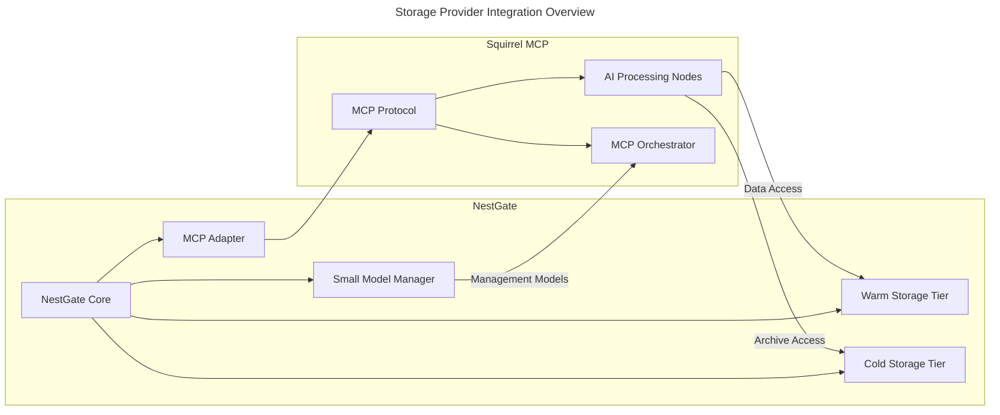
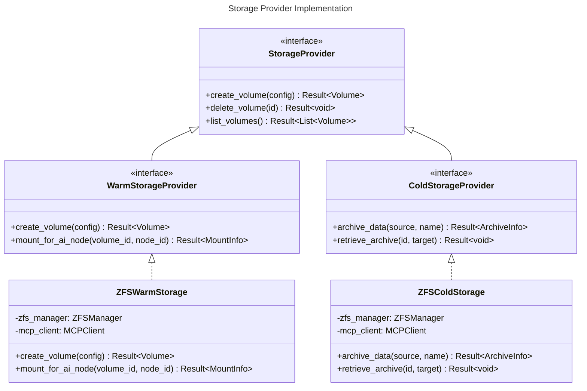

# NestGate-Squirrel Integration

*This is a placeholder document. The full NestGate-Squirrel integration documentation will be added during the documentation phase.*

## Overview

This document outlines the integration between NestGate NAS nodes and the Squirrel MCP system, providing detailed specifications for how NestGate functions as a storage provider within the Squirrel ecosystem.

## Integration Points

### Resource Registration
- NestGate registers as a storage provider with the Squirrel MCP orchestrator
- Resource capabilities are advertised including storage tiers and capacity
- Authentication and authorization are established

### Data Access
- AI nodes request storage from the MCP orchestrator
- The orchestrator directs requests to NestGate
- NestGate provisions and mounts storage for AI nodes
- Access control is enforced based on orchestrator policies

### Monitoring and Metrics
- NestGate reports health and performance metrics to the orchestrator
- Utilization trends are analyzed for optimization
- Alerts are generated for storage-related issues

## Implementation Status

Currently, the following integration points have been implemented:
- Basic resource registration
- Storage provisioning API
- Initial metric reporting

Please refer to the [SPECS.md](../SPECS.md) document for more information on the overall NestGate architecture.



## Design Principles

1. **Storage Provider Focus**: Optimize for serving AI workloads with tiered storage
2. **Interface Segregation**: Use focused interfaces for storage functionality
3. **Dependency Inversion**: Depend on abstractions, not implementations
4. **Testability**: Enable independent testing through mock implementations
5. **Tiered Performance**: Optimize each storage tier for specific use cases

## Integration Architecture

### Storage Provider Abstraction

The abstraction layer defines interfaces for tiered storage functionality:

```rust
// Example interface definitions (pseudocode)

/// Defines operations for warm storage tier
pub trait WarmStorageProvider {
    async fn create_volume(&self, config: VolumeConfig) -> Result<Volume>;
    async fn delete_volume(&self, id: &str) -> Result<()>;
    async fn list_volumes(&self) -> Result<Vec<Volume>>;
    async fn get_volume_status(&self, id: &str) -> Result<VolumeStatus>;
    async fn resize_volume(&self, id: &str, new_size: u64) -> Result<Volume>;
    async fn create_snapshot(&self, volume_id: &str, name: &str) -> Result<Snapshot>;
    async fn mount_for_ai_node(&self, volume_id: &str, node_id: &str) -> Result<MountInfo>;
}

/// Defines operations for cold storage tier
pub trait ColdStorageProvider {
    async fn archive_data(&self, source_path: &str, archive_name: &str) -> Result<ArchiveInfo>;
    async fn retrieve_archive(&self, archive_id: &str, target_path: &str) -> Result<()>;
    async fn list_archives(&self) -> Result<Vec<ArchiveInfo>>;
    async fn get_archive_status(&self, id: &str) -> Result<ArchiveStatus>;
    async fn create_archive_snapshot(&self, archive_id: &str, name: &str) -> Result<Snapshot>;
    async fn mount_archive(&self, archive_id: &str, node_id: &str) -> Result<MountInfo>;
}

/// Defines operations for cache management
pub trait CacheManager {
    async fn allocate_cache(&self, key: &str, size: u64) -> Result<CacheAllocation>;
    async fn release_cache(&self, allocation_id: &str) -> Result<()>;
    async fn get_cache_stats(&self) -> Result<CacheStats>;
    async fn optimize_cache(&self) -> Result<OptimizationResult>;
    async fn pin_to_cache(&self, data_id: &str) -> Result<()>;
    async fn unpin_from_cache(&self, data_id: &str) -> Result<()>;
}

/// Defines operations for small model hosting
pub trait SmallModelManager {
    async fn deploy_model(&self, model_config: ModelConfig) -> Result<ModelDeployment>;
    async fn unload_model(&self, model_id: &str) -> Result<()>;
    async fn list_models(&self) -> Result<Vec<ModelInfo>>;
    async fn get_model_stats(&self, model_id: &str) -> Result<ModelStats>;
    async fn run_inference(&self, model_id: &str, input: Tensor) -> Result<Tensor>;
    async fn update_model(&self, model_id: &str, model_path: &str) -> Result<ModelDeployment>;
}
```

### Adapter Implementations

The adapter layer implements the abstractions for Squirrel MCP:

```rust
// Example adapter implementations (pseudocode)

pub struct SquirrelWarmStorageProvider {
    client: SquirrelMcpClient,
    zfs_manager: ZFSManager,
}

impl WarmStorageProvider for SquirrelWarmStorageProvider {
    async fn create_volume(&self, config: VolumeConfig) -> Result<Volume> {
        // Create ZFS dataset for warm storage
        let dataset = self.zfs_manager.create_dataset(&config.name, config.size).await?;
        
        // Register with MCP
        let mcp_config = convert_to_mcp_volume_config(config, dataset, StorageTier::Warm);
        let mcp_volume = self.client.register_storage_resource(mcp_config).await?;
        
        // Convert result
        Ok(convert_from_mcp_volume(mcp_volume))
    }
    
    async fn mount_for_ai_node(&self, volume_id: &str, node_id: &str) -> Result<MountInfo> {
        // Get volume information
        let volume = self.zfs_manager.get_dataset(volume_id).await?;
        
        // Register mount with MCP
        let mount_request = MountRequest {
            volume_id: volume_id.to_string(),
            node_id: node_id.to_string(),
            mount_options: MountOptions {
                read_only: false,
                cache_mode: CacheMode::WriteBack,
                sync_mode: SyncMode::Standard,
            },
        };
        
        let mcp_mount = self.client.request_mount(mount_request).await?;
        
        // Return mount information
        Ok(MountInfo {
            id: mcp_mount.id,
            path: mcp_mount.path,
            status: MountStatus::Mounting,
        })
    }
    
    // Other implementation methods...
}
```

### Mock Implementations for Testing

Mock implementations allow development without Squirrel MCP:

```rust
// Example mock implementations (pseudocode)

pub struct MockWarmStorageProvider {
    volumes: Arc<RwLock<HashMap<String, Volume>>>,
    mounts: Arc<RwLock<HashMap<String, MountInfo>>>,
}

impl WarmStorageProvider for MockWarmStorageProvider {
    async fn create_volume(&self, config: VolumeConfig) -> Result<Volume> {
        let volume = Volume {
            id: Uuid::new_v4().to_string(),
            name: config.name,
            size: config.size,
            tier: StorageTier::Warm,
            created_at: Utc::now(),
            status: VolumeStatus::Creating,
        };
        
        let mut volumes = self.volumes.write().await;
        volumes.insert(volume.id.clone(), volume.clone());
        
        Ok(volume)
    }
    
    // Other implementation methods...
}
```

## Integration Phases

### Phase 1: Storage Abstraction (Month 1-2)

1. Define warm and cold storage interfaces
2. Implement ZFS-based storage providers
3. Develop caching layer
4. Create basic testing framework

### Phase 2: MCP Protocol Integration (Month 3-4)

1. Implement MCP protocol adapters
2. Create storage registration services
3. Develop mount management system
4. Build monitoring integration

### Phase 3: AI Node Integration (Month 5-6)

1. Optimize storage for AI workloads
2. Implement data access patterns
3. Develop small model manager
4. Create performance optimization tools

### Phase 4: Performance Optimization (Month 7-8)

1. Implement cross-tier movement strategies
2. Optimize cache for AI workloads
3. Develop predictive data placement
4. Create performance monitoring dashboards

### Phase 5: Production Deployment (Month 9)

1. Deploy to production environment
2. Integrate with MCP AI nodes
3. Implement comprehensive monitoring
4. Develop automation for tier management

## Core Integration Points

### Warm Storage Management

NestGate will provide optimized warm storage for MCP AI nodes:

```yaml
warm_storage:
  purpose: "Frequent AI data access"
  use_cases:
    - "Current training datasets"
    - "Active AI models"
    - "Inference data"
    - "Frequently accessed intermediate results"
  
  performance_targets:
    throughput: ">500MB/s"
    iops: ">10K"
    latency: "<2ms"
  
  features:
    - "ZFS dataset management"
    - "Snapshot-based versioning"
    - "AI node direct mount support"
    - "Cache integration"
    - "Performance monitoring"
```

### Cold Storage Management

NestGate will provide efficient cold storage for archival data:

```yaml
cold_storage:
  purpose: "Infrequent AI data access"
  use_cases:
    - "Historical training data"
    - "Archived models"
    - "Infrequently accessed results"
    - "Backup datasets"
  
  performance_targets:
    throughput: ">250MB/s"
    iops: ">5K"
    latency: "<10ms"
  
  features:
    - "ZFS compression"
    - "Snapshot for long-term retention"
    - "Selective retrieval"
    - "Archive indexing"
    - "Capacity optimization"
```

### Small Model Hosting

NestGate will utilize its RTX 2070 for hosting management models:

```yaml
small_model_hosting:
  purpose: "Management and orchestration models"
  hardware: "RTX 2070 8GB"
  
  model_types:
    - "Resource predictors"
    - "Data movement optimizers"
    - "Workload classifiers"
    - "Anomaly detectors"
  
  performance_targets:
    model_size: "<4GB"
    inference_latency: "<50ms"
    concurrent_models: "3-5"
  
  features:
    - "CUDA acceleration"
    - "ONNX Runtime integration"
    - "Tensor management"
    - "Model versioning"
    - "Performance monitoring"
```

### Cache Management

NestGate will provide optimized cache management for AI workloads:

```yaml
cache_management:
  purpose: "Optimize performance for AI data access"
  hardware: "NVMe storage"
  
  strategies:
    - "Frequency-based caching"
    - "Prefetch prediction"
    - "Workload-aware pinning"
    - "Cross-node cache coordination"
  
  performance_targets:
    throughput: ">2GB/s"
    iops: ">50K"
    hit_ratio: ">85%"
  
  features:
    - "Predictive cache warming"
    - "Cache pinning for critical data"
    - "Cache tier migration"
    - "Performance analytics"
```

## Storage Provider Implementation

The implementation follows the storage provider pattern:



## Error Handling and Recovery

The integration implements robust error handling:

```rust
// Example error handling (pseudocode)

pub enum StorageError {
    NotFound(String),
    PermissionDenied(String),
    OutOfSpace(String),
    IOError(std::io::Error),
    MCPError(MCPError),
    ZFSError(ZFSError),
}

impl From<MCPError> for StorageError {
    fn from(error: MCPError) -> Self {
        match error {
            MCPError::ConnectionError(msg) => StorageError::MCPError(error),
            MCPError::ResourceError(msg) => StorageError::OutOfSpace(msg),
            // Other error mappings...
        }
    }
}

// Recovery strategies for storage
async fn with_storage_retry<F, Fut, T>(f: F, retries: usize) -> Result<T, StorageError>
where
    F: Fn() -> Fut,
    Fut: Future<Output = Result<T, StorageError>>,
{
    let mut attempts = 0;
    loop {
        match f().await {
            Ok(result) => return Ok(result),
            Err(err) => {
                attempts += 1;
                if attempts > retries {
                    return Err(err);
                }
                
                // Use exponential backoff
                let backoff = Duration::from_millis(100 * 2u64.pow(attempts as u32));
                tokio::time::sleep(backoff).await;
                
                // Log retry attempt
                tracing::warn!(
                    "Storage operation failed, retrying ({}/{}): {:?}",
                    attempts,
                    retries,
                    err
                );
            }
        }
    }
}
```

## Configuration

The integration is configurable through YAML:

```yaml
nestgate_storage:
  warm_storage:
    path: "/zfs/warm_pool"
    datasets:
      max_count: 100
      default_quota: "100GB"
    snapshots:
      retention: "30 days"
      schedule: "daily"
    performance:
      recordsize: "128K"
      sync: "standard"
      compression: "lz4"
  
  cold_storage:
    path: "/zfs/cold_pool"
    archives:
      default_quota: "1TB"
    snapshots:
      retention: "365 days"
      schedule: "weekly"
    performance:
      recordsize: "1M"
      sync: "disabled"
      compression: "zstd"
  
  cache:
    path: "/zfs/cache_pool"
    size: "2TB"
    algorithms:
      default: "lru"
      specialized:
        training_data: "mru"
        models: "pinned"
    eviction:
      policy: "least-recently-used"
      threshold: 90
  
  small_model:
    max_models: 5
    max_model_size: "4GB"
    runtime: "onnx"
    cache_dir: "/var/cache/nestgate/models"
    
  mcp:
    connection:
      endpoint: "https://mcp.example.com"
      timeout: 30
      retries: 3
    
    authentication:
      method: "oauth2"
      client_id: "${MCP_CLIENT_ID}"
      client_secret: "${MCP_CLIENT_SECRET}"
```

## Performance Considerations

The integration addresses several performance aspects:

```yaml
performance:
  warm_storage:
    zfs_tuning:
      recordsize: "128K"
      primarycache: "all"
      secondarycache: "all"
      sync: "standard"
      logbias: "throughput"
    
    io_patterns:
      read_heavy: "prefetch optimization"
      write_heavy: "log device usage"
      mixed: "adaptive caching"
  
  cold_storage:
    zfs_tuning:
      recordsize: "1M"
      primarycache: "metadata"
      secondarycache: "all"
      sync: "disabled"
      compression: "zstd"
    
    access_patterns:
      sequential: "prefetch optimization"
      archival: "compression priority"
      retrieval: "read-ahead tuning"
  
  cache:
    algorithms:
      data_types:
        model_weights: "pinned"
        training_data: "mru"
        intermediate_results: "lru"
    
    placement:
      hot_data: "nvme tier"
      warm_data: "ssd tier"
      cold_data: "evict"
    
    optimization:
      prefetch: true
      eviction_policy: "workload-aware"
      monitoring_interval: 60
```

## Monitoring and Observability

The integration includes comprehensive monitoring for storage tiers:

```yaml
monitoring:
  warm_storage:
    metrics:
      - name: "warm_iops"
        type: "gauge"
        description: "IOPS for warm storage tier"
      - name: "warm_throughput"
        type: "gauge"
        description: "Throughput for warm storage tier"
      - name: "warm_latency"
        type: "histogram"
        description: "Latency for warm storage tier operations"
  
  cold_storage:
    metrics:
      - name: "cold_throughput"
        type: "gauge"
        description: "Throughput for cold storage tier"
      - name: "archive_count"
        type: "gauge"
        description: "Number of archives in cold storage"
      - name: "retrieval_time"
        type: "histogram"
        description: "Time to retrieve archives from cold storage"
  
  cache:
    metrics:
      - name: "cache_hit_ratio"
        type: "gauge"
        description: "Cache hit ratio"
      - name: "cache_usage"
        type: "gauge"
        description: "Cache usage percentage"
      - name: "cache_evictions"
        type: "counter"
        description: "Number of cache evictions"
  
  small_model:
    metrics:
      - name: "model_inference_latency"
        type: "histogram"
        description: "Inference latency for small models"
      - name: "model_memory_usage"
        type: "gauge"
        description: "GPU memory usage for models"
      - name: "model_throughput"
        type: "gauge"
        description: "Inference operations per second"
```

## Testing Strategy

The integration includes a testing strategy for storage functionality:

```yaml
testing:
  unit_tests:
    - "Test ZFS storage provider implementation"
    - "Test cache management algorithms"
    - "Test error handling and recovery"
  
  integration_tests:
    - "Test mounting for MCP AI nodes"
    - "Test high-throughput data operations"
    - "Test tier migration performance"
  
  performance_tests:
    - "Benchmark warm storage throughput"
    - "Measure cold storage capacity efficiency"
    - "Evaluate cache hit ratios under load"
    - "Measure small model inference performance"
```

## Security Considerations

The integration addresses security concerns:

```yaml
security:
  access_control:
    - "Node-based authorization"
    - "Volume access permissions"
    - "Mount restrictions"
  
  data_protection:
    - "ZFS encryption for sensitive data"
    - "Secure deletion capabilities"
    - "Snapshot access controls"
  
  network_security:
    - "TLS for all connections"
    - "Network isolation for storage traffic"
    - "Access logging and auditing"
```

## Technical Metadata
- Category: Integration Specification
- Priority: Medium
- Last Updated: 2024-09-30
- Dependencies:
  - NestGate Core v0.8.0+
  - Squirrel MCP v1.5.0+
  - ZFS Storage
  - NVIDIA RTX 2070
- Testing Requirements:
  - Storage performance tests
  - MCP integration tests
  - Cache efficiency tests
  - Small model benchmarks