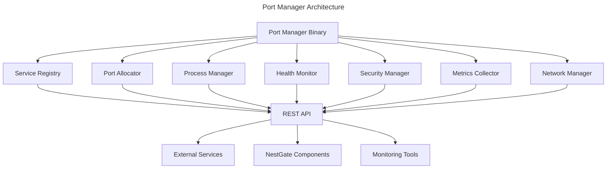

# NestGate Port Manager System - Team Handoff

## Overview

The NestGate Port Manager is a Rust-based service that provides dynamic port allocation, service lifecycle management, and coordination across the NestGate ecosystem. This document provides a complete list of files and components needed to deploy and maintain the port manager system.

## Core System Architecture



## Required Files for Handoff

### 1. Core Rust Implementation
**Location**: `crates/services/nestgate-port-manager/`

#### Source Code Files:
- `src/lib.rs` - Main library interface
- `src/main.rs` - CLI binary entry point
- `src/api.rs` - REST API implementation (25KB, 737 lines)
- `src/config.rs` - Configuration management (9.1KB, 339 lines)
- `src/errors.rs` - Error types and handling (2.0KB, 81 lines)
- `src/health.rs` - Health monitoring system (8.3KB, 274 lines)
- `src/metrics.rs` - Metrics collection (18KB, 554 lines)
- `src/network.rs` - Network management (20KB, 672 lines)
- `src/port.rs` - Port allocation logic (9.0KB, 297 lines)
- `src/process.rs` - Process management (20KB, 551 lines)
- `src/security.rs` - Security and authentication (12KB, 411 lines)
- `src/service.rs` - Service registry (16KB, 566 lines)
- `src/tests.rs` - Unit tests (3.1KB, 92 lines)

#### Configuration Files:
- `Cargo.toml` - Rust dependencies and build config
- `Cargo.lock` - Dependency lock file
- `test-config.yaml` - Test configuration
- `config/` - Configuration examples directory
- `examples/` - Usage examples directory

#### Documentation:
- `README.md` - Crate documentation and usage

#### Tests:
- `tests/` - Integration tests directory
- `tests/port_manager_test.rs` - Main test suite

### 2. Shell Scripts and Automation
**Location**: Various locations

#### Port Manager Control Scripts:
- `port-manager-client.sh` - Client script for interacting with port manager
- `start-with-port-manager.sh` - Main startup script with port manager
- `scripts/start/toggle-port-manager.sh` - Start/stop port manager (Linux/macOS)
- `scripts/start/toggle-port-manager.ps1` - Start/stop port manager (Windows PowerShell)

#### Integration Scripts:
- `integration-test-setup.sh` - Integration testing setup
- `test-fs-zfs-ui-integration.sh` - ZFS integration testing
- `run-integration-test.sh` - Integration test runner

### 3. Configuration Files
**Location**: Various locations

#### Main Configuration:
- `.config/port-manager-config.yaml` - Main port manager configuration
- `config/port-manager-config.yaml` - Alternative config location

#### Environment Files:
- `.service-info` - Service information file
- `.port-manager-pid` - Process ID tracking
- `.port-manager-state.json` - Runtime state persistence

### 4. Documentation
**Location**: `docs/` directory

#### User Documentation:
- `docs/port-manager.md` - Main port manager documentation
- `docs/guides/port-manager.md` - User guide and best practices
- `crates/ui/nestgate-ui/src/services/README-PORT-MANAGER.md` - Integration documentation

#### Technical Documentation:
- `README.md` - Project overview (includes port manager section)
- `PR.md` - Pull request documentation

### 5. Build and Dependency Files

#### Rust Build System:
- `Cargo.toml` - Workspace configuration
- `Cargo.lock` - Workspace dependency lock
- `target/` - Build artifacts (can be regenerated)

#### JavaScript Integration (Legacy - Remove These):
- ~~Any `.ts` files with "port-manager" in the name~~ (Outdated, ignore)

## Installation and Setup

### Prerequisites
- Rust 1.70+ toolchain
- System dependencies for process management
- Network access for port binding

### Building the Port Manager
```bash
cd crates/services/nestgate-port-manager
cargo build --release
```

### Running the Port Manager
```bash
# Using the binary directly
./target/release/port-manager --port 9000 --log-level info

# Using the convenience script
./start-with-port-manager.sh

# Using configuration file
./target/release/port-manager --config .config/port-manager-config.yaml
```

## API Endpoints

The port manager provides a REST API on the configured port (default 9000):

- `GET /health` - Health check
- `GET /services` - List all services
- `POST /services` - Register a service
- `GET /services/{id}` - Get service details
- `DELETE /services/{id}` - Unregister service
- `POST /services/{id}/start` - Start a service
- `POST /services/{id}/stop` - Stop a service
- `GET /metrics` - Prometheus metrics
- `POST /system/shutdown` - Graceful shutdown

## Default Port Ranges

| Service Type | Start Port | End Port |
|--------------|------------|----------|
| UI           | 3000       | 3050     |
| API          | 3051       | 3100     |
| WebSocket    | 3101       | 3150     |
| Database     | 6000       | 6999     |

## Dependencies

### Runtime Dependencies
- **tokio**: Async runtime
- **axum**: Web framework
- **serde**: Serialization
- **tracing**: Logging
- **clap**: CLI argument parsing

### System Dependencies
- Process management capabilities
- Network socket access
- File system access for state persistence

## Configuration

The port manager supports configuration via:
1. YAML/JSON configuration files
2. Environment variables
3. Command-line arguments

Key configuration sections:
- `server`: HTTP server settings
- `port_ranges`: Service type port ranges
- `health`: Health check configuration
- `security`: Authentication and authorization
- `metrics`: Metrics collection settings
- `logging`: Log output configuration

## Monitoring and Metrics

The port manager exposes Prometheus metrics at `/metrics` endpoint:
- Service count and status
- Port allocation metrics
- Process health metrics
- API request metrics

## Security Considerations

- API key authentication (optional)
- IP whitelisting support
- Rate limiting
- CORS configuration
- SSL/TLS support (configurable)

## Deployment Notes

1. **Single Instance**: Run one port manager per environment
2. **State Persistence**: Enable persistence for production deployments
3. **Health Monitoring**: Configure health checks for all managed services
4. **Log Management**: Configure log rotation and retention
5. **Network Security**: Secure the management API appropriately

## Support and Maintenance

- **Logs**: Check `logs/port-manager.log` for troubleshooting
- **State**: Monitor `.port-manager-state.json` for service state
- **Metrics**: Use Prometheus endpoint for monitoring
- **API**: REST API provides full programmatic control

## Migration Notes

- The TypeScript port manager implementation is deprecated
- All new integrations should use the Rust-based REST API
- Existing scripts have been updated to use the Rust implementation
- Remove any references to `port-manager.ts` files 