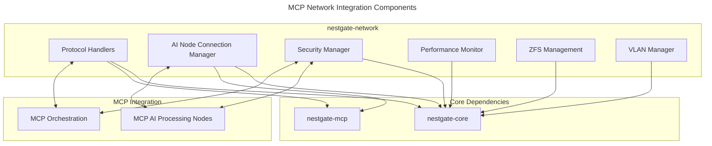

# MCP NAS Node Network Architecture

## Component Structure



## Component Configuration

```yaml
    components:
  protocol_handlers:
    purpose: "Implement storage protocols for MCP AI node access"
    primary_protocol: "NFS"
        features:
      - "NFS exports management"
      - "NFS mount handling"
      - "Mount options optimization for AI workloads"
      - "Access pattern monitoring"
  
  ai_node_connection_manager:
    purpose: "Manage connections from MCP AI nodes"
        features:
      - "Connection lifecycle management"
      - "Data path optimization"
      - "Node health monitoring"
      - "Connection pooling for high-traffic nodes"
      
  security_manager:
    purpose: "Implement MCP security requirements"
        features:
      - "Token-based authentication"
      - "AI node authentication"
      - "Role-based access control"
      - "Security level enforcement"
      
      performance_monitor:
    purpose: "Monitor network metrics for MCP reporting"
    features:
      - "Latency tracking by tier"
      - "Throughput measurement"
      - "Connection metrics gathering"
      - "Performance optimization insights"
  
  zfs_manager:
    purpose: "ZFS storage backend management"
    features:
      - "ZFS pool operations"
      - "Dataset management"
      - "Performance tuning"
      - "System parameter optimization"
      
  vlan_manager:
    purpose: "Network segmentation for AI nodes"
        features:
      - "VLAN configuration"
      - "Network isolation"
      - "Traffic prioritization"
      - "Secure node communication"
```

## Performance Requirements

```yaml
performance:
  latency:
    warm_tier: "<2ms"
    cold_tier: "<10ms"
    cache_tier: "<0.5ms"
  
  throughput:
    warm_tier: ">500MB/s"
    cold_tier: ">250MB/s"
    cache_tier: ">2GB/s"
  
  connections:
    ai_nodes: 
      max_concurrent: 64
      setup_time: "<100ms"
    
reliability:
  uptime: "99.9%"
  connection_stability: "99.9%"
  error_recovery: "<5s"
      
      security:
  authentication: "MCP token-based"
  authorization: "MCP role-based access control"
```

## Implementation Details

### AI Node Connection Management

The AI Node Connection Manager establishes and maintains connections between MCP AI nodes and NestGate storage:

```rust
// AI Node connection management (based on current implementation)
pub struct AiNodeManager {
    /// Protocol handlers
    protocol_handlers: HashMap<Protocol, Arc<dyn ProtocolHandler>>,
    
    /// Active connections
    connections: RwLock<HashMap<ConnectionId, ConnectionDetails>>,
    
    /// Maximum connections per node
    max_connections_per_node: usize,
}

impl AiNodeManager {
    /// Create a new AI node manager
    pub fn new(max_connections_per_node: usize) -> Self {
        Self {
            protocol_handlers: HashMap::new(),
            connections: RwLock::new(HashMap::new()),
            max_connections_per_node,
        }
    }
    
    /// Initialize the manager
    pub async fn initialize(&mut self, config: &NetworkConfig) -> Result<()> {
        info!("Initializing AI node manager");
        
        // Set up protocol handlers
        let mut protocol_handlers = HashMap::new();
        
        // Add NFS handler
        let nfs_manager = Arc::new(NfsManager::new(config.nfs_config.clone()));
        protocol_handlers.insert(Protocol::Nfs, nfs_manager as Arc<dyn ProtocolHandler>);
        
        self.protocol_handlers = protocol_handlers;
        
        Ok(())
    }
    
    /// Mount a volume
    pub async fn mount(
        &self,
        node_id: &str,
        volume_id: &str,
        protocol: Protocol,
        read_only: bool,
        performance: PerformancePreference,
    ) -> Result<String> {
        debug!("Mount request: node={}, volume={}, protocol={:?}", 
               node_id, volume_id, protocol);
        
        // Get handler for protocol
        let handler = match self.protocol_handlers.get(&protocol) {
            Some(handler) => handler,
            None => return Err(NetworkError::UnsupportedProtocol(protocol)),
        };
        
        // Set access mode
        let access_mode = if read_only {
            AccessMode::Read
        } else {
            AccessMode::ReadWrite
        };
        
        // Create mount options
        let mount_options = MountOptions {
            access_mode,
            performance_preference: performance,
        };
        
        // Establish mount
        let mount_info = handler.establish_mount(node_id, volume_id, mount_options).await?;
        
        // Create connection ID
        let connection_id = format!("{}_{}", node_id, volume_id);
        
        // Store connection details
        let details = ConnectionDetails {
            node_id: node_id.to_string(),
            volume_id: volume_id.to_string(),
            protocol,
            client_path: mount_info.client_path.clone(),
            mount_command: mount_info.mount_command.clone(),
        };
        
        // Store in connections map
        let mut connections = self.connections.write().await;
        connections.insert(connection_id.clone(), details);
        
        // Return the mount command
        Ok(mount_info.mount_command)
    }
    
    /// Unmount a volume
    pub async fn unmount(&self, node_id: &str, volume_id: &str) -> Result<()> {
        // Implementation as per current code
        // ...
    }
}
```

### NFS Protocol Implementation

The NFS protocol handler focuses on efficient mount management for AI workloads:

```rust
// NFS protocol implementation (based on current code)
pub struct NfsManager {
    /// Configuration
    config: NfsConfig,
}

impl NfsManager {
    /// Create a new NFS manager
    pub fn new(config: NfsConfig) -> Self {
        Self {
            config,
        }
    }
    
    /// Initialize
    pub async fn initialize(&self) -> Result<()> {
        info!("Initializing NFS manager with server IP: {}", self.config.server_ip);
        
        // Create exports directory if it doesn't exist
        let exports_dir = Path::new(&self.config.exports_dir);
        if !exports_dir.exists() {
            fs::create_dir_all(exports_dir)
                .map_err(NetworkError::IoError)?;
        }
        
        // Create exports file if it doesn't exist
        let exports_file = Path::new(&self.config.exports_file);
        if !exports_file.exists() {
            File::create(exports_file)
                .map_err(NetworkError::IoError)?;
        }
        
        // Start NFS server if not already running
        self.ensure_nfs_server_running()?;
        
        Ok(())
    }
    
    /// Generate export name
    fn generate_export_name(&self, node_id: &str, volume_id: &str) -> String {
        format!("nestgate_{}_{}",
            node_id.replace("-", ""),
            volume_id.replace("-", ""),
        )
    }
    
    // Implementation as per current code
    // ...
}

impl ProtocolHandler for NfsManager {
    async fn establish_mount(
        &self,
        node_id: &str,
        volume_id: &str,
        options: MountOptions,
    ) -> Result<MountInfo> {
        // Implementation as per current code
        // ...
    }
    
    // Other implementations
    // ...
}
```

### ZFS Management Integration

The ZFS management component provides storage operations and tuning:

```rust
// ZFS pool management (based on current implementation)
pub struct ZfsPoolManager<Z> {
    /// ZFS commander
    commander: Z,
    
    /// Migration jobs
    migration_jobs: Arc<RwLock<HashMap<String, ZfsMigrationJob>>>,
}

impl<Z: ZfsCommander + Send + Sync + 'static + Clone> ZfsPoolManager<Z> {
    /// Create a new ZFS pool manager
    pub fn new(commander: Z) -> Self {
        Self {
            commander,
            migration_jobs: Arc::new(RwLock::new(HashMap::new())),
        }
    }
    
    /// List all ZFS pools
    pub async fn list_pools(&self) -> Result<Vec<String>> {
        let pools = self.commander.list_pools().await
            .map_err(|e| ZfsError::CommandFailed(e.to_string()))?;
        
        Ok(pools.iter().map(|p| p.name.clone()).collect())
    }
    
    /// Create a new dataset
    pub async fn create_dataset(&self, dataset_name: &str, properties: HashMap<String, String>) -> Result<()> {
        self.commander.create_dataset(dataset_name, properties).await
            .map_err(|e| ZfsError::CommandFailed(e.to_string()))
    }
    
    // Other implementation details
    // ...
}

// ZFS tuning management (based on current implementation)
pub struct ZfsTuningManager<S> {
    /// Sysctl operations
    sysctl: S,
    
    /// Tuning configuration
    config: Arc<RwLock<ZfsTuningConfig>>,
    
    /// Tuning file path
    tuning_file: PathBuf,
    
    /// Original parameters
    original_params: Arc<RwLock<Option<HashMap<String, String>>>>,
    
    /// Is ZFS module loaded
    zfs_loaded: Arc<RwLock<bool>>,
}

impl<S: SysctlOperations + Send + Sync + 'static> ZfsTuningManager<S> {
    /// Create a new ZFS tuning manager
    pub fn new(sysctl: S, config: ZfsTuningConfig, tuning_file: Option<PathBuf>) -> Self {
        let tuning_file = tuning_file.unwrap_or_else(|| PathBuf::from(DEFAULT_TUNING_FILE));
        
        Self {
            sysctl,
            config: Arc::new(RwLock::new(config)),
            tuning_file,
            original_params: Arc::new(RwLock::new(None)),
            zfs_loaded: Arc::new(RwLock::new(false)),
        }
    }
    
    // Implementation details
    // ...
}
```

### Security Implementation

The security layer implements MCP-compatible authentication and authorization:

```rust
// Security implementation (based on current code)
pub struct SecurityManager {
    /// Security level (policy enforcement strength)
    security_level: SecurityLevel,
    
    /// Authentication provider
    auth_provider: Arc<dyn AuthProvider>,
    
    /// Authorization provider
    authz_provider: Arc<dyn AuthzProvider>,
    
    /// Token storage
    tokens: RwLock<HashMap<String, AuthToken>>,
}

impl SecurityManager {
    /// Create a new security manager
    pub fn new(security_level: SecurityLevel) -> Self {
        Self {
            security_level,
            auth_provider: Arc::new(LocalAuthProvider::new()),
            authz_provider: Arc::new(LocalAuthzProvider::new()),
            tokens: RwLock::new(HashMap::new()),
        }
    }
    
    /// Validate token
    pub async fn validate_token(&self, token_value: &str) -> Result<()> {
        let tokens = self.tokens.read().await;
        
        match tokens.get(token_value) {
            Some(token) if token.is_valid() => Ok(()),
            Some(_) => Err(NetworkError::InvalidToken),
            None => Err(NetworkError::InvalidToken),
        }
    }
    
    /// Generate token
    pub async fn generate_token(&self, permissions: Vec<String>, expiration: Option<Duration>) -> AuthToken {
        // Implementation details
        // ...
        
        AuthToken {
            token: format!("token-{}", SystemTime::now().duration_since(UNIX_EPOCH).unwrap().as_secs()),
            expiration: expiration.map(|e| {
                SystemTime::now() + e
            }),
            permissions,
        }
    }
    
    // Other implementation details
    // ...
}
```

### Performance Monitoring

The performance monitor tracks metrics specific to AI workloads:

```rust
// Performance monitoring implementation (based on current code)
pub struct PerformanceMonitor {
    /// Whether monitoring is enabled
    enabled: bool,
    
    /// Collection interval
    collection_interval: Duration,
    
    /// Connection metrics
    connection_metrics: RwLock<HashMap<String, ConnectionMetrics>>,
    
    /// Tier-specific metrics
    tier_metrics: RwLock<HashMap<StorageTier, HashMap<MetricType, MetricsCounter>>>,
}

impl PerformanceMonitor {
    /// Create a new performance monitor
    pub fn new(enabled: bool) -> Self {
        Self {
            enabled,
            collection_interval: Duration::from_secs(60),
            connection_metrics: RwLock::new(HashMap::new()),
            tier_metrics: RwLock::new(HashMap::new()),
        }
    }
    
    /// Record operation metrics
    pub async fn record_operation(
        &self,
        connection_id: &str,
        tier: StorageTier,
        metric_type: MetricType,
        value: u64,
    ) -> Result<()> {
        if !self.enabled {
            return Ok(());
        }
        
        // Record in connection metrics
        {
            let mut metrics = self.connection_metrics.write().await;
            if let Some(connection_metric) = metrics.get_mut(connection_id) {
                connection_metric.record_metric(metric_type, value);
            }
        }
        
        // Record in tier metrics
        {
            let mut tier_metrics = self.tier_metrics.write().await;
            let metrics = tier_metrics
                .entry(tier)
                .or_insert_with(HashMap::new);
                
            let counter = metrics
                .entry(metric_type)
                .or_insert_with(|| MetricsCounter::new());
                
            counter.record(value);
        }
        
        Ok(())
    }
    
    // Other implementation details
    // ...
}
```

## MCP Integration API

The network component exposes a focused API for MCP integration:

```rust
// MCP integration API (based on current implementation)
pub struct NestGateNetwork<Z: ZfsCommander + Send + Sync + 'static + Clone> {
    /// Network configuration
    pub config: Arc<RwLock<NetworkConfig>>,
    
    /// NFS protocol handler
    pub nfs_handler: Option<Arc<RwLock<dyn ProtocolHandler>>>,
    
    /// SMB protocol handler
    pub smb_handler: Option<Arc<RwLock<dyn ProtocolHandler>>>,
    
    /// VLAN manager
    pub vlan_manager: Arc<RwLock<VlanManager>>,
    
    /// ZFS tuning manager
    pub zfs_tuning_manager: Arc<RwLock<ZfsTuningManager<DefaultSysctl>>>,
    
    /// ZFS pool manager
    pub zfs_pool_manager: Option<Arc<RwLock<ZfsPoolManager<Z>>>>,
    
    /// Shutdown signal
    shutdown: Arc<AtomicBool>,
    
    /// Cleanup task handle
    cleanup_task: Option<tokio::task::JoinHandle<()>>,
}

impl<Z: ZfsCommander + Send + Sync + Clone + 'static> NestGateNetwork<Z> {
    /// Create a new NestGate Network component
    pub fn new(config: NetworkConfig) -> Self {
        // Initialization code
        // ...
    }
    
    /// Initialize the network
    pub async fn initialize(&self) -> Result<()> {
        // Initialize ZFS tuning
        let tuning_manager = self.zfs_tuning_manager.read().await;
        match tuning_manager.init().await {
            Ok(_) => info!("ZFS tuning initialized"),
            Err(e) => warn!("Failed to initialize ZFS tuning: {}", e),
        }
        
        // Apply ZFS tuning if enabled
        if self.config.read().await.zfs_tuning_config.enable_tuning {
            match self.apply_zfs_tuning().await {
                Ok(_) => info!("ZFS tuning applied successfully"),
                Err(e) => warn!("Failed to apply ZFS tuning: {}", e),
            }
        }
        
        // Start migration job cleanup task
        self.start_migration_cleanup().await;
        
        Ok(())
    }
    
    // Other implementation details
    // ...
}
```

## Technical Metadata
- Category: Network Component
- Priority: High
- Owner: DataScienceBioLab
- Dependencies:
  - nestgate-core
  - nestgate-mcp
  - tokio = "1.36"
  - tracing = "0.1"
  - async-trait = "0.1"
- Validation Requirements:
  - NFS protocol compatibility tests
  - ZFS operation validation
  - AI node connection performance tests
  - Tier-specific performance validation