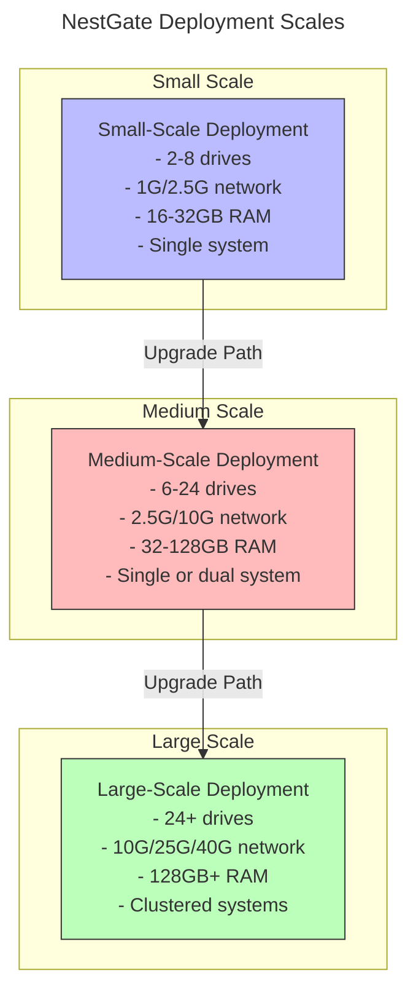
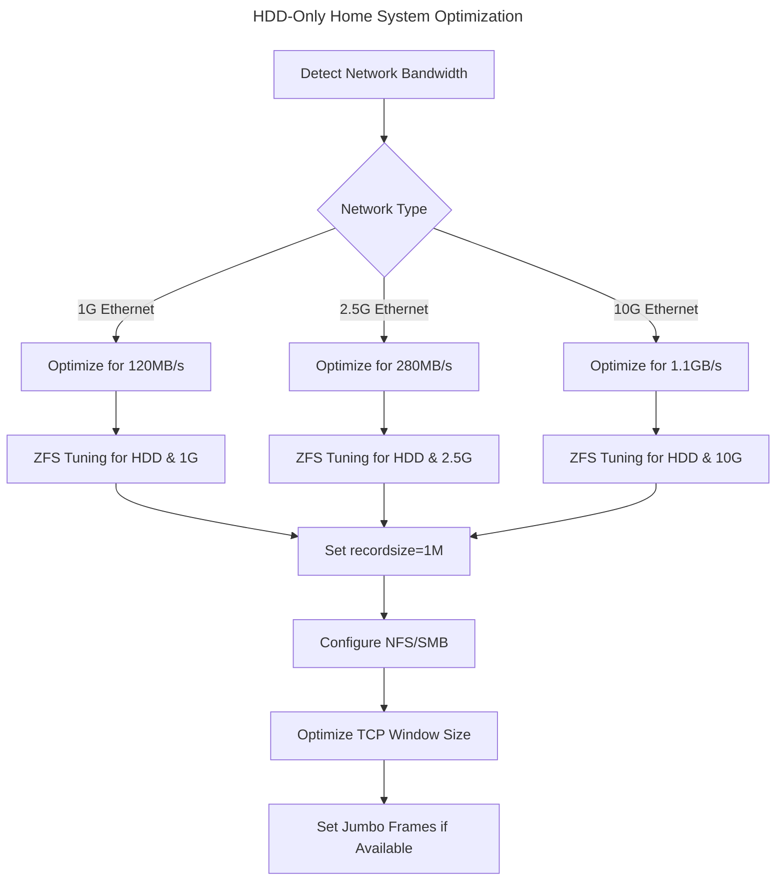

# NestGate Deployment Scaling Capabilities

## Overview

NestGate is designed to operate effectively across different deployment scales, from modest home/small lab setups to large enterprise environments. This specification defines how the system adapts to different hardware configurations while maintaining consistent functionality and performance characteristics.

## July 2024 Update: HDD-Only Home System Focus

For our initial production deployment targeting home users, we're focusing on a simplified HDD-only storage tier:

- **Simplified Storage Architecture**: Single HDD tier which will fully saturate typical home network bandwidth (1G/2.5G/10G)
- **Network-Optimized Performance**: Tuning focused on maximizing network throughput rather than storage speed
- **Future Expandability**: System design allows for adding SSD/NVMe tiers in the future as network bandwidth increases
- **Implementation Priority**: Core NAS functionality first, with AI integration deferred to a later phase

## Deployment Scale Categories



## Scale-Adaptive Architecture

```yaml
deployment_scale:
  small_scale:
    storage:
      capacity_range: "4-50TB"
      minimum_drives: 2
      recommended_configuration: "Mirror (2 drives) or RAIDZ1 (3-4 drives)"
      storage_tiers:
        primary_hdd: "Required - Main storage (HDD only initially)"
        future_expansion: "SSD/NVMe tiers to be added when network bandwidth increases"
    
    network:
      minimum: "1G Ethernet"
      recommended: "2.5G/10G Ethernet"
      saturation: "~120MB/s (1G) or ~280MB/s (2.5G) or ~1.1GB/s (10G)"
      
    memory:
      minimum: "16GB"
      recommended: "32GB"
      zfs_arc_max: "50% of system RAM"
      
    performance:
      throughput:
        expected: "Network saturation with proper tuning"
        hdd_tier: ">120MB/s for 1G, >280MB/s for 2.5G"
      
    adaption:
      tuning_params:
        zfs_txg_timeout: 10
        dirty_data_max_percent: 20
        prefetch_disable: 0
        recordsize: "1M for general datasets"
  
  medium_scale:
    storage:
      capacity_range: "50-200TB"
      minimum_drives: 6
      recommended_configuration: "RAIDZ2 (6-10 drives) or multiple vdevs"
      storage_tiers:
        cold: "Required - main storage array"
        warm: "Local NVMe on nodes or dedicated pool"
        cache: "Recommended - NVMe for L2ARC"
    
    network:
      minimum: "2.5G Ethernet"
      recommended: "10G Ethernet"
      saturation: "~280MB/s (2.5G) or ~1.1GB/s (10G)"
      
    memory:
      minimum: "32GB"
      recommended: "64-128GB"
      zfs_arc_max: "40-60% of system RAM"
      
    performance:
      throughput:
        expected: "Network saturation with proper tuning"
        warm_tier: ">500MB/s"
        cold_tier: ">250MB/s"
      
    adaption:
      tuning_params:
        zfs_txg_timeout: 5
        dirty_data_max_percent: 30
        prefetch_disable: 0
  
  large_scale:
    storage:
      capacity_range: "200TB-2PB+"
      minimum_drives: 24
      recommended_configuration: "Multiple RAIDZ2/RAIDZ3 vdevs or striped mirrors"
      storage_tiers:
        cold: "Multiple pools with different classes of storage"
        warm: "Dedicated high-performance pool"
        cache: "Dedicated cache devices, multiple L2ARC devices"
    
    network:
      minimum: "10G Ethernet"
      recommended: "25G/40G Ethernet or InfiniBand"
      saturation: "Maximum available bandwidth"
      
    memory:
      minimum: "128GB"
      recommended: "256GB-1TB"
      zfs_arc_max: "Carefully tuned based on workload"
      
    performance:
      throughput:
        expected: "Multi-GB/s with parallel access"
        warm_tier: ">1GB/s"
        cold_tier: ">500MB/s"
      
    adaption:
      tuning_params:
        zfs_txg_timeout: 3
        dirty_data_max_percent: 40
        prefetch_disable: 0
```

## Deployment Adaptations

### Automatic Configuration Adaptation

NestGate automatically adapts its configuration based on the detected hardware capabilities:

1. **Storage Configuration**
   - Identifies available storage devices and configures optimally
   - Configures ZFS pool layouts appropriate for the number of drives
   - Adjusts recordsize and other parameters based on workload patterns

2. **Memory Adaptation**
   - Scales ZFS ARC size based on available system memory
   - Adjusts cache allocations for metadata vs data based on workload
   - Configures L2ARC for systems with appropriate cache devices (when available)

3. **Network Tuning**
   - Detects network interface capabilities and adapts buffer sizes
   - Scales connection limits based on available bandwidth
   - Optimizes NFS/SMB parameters to match network capacity
   - Implements congestion management appropriate to link speed

### HDD-Only Configuration Focus

For the initial home system deployments, we focus specifically on HDD optimization:



### Future Multi-Tier Expansion

The system is designed to allow future expansion to multi-tier storage:

1. **HDD Base Tier** 
   - Start with HDD-only configuration
   - Optimize for network saturation

2. **Add SSD Cache Tier (Future)**
   - When network bandwidth increases (>10G)
   - Implement L2ARC for read caching
   - Possible SLOG for sync writes

3. **Add NVMe Warm Tier (Future)**
   - When implementing AI workloads
   - For datasets requiring very high performance

## Current Reference Implementation

The current reference implementation is targeted at small-scale home deployments:

```yaml
reference_implementation:
  storage:
    capacity: "8-32TB raw"
    configuration: "Mirror (2 drives) or RAIDZ1 (3-4 drives)"
    usable_capacity: "4-24TB depending on configuration"
    expansion: "Add second vdev as needed"
  
  network:
    interface: "2.5G Ethernet"
    expected_throughput: "~280MB/s maximum"
    optimizations:
      - "Jumbo frames if switch supports"
      - "Optimized TCP window size"
      - "NFS/SMB tuned for HDD performance"
  
  zfs_tuning:
    recordsize: "1M for general datasets, 128K for specific workloads"
    compression: "lz4 for balance of performance and space savings"
    atime: "off to reduce unnecessary writes"
    sync: "standard for general usage"
```

## Storage Tier Performance Expectations

For the HDD-only small-scale deployment:

| Network | Expected Throughput | HDD RAID Type | Typical Workload Performance |
|---------|---------------------|--------------|------------------------------|
| 1G      | ~120 MB/s           | Mirror       | 100-120 MB/s                 |
| 2.5G    | ~280 MB/s           | Mirror       | 250-280 MB/s                 |
| 10G     | ~1.1 GB/s           | RAIDZ1/Z2    | 500-800 MB/s                 |

These values represent expected real-world performance with the NestGate software stack and optimized configuration.

## Migration Between Scales

The system supports migration between different deployment scales:

1. **Scaling Up**
   - ZFS allows incremental addition of vdevs
   - Network components can adapt to faster interfaces
   - Configuration profiles adjust automatically
   - Data distribution rebalances across new resources

2. **Hardware Migration**
   - ZFS pools can be exported/imported across systems
   - Configuration database preserves settings
   - Authentication and security policies transfer seamlessly
   - Progressive implementation of advanced features

## Scale-Specific Optimizations

### Small-Scale Optimizations
- Memory usage optimized for limited RAM
- Reduced background task frequency
- Conservative ZFS ARC policies
- Single-threaded operations where appropriate

### Medium-Scale Optimizations
- Balanced memory allocation
- Multi-threaded operations
- Moderate parallelism in data operations
- Dynamic resource allocation

### Large-Scale Optimizations
- Aggressive parallelism
- Distributed operations
- Predictive data placement
- Workload-based resource allocation
- Cross-node balancing

## Technical Metadata
- Category: Deployment Specification
- Priority: High
- Owner: DataScienceBioLab
- Dependencies:
  - ZFS storage subsystem
  - Network infrastructure
  - NFS protocol implementation
  - AI node resources
- Validation Requirements:
  - Tested on reference implementation
  - Performance validation at target scales
  - Resource utilization monitoring
  - Scale transition testing 