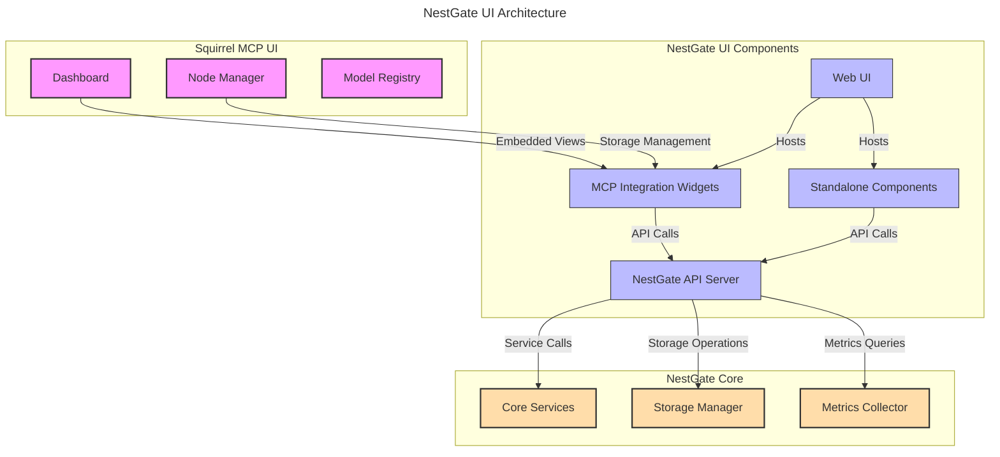

# NestGate Enhanced UI/UX Integration

## Overview

The NestGate Enhanced UI/UX Integration provides a lightweight, purpose-built management interface for AI storage workflows while integrating seamlessly with the Squirrel MCP ecosystem. This specification defines the architecture, components, and integration points for a modern, responsive interface that balances standalone capability with MCP integration.

## UI Architecture



## Integration Models

```yaml
integration_methods:
  embedded_widgets:
    description: "Embeddable components for MCP UI integration"
    technologies:
      - "Web Components"
      - "React components with API"
      - "iframe integration for legacy support"
    capabilities:
      - "Dataset browsing and management"
      - "Storage tier visualization"
      - "Performance metrics display"
      - "Snapshot management"
    
  unified_api:
    description: "Consistent API for both MCP and standalone use"
    technologies:
      - "RESTful API with OpenAPI specification"
      - "GraphQL endpoint for complex queries"
      - "WebSocket for real-time updates"
    authentication:
      - "API key support"
      - "OAuth integration with MCP"
      - "JWT token authentication"
  
  standalone_mode:
    description: "Lightweight UI for direct NestGate management"
    technologies:
      - "Progressive Web App (PWA)"
      - "Responsive design for mobile and desktop"
      - "Offline capability for basic functions"
    capabilities:
      - "Basic storage management"
      - "System health monitoring"
      - "Alert configuration and viewing"
      - "Simple dataset operations"
```

## Key UI Modules

### AI Workflow Dashboard

```yaml
ai_workflow_dashboard:
  description: "Central view of AI storage operations and metrics"
  components:
    - name: "Dataset Activity Timeline"
      purpose: "Visualize dataset access patterns over time"
      metrics_displayed:
        - "Read/write operations per dataset"
        - "AI training cycles"
        - "Model checkpoint events"
        - "Dataset version changes"
      
    - name: "Storage Tier Visualization"
      purpose: "Interactive view of storage tier usage and flow"
      features:
        - "Tier capacity and usage indicators"
        - "Data movement visualization between tiers"
        - "Predictive usage indicators"
        - "Optimization suggestions"
      
    - name: "AI Workload Correlation"
      purpose: "Correlate storage metrics with AI training metrics"
      data_sources:
        - "NestGate storage metrics"
        - "MCP training metrics API"
        - "Model performance data"
      visualizations:
        - "Combined timeline views"
        - "Performance correlation graphs"
        - "Resource utilization heat maps"
```

### Dataset Explorer

```yaml
dataset_explorer:
  description: "AI-optimized dataset browsing and management"
  features:
    - name: "Dataset Hierarchy View"
      capabilities:
        - "AI project-based organization"
        - "Version history visualization"
        - "Metadata filtering and searching"
        - "Tagged dataset organization"
      
    - name: "Dataset Timeline"
      capabilities:
        - "Version history with metadata"
        - "Snapshot points visualization"
        - "Training cycle correlation"
        - "Dataset lineage tracking"
      
    - name: "AI Metadata Inspector"
      capabilities:
        - "Model performance correlation"
        - "Feature distribution visualization"
        - "Training hyperparameter tracking"
        - "Dataset comparison tools"
```

### Storage Performance Analyzer

```yaml
performance_analyzer:
  description: "Advanced storage performance visualization for AI workloads"
  metrics:
    - name: "Throughput Analysis"
      visualizations:
        - "Real-time throughput graphs"
        - "Historical trends by dataset"
        - "Comparative analysis between storage tiers"
        - "Bottleneck identification"
      
    - name: "Latency Inspector"
      visualizations:
        - "Latency distribution histograms"
        - "Operation latency by type"
        - "Tier-specific latency analysis"
        - "Anomaly detection highlighting"
      
    - name: "IOPS Profiler"
      visualizations:
        - "Read/write IOPS breakdown"
        - "IOPS patterns during training cycles"
        - "Dataset-specific IOPS patterns"
        - "Predictive IOPS requirements"
```

### Snapshot & Backup Management

```yaml
snapshot_management:
  description: "Visual management of AI-aware snapshots and backups"
  components:
    - name: "Snapshot Timeline"
      features:
        - "Visual timeline of all snapshots"
        - "Training-correlated snapshot points"
        - "Filter by metadata, policy, or tier"
        - "One-click restore operations"
      
    - name: "Policy Editor"
      features:
        - "Visual policy creation workflow"
        - "Tier-specific policy templates"
        - "AI workload-specific templates"
        - "Policy simulation tool"
      
    - name: "Backup Status Dashboard"
      features:
        - "Replication job monitoring"
        - "Backup verification status"
        - "Recovery point objective tracking"
        - "Offsite backup visualization"
```

## MCP Integration Components

### Embedded Storage Widgets

```yaml
embedded_widgets:
  description: "UI components designed for embedding in MCP dashboard"
  widget_types:
    - name: "Storage Tier Status"
      size: "Small (1x1)"
      features:
        - "Capacity indicators"
        - "Health status"
        - "Performance at-a-glance"
        - "Alert indicators"
      
    - name: "Dataset Browser"
      size: "Medium (2x2)"
      features:
        - "Quick dataset navigation"
        - "Version selection"
        - "Mount status indicators"
        - "Basic dataset operations"
      
    - name: "Performance Metrics"
      size: "Medium (2x1)"
      features:
        - "Key performance graphs"
        - "Tier comparison"
        - "AI correlation indicators"
        - "Bottleneck warnings"
      
    - name: "Snapshot Manager"
      size: "Large (2x2)"
      features:
        - "Snapshot timeline"
        - "Quick snapshot creation"
        - "Restoration options"
        - "Policy adherence indicators"
```

### API Integration

```yaml
api_integration:
  description: "Comprehensive API for MCP integration and standalone use"
  categories:
    - name: "Storage Operations API"
      endpoints:
        - "/api/v1/storage/pools"
        - "/api/v1/storage/datasets"
        - "/api/v1/storage/snapshots"
        - "/api/v1/storage/mounts"
      
    - name: "Performance Metrics API"
      endpoints:
        - "/api/v1/metrics/realtime"
        - "/api/v1/metrics/historical"
        - "/api/v1/metrics/analysis"
        - "/api/v1/metrics/predictions"
      
    - name: "AI Correlation API"
      endpoints:
        - "/api/v1/ai/datasets"
        - "/api/v1/ai/training-correlation"
        - "/api/v1/ai/model-performance"
        - "/api/v1/ai/workload-patterns"
      
    - name: "Administration API"
      endpoints:
        - "/api/v1/admin/users"
        - "/api/v1/admin/system"
        - "/api/v1/admin/alerts"
        - "/api/v1/admin/config"
```

## Standalone Mode

The standalone mode provides essential functionality when used outside of the MCP ecosystem:

```yaml
standalone_features:
  description: "Core functionality available in standalone mode"
  components:
    - name: "Essential Dashboard"
      capabilities:
        - "System health overview"
        - "Storage capacity visualization"
        - "Performance metrics"
        - "Alert notifications"
      
    - name: "Dataset Manager"
      capabilities:
        - "Dataset browsing and creation"
        - "Snapshot management"
        - "Backup status and controls"
        - "Export and sharing options"
      
    - name: "Admin Console"
      capabilities:
        - "User management"
        - "Network configuration"
        - "System updates"
        - "Configuration backup/restore"
      
    - name: "Storage Configuration"
      capabilities:
        - "Pool management"
        - "Tier configuration"
        - "Tuning parameters"
        - "Encryption management"
```

## Responsive Design

```yaml
responsive_framework:
  description: "Design system for responsive UI across devices"
  breakpoints:
    - name: "mobile"
      width: "< 768px"
      adaptations:
        - "Simplified single-column layouts"
        - "Touch-optimized controls"
        - "Reduced data density"
        - "Essential functions only"
      
    - name: "tablet"
      width: "768px - 1199px"
      adaptations:
        - "Two-column layouts"
        - "Collapsible sections"
        - "Medium data density"
        - "Most functions available"
      
    - name: "desktop"
      width: "≥ 1200px"
      adaptations:
        - "Multi-column layouts"
        - "Advanced visualizations"
        - "High data density"
        - "All functions available"
  
  color_themes:
    - name: "light"
      description: "Light theme for general use"
    - name: "dark"
      description: "Dark theme for reduced eye strain"
    - name: "high-contrast"
      description: "Accessible high-contrast theme"
```

## Implementation Technologies

```yaml
technology_stack:
  frontend:
    - name: "React"
      purpose: "UI component framework"
    - name: "TypeScript"
      purpose: "Type-safe development"
    - name: "D3.js"
      purpose: "Data visualization"
    - name: "Tailwind CSS"
      purpose: "Responsive styling"
    - name: "React Query"
      purpose: "API data fetching and caching"
    
  backend:
    - name: "Rust (axum)"
      purpose: "API server"
    - name: "WebSockets"
      purpose: "Real-time updates"
    - name: "OpenAPI"
      purpose: "API documentation and validation"
    - name: "JSON Schema"
      purpose: "Data validation"
```

## Authentication and Security

```yaml
security_features:
  authentication:
    - name: "MCP SSO Integration"
      description: "Single sign-on with MCP identity provider"
    - name: "API Key Management"
      description: "Scoped API keys for programmatic access"
    - name: "Role-Based Access Control"
      description: "Granular permission system"
    
  communication:
    - name: "TLS 1.3+"
      description: "Secure communications"
    - name: "CSRF Protection"
      description: "Cross-site request forgery protection"
    - name: "API Rate Limiting"
      description: "Prevent abuse and ensure fair usage"
```

## Technical Metadata
- Category: User Interface
- Priority: Medium
- Owner: DataScienceBioLab
- Dependencies:
  - Squirrel MCP UI framework
  - NestGate API server
  - Metrics collection system
- Validation Requirements:
  - Cross-browser compatibility
  - Responsive design testing
  - Integration testing with MCP
  - Accessibility compliance testing 