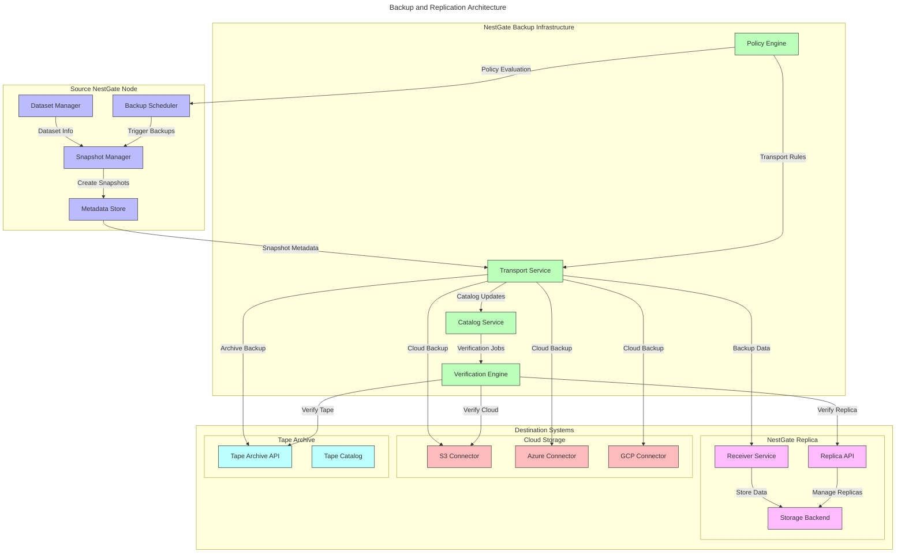

# NestGate Expanded Backup and Replication System

## Overview

The NestGate Expanded Backup and Replication System provides enterprise-grade data protection specifically optimized for AI workloads and model development environments. This specification defines an architecture that balances comprehensive backup capabilities with the unique requirements of AI data pipelines, including model checkpoints, dataset versions, and training artifacts.

## System Architecture



## Backup Policy Framework

```yaml
policy_framework:
  policy_types:
    - name: "Dataset Lifecycle Policy"
      description: "Manages dataset snapshots and backups based on dataset lifecycle stage"
      parameters:
        - name: "lifecycle_stage"
          options: 
            - "development"
            - "training"
            - "production"
            - "archived"
        - name: "retention_period"
          description: "Period to retain backups"
        - name: "snapshot_frequency"
          description: "How often to create snapshots"
        - name: "verification_schedule"
          description: "When to verify backup integrity"
    
    - name: "Training-Aware Policy"
      description: "Creates backups synchronized with AI training cycles"
      parameters:
        - name: "training_events"
          options:
            - "pre_training"
            - "checkpoint_created"
            - "accuracy_milestone"
            - "training_complete"
        - name: "model_performance_threshold"
          description: "Performance metrics that trigger backup"
        - name: "convergence_detection"
          description: "Backup when model converges"
        - name: "failure_detection"
          description: "Backup on training failure"
    
    - name: "Tiered Storage Policy"
      description: "Manages backups across different storage tiers"
      parameters:
        - name: "source_tier"
          options:
            - "hot"
            - "warm"
            - "cold"
        - name: "backup_targets"
          type: "array"
          items:
            type: "object"
            properties:
              tier: 
                type: "string"
                enum: ["replica_hot", "replica_warm", "replica_cold", "cloud", "tape"]
              retention:
                type: "string"
              schedule:
                type: "string"
        - name: "automatic_promotion"
          description: "Rules for promoting backups between tiers"
        - name: "data_access_patterns"
          description: "Backup strategy based on access patterns"
```

## Replication Strategies

### ZFS-Native Replication

```yaml
zfs_replication:
  description: "ZFS send/receive based replication for efficient dataset transfer"
  features:
    - name: "Incremental Replication"
      description: "Only transfer changes since last replication"
      implementation:
        pattern: "zfs send -i <prev_snapshot> <current_snapshot> | zfs recv <target>"
        optimization: "Resume support for interrupted transfers"
        
    - name: "Compressed Replication"
      description: "Use compression to reduce network bandwidth"
      implementation:
        pattern: "zfs send | compression | encryption | transport | decryption | decompression | zfs recv"
        compression_options:
          - "zstd (default)"
          - "lz4 (fast)"
          - "gzip (compatibility)"
        
    - name: "Throttled Replication"
      description: "Control bandwidth usage during replication"
      implementation:
        pattern: "zfs send | throttle(limit) | zfs recv"
        options:
          - "time-based throttling (business hours vs. off hours)"
          - "bandwidth allocation priority"
          - "adaptive throttling based on network usage"
        
    - name: "Encrypted Replication"
      description: "Secure data in transit"
      implementation:
        encryption_options:
          - "AES-256-GCM (default)"
          - "ChaCha20-Poly1305 (alternative)"
          - "Hardware-accelerated options where available"
```

### Multi-Target Replication

```yaml
multi_target_replication:
  description: "Replicate datasets to multiple destinations simultaneously"
  architectures:
    - name: "Fan-Out Replication"
      description: "One source to many targets"
      features:
        - "Parallel processing for multiple targets"
        - "Independent reliability channels"
        - "Destination-specific policies"
      use_cases:
        - "Geographical distribution of data"
        - "Multiple retention policies"
        - "Hybrid cloud/on-premise strategy"
    
    - name: "Cascading Replication"
      description: "Replication through intermediate nodes"
      features:
        - "Reduced source load"
        - "Bandwidth optimization"
        - "Hierarchical data distribution"
      use_cases:
        - "Distributed team access"
        - "Remote site with limited bandwidth"
        - "Branch office deployment"
    
    - name: "Bi-Directional Replication"
      description: "Two-way replication with conflict resolution"
      features:
        - "Metadata-based conflict detection"
        - "Automated conflict resolution"
        - "Manual resolution interface"
      use_cases:
        - "Active-active deployment"
        - "Collaborative editing environments"
        - "Disaster recovery with failback"
```

## AI-Aware Backup Features

```yaml
ai_aware_features:
  description: "Backup capabilities specific to AI workloads"
  features:
    - name: "Model Checkpoint Integration"
      description: "Coordinate backups with model checkpoint creation"
      implementation:
        - "API hook for checkpoint event notification"
        - "Automated snapshot on checkpoint creation"
        - "Metadata tagging with model metrics"
        - "Selective backup based on model performance"
      
    - name: "Dataset Version Correlation"
      description: "Track and backup dataset versions used in training"
      implementation:
        - "Dataset lineage tracking"
        - "Version-aware backup policies"
        - "Training correlation metadata"
        - "Feature distribution snapshots"
      
    - name: "Experiment Reproduction Support"
      description: "Ensure reproducibility of AI experiments"
      implementation:
        - "Environment snapshot integration"
        - "Code repository integration"
        - "Configuration capture"
        - "Result correlation"
      
    - name: "Inference Model Protection"
      description: "Specialized protection for deployed models"
      implementation:
        - "Model-specific recovery point objectives"
        - "Versioned model backup"
        - "Deployment configuration capture"
        - "A/B test version management"
```

## Cloud Integration

```yaml
cloud_integration:
  description: "Integration with cloud storage providers"
  providers:
    - name: "Amazon S3"
      features:
        - "Native S3 API support"
        - "Bucket lifecycle policies"
        - "Cross-region replication"
        - "Intelligent tiering integration"
      implementation:
        protocol: "HTTPS with AWS v4 signature"
        parallelism: "Multipart uploads with dynamic part sizing"
        optimization: "Transfer acceleration support"
      
    - name: "Microsoft Azure Blob"
      features:
        - "Azure Blob Storage API"
        - "Container policies"
        - "Archive tier support"
        - "Immutability policies"
      implementation:
        protocol: "HTTPS with Azure authentication"
        parallelism: "Concurrent block uploads"
        optimization: "Azure CDN integration"
      
    - name: "Google Cloud Storage"
      features:
        - "GCS API support"
        - "Nearline/Coldline tiering"
        - "Object lifecycle management"
        - "Object holds and retention"
      implementation:
        protocol: "HTTPS with OAuth 2.0"
        parallelism: "Composite objects"
        optimization: "Storage transfer service integration"
```

## Verification and Validation

```yaml
verification_system:
  description: "Comprehensive backup integrity verification"
  verification_methods:
    - name: "Checksum Verification"
      description: "Validate data integrity through checksums"
      algorithms:
        - "SHA-256 (default)"
        - "SHA-512 (high security)"
        - "Blake3 (high performance)"
      implementation:
        - "Source vs destination comparison"
        - "Historical checksum tracking"
        - "Incremental verification"
      
    - name: "Metadata Verification"
      description: "Ensure metadata consistency"
      attributes:
        - "Permissions and ownership"
        - "Extended attributes"
        - "Dataset properties"
        - "ZFS flags and settings"
      
    - name: "Restoration Testing"
      description: "Periodic test restores to validate recoverability"
      implementation:
        - "Automated test restores to isolated environments"
        - "Application-level validation"
        - "Performance benchmarking of restored data"
        - "Recovery time objective validation"
```

## Recovery Capabilities

```yaml
recovery_system:
  description: "Advanced recovery options for different scenarios"
  recovery_types:
    - name: "Point-in-Time Recovery"
      description: "Restore to specific snapshot point"
      features:
        - "Timeline-based browsing"
        - "Metadata search in recovery points"
        - "Pre-recovery verification"
        - "Differential recovery analysis"
      
    - name: "Partial Recovery"
      description: "Restore specific datasets or files"
      features:
        - "Granular file selection"
        - "Metadata-only recovery option"
        - "Alternative location restore"
        - "Streaming restore for immediate access"
      
    - name: "Cross-System Recovery"
      description: "Recover to different system or environment"
      features:
        - "Environment adaptation during recovery"
        - "Configuration mapping"
        - "Dependency resolution"
        - "Network reconfiguration"
      
    - name: "Disaster Recovery"
      description: "Complete system recovery"
      features:
        - "Bare-metal recovery"
        - "Virtual machine conversion"
        - "Isolated recovery environment"
        - "Network services reconfiguration"
```

## Catalog and Search

```yaml
catalog_system:
  description: "Comprehensive backup catalog with advanced search"
  components:
    - name: "Backup Catalog Database"
      features:
        - "Distributed catalog architecture"
        - "Metadata-rich indexing"
        - "Historical version tracking"
        - "Policy correlation"
      implementation:
        database: "RocksDB embedded database"
        indexing: "Full-text and metadata indexing"
        access: "API and CLI interfaces"
      
    - name: "AI-Enhanced Search"
      features:
        - "Natural language search queries"
        - "Content-based search (where applicable)"
        - "Relationship discovery"
        - "Pattern-based search"
      implementation:
        engine: "Vector embedding search"
        models: "Embedding model for file context"
        enhancement: "User feedback integration for improved results"
      
    - name: "Backup Analytics"
      features:
        - "Backup statistics and trends"
        - "Storage utilization analysis"
        - "Policy effectiveness reporting"
        - "Recovery time prediction"
      implementation:
        visualization: "Interactive dashboards"
        analysis: "Historical trend analysis"
        prediction: "ML-based prediction models"
```

## Implementation Components

### Transport Service

```rust
/// Transport service for backup data movement
pub struct TransportService {
    /// Configuration for the transport service
    config: TransportConfig,
    /// Active transport sessions
    sessions: HashMap<SessionId, TransportSession>,
    /// Metrics collector
    metrics: Arc<MetricsCollector>,
}

impl TransportService {
    /// Create a new transport service with the given configuration
    pub fn new(config: TransportConfig, metrics: Arc<MetricsCollector>) -> Self {
        Self {
            config,
            sessions: HashMap::new(),
            metrics,
        }
    }
    
    /// Start a new replication session
    pub async fn start_replication(
        &mut self,
        source: SnapshotRef,
        destination: ReplicationDestination,
        options: ReplicationOptions,
    ) -> Result<SessionId, TransportError> {
        // Implementation details
        // ...
    }
    
    /// Control bandwidth for active sessions
    pub async fn throttle_session(
        &mut self,
        session_id: SessionId,
        bandwidth_limit: Option<u64>,
    ) -> Result<(), TransportError> {
        // Implementation details
        // ...
    }
}
```

### Policy Engine

```rust
/// Policy engine for backup and replication decision-making
pub struct PolicyEngine {
    /// Active policies
    policies: HashMap<PolicyId, Policy>,
    /// Policy evaluation engine
    evaluator: PolicyEvaluator,
    /// Event subscriber for policy triggers
    event_subscriber: EventSubscriber,
}

impl PolicyEngine {
    /// Create a new policy engine
    pub fn new(config: PolicyConfig) -> Self {
        // Implementation details
        // ...
    }
    
    /// Register a new policy
    pub async fn register_policy(&mut self, policy: Policy) -> Result<PolicyId, PolicyError> {
        // Implementation details
        // ...
    }
    
    /// Evaluate policies for a dataset
    pub async fn evaluate_for_dataset(
        &self,
        dataset: DatasetRef,
        context: EvaluationContext,
    ) -> Vec<PolicyAction> {
        // Implementation details
        // ...
    }
}
```

### Verification Engine

```rust
/// Verification engine for backup integrity
pub struct VerificationEngine {
    /// Verification workers
    workers: Vec<VerificationWorker>,
    /// Verification job queue
    job_queue: JobQueue<VerificationJob>,
    /// Results database
    results_db: VerificationResultsDb,
}

impl VerificationEngine {
    /// Create a new verification engine
    pub fn new(config: VerificationConfig) -> Self {
        // Implementation details
        // ...
    }
    
    /// Schedule a verification job
    pub async fn schedule_verification(
        &self,
        backup_ref: BackupRef,
        options: VerificationOptions,
    ) -> Result<JobId, VerificationError> {
        // Implementation details
        // ...
    }
    
    /// Get verification result
    pub async fn get_verification_result(
        &self,
        job_id: JobId,
    ) -> Result<VerificationResult, VerificationError> {
        // Implementation details
        // ...
    }
}
```

## Implementation Phases

```yaml
implementation_phases:
  - phase: "1 - Core Replication"
    description: "Implement fundamental ZFS replication capabilities"
    deliverables:
      - "ZFS send/receive integration"
      - "Basic scheduling system"
      - "Simple policy framework"
      - "Baseline verification"
    estimated_effort: "3 sprints"
    
  - phase: "2 - AI Workload Integration"
    description: "Add AI-specific features and optimizations"
    deliverables:
      - "AI training integration"
      - "Model checkpoint correlation"
      - "Metadata enhancements"
      - "Dataset version tracking"
    estimated_effort: "2 sprints"
    
  - phase: "3 - Cloud Integration"
    description: "Implement cloud storage integrations"
    deliverables:
      - "S3-compatible storage support"
      - "Azure Blob integration"
      - "GCS integration"
      - "Cloud-specific optimizations"
    estimated_effort: "3 sprints"
    
  - phase: "4 - Advanced Features"
    description: "Implement enterprise-grade capabilities"
    deliverables:
      - "Advanced verification system"
      - "Comprehensive catalog and search"
      - "Recovery testing automation"
      - "Performance analytics"
    estimated_effort: "4 sprints"
```

## Technical Metadata
- Category: Data Protection
- Priority: High
- Owner: DataScienceBioLab
- Dependencies:
  - ZFS command-line tools
  - Transport security libraries
  - Compression libraries
  - Cloud storage SDKs
- Validation Requirements:
  - Recovery success rate > 99.9%
  - Performance impact < 5% during backup
  - Verification accuracy 100%
  - Network efficiency testing 