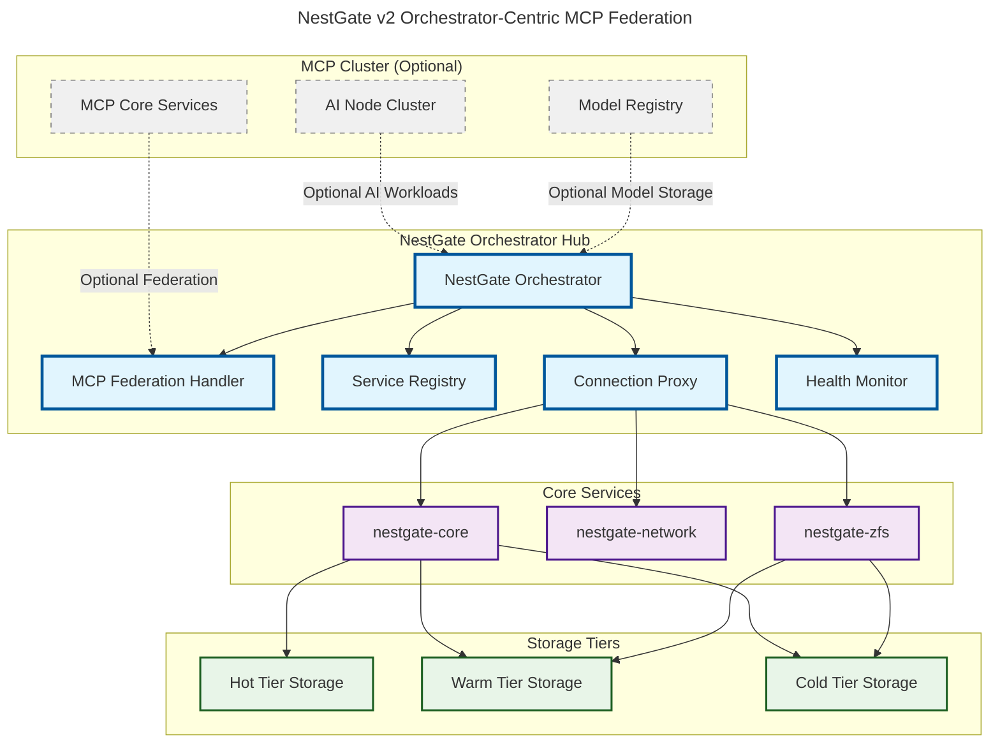
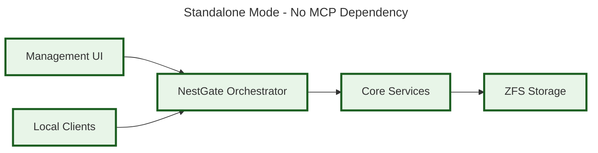
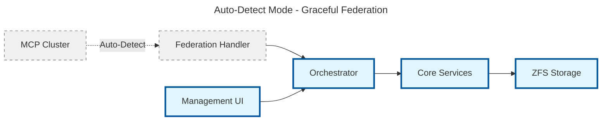
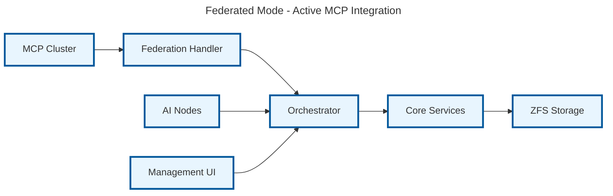
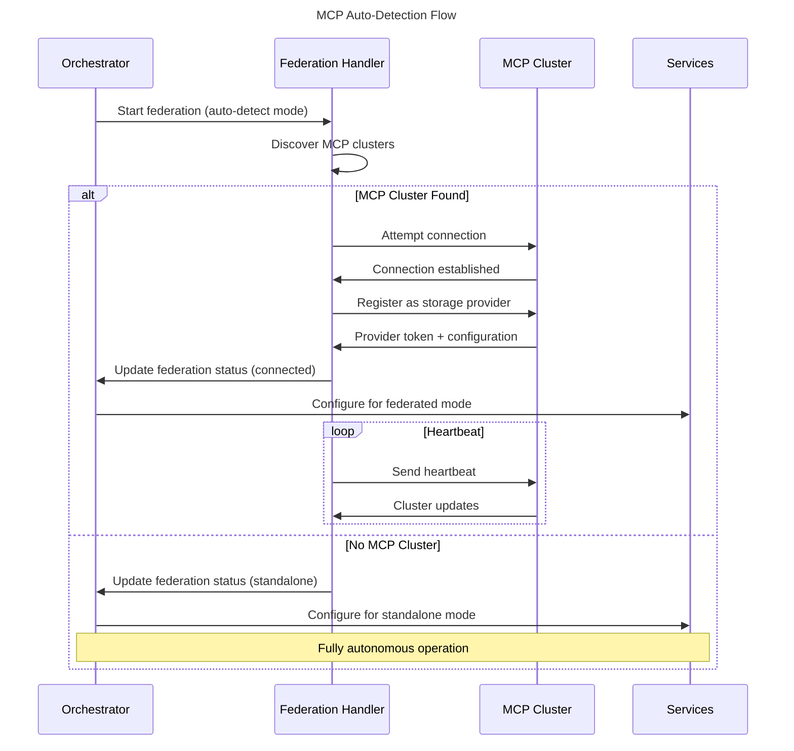
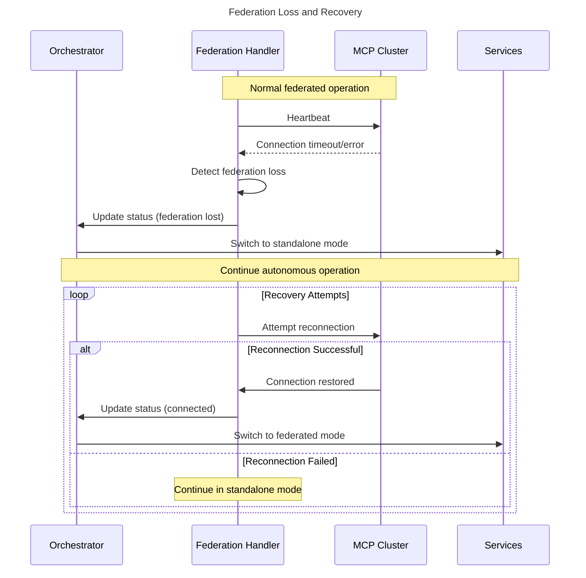
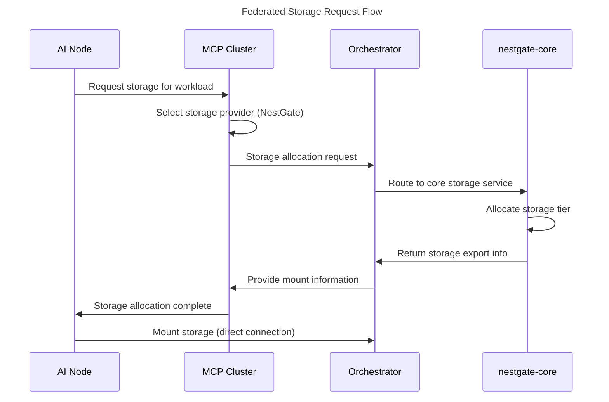

# NestGate v2 MCP Federation Integration

## v2 Architectural Transformation

**v1 → v2 Evolution:**
- Required MCP dependency → **Optional MCP Federation**
- Direct MCP integration → **Orchestrator-mediated federation**
- Always-on MCP connection → **Auto-detect with graceful degradation**
- Hardcoded MCP endpoints → **Dynamic discovery and failover**

## Overview

NestGate v2 implements **optional MCP federation** through the orchestrator, providing seamless integration with MCP clusters when available while maintaining **full sovereign operation** when not. The orchestrator manages all MCP connectivity, allowing the system to operate in standalone mode by default and gracefully upgrade to federated mode when MCP clusters are detected.

## Federation Architecture



## Federation Modes

### 1. Standalone Mode (Default)
```yaml
mode: standalone
mcp_integration: disabled
dependencies: NONE
operation: fully_autonomous
description: "Default sovereign operation without external dependencies"
```



### 2. Auto-Detect Mode (Hybrid)
```yaml
mode: auto_detect
mcp_integration: auto_detect
dependencies: optional_mcp
operation: hybrid_autonomous
description: "Attempt MCP connection, fallback to standalone"
```



### 3. Federated Mode (Active)
```yaml
mode: federated
mcp_integration: active
dependencies: mcp_cluster
operation: cluster_participant
description: "Active MCP cluster participation with standalone fallback"
```



## Orchestrator MCP Federation API

### Federation Management Endpoints
```yaml
orchestrator_federation_api:
  federation_status:
    path: "/api/federation/status"
    method: "GET"
    purpose: "Get current federation status and mode"
    authentication: "orchestrator_token"
    returns:
      mode: "standalone|auto_detect|federated"
      status: "disabled|detecting|connected|error"
      mcp_info: "MCP cluster information if connected"
  
  federation_config:
    path: "/api/federation/config"
    method: "POST/PUT"
    purpose: "Configure federation mode and settings"
    authentication: "orchestrator_token"
    parameters:
      mode: "Federation mode to set"
      auto_detect_interval: "Auto-detection frequency"
      mcp_endpoints: "Known MCP cluster endpoints"
    returns:
      status: "Configuration status"
      effective_mode: "Currently active federation mode"
  
  mcp_discovery:
    path: "/api/federation/discover"
    method: "POST"
    purpose: "Manually trigger MCP cluster discovery"
    authentication: "orchestrator_token"
    returns:
      discovered_clusters: "List of discovered MCP clusters"
      connection_status: "Status of connection attempts"
```

### Storage Provider Registration (When Federated)
```yaml
mcp_provider_registration:
  register_storage_node:
    path: "/mcp/v1/providers/storage/register"
    method: "POST"
    purpose: "Register NestGate as storage provider with MCP cluster"
    parameters:
      node_id: "Unique NestGate instance identifier"
      capabilities: "Storage tiers and capacities"
      endpoints: "Orchestrator endpoint information"
      protocols: "Supported storage protocols"
    returns:
      provider_token: "MCP provider authentication token"
      provider_id: "Assigned provider identifier"
      heartbeat_interval: "Required heartbeat frequency"
```

## Federation Implementation

### MCP Federation Handler
```rust
use std::time::Duration;
use tokio::time::interval;
use serde::{Deserialize, Serialize};

#[derive(Debug, Clone)]
pub struct McpFederation {
    orchestrator: Arc<Orchestrator>,
    federation_mode: FederationMode,
    mcp_client: Option<McpClient>,
    heartbeat_interval: Duration,
}

#[derive(Debug, Clone, Serialize, Deserialize)]
pub enum FederationMode {
    Standalone,        // No MCP integration
    AutoDetect,        // Attempt MCP connection, fallback to standalone
    Federated,         // Active MCP cluster participation
}

#[derive(Debug, Clone, Serialize, Deserialize)]
pub enum FederationStatus {
    Disabled,          // Standalone mode
    Detecting,         // Auto-detecting MCP clusters
    Connected,         // Successfully connected to MCP cluster
    Error(String),     // Connection or federation error
}

impl McpFederation {
    pub async fn new(orchestrator: Arc<Orchestrator>, mode: FederationMode) -> Self {
        Self {
            orchestrator,
            federation_mode: mode,
            mcp_client: None,
            heartbeat_interval: Duration::from_secs(30),
        }
    }
    
    pub async fn start(&mut self) -> Result<(), FederationError> {
        match self.federation_mode {
            FederationMode::Standalone => {
                info!("Starting in standalone mode - no MCP integration");
                Ok(())
            }
            FederationMode::AutoDetect => {
                info!("Starting in auto-detect mode - attempting MCP discovery");
                self.auto_detect_and_connect().await
            }
            FederationMode::Federated => {
                info!("Starting in federated mode - connecting to MCP cluster");
                self.connect_to_mcp().await
            }
        }
    }
    
    async fn auto_detect_and_connect(&mut self) -> Result<(), FederationError> {
        match self.discover_mcp_clusters().await {
            Ok(clusters) if !clusters.is_empty() => {
                info!("Discovered {} MCP cluster(s), attempting connection", clusters.len());
                self.connect_to_best_cluster(clusters).await
            }
            Ok(_) => {
                warn!("No MCP clusters discovered, falling back to standalone mode");
                self.federation_mode = FederationMode::Standalone;
                Ok(())
            }
            Err(e) => {
                warn!("MCP discovery failed: {}, falling back to standalone mode", e);
                self.federation_mode = FederationMode::Standalone;
                Ok(())
            }
        }
    }
    
    async fn discover_mcp_clusters(&self) -> Result<Vec<McpClusterInfo>, FederationError> {
        // Implement MCP cluster discovery logic
        // Try known MCP endpoints
        // Use mDNS/DNS-SD for local discovery
        // Check for MCP service announcements
        todo!()
    }
    
    async fn connect_to_mcp(&mut self) -> Result<(), FederationError> {
        // Establish connection to MCP cluster
        // Register as storage provider
        // Start heartbeat mechanism
        // Handle authentication and authorization
        todo!()
    }
    
    pub async fn handle_federation_loss(&mut self) {
        warn!("MCP federation connection lost, degrading to standalone mode");
        self.mcp_client = None;
        self.federation_mode = FederationMode::Standalone;
        
        // Update orchestrator registry
        if let Err(e) = self.orchestrator.update_federation_status(FederationStatus::Disabled).await {
            error!("Failed to update federation status: {}", e);
        }
        
        // Continue autonomous operation
        info!("Now operating in autonomous standalone mode");
    }
    
    pub async fn get_status(&self) -> FederationStatus {
        match &self.mcp_client {
            Some(client) if client.is_connected() => FederationStatus::Connected,
            Some(_) => FederationStatus::Error("Connection lost".to_string()),
            None => match self.federation_mode {
                FederationMode::Standalone => FederationStatus::Disabled,
                FederationMode::AutoDetect => FederationStatus::Detecting,
                FederationMode::Federated => FederationStatus::Error("Not connected".to_string()),
            }
        }
    }
}
```

### Storage Provider Interface (When Federated)
```rust
#[derive(Debug, Serialize, Deserialize)]
pub struct StorageProviderRegistration {
    pub node_id: String,
    pub orchestrator_endpoint: String,
    pub capabilities: StorageCapabilities,
    pub protocols: Vec<String>,
    pub network_info: NetworkInfo,
}

#[derive(Debug, Serialize, Deserialize)]
pub struct StorageCapabilities {
    pub total_capacity: u64,
    pub available_capacity: u64,
    pub storage_tiers: HashMap<String, TierCapabilities>,
    pub max_concurrent_connections: u32,
    pub supported_operations: Vec<String>,
}

#[derive(Debug, Serialize, Deserialize)]
pub struct TierCapabilities {
    pub capacity: u64,
    pub performance: PerformanceMetrics,
    pub compression: bool,
    pub encryption: bool,
}

impl McpStorageProvider {
    pub async fn register_with_mcp(&self, mcp_endpoint: &str) -> Result<String, McpError> {
        let registration = StorageProviderRegistration {
            node_id: self.generate_node_id(),
            orchestrator_endpoint: format!("http://{}:8080", self.local_ip()),
            capabilities: self.get_capabilities().await?,
            protocols: vec!["nfs".to_string(), "smb".to_string(), "http".to_string()],
            network_info: self.get_network_info().await?,
        };
        
        let response = self.mcp_client
            .post("/mcp/v1/providers/storage/register")
            .json(&registration)
            .send()
            .await?;
            
        let provider_token: String = response.json::<ProviderResponse>().await?.token;
        Ok(provider_token)
    }
    
    pub async fn provide_storage_export(&self, request: StorageExportRequest) -> Result<StorageExport, McpError> {
        // Route through orchestrator to appropriate storage service
        let export_request = self.orchestrator
            .route_request("/api/storage/exports", request.into())
            .await?;
            
        // Return MCP-compatible export information
        Ok(StorageExport {
            export_id: export_request.export_id,
            mount_endpoint: format!("{}:{}", self.local_ip(), export_request.port),
            access_credentials: export_request.credentials,
            protocol: export_request.protocol,
        })
    }
}
```

## Federation Workflow Patterns

### Auto-Detection and Connection Flow


### Graceful Degradation Flow


### Storage Request Routing (Federated Mode)


## Configuration Examples

### Standalone Configuration (Default)
```yaml
nestgate_config:
  orchestrator:
    port: 8080
    federation:
      mode: standalone
      mcp_integration: disabled
  
  services:
    auto_register: true
    health_check_interval: 30
  
  storage:
    autonomous_operation: true
    external_dependencies: none
```

### Auto-Detect Configuration
```yaml
nestgate_config:
  orchestrator:
    port: 8080
    federation:
      mode: auto_detect
      discovery_interval: 300  # 5 minutes
      known_mcp_endpoints:
        - "https://mcp-cluster-1.local:8443"
        - "https://mcp-cluster-2.local:8443"
      fallback_mode: standalone
  
  mcp_federation:
    heartbeat_interval: 30
    connection_timeout: 10
    retry_attempts: 3
    graceful_degradation: true
```

### Federated Configuration
```yaml
nestgate_config:
  orchestrator:
    port: 8080
    federation:
      mode: federated
      mcp_endpoint: "https://mcp-cluster.example.com:8443"
      provider_id: "nestgate-storage-001"
      auto_reconnect: true
  
  mcp_federation:
    heartbeat_interval: 30
    registration_retry: true
    cluster_failover: true
    standalone_fallback: true
```

## Security Considerations

### Federation Security
```yaml
security_model:
  authentication:
    mcp_provider_tokens: "JWT-based provider authentication"
    token_rotation: "Automatic token refresh"
    mutual_tls: "mTLS for MCP cluster communication"
  
  authorization:
    storage_permissions: "Fine-grained storage access control"
    ai_node_isolation: "Workload isolation and resource limits"
    cluster_policies: "MCP cluster-wide policy enforcement"
  
  network_security:
    encrypted_communication: "TLS 1.3 for all MCP traffic"
    network_segmentation: "VLAN isolation for federated traffic"
    firewall_integration: "Automatic firewall rule management"
```

### Autonomous Security (Standalone)
```yaml
standalone_security:
  local_authentication: "Local user management and API keys"
  service_isolation: "Container/process isolation for services"
  storage_encryption: "ZFS native encryption at rest"
  network_security: "Local firewall and access controls"
```

## Testing and Validation

### Federation Testing Scenarios
```yaml
test_scenarios:
  standalone_operation:
    - "System starts and operates without MCP cluster"
    - "All storage operations function autonomously"
    - "No external dependencies required"
  
  auto_detection:
    - "Discovers available MCP clusters"
    - "Successfully connects to best cluster"
    - "Falls back to standalone when no clusters found"
  
  federation_active:
    - "Registers as storage provider with MCP"
    - "Serves storage requests from AI nodes"
    - "Maintains heartbeat with MCP cluster"
  
  graceful_degradation:
    - "Detects MCP cluster connection loss"
    - "Switches to standalone mode automatically"
    - "Continues serving local storage requests"
    - "Attempts reconnection periodically"
  
  recovery:
    - "Reconnects to MCP cluster when available"
    - "Re-registers as storage provider"
    - "Resumes federated operation"
```

## Summary

The NestGate v2 MCP federation integration represents a **sophisticated balance** between **autonomous operation** and **cluster participation**:

### Key Achievements
- **Sovereign First**: Default standalone operation with zero dependencies
- **Optional Federation**: MCP integration when beneficial, not required
- **Graceful Degradation**: Seamless fallback to autonomous mode
- **Orchestrator-Mediated**: All federation through central orchestrator
- **Production Ready**: Robust error handling and recovery mechanisms

### Federation Capabilities
- ✅ **Auto-detection** of MCP clusters
- ✅ **Graceful connection** and registration
- ✅ **Autonomous fallback** when federation unavailable
- ✅ **Seamless recovery** when clusters become available
- ✅ **Centralized management** through orchestrator

The v2 federation model successfully delivers **true sovereignty** while enabling optional **MCP cluster participation** when strategically advantageous. 