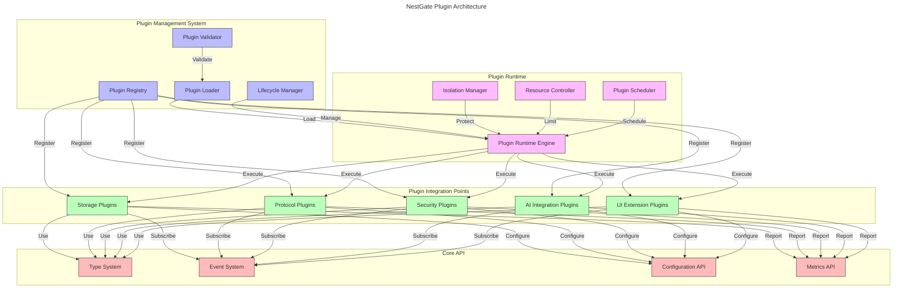

# NestGate Plugin Architecture

## Overview

The NestGate Plugin Architecture provides a comprehensive framework for extending and customizing NestGate functionality through plugins. This extensibility allows third-party developers, AI framework integrators, and enterprise users to adapt NestGate to specific requirements while maintaining core stability and security. The architecture emphasizes type safety, performance, and scalability.

## Plugin System Architecture



## Plugin Types and Integration Points

### Storage Plugins

```yaml
storage_plugins:
  description: "Extensions for storage subsystems and data management"
  integration_points:
    - name: "Data Tier Management"
      capabilities:
        - "Custom tier implementation"
        - "Data movement policies"
        - "Tier-specific optimizations"
        - "Custom storage backends"
      api_interfaces:
        - "StorageTierManager"
        - "DataMovementPolicy"
        - "TierOptimizer"
        - "StorageBackend"
      
    - name: "Data Transformation"
      capabilities:
        - "Custom compression algorithms"
        - "Data deduplication methods"
        - "Encryption extensions"
        - "Data format conversion"
      api_interfaces:
        - "CompressionProvider"
        - "DeduplicationEngine"
        - "EncryptionProvider"
        - "DataTransformer"
      
    - name: "Dataset Optimization"
      capabilities:
        - "AI dataset format optimization"
        - "Dataset indexing strategies"
        - "Custom caching policies"
        - "Access pattern optimization"
      api_interfaces:
        - "DatasetOptimizer"
        - "IndexingStrategy"
        - "CachingPolicy"
        - "AccessPatternOptimizer"
```

### Protocol Plugins

```yaml
protocol_plugins:
  description: "Extensions for storage protocols and data access methods"
  integration_points:
    - name: "Protocol Implementation"
      capabilities:
        - "New protocol support"
        - "Protocol extensions"
        - "Custom authentication handlers"
        - "Client adapters"
      api_interfaces:
        - "ProtocolHandler"
        - "ProtocolExtension"
        - "AuthenticationAdapter"
        - "ClientAdapter"
      
    - name: "Protocol Optimization"
      capabilities:
        - "Custom tuning strategies"
        - "Protocol-specific caching"
        - "Connection management"
        - "Protocol translation"
      api_interfaces:
        - "ProtocolTuner"
        - "ProtocolCache"
        - "ConnectionManager"
        - "ProtocolTranslator"
      
    - name: "Access Control Extensions"
      capabilities:
        - "Custom ACL implementations"
        - "Permission mapping"
        - "Quota enforcement"
        - "Audit logging"
      api_interfaces:
        - "AccessControlProvider"
        - "PermissionMapper"
        - "QuotaEnforcer"
        - "AuditLogger"
```

### AI Integration Plugins

```yaml
ai_integration_plugins:
  description: "Extensions for AI framework integration and optimization"
  integration_points:
    - name: "Framework Integration"
      capabilities:
        - "ML framework connectors"
        - "Training pipeline integration"
        - "Model repository extensions"
        - "Inference optimization"
      api_interfaces:
        - "FrameworkConnector"
        - "TrainingPipelineAdapter"
        - "ModelRepositoryExtension"
        - "InferenceOptimizer"
      
    - name: "Dataset Management"
      capabilities:
        - "Custom dataset formats"
        - "Dataset transformation"
        - "Feature extraction"
        - "Dataset versioning"
      api_interfaces:
        - "DatasetFormatHandler"
        - "DatasetTransformer"
        - "FeatureExtractor"
        - "VersioningStrategy"
      
    - name: "Workload Optimization"
      capabilities:
        - "Training workload detection"
        - "Auto-tuning for models"
        - "Resource allocation strategies"
        - "Distributed training support"
      api_interfaces:
        - "WorkloadDetector"
        - "AutoTuner"
        - "ResourceAllocator"
        - "DistributedTrainingSupport"
```

### Security Plugins

```yaml
security_plugins:
  description: "Extensions for security, authentication, and encryption"
  integration_points:
    - name: "Authentication Providers"
      capabilities:
        - "Identity provider integration"
        - "Multi-factor authentication"
        - "Token management"
        - "Certificate handling"
      api_interfaces:
        - "IdentityProvider"
        - "MfaProvider"
        - "TokenManager"
        - "CertificateManager"
      
    - name: "Encryption Extensions"
      capabilities:
        - "Custom encryption algorithms"
        - "Key management integration"
        - "Hardware security module support"
        - "Encrypted dataset management"
      api_interfaces:
        - "EncryptionAlgorithm"
        - "KeyManager"
        - "HsmIntegration"
        - "EncryptedDatasetManager"
      
    - name: "Security Policy"
      capabilities:
        - "Custom policy enforcement"
        - "Compliance checking"
        - "Security monitoring"
        - "Threat detection"
      api_interfaces:
        - "PolicyEnforcer"
        - "ComplianceChecker"
        - "SecurityMonitor"
        - "ThreatDetector"
```

### UI Extension Plugins

```yaml
ui_plugins:
  description: "Extensions for user interface and experience"
  integration_points:
    - name: "Dashboard Widgets"
      capabilities:
        - "Custom dashboard components"
        - "Visualization extensions"
        - "Status indicators"
        - "Interactive controls"
      api_interfaces:
        - "DashboardWidget"
        - "VisualizationProvider"
        - "StatusIndicator"
        - "ControlPanel"
      
    - name: "Management Extensions"
      capabilities:
        - "Custom management views"
        - "Configuration wizards"
        - "Reporting tools"
        - "System monitoring"
      api_interfaces:
        - "ManagementView"
        - "ConfigurationWizard"
        - "ReportGenerator"
        - "MonitoringView"
      
    - name: "AI Workflow UI"
      capabilities:
        - "Training management interfaces"
        - "Model visualization"
        - "Dataset exploration tools"
        - "Performance analysis views"
      api_interfaces:
        - "TrainingManager"
        - "ModelVisualizer"
        - "DatasetExplorer"
        - "PerformanceAnalyzer"
```

## Plugin System API

### Core Type System

```rust
/// Plugin definition trait
pub trait Plugin: Send + Sync {
    /// Get plugin metadata
    fn metadata(&self) -> PluginMetadata;
    
    /// Initialize the plugin
    fn initialize(&mut self, context: &PluginContext) -> Result<(), PluginError>;
    
    /// Shutdown the plugin
    fn shutdown(&mut self) -> Result<(), PluginError>;
    
    /// Get plugin capabilities
    fn capabilities(&self) -> Vec<PluginCapability>;
}

/// Plugin metadata structure
#[derive(Clone, Debug)]
pub struct PluginMetadata {
    /// Plugin identifier
    pub id: String,
    
    /// Plugin name
    pub name: String,
    
    /// Plugin version
    pub version: Version,
    
    /// Plugin description
    pub description: String,
    
    /// Plugin author
    pub author: String,
    
    /// Plugin homepage URL
    pub homepage: Option<String>,
    
    /// Plugin repository URL
    pub repository: Option<String>,
    
    /// Plugin license
    pub license: String,
}

/// Plugin capability
#[derive(Clone, Debug)]
pub enum PluginCapability {
    /// Storage plugin capability
    Storage(StorageCapability),
    
    /// Protocol plugin capability
    Protocol(ProtocolCapability),
    
    /// AI integration capability
    AiIntegration(AiIntegrationCapability),
    
    /// Security capability
    Security(SecurityCapability),
    
    /// UI extension capability
    UiExtension(UiExtensionCapability),
}
```

### Plugin Lifecycle Management

```rust
/// Plugin registry for managing available plugins
pub struct PluginRegistry {
    /// Registered plugins
    plugins: HashMap<String, PluginRegistration>,
    
    /// Plugin capability index
    capability_index: HashMap<PluginCapabilityType, Vec<String>>,
    
    /// Plugin validator
    validator: PluginValidator,
}

impl PluginRegistry {
    /// Create a new plugin registry
    pub fn new(config: PluginRegistryConfig) -> Self {
        // Implementation details
        // ...
    }
    
    /// Register a plugin
    pub fn register_plugin(
        &mut self,
        plugin: Box<dyn Plugin>,
    ) -> Result<(), PluginRegistrationError> {
        // Implementation details
        // ...
    }
    
    /// Get a plugin by ID
    pub fn get_plugin(
        &self,
        plugin_id: &str,
    ) -> Result<&PluginRegistration, PluginLookupError> {
        // Implementation details
        // ...
    }
    
    /// Find plugins with specific capability
    pub fn find_plugins_with_capability(
        &self,
        capability_type: PluginCapabilityType,
    ) -> Vec<&PluginRegistration> {
        // Implementation details
        // ...
    }
}

/// Plugin loader
pub struct PluginLoader {
    /// Plugin load paths
    load_paths: Vec<PathBuf>,
    
    /// Plugin validator
    validator: PluginValidator,
    
    /// Loaded plugin libraries
    libraries: HashMap<String, PluginLibrary>,
}

impl PluginLoader {
    /// Create a new plugin loader
    pub fn new(config: PluginLoaderConfig) -> Self {
        // Implementation details
        // ...
    }
    
    /// Discover available plugins
    pub async fn discover_plugins(&mut self) -> Result<Vec<PluginMetadata>, PluginDiscoveryError> {
        // Implementation details
        // ...
    }
    
    /// Load a plugin by ID
    pub async fn load_plugin(
        &mut self,
        plugin_id: &str,
    ) -> Result<Box<dyn Plugin>, PluginLoadError> {
        // Implementation details
        // ...
    }
}
```

### Plugin Runtime

```rust
/// Plugin runtime for executing plugins
pub struct PluginRuntime {
    /// Resource controller
    resource_controller: PluginResourceController,
    
    /// Isolation manager
    isolation_manager: PluginIsolationManager,
    
    /// Plugin scheduler
    scheduler: PluginScheduler,
    
    /// Runtime state
    state: PluginRuntimeState,
}

impl PluginRuntime {
    /// Create a new plugin runtime
    pub fn new(config: PluginRuntimeConfig) -> Self {
        // Implementation details
        // ...
    }
    
    /// Start the plugin runtime
    pub async fn start(&mut self) -> Result<(), PluginRuntimeError> {
        // Implementation details
        // ...
    }
    
    /// Execute a plugin function
    pub async fn execute<T, R>(
        &self,
        plugin_id: &str,
        func: impl FnOnce(&dyn Plugin) -> Result<R, T>,
    ) -> Result<R, PluginExecutionError<T>> {
        // Implementation details
        // ...
    }
    
    /// Set resource limits for a plugin
    pub async fn set_resource_limits(
        &mut self,
        plugin_id: &str,
        limits: PluginResourceLimits,
    ) -> Result<(), PluginResourceError> {
        // Implementation details
        // ...
    }
}

/// Plugin isolation manager
pub struct PluginIsolationManager {
    /// Isolation level
    isolation_level: IsolationLevel,
    
    /// Isolation contexts
    contexts: HashMap<String, IsolationContext>,
}

impl PluginIsolationManager {
    /// Create a new isolation manager
    pub fn new(config: IsolationConfig) -> Self {
        // Implementation details
        // ...
    }
    
    /// Create an isolation context for a plugin
    pub async fn create_context(
        &mut self,
        plugin_id: &str,
    ) -> Result<IsolationContextId, IsolationError> {
        // Implementation details
        // ...
    }
    
    /// Execute a function within an isolation context
    pub async fn execute_isolated<T, R>(
        &self,
        context_id: IsolationContextId,
        func: impl FnOnce() -> Result<R, T>,
    ) -> Result<R, IsolationExecutionError<T>> {
        // Implementation details
        // ...
    }
}
```

### Event System

```rust
/// Event system for plugin communication
pub struct EventSystem {
    /// Event bus
    event_bus: EventBus,
    
    /// Subscription manager
    subscription_manager: SubscriptionManager,
    
    /// Event publishers
    publishers: HashMap<EventType, Vec<PublisherId>>,
}

impl EventSystem {
    /// Create a new event system
    pub fn new(config: EventSystemConfig) -> Self {
        // Implementation details
        // ...
    }
    
    /// Register a publisher
    pub async fn register_publisher(
        &mut self,
        plugin_id: &str,
        event_types: &[EventType],
    ) -> Result<PublisherId, EventRegistrationError> {
        // Implementation details
        // ...
    }
    
    /// Subscribe to events
    pub async fn subscribe(
        &mut self,
        plugin_id: &str,
        event_types: &[EventType],
        callback: EventCallback,
    ) -> Result<SubscriptionId, SubscriptionError> {
        // Implementation details
        // ...
    }
    
    /// Publish an event
    pub async fn publish(
        &self,
        publisher_id: PublisherId,
        event: Event,
    ) -> Result<(), PublishError> {
        // Implementation details
        // ...
    }
}

/// Event callback type
pub type EventCallback = Box<dyn Fn(Event) -> BoxFuture<'static, Result<(), EventHandlingError>> + Send + Sync>;

/// Event structure
#[derive(Clone, Debug)]
pub struct Event {
    /// Event ID
    pub id: EventId,
    
    /// Event type
    pub event_type: EventType,
    
    /// Event timestamp
    pub timestamp: DateTime<Utc>,
    
    /// Event source
    pub source: String,
    
    /// Event payload
    pub payload: EventPayload,
}
```

### Configuration API

```rust
/// Configuration system for plugins
pub struct ConfigurationSystem {
    /// Configuration store
    store: ConfigStore,
    
    /// Schema registry
    schema_registry: SchemaRegistry,
    
    /// Change notification manager
    change_manager: ChangeNotificationManager,
}

impl ConfigurationSystem {
    /// Create a new configuration system
    pub fn new(config: ConfigSystemConfig) -> Self {
        // Implementation details
        // ...
    }
    
    /// Register a configuration schema
    pub async fn register_schema(
        &mut self,
        plugin_id: &str,
        schema: ConfigSchema,
    ) -> Result<SchemaId, SchemaRegistrationError> {
        // Implementation details
        // ...
    }
    
    /// Get plugin configuration
    pub async fn get_config(
        &self,
        plugin_id: &str,
    ) -> Result<PluginConfig, ConfigRetrievalError> {
        // Implementation details
        // ...
    }
    
    /// Update plugin configuration
    pub async fn update_config(
        &mut self,
        plugin_id: &str,
        config: PluginConfig,
    ) -> Result<(), ConfigUpdateError> {
        // Implementation details
        // ...
    }
    
    /// Subscribe to configuration changes
    pub async fn subscribe_to_changes(
        &mut self,
        plugin_id: &str,
        callback: ConfigChangeCallback,
    ) -> Result<SubscriptionId, SubscriptionError> {
        // Implementation details
        // ...
    }
}

/// Configuration change callback
pub type ConfigChangeCallback = Box<dyn Fn(ConfigChange) -> BoxFuture<'static, Result<(), ConfigChangeHandlingError>> + Send + Sync>;

/// Configuration change
#[derive(Clone, Debug)]
pub struct ConfigChange {
    /// Change ID
    pub id: ChangeId,
    
    /// Plugin ID
    pub plugin_id: String,
    
    /// Previous configuration
    pub previous: Option<PluginConfig>,
    
    /// New configuration
    pub new: PluginConfig,
    
    /// Timestamp
    pub timestamp: DateTime<Utc>,
}
```

## Example Plugins

### AI Framework Connector Plugin

```rust
/// TensorFlow dataset optimization plugin
pub struct TensorFlowDatasetPlugin {
    /// Plugin metadata
    metadata: PluginMetadata,
    
    /// Configuration
    config: TensorFlowConfig,
    
    /// Event subscription
    event_subscription: Option<SubscriptionId>,
    
    /// Dataset optimizer
    optimizer: TensorFlowDatasetOptimizer,
}

impl Plugin for TensorFlowDatasetPlugin {
    fn metadata(&self) -> PluginMetadata {
        self.metadata.clone()
    }
    
    fn initialize(&mut self, context: &PluginContext) -> Result<(), PluginError> {
        // Get configuration
        self.config = context.configuration().get_config("tensorflow_plugin")
            .map_err(|e| PluginError::Initialization(format!("Failed to get config: {}", e)))?;
        
        // Subscribe to dataset events
        let subscription = context.events().subscribe(
            &[EventType::DatasetCreated, EventType::DatasetAccessed],
            Box::new(|event| {
                Box::pin(async move {
                    // Handle dataset events
                    // ...
                    Ok(())
                })
            }),
        ).map_err(|e| PluginError::Initialization(format!("Failed to subscribe: {}", e)))?;
        
        self.event_subscription = Some(subscription);
        
        // Initialize optimizer
        self.optimizer = TensorFlowDatasetOptimizer::new(self.config.clone());
        
        Ok(())
    }
    
    fn shutdown(&mut self) -> Result<(), PluginError> {
        // Cleanup
        // ...
        Ok(())
    }
    
    fn capabilities(&self) -> Vec<PluginCapability> {
        vec![
            PluginCapability::AiIntegration(AiIntegrationCapability::FrameworkConnector(
                FrameworkConnectorCapability {
                    framework_name: "tensorflow".to_string(),
                    supported_versions: vec!["2.x".to_string()],
                    features: vec![
                        "dataset_optimization".to_string(),
                        "checkpoint_management".to_string(),
                        "training_metrics".to_string(),
                    ],
                }
            )),
            PluginCapability::Storage(StorageCapability::DatasetOptimization(
                DatasetOptimizationCapability {
                    supported_formats: vec!["tfrecord".to_string(), "tf_dataset".to_string()],
                    optimization_types: vec![
                        "prefetch".to_string(),
                        "caching".to_string(),
                        "parallelization".to_string(),
                    ],
                }
            )),
        ]
    }
}

impl FrameworkConnector for TensorFlowDatasetPlugin {
    // Implementation of FrameworkConnector trait
    // ...
}

impl DatasetOptimizer for TensorFlowDatasetPlugin {
    // Implementation of DatasetOptimizer trait
    // ...
}
```

### Custom Storage Tier Plugin

```rust
/// Cloud storage tier plugin
pub struct CloudStorageTierPlugin {
    /// Plugin metadata
    metadata: PluginMetadata,
    
    /// Configuration
    config: CloudStorageConfig,
    
    /// Storage backend
    backend: CloudStorageBackend,
    
    /// Migration manager
    migration_manager: MigrationManager,
}

impl Plugin for CloudStorageTierPlugin {
    fn metadata(&self) -> PluginMetadata {
        self.metadata.clone()
    }
    
    fn initialize(&mut self, context: &PluginContext) -> Result<(), PluginError> {
        // Get configuration
        self.config = context.configuration().get_config("cloud_storage_plugin")
            .map_err(|e| PluginError::Initialization(format!("Failed to get config: {}", e)))?;
        
        // Initialize cloud storage backend
        self.backend = CloudStorageBackend::new(self.config.clone())
            .map_err(|e| PluginError::Initialization(format!("Failed to initialize backend: {}", e)))?;
        
        // Initialize migration manager
        self.migration_manager = MigrationManager::new(context.clone(), self.backend.clone());
        
        Ok(())
    }
    
    fn shutdown(&mut self) -> Result<(), PluginError> {
        // Cleanup connections
        self.backend.disconnect()
            .map_err(|e| PluginError::Shutdown(format!("Failed to disconnect: {}", e)))?;
        
        Ok(())
    }
    
    fn capabilities(&self) -> Vec<PluginCapability> {
        vec![
            PluginCapability::Storage(StorageCapability::StorageBackend(
                StorageBackendCapability {
                    backend_type: "cloud_storage".to_string(),
                    supported_providers: vec!["s3".to_string(), "azure".to_string(), "gcs".to_string()],
                    features: vec![
                        "tiered_storage".to_string(),
                        "lifecycle_management".to_string(),
                        "encryption".to_string(),
                    ],
                }
            )),
            PluginCapability::Storage(StorageCapability::DataTierManagement(
                DataTierManagementCapability {
                    tier_name: "cloud".to_string(),
                    tier_type: "cold".to_string(),
                    migration_capabilities: vec![
                        "policy_based".to_string(),
                        "scheduled".to_string(),
                        "on_demand".to_string(),
                    ],
                }
            )),
        ]
    }
}

impl StorageBackend for CloudStorageTierPlugin {
    // Implementation of StorageBackend trait
    // ...
}

impl DataTierManager for CloudStorageTierPlugin {
    // Implementation of DataTierManager trait
    // ...
}
```

## Plugin Development Guidelines

```yaml
development_guidelines:
  description: "Guidelines for developing NestGate plugins"
  best_practices:
    - name: "Performance Considerations"
      guidelines:
        - "Minimize blocking operations on critical paths"
        - "Use async/await for I/O-bound operations"
        - "Implement caching for repeated operations"
        - "Profile plugin performance regularly"
        - "Use efficient data structures and algorithms"
      
    - name: "Security Guidelines"
      guidelines:
        - "Follow least privilege principle"
        - "Sanitize all inputs and validate parameters"
        - "Use secure communication channels"
        - "Protect sensitive data in memory"
        - "Implement proper logging of security events"
      
    - name: "Error Handling"
      guidelines:
        - "Provide detailed error messages"
        - "Implement proper error propagation"
        - "Use structured error types"
        - "Clean up resources on error"
        - "Log errors with appropriate context"
      
    - name: "Resource Management"
      guidelines:
        - "Implement proper cleanup in shutdown"
        - "Monitor and limit resource usage"
        - "Release resources promptly"
        - "Use connection pooling where appropriate"
        - "Implement resource throttling"
```

## Plugin Distribution and Marketplace

```yaml
plugin_distribution:
  description: "Plugin distribution and marketplace infrastructure"
  components:
    - name: "Plugin Repository"
      features:
        - "Version-controlled plugin storage"
        - "Metadata indexing and search"
        - "Digital signature verification"
        - "Dependency management"
        - "Compatibility checking"
      implementation:
        - "Git-based repository system"
        - "Semantic versioning enforcement"
        - "GPG signature verification"
        - "Compatibility matrix"
      
    - name: "Plugin Marketplace"
      features:
        - "Plugin discovery and browsing"
        - "Rating and review system"
        - "Installation and update management"
        - "License management"
        - "Developer profiles and support"
      implementation:
        - "Web-based marketplace UI"
        - "REST API for programmatic access"
        - "One-click installation"
        - "Automated update checking"
      
    - name: "Plugin Verification"
      features:
        - "Automated testing framework"
        - "Security scanning"
        - "Performance benchmarking"
        - "API compatibility checking"
        - "Documentation verification"
      implementation:
        - "CI/CD pipeline integration"
        - "Vulnerability scanning"
        - "Performance regression testing"
        - "API contract validation"
```

## Implementation Phases

```yaml
implementation_phases:
  - phase: "1 - Core Plugin Architecture"
    description: "Implement the fundamental plugin system"
    deliverables:
      - "Plugin type system"
      - "Plugin registry"
      - "Plugin loader"
      - "Basic plugin runtime"
    estimated_effort: "3 sprints"
    
  - phase: "2 - Integration Points"
    description: "Implement plugin integration points"
    deliverables:
      - "Storage integration points"
      - "Protocol integration points"
      - "AI integration points"
      - "Core API interfaces"
    estimated_effort: "4 sprints"
    
  - phase: "3 - Runtime and Security"
    description: "Enhance plugin runtime and security"
    deliverables:
      - "Resource control system"
      - "Isolation mechanisms"
      - "Security validation"
      - "Performance monitoring"
    estimated_effort: "3 sprints"
    
  - phase: "4 - Plugin SDK"
    description: "Develop plugin SDK and development tools"
    deliverables:
      - "Plugin SDK"
      - "Development templates"
      - "Testing framework"
      - "Documentation generator"
    estimated_effort: "2 sprints"
    
  - phase: "5 - Marketplace"
    description: "Implement plugin distribution and marketplace"
    deliverables:
      - "Plugin repository"
      - "Marketplace UI"
      - "Plugin verification system"
      - "Installation and update system"
    estimated_effort: "3 sprints"
```

## Technical Metadata
- Category: Extensibility
- Priority: Medium
- Owner: DataScienceBioLab
- Dependencies:
  - Core NestGate API
  - Plugin runtime libraries
  - Dynamic loading system
  - Security sandbox implementation
- Validation Requirements:
  - Plugin isolation testing
  - Performance impact testing
  - API compatibility verification
  - Security validation 