# NestGate Expanded Protocol Support

## Overview

The NestGate Expanded Protocol Support specification defines a comprehensive framework for storage protocol implementation with a focus on AI workload optimization. While maintaining NFS as the primary protocol, this specification outlines additional protocol support and advanced optimization techniques for maximum performance and compatibility across diverse AI deployment scenarios.

## Protocol Architecture

```mermaid
---
title: Multi-Protocol Architecture
---
graph TD
    subgraph "Protocol Management Layer"
        PM_Registry[Protocol Registry]
        PM_Factory[Protocol Handler Factory]
        PM_Coordinator[Protocol Coordinator]
        PM_Monitor[Protocol Monitor]
    end
    
    subgraph "Protocol Implementations"
        subgraph "Primary Protocols"
            P_NFS[NFS Protocol]
            P_SMB[SMB Protocol]
            P_iSCSI[iSCSI Protocol]
        end
        
        subgraph "Secondary Protocols"
            S_S3[S3 Compatible]
            S_WebDAV[WebDAV]
            S_FTP[FTP]
        end
    end
    
    subgraph "Core Services"
        CS_AuthSvc[Authentication Service]
        CS_AccessControl[Access Control]
        CS_VFS[Virtual File System]
        CS_PoolMgr[Storage Pool Manager]
    end
    
    subgraph "Optimization Framework"
        OF_Profiler[Protocol Profiler]
        OF_Tuner[Protocol Tuner]
        OF_AIWorkload[AI Workload Detector]
        OF_MetricCollector[Metric Collector]
    end
    
    PM_Registry -->|Register| P_NFS
    PM_Registry -->|Register| P_SMB
    PM_Registry -->|Register| P_iSCSI
    PM_Registry -->|Register| S_S3
    PM_Registry -->|Register| S_WebDAV
    PM_Registry -->|Register| S_FTP
    
    PM_Factory -->|Create| P_NFS
    PM_Factory -->|Create| P_SMB
    PM_Factory -->|Create| P_iSCSI
    PM_Factory -->|Create| S_S3
    PM_Factory -->|Create| S_WebDAV
    PM_Factory -->|Create| S_FTP
    
    PM_Coordinator -->|Coordinate| P_NFS
    PM_Coordinator -->|Coordinate| P_SMB
    PM_Coordinator -->|Coordinate| P_iSCSI
    PM_Coordinator -->|Coordinate| S_S3
    PM_Coordinator -->|Coordinate| S_WebDAV
    PM_Coordinator -->|Coordinate| S_FTP
    
    PM_Monitor -->|Monitor| P_NFS
    PM_Monitor -->|Monitor| P_SMB
    PM_Monitor -->|Monitor| P_iSCSI
    PM_Monitor -->|Monitor| S_S3
    PM_Monitor -->|Monitor| S_WebDAV
    PM_Monitor -->|Monitor| S_FTP
    
    P_NFS -->|Use| CS_AuthSvc
    P_NFS -->|Use| CS_AccessControl
    P_NFS -->|Use| CS_VFS
    P_NFS -->|Use| CS_PoolMgr
    
    P_SMB -->|Use| CS_AuthSvc
    P_SMB -->|Use| CS_AccessControl
    P_SMB -->|Use| CS_VFS
    P_SMB -->|Use| CS_PoolMgr
    
    P_iSCSI -->|Use| CS_AuthSvc
    P_iSCSI -->|Use| CS_AccessControl
    P_iSCSI -->|Use| CS_PoolMgr
    
    S_S3 -->|Use| CS_AuthSvc
    S_S3 -->|Use| CS_AccessControl
    S_S3 -->|Use| CS_VFS
    S_S3 -->|Use| CS_PoolMgr
    
    OF_Profiler -->|Profile| P_NFS
    OF_Profiler -->|Profile| P_SMB
    OF_Profiler -->|Profile| P_iSCSI
    
    OF_AIWorkload -->|Analyze| OF_Profiler
    OF_AIWorkload -->|Configure| OF_Tuner
    
    OF_Tuner -->|Optimize| P_NFS
    OF_Tuner -->|Optimize| P_SMB
    OF_Tuner -->|Optimize| P_iSCSI
    
    OF_MetricCollector -->|Collect| P_NFS
    OF_MetricCollector -->|Collect| P_SMB
    OF_MetricCollector -->|Collect| P_iSCSI
    
    classDef mgmt fill:#bbf,stroke:#333,stroke-width:1px;
    classDef primary fill:#bfb,stroke:#333,stroke-width:1px;
    classDef secondary fill:#fbf,stroke:#333,stroke-width:1px;
    classDef core fill:#fbb,stroke:#333,stroke-width:1px;
    classDef opt fill:#bff,stroke:#333,stroke-width:1px;
    
    class PM_Registry,PM_Factory,PM_Coordinator,PM_Monitor mgmt;
    class P_NFS,P_SMB,P_iSCSI primary;
    class S_S3,S_WebDAV,S_FTP secondary;
    class CS_AuthSvc,CS_AccessControl,CS_VFS,CS_PoolMgr core;
    class OF_Profiler,OF_Tuner,OF_AIWorkload,OF_MetricCollector opt;
```



## Optimized NFS Implementation

### NFS Protocol Optimization

```yaml
nfs_optimization:
  description: "Advanced NFS optimization for AI workloads"
  protocol_versions:
    - version: "NFSv3"
      features:
        - "Legacy client compatibility"
        - "Basic POSIX semantics"
        - "UDP support for specific use cases"
      optimization:
        - "TCP buffer tuning"
        - "Read/write size optimization"
        - "RPC thread pool scaling"
    
    - version: "NFSv4.1"
      features:
        - "Session management"
        - "Client delegation"
        - "Compound operations"
        - "Parallel NFS support"
      optimization:
        - "Session parameters tuning"
        - "Delegation strategies for AI data"
        - "Compound operation optimization"
        - "Client ID tracking optimization"
    
    - version: "NFSv4.2"
      features:
        - "Server-side copy"
        - "Sparse files support"
        - "Space reservation"
        - "Application data blocks"
      optimization:
        - "Copy offload for dataset duplication"
        - "Sparse file optimization for checkpoints"
        - "Space reservation for training data"
        - "Metadata caching strategies"
```

### NFS AI Workload Optimization

```yaml
nfs_ai_optimization:
  description: "NFS optimizations specific to AI training and inference patterns"
  workload_patterns:
    - name: "Training Data Loading"
      characteristics:
        - "Large sequential reads"
        - "Repeated access patterns"
        - "Epoch-based dataset traversal"
        - "Random sample selection"
      optimizations:
        - "Read-ahead buffer tuning"
        - "Client-directed prefetch"
        - "Dataset-aware caching"
        - "Access pattern detection"
      implementation:
        - "Dynamic read-ahead size adjustment"
        - "Cross-file prefetch coordination"
        - "Epoch boundary detection"
        - "Training framework integration"
    
    - name: "Checkpoint Writing"
      characteristics:
        - "Periodic large writes"
        - "Critical data durability"
        - "Versioned file patterns"
        - "Metadata-intensive operations"
      optimizations:
        - "Write coalescing strategies"
        - "Commit optimizations"
        - "Metadata transaction batching"
        - "Checkpoint-aware synchronization"
      implementation:
        - "Detected checkpoint patterns"
        - "ZFS synchronization tuning"
        - "Commit sequencing"
        - "Versioned file optimizations"
    
    - name: "Inference Serving"
      characteristics:
        - "Small, random reads"
        - "Low latency requirements"
        - "Consistent access patterns"
        - "Metadata-heavy operations"
      optimizations:
        - "Metadata caching"
        - "Low-latency read paths"
        - "Read-focused tuning"
        - "Attribute caching strategies"
      implementation:
        - "In-memory metadata caching"
        - "Direct I/O paths"
        - "Priority scheduling"
        - "Client capability negotiation"
```

### NFS Export Management

```yaml
nfs_export_management:
  description: "Enhanced NFS export configuration and management"
  export_features:
    - name: "AI-Aware Export Options"
      configuration:
        options:
          - name: "dataset_type"
            values: ["training", "inference", "checkpoint", "general"]
            effect: "Apply preset optimizations based on dataset usage"
          
          - name: "access_pattern"
            values: ["sequential", "random", "mixed"]
            effect: "Tune read-ahead and caching behavior"
          
          - name: "sync_strategy"
            values: ["standard", "checkpoint", "always", "never"]
            effect: "Control synchronization behavior for different data types"
          
          - name: "client_optimization"
            values: ["tensorflow", "pytorch", "jax", "generic"]
            effect: "Apply client-specific optimizations"
      
    - name: "Multi-Client Export Strategies"
      configuration:
        strategy_types:
          - name: "Performance Isolation"
            description: "Isolate client performance impact"
            implementation:
              - "Per-client resource limits"
              - "I/O scheduling separation"
              - "Client-specific thread pools"
          
          - name: "Collaborative Clients"
            description: "Optimize for multiple clients accessing same data"
            implementation:
              - "Cross-client cache coordination"
              - "Access pattern correlation"
              - "Read-ahead optimization across clients"
          
          - name: "Client Capability Detection"
            description: "Detect and adapt to client capabilities"
            implementation:
              - "Client feature negotiation"
              - "Client-side buffer detection"
              - "Network capability sensing"
```

## Additional Protocol Support

### SMB/CIFS Implementation

```yaml
smb_implementation:
  description: "SMB protocol implementation for Windows/macOS compatibility"
  protocol_versions:
    - version: "SMB3"
      features:
        - "Multichannel support"
        - "Transparent failover"
        - "End-to-end encryption"
        - "Directory leasing"
      optimization:
        - "Performance tuning for AI workloads"
        - "Credit management optimization"
        - "Compound protocol operations"
        - "Signing and encryption offload"
    
    - version: "SMB3.1.1"
      features:
        - "Pre-authentication integrity"
        - "AES-128-GCM encryption"
        - "Enhanced performance features"
      optimization:
        - "Encryption performance tuning"
        - "Security-performance balance"
        - "Windows client optimization"
  
  ai_workload_support:
    - name: "Windows ML Framework Support"
      features:
        - "Optimized for Windows ML workloads"
        - "DirectML integration"
        - "Windows AI platform support"
      implementation:
        - "Oplock optimization for ML data"
        - "Cache coherency tuning"
        - "Metadata leasing strategies"
    
    - name: "Mixed Linux/Windows Environment"
      features:
        - "Consistent data access across platforms"
        - "Identity mapping integration"
        - "Permission synchronization"
      implementation:
        - "ID mapping services"
        - "ACL translation"
        - "Cross-protocol security"
```

### iSCSI Implementation

```yaml
iscsi_implementation:
  description: "Block-level access for specialized AI workloads"
  features:
    - name: "Target Implementation"
      capabilities:
        - "LIO target subsystem integration"
        - "SCSI command handling"
        - "Multiple backstore support"
        - "TPG management"
      implementation:
        - "ZFS zvol integration"
        - "Thin provisioning support"
        - "UNMAP/TRIM command support"
        - "XCOPY implementation"
    
    - name: "AI Block Storage Optimization"
      capabilities:
        - "Optimized block size for AI workloads"
        - "Prefetch strategies for sequential access"
        - "Checkpoint-aware caching"
        - "I/O scheduler tuning"
      implementation:
        - "Access pattern detection"
        - "Workload-based queue depth"
        - "Command prioritization"
        - "ATS/WRITE_SAME support"
    
    - name: "Multi-Path Support"
      capabilities:
        - "ALUA implementation"
        - "Asymmetric access reporting"
        - "Path group management"
        - "Automatic failover support"
      implementation:
        - "ALUA target port groups"
        - "State change notifications"
        - "Preferred path designation"
        - "Load balancing support"
```

### S3-Compatible API

```yaml
s3_implementation:
  description: "S3-compatible object storage for AI dataset management"
  features:
    - name: "Core S3 Compatibility"
      capabilities:
        - "Bucket operations"
        - "Object CRUD operations"
        - "Multi-part uploads"
        - "Basic access control"
      implementation:
        - "ZFS backend integration"
        - "Metadata mapping"
        - "Object/dataset correlation"
        - "S3 signature verification"
    
    - name: "AI Dataset Features"
      capabilities:
        - "Dataset versioning"
        - "Immutable snapshots"
        - "Training metadata tagging"
        - "Performance-optimized access"
      implementation:
        - "ZFS snapshot integration"
        - "Extended attribute mapping"
        - "Training metadata in object tags"
        - "Optimized access patterns"
    
    - name: "ML Framework Integration"
      capabilities:
        - "Direct framework access patterns"
        - "Data loading optimization"
        - "Checkpoint storage strategies"
        - "Distributed training support"
      implementation:
        - "Framework-specific optimizations"
        - "Parallel access patterns"
        - "Checkpoint consistency guarantees"
        - "Cross-node coordination"
```

## Protocol Integration Framework

### Multi-Protocol Access

```yaml
multi_protocol_access:
  description: "Coordinated access across multiple protocols"
  integrations:
    - name: "Unified Authentication"
      features:
        - "Centralized identity management"
        - "Cross-protocol authentication"
        - "Single sign-on support"
        - "Protocol-specific auth mapping"
      implementation:
        - "Unified user database"
        - "Protocol auth translation"
        - "Identity mapping services"
        - "Attribute certificate handling"
    
    - name: "Unified Authorization"
      features:
        - "Cross-protocol access control"
        - "Consistent permission model"
        - "Protocol-agnostic policy enforcement"
        - "Permission translation"
      implementation:
        - "ZFS permission mapping"
        - "ACL translation services"
        - "Policy enforcement points"
        - "Permission caching strategies"
    
    - name: "Lock Management"
      features:
        - "Cross-protocol locking coordination"
        - "Deadlock prevention"
        - "AI-workload-aware lock management"
        - "Protocol-specific lock translation"
      implementation:
        - "Centralized lock manager"
        - "Protocol-specific lock adapters"
        - "Priority-based lock resolution"
        - "Lease-based lock strategies"
```

### Protocol Coordination

```yaml
protocol_coordination:
  description: "Coordination between multiple active protocols"
  coordination_areas:
    - name: "Cache Coherency"
      features:
        - "Cross-protocol cache invalidation"
        - "Write synchronization"
        - "Metadata consistency"
        - "Attribute coherency"
      implementation:
        - "Central cache notification system"
        - "Protocol-specific cache flushing"
        - "Change notification propagation"
        - "Cache metadata exchange"
    
    - name: "Namespace Consistency"
      features:
        - "Consistent directory listings"
        - "Cross-protocol rename coordination"
        - "Attribute synchronization"
        - "Extended attribute mapping"
      implementation:
        - "Namespace transaction manager"
        - "Cross-protocol rename locking"
        - "Attribute translation services"
        - "Namespace change notification"
    
    - name: "QoS Coordination"
      features:
        - "Cross-protocol resource allocation"
        - "Fair sharing between protocols"
        - "Priority-based resource management"
        - "Bandwidth partitioning"
      implementation:
        - "Global resource controller"
        - "Protocol resource quotas"
        - "Dynamic resource reallocation"
        - "Performance isolation strategies"
```

## Protocol Monitoring and Analytics

```yaml
protocol_analytics:
  description: "Protocol performance monitoring and optimization analytics"
  analysis_categories:
    - name: "Protocol-Level Metrics"
      metrics:
        - "Operations per second by type"
        - "Latency distribution by operation"
        - "Error rates and types"
        - "Client connection patterns"
      visualization:
        - "Real-time operation dashboards"
        - "Protocol comparison views"
        - "Client activity heatmaps"
        - "Error correlation analysis"
    
    - name: "AI Workload Correlation"
      metrics:
        - "Data access patterns by AI framework"
        - "Training phase correlation"
        - "Model checkpoint events"
        - "Inference request patterns"
      visualization:
        - "Training-correlated access patterns"
        - "Checkpoint I/O visualization"
        - "Framework-specific metrics"
        - "Model-to-storage correlation"
    
    - name: "Optimization Insights"
      features:
        - "Automatic bottleneck detection"
        - "Configuration improvement suggestions"
        - "Workload-specific tuning advice"
        - "Anomaly detection and alerting"
      implementation:
        - "Machine learning-based analysis"
        - "Historical performance comparison"
        - "Configuration recommendation engine"
        - "A/B testing of optimizations"
```

## Implementation Components

### Protocol Registry

```rust
/// Registry for protocol handlers and capabilities
pub struct ProtocolRegistry {
    /// Registered protocol handlers
    handlers: HashMap<ProtocolType, Box<dyn ProtocolHandler>>,
    /// Protocol capabilities
    capabilities: HashMap<ProtocolType, ProtocolCapabilities>,
    /// Protocol factory
    factory: ProtocolFactory,
}

impl ProtocolRegistry {
    /// Create a new protocol registry
    pub fn new(config: RegistryConfig) -> Self {
        // Implementation details
        // ...
    }
    
    /// Register a protocol handler
    pub fn register_protocol<H: ProtocolHandler + 'static>(
        &mut self,
        protocol_type: ProtocolType,
        handler: H,
        capabilities: ProtocolCapabilities,
    ) -> Result<(), RegistryError> {
        // Implementation details
        // ...
    }
    
    /// Get a protocol handler instance
    pub fn get_handler(
        &self,
        protocol_type: ProtocolType,
    ) -> Result<&dyn ProtocolHandler, RegistryError> {
        // Implementation details
        // ...
    }
    
    /// Check if a protocol is supported
    pub fn is_supported(&self, protocol_type: ProtocolType) -> bool {
        // Implementation details
        // ...
    }
}
```

### NFS Protocol Handler

```rust
/// Optimized NFS protocol handler for AI workloads
pub struct NfsProtocolHandler {
    /// NFS export manager
    export_manager: NfsExportManager,
    /// NFS server configuration
    config: NfsConfig,
    /// AI workload optimizer
    ai_optimizer: NfsAiOptimizer,
    /// Performance metrics collector
    metrics: Arc<NfsMetricsCollector>,
}

impl NfsProtocolHandler {
    /// Create a new NFS protocol handler
    pub fn new(config: NfsConfig, metrics: Arc<NfsMetricsCollector>) -> Self {
        // Implementation details
        // ...
    }
    
    /// Start the NFS server
    pub async fn start_server(&self) -> Result<(), NfsError> {
        // Implementation details
        // ...
    }
    
    /// Create a new export with AI-specific optimizations
    pub async fn create_export(
        &mut self,
        export_path: &str,
        options: NfsExportOptions,
    ) -> Result<NfsExportId, NfsError> {
        // Implementation details
        // ...
    }
    
    /// Apply AI workload optimization
    pub async fn optimize_for_workload(
        &mut self,
        export_id: NfsExportId,
        workload_type: AiWorkloadType,
    ) -> Result<(), NfsError> {
        // Implementation details
        // ...
    }
}

impl ProtocolHandler for NfsProtocolHandler {
    // ProtocolHandler trait implementation
    // ...
}
```

### AI Workload Detector

```rust
/// AI workload detection and optimization engine
pub struct AiWorkloadDetector {
    /// Access pattern analyzer
    pattern_analyzer: AccessPatternAnalyzer,
    /// Workload classification model
    classifier: WorkloadClassifier,
    /// Optimization rule engine
    rule_engine: OptimizationRuleEngine,
}

impl AiWorkloadDetector {
    /// Create a new AI workload detector
    pub fn new(config: DetectorConfig) -> Self {
        // Implementation details
        // ...
    }
    
    /// Analyze access patterns to detect AI workload type
    pub async fn analyze_patterns(
        &self,
        protocol_type: ProtocolType,
        access_data: &[AccessRecord],
    ) -> Result<WorkloadClassification, DetectionError> {
        // Implementation details
        // ...
    }
    
    /// Generate optimization recommendations
    pub async fn generate_optimizations(
        &self,
        classification: &WorkloadClassification,
        protocol_type: ProtocolType,
    ) -> Result<OptimizationRecommendations, OptimizationError> {
        // Implementation details
        // ...
    }
}
```

## Implementation Phases

```yaml
implementation_phases:
  - phase: "1 - Enhanced NFS Optimization"
    description: "Expand NFS optimization for AI workloads"
    deliverables:
      - "AI workload detection for NFS"
      - "Advanced export optimization"
      - "Protocol-level tuning"
      - "Client capability negotiation"
    estimated_effort: "3 sprints"
    
  - phase: "2 - SMB Protocol Support"
    description: "Add SMB/CIFS protocol support"
    deliverables:
      - "SMB3 protocol implementation"
      - "Windows client support"
      - "Cross-protocol coordination"
      - "AI workload tuning for Windows"
    estimated_effort: "4 sprints"
    
  - phase: "3 - iSCSI Implementation"
    description: "Implement block storage protocol"
    deliverables:
      - "iSCSI target subsystem"
      - "ZFS zvol integration"
      - "Multi-path support"
      - "Block-level optimizations"
    estimated_effort: "3 sprints"
    
  - phase: "4 - S3 API Integration"
    description: "Add S3-compatible object storage API"
    deliverables:
      - "Core S3 compatibility"
      - "ZFS backend integration"
      - "ML framework optimizations"
      - "Object metadata mapping"
    estimated_effort: "3 sprints"
    
  - phase: "5 - Unified Protocol Framework"
    description: "Implement protocol coordination framework"
    deliverables:
      - "Cross-protocol authentication"
      - "Unified authorization"
      - "Lock management"
      - "Cache coherency"
    estimated_effort: "4 sprints"
```

## Technical Metadata
- Category: Protocol Support
- Priority: Medium
- Owner: DataScienceBioLab
- Dependencies:
  - NFS server implementation
  - SMB server libraries
  - iSCSI target framework
  - S3 API libraries
- Validation Requirements:
  - Protocol standards compliance
  - Performance validation with AI workloads
  - Cross-protocol compatibility
  - Security validation 