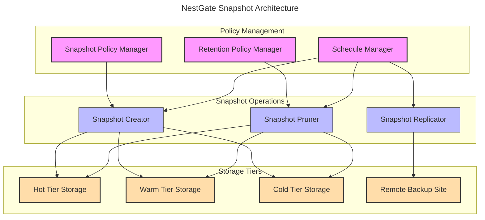
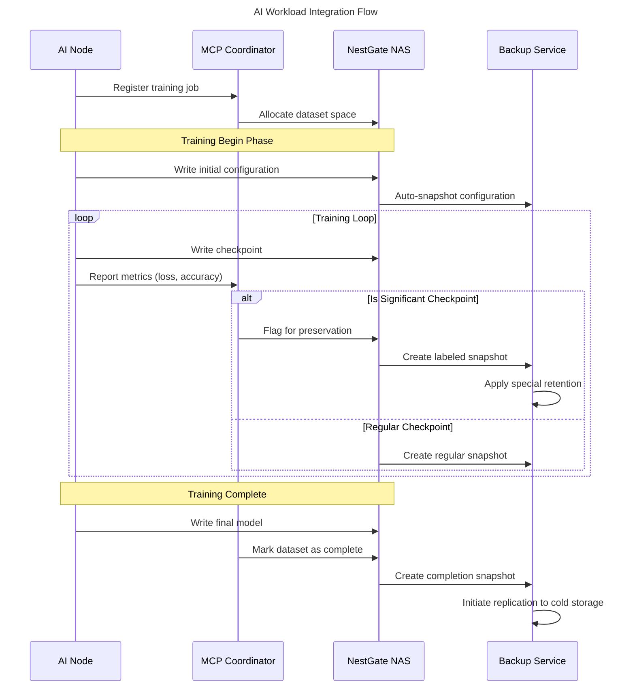

# NestGate Snapshot and Backup System

## Overview

The NestGate Snapshot and Backup System provides comprehensive data protection for AI workloads through automated ZFS snapshot management, intelligent backup scheduling, and multi-tier replication. This specification defines the architecture, policies, and interfaces for maintaining data integrity across training cycles while optimizing for AI-specific workload patterns.

## Snapshot Management Architecture



## AI-Optimized Snapshot Policies

NestGate implements AI-specific snapshot policies that align with typical AI workload patterns:

```yaml
snapshot_policies:
  training_checkpoints:
    description: "Automated snapshots for AI model training checkpoints"
    triggers:
      - "Model checkpoint save events"
      - "Training epoch completion"
      - "Validation score improvement"
    frequency: "Variable, based on training progress"
    naming_convention: "${dataset_name}_epoch${epoch}_val${validation_score}"
    retention:
      best_models: "Keep indefinitely"
      improving_models: "Keep last 5"
      other_checkpoints: "Keep for 7 days"
  
  dataset_versions:
    description: "Version control for training datasets"
    triggers:
      - "Dataset update events"
      - "Pre-processing completion"
      - "Feature engineering changes"
    frequency: "On dataset modification"
    naming_convention: "${dataset_name}_v${version}_${timestamp}"
    retention:
      major_versions: "Keep indefinitely"
      minor_versions: "Keep last 10"
      experimental: "Keep for 30 days"
  
  system_protection:
    description: "System-level protection for NestGate configuration"
    triggers:
      - "Configuration changes"
      - "Software updates"
      - "Schedule-based (daily)"
    frequency: "Daily + on-change"
    naming_convention: "system_${component}_${timestamp}"
    retention:
      daily: "Keep for 7 days"
      weekly: "Keep for 4 weeks"
      monthly: "Keep for 6 months"
```

## Tier-Specific Snapshot Strategy

NestGate tailors snapshot frequency and retention based on storage tier:

### Hot Tier Snapshots

```yaml
hot_tier_snapshots:
  frequency: 
    default: "Every 15 minutes"
    during_training: "Every 5 minutes"
    idle_periods: "Every 60 minutes"
  
  retention:
    recent: "Keep all snapshots for 24 hours"
    hourly: "Keep hourly snapshots for 7 days"
    daily: "Keep daily snapshots for 14 days"
  
  special_policies:
    auto_promote: "Automatically promote important snapshots to warm tier"
    critical_data: "Apply higher retention for critical datasets"
```

### Warm Tier Snapshots

```yaml
warm_tier_snapshots:
  frequency:
    default: "Every 4 hours"
    active_projects: "Every 1 hour"
    inactive_projects: "Daily"
  
  retention:
    hourly: "Keep for 3 days"
    daily: "Keep for 30 days"
    weekly: "Keep for 3 months"
  
  special_policies:
    dataset_versions: "Keep all labeled dataset versions"
    model_checkpoints: "Keep all successful training checkpoints"
```

### Cold Tier Snapshots

```yaml
cold_tier_snapshots:
  frequency:
    default: "Daily"
    archive_datasets: "Weekly"
  
  retention:
    daily: "Keep for 14 days"
    weekly: "Keep for 3 months"
    monthly: "Keep for 1 year"
    yearly: "Keep indefinitely"
  
  special_policies:
    archive_integrity: "Periodic validation of snapshot integrity"
    compliance: "Support for legal hold and compliance requirements"
```

## Backup Replication

### Replication Targets

```yaml
replication_targets:
  local_replicas:
    description: "Cross-pool replication within the same NestGate system"
    targets:
      - "Secondary ZFS pool on same system"
      - "Separate disk shelves"
    encryption: "Optional, same keys as source"
    compression: "Based on network and storage capabilities"
  
  remote_nas:
    description: "Replication to other NestGate or NAS systems"
    targets:
      - "Secondary NestGate system"
      - "Compatible ZFS storage systems"
    transport: "SSH or dedicated replication channel"
    encryption: "Required, separate key management"
    bandwidth_control: "Configurable rate limiting and scheduling"
  
  object_storage:
    description: "Cloud object storage backup for disaster recovery"
    targets:
      - "S3-compatible storage"
      - "Azure Blob Storage"
      - "Google Cloud Storage"
    format: "ZFS snapshots or object-optimized format"
    deduplication: "Client-side deduplication where possible"
    lifecycle_policies: "Automatic tiering to cold storage after 30 days"
```

### Replication Schedule

```yaml
replication_schedule:
  hot_to_warm:
    frequency: "Continuous for critical, 4 hours for standard"
    conditions: "When load < 30%, bandwidth available"
    priority: "High"
  
  warm_to_cold:
    frequency: "Daily, during off-hours (2-6 AM)"
    conditions: "When system load < 20%"
    priority: "Medium"
  
  cold_to_remote:
    frequency: "Weekly full, daily incremental"
    conditions: "When bandwidth costs lowest"
    priority: "Low"
```

## Implementation Details

### Snapshot Manager

```rust
/// Snapshot Manager for automated snapshot operations
pub struct SnapshotManager<Z> {
    /// ZFS commander for snapshot operations
    commander: Z,
    
    /// Policy engine
    policy_engine: Arc<SnapshotPolicyEngine>,
    
    /// Scheduler
    scheduler: Arc<ScheduleManager>,
    
    /// Event listener
    event_listener: Arc<EventListener>,
}

impl<Z: ZfsCommander + Send + Sync + 'static + Clone> SnapshotManager<Z> {
    /// Create a new snapshot manager
    pub fn new(
        commander: Z,
        policy_engine: SnapshotPolicyEngine,
        scheduler: ScheduleManager,
        event_listener: EventListener,
    ) -> Self {
        Self {
            commander,
            policy_engine: Arc::new(policy_engine),
            scheduler: Arc::new(scheduler),
            event_listener: Arc::new(event_listener),
        }
    }
    
    /// Initialize the snapshot manager
    pub async fn init(&self) -> Result<()> {
        // Register event handlers
        self.register_event_handlers().await?;
        
        // Initialize schedules
        self.initialize_schedules().await?;
        
        // Perform initial snapshot inventory
        self.inventory_snapshots().await?;
        
        Ok(())
    }
    
    /// Create a snapshot based on policy
    pub async fn create_snapshot(&self, dataset: &str, policy_name: &str, metadata: HashMap<String, String>) -> Result<String> {
        // Get policy
        let policy = self.policy_engine.get_policy(policy_name).await?;
        
        // Generate snapshot name
        let snapshot_name = self.generate_snapshot_name(dataset, &policy, &metadata).await?;
        
        // Create snapshot with properties
        let properties = self.prepare_snapshot_properties(&policy, &metadata).await?;
        self.commander.create_snapshot_with_properties(dataset, &snapshot_name, properties).await
            .map_err(|e| SnapshotError::CreationFailed(e.to_string()))?;
        
        // Update snapshot inventory
        self.inventory_snapshots().await?;
        
        // Check if snapshot should be replicated
        if policy.auto_replicate {
            self.schedule_replication(dataset, &snapshot_name, &policy.replication_target).await?;
        }
        
        Ok(snapshot_name)
    }
    
    /// Apply retention policy and prune snapshots
    pub async fn prune_snapshots(&self, dataset: &str, policy_name: &str) -> Result<Vec<String>> {
        // Get policy
        let policy = self.policy_engine.get_policy(policy_name).await?;
        
        // Get current snapshots
        let snapshots = self.commander.list_snapshots(dataset).await
            .map_err(|e| SnapshotError::ListFailed(e.to_string()))?;
        
        // Apply retention rules
        let to_delete = self.apply_retention_rules(dataset, &snapshots, &policy).await?;
        
        // Delete snapshots
        let mut deleted = Vec::new();
        for snapshot in to_delete {
            if let Ok(()) = self.commander.destroy_snapshot(&snapshot).await {
                deleted.push(snapshot);
            }
        }
        
        Ok(deleted)
    }
    
    /// Schedule snapshot replication
    pub async fn schedule_replication(&self, dataset: &str, snapshot: &str, target: &str) -> Result<String> {
        // Validate target exists
        self.validate_replication_target(target).await?;
        
        // Create replication job
        let job_id = Uuid::new_v4().to_string();
        
        // Schedule job
        self.scheduler.schedule_replication_job(
            job_id.clone(),
            dataset.to_string(),
            snapshot.to_string(),
            target.to_string(),
        ).await?;
        
        Ok(job_id)
    }
    
    // Other implementation methods
}
```

### Backup Service

```rust
/// Backup Service coordinates snapshot and replication operations
pub struct BackupService<Z, S> {
    /// Snapshot manager
    snapshot_manager: SnapshotManager<Z>,
    
    /// Storage manager
    storage_manager: S,
    
    /// Concurrency limit for backup operations
    concurrency_limit: usize,
    
    /// Active backup jobs
    active_jobs: Arc<RwLock<HashMap<String, BackupJob>>>,
}

impl<Z: ZfsCommander + Send + Sync + 'static + Clone, S: StorageManager + Send + Sync + 'static> BackupService<Z, S> {
    /// Create a new backup service
    pub fn new(snapshot_manager: SnapshotManager<Z>, storage_manager: S, concurrency_limit: usize) -> Self {
        Self {
            snapshot_manager,
            storage_manager,
            concurrency_limit,
            active_jobs: Arc::new(RwLock::new(HashMap::new())),
        }
    }
    
    /// Initialize the backup service
    pub async fn init(&self) -> Result<()> {
        // Initialize snapshot manager
        self.snapshot_manager.init().await?;
        
        // Set up recurring jobs
        self.setup_recurring_jobs().await?;
        
        // Perform initial verification
        self.verify_backup_state().await?;
        
        Ok(())
    }
    
    /// Start a backup job for a dataset
    pub async fn backup_dataset(&self, dataset: &str, policy_name: &str, options: BackupOptions) -> Result<String> {
        // Validate we're under concurrency limit
        let job_count = self.active_jobs.read().await.len();
        if job_count >= self.concurrency_limit {
            return Err(BackupError::ConcurrencyLimitReached);
        }
        
        // Generate job ID
        let job_id = Uuid::new_v4().to_string();
        
        // Create backup job
        let job = BackupJob::new(
            job_id.clone(),
            dataset.to_string(),
            policy_name.to_string(),
            options,
        );
        
        // Store job
        self.active_jobs.write().await.insert(job_id.clone(), job);
        
        // Start job
        self.start_backup_job(&job_id).await?;
        
        Ok(job_id)
    }
    
    /// Verify backup integrity
    pub async fn verify_backup(&self, dataset: &str) -> Result<BackupVerificationResult> {
        // Get all snapshots for dataset
        let snapshots = self.snapshot_manager.list_snapshots(dataset).await?;
        
        // Check for gaps in backup history
        let gaps = self.find_backup_gaps(dataset, &snapshots).await?;
        
        // Verify snapshot integrity
        let integrity_checks = self.verify_snapshot_integrity(dataset, &snapshots).await?;
        
        // Verify replication status
        let replication_status = self.verify_replication_status(dataset, &snapshots).await?;
        
        // Build verification result
        let result = BackupVerificationResult {
            dataset: dataset.to_string(),
            snapshot_count: snapshots.len(),
            gaps,
            integrity_checks,
            replication_status,
        };
        
        Ok(result)
    }
    
    // Other implementation methods
}
```

## AI Workload Integration

NestGate's backup system integrates with AI workflows to provide context-aware protection:



### AI-Aware Snapshot Hooks

```yaml
ai_integration_hooks:
  model_training:
    trigger_points:
      - "training_start"
      - "epoch_complete"
      - "validation_improvement"
      - "training_complete"
    metadata_capture:
      - "model_architecture"
      - "hyperparameters"
      - "dataset_version"
      - "validation_metrics"
    retention_rules:
      - "Keep all validation improvements"
      - "Keep final model indefinitely"
      - "Keep intermediate checkpoints for 7 days"
  
  dataset_preparation:
    trigger_points:
      - "preprocessing_start"
      - "preprocessing_stages"
      - "dataset_finalized"
    metadata_capture:
      - "preprocessing_steps"
      - "data_statistics"
      - "feature_engineering_details"
      - "data_splits"
    retention_rules:
      - "Keep finalized datasets indefinitely"
      - "Keep preprocessing stages for 14 days"
```

## Disaster Recovery

```yaml
disaster_recovery:
  recovery_targets:
    rto: "Recovery Time Objective: 4 hours"
    rpo: "Recovery Point Objective: 1 hour for hot tier, 24 hours for cold tier"
  
  recovery_scenarios:
    disk_failure:
      detection: "ZFS pool status monitoring"
      response: "Automatic rebuild using hot spares"
      escalation: "Alert if rebuild exceeds 12 hours"
    
    pool_corruption:
      detection: "ZFS integrity checks"
      response: "Restoration from most recent snapshot"
      fallback: "Replication from remote backup"
    
    system_failure:
      detection: "Heartbeat monitoring"
      response: "Activate standby NestGate node if available"
      fallback: "Rebuild from remote backup"
    
    site_disaster:
      detection: "External monitoring"
      response: "Activate DR site using replicated data"
      recovery_sequence:
        - "Restore system configuration"
        - "Restore cold tier data"
        - "Restore warm tier data"
        - "Restore hot tier data"
        - "Verify data integrity"
        - "Resume MCP integration"
```

## Security and Encryption

```yaml
security_features:
  snapshot_encryption:
    method: "ZFS native encryption"
    key_management: "Integration with central key management service"
    separate_keys: "Option for separate snapshot keys"
  
  transport_security:
    local: "Encrypted transport for local replication"
    remote: "TLS 1.3 for remote replication"
    ssh_options: "Hardened SSH configuration for replication"
  
  access_controls:
    snapshot_creation: "Role-based permissions"
    snapshot_access: "Fine-grained access controls"
    restoration: "Approval workflow for sensitive data"
  
  audit_trail:
    events_logged:
      - "Snapshot creation/deletion"
      - "Backup job execution"
      - "Restoration events"
      - "Policy changes"
    retention: "1 year of audit logs"
    export: "Structured export for compliance reporting"
```

## Management Interface

The snapshot and backup system exposes the following administrative interfaces:

```yaml
management_interfaces:
  cli_commands:
    - name: "snapshot-create"
      description: "Create a new snapshot manually"
      options:
        - "dataset: Target dataset"
        - "policy: Policy to apply"
        - "recursive: Apply to child datasets"
        - "metadata: Custom metadata key-value pairs"
    
    - name: "snapshot-list"
      description: "List snapshots for a dataset"
      options:
        - "dataset: Target dataset"
        - "filter: Filter by properties"
        - "sort: Sort order"
    
    - name: "backup-job-status"
      description: "Check status of backup jobs"
      options:
        - "job-id: Specific job ID"
        - "dataset: Filter by dataset"
        - "status: Filter by status"
    
    - name: "backup-verify"
      description: "Verify backup integrity"
      options:
        - "dataset: Target dataset"
        - "level: Verification depth"
        - "fix: Attempt to fix issues"
  
  api_endpoints:
    - path: "/api/v1/snapshots"
      methods: "GET, POST, DELETE"
      authentication: "API token with snapshot permissions"
      rate_limiting: "100 requests per minute"
    
    - path: "/api/v1/backup/jobs"
      methods: "GET, POST, PUT"
      authentication: "API token with backup permissions"
      rate_limiting: "20 requests per minute"
    
    - path: "/api/v1/backup/verify"
      methods: "POST"
      authentication: "API token with admin permissions"
      rate_limiting: "5 requests per minute"
  
  mcp_integration:
    - command: "register-snapshot-hook"
      description: "Register MCP event to trigger snapshot"
    - command: "request-dataset-backup"
      description: "Request backup of AI workload dataset"
    - command: "restore-dataset-version"
      description: "Restore specific version of dataset"
```

## Monitoring and Reporting

```yaml
monitoring:
  metrics:
    - name: "snapshot_success_rate"
      description: "Percentage of successful snapshot operations"
      threshold: "99.9%"
    
    - name: "backup_completion_rate"
      description: "Percentage of backup jobs completed successfully"
      threshold: "99.5%"
    
    - name: "snapshot_age"
      description: "Age of most recent snapshot by dataset"
      threshold: "Varies by tier and importance"
    
    - name: "replication_lag"
      description: "Time lag between primary and replica"
      threshold: "1 hour for critical data"
  
  alerts:
    - name: "snapshot_failure"
      description: "Snapshot operation failed"
      severity: "Warning"
      escalation: "Retry, then alert admin"
    
    - name: "backup_job_failure"
      description: "Backup job failed"
      severity: "Error"
      escalation: "Alert admin"
    
    - name: "replication_lag_exceeded"
      description: "Replication lag exceeds threshold"
      severity: "Warning to Error (time-based)"
      escalation: "Auto-adjust priority, then alert"
  
  reports:
    - name: "daily_backup_summary"
      description: "Summary of backup operations"
      delivery: "Email, MCP notification"
      format: "HTML, JSON"
    
    - name: "monthly_compliance_report"
      description: "Detailed backup compliance report"
      delivery: "Email to compliance team"
      format: "PDF with digital signature"
```

## Technical Metadata
- Category: Data Protection
- Priority: High
- Owner: DataScienceBioLab
- Dependencies:
  - ZFS snapshot capabilities
  - Replication infrastructure
  - MCP integration
- Validation Requirements:
  - Recovery testing
  - Performance impact assessment
  - Integration testing with AI workflows 