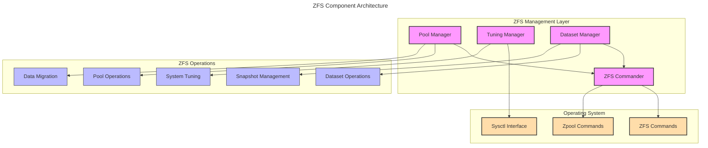

# ZFS Integration for NestGate

## July 2024 Update: HDD-Only Focus

For the initial NestGate release, we're focusing on HDD-only storage implementations that will fully saturate typical home network connections (1G/2.5G/10G):

- **Single-Tier Implementation**: Initial focus on HDD tier only
- **Network Throughput Optimization**: ZFS parameters tuned to maximize network bandwidth utilization
- **Simplified Management**: Focus on core ZFS features before implementing multi-tier capabilities
- **Future Expandability**: System architecture designed to support SSD/NVMe tiers in future releases (2025 Q1)

The architectural design remains the same, but tuning parameters and implementation focus have been updated to reflect this approach.

## Overview

NestGate leverages ZFS (Zettabyte File System) as its storage foundation, providing robust data management capabilities. This specification defines the ZFS integration architecture, tuning parameters, management interfaces, and storage-specific optimizations implemented in the system.

## ZFS Architecture



## ZFS Management Components

```yaml
zfs_components:
  commander:
    purpose: "Low-level ZFS command execution"
    responsibilities:
      - "Execute ZFS commands"
      - "Parse command output"
      - "Handle error conditions"
      - "Provide standardized interfaces"
    interfaces:
      - "list_pools"
      - "get_pool"
      - "list_datasets"
      - "create_dataset"
      - "delete_dataset"
      - "get_dataset_properties"
      - "create_snapshot"
      - "list_snapshots"
      - "send_snapshot_to_dataset"
  
  pool_manager:
    purpose: "ZFS pool operations and management"
    responsibilities:
      - "Pool lifecycle management"
      - "Dataset operations"
      - "Snapshot management"
      - "Data migration"
      - "Error recovery"
    features:
      - "Pool health monitoring"
      - "Automated scrub scheduling"
      - "Performance statistics"
      - "Migration job tracking"
  
  tuning_manager:
    purpose: "ZFS performance tuning for storage workloads"
    responsibilities:
      - "System parameter management"
      - "Workload-specific tuning"
      - "Performance monitoring"
      - "Configuration persistence"
    interfaces:
      - "init"
      - "apply_tuning"
      - "restore_defaults"
      - "update_config"
      - "get_current_parameters"
```

## HDD Storage Optimization Parameters

The ZFS Tuning Manager is optimized for HDD-based storage with parameters that maximize network throughput while maintaining data integrity:

```yaml
tuning_parameters:
  recordsize:
    description: "ZFS record size for datasets"
    network_impact: "Affects throughput for different access patterns"
    values:
      general_datasets: "1M"
      database_workloads: "128K"
      small_file_workloads: "128K"
    explanation: "Larger recordsize optimizes for sequential reads/writes on HDDs"
  
  compression:
    description: "Data compression algorithm"
    network_impact: "Reduces data transfer over network at CPU cost"
    values:
      general_use: "lz4"
      archive_datasets: "zstd"
    explanation: "lz4 provides good compression with minimal CPU impact"
  
  atime:
    description: "Access time updates"
    performance_impact: "Reduces unnecessary writes to HDDs"
    value: "off"
    explanation: "Disabling atime improves performance for read-heavy workloads"
  
  txg_timeout:
    description: "Transaction group commit time (seconds)"
    network_impact: "Controls flush frequency and write latency"
    values:
      default: 10
      network_1g: 15
      network_10g: 5
    explanation: "Longer times for slower networks, shorter for faster networks"
  
  dirty_data_max_percent:
    description: "Maximum dirty data as percentage of system memory"
    network_impact: "Affects write buffering and throughput"
    values:
      default: 20
      high_memory_systems: 30
    explanation: "Higher values improve write throughput for bursty workloads"
  
  prefetch_disable:
    description: "Disable ZFS prefetching mechanism"
    network_impact: "Affects sequential read performance"
    value: 0
    explanation: "Keep enabled for sequential read performance on HDDs"
```

## Current Implementation (HDD Tier)

```yaml
hdd_tier:
  media: "Hard Disk Drives (7200 RPM recommended)"
  zfs_pool: "nestgate_data"
  configuration: "Mirror (2 drives) or RAIDZ1 (3-4 drives)"
  recordsize: "1M (general datasets)"
  compression: "lz4"
  sync: "standard"
  atime: "off"
  primary_usage: "All data storage in initial implementation"
  performance_target:
    throughput_1g: "~120MB/s (network saturation)"
    throughput_2.5g: "~280MB/s (network saturation)"
    throughput_10g: "~500-800MB/s (dependent on HDD count and configuration)"
```

## Network-Optimized Tuning

The following parameters are optimized based on the detected network interface speed:

```yaml
network_based_tuning:
  1g_ethernet:
    txg_timeout: 15
    recordsize: "1M"
    prefetch_max: "4MB"
    target_throughput: "~120MB/s"
  
  2.5g_ethernet:
    txg_timeout: 10
    recordsize: "1M"
    prefetch_max: "8MB"
    target_throughput: "~280MB/s"
  
  10g_ethernet:
    txg_timeout: 5
    recordsize: "1M"
    prefetch_max: "16MB"
    target_throughput: "500-800MB/s"
```

## Workload-Specific Optimizations

NestGate provides specialized dataset configurations for different workload types:

```yaml
workload_configurations:
  media_storage:
    description: "Optimized for large media files (photos, videos, documents)"
  recordsize: "1M"
    compression: "lz4"
    atime: "off"
    primarycache: "all"
  sync: "standard"
    logbias: "throughput"
    target_workloads: "Home media storage, backups, archives"
  
  home_directories:
    description: "Balanced configuration for user home directories"
    recordsize: "128K"
    compression: "lz4"
    atime: "on"
    relatime: "on"
    primarycache: "all"
    sync: "standard"
    target_workloads: "User home directories, mixed workloads"
  
  database:
    description: "Optimized for database storage"
    recordsize: "16K"
    compression: "lz4"
    atime: "off"
    primarycache: "metadata"
    sync: "always"
    logbias: "latency"
    target_workloads: "Small databases, structured data storage"
  
  vm_storage:
    description: "Optimized for virtual machine storage"
    recordsize: "64K"
    compression: "lz4"
    atime: "off"
    primarycache: "all"
    sync: "disabled"
    target_workloads: "Virtual machine images, container storage"
```

## Future Multi-Tier Implementation

In future releases (planned for 2025 Q1), the system will be expanded to support multiple storage tiers:

1. **SSD Cache Tier**
   - L2ARC for read caching
   - SLOG for sync write acceleration
   - Implementation timeline: 2025 Q1

2. **NVMe Performance Tier**
   - For datasets requiring very high performance
   - Implementation timeline: 2025 Q1-Q2

The current architecture is designed to accommodate these future expansions without significant changes to the core implementation.

## Implementation Status

| Feature | Status | Priority |
|---------|--------|----------|
| Basic ZFS Pool Management | ✅ Complete | High |
| HDD Tier Optimization | ✅ Complete | High |
| Dataset Management | ✅ Complete | High |
| Network-Based Tuning | ✅ Complete | High |
| Snapshot Management | 🚧 In Progress | High |
| Backup & Replication | 🚧 In Progress | High |
| WebUI Integration | 🚧 In Progress | High |
| Multi-Tier Support | ⏳ Future Phase | Medium |
| Advanced Analytics | ⏳ Future Phase | Low |

## Integration with Core Components

### Pool and Dataset Management API

```yaml
api_endpoints:
  pool_management:
    create_pool:
      method: "POST"
      path: "/api/v1/zfs/pools"
      parameters:
        - name: "name"
          type: "string"
          required: true
        - name: "vdevs"
          type: "array"
          required: true
        - name: "properties"
          type: "object"
          required: false
  
  dataset_management:
    create_dataset:
      method: "POST"
      path: "/api/v1/zfs/datasets"
      parameters:
        - name: "name"
          type: "string"
          required: true
        - name: "properties"
          type: "object"
          required: false
        - name: "quota"
          type: "number"
          required: false
        - name: "workload_type"
          type: "string"
          required: false
```

### Integration with Protocol Services

ZFS datasets are exposed through network protocols:

```yaml
protocol_integration:
  nfs:
    dataset_properties:
      sharenfs: "on"
    performance_tuning:
      - "Optimized read/write buffer sizes"
      - "NFS thread pool tuning"
      - "UDP vs TCP optimization based on network"
  
  smb:
    dataset_properties:
      sharesmb: "on"
    performance_tuning:
      - "Share-level tuning based on workload"
      - "ACL management"
      - "Windows compatibility optimizations"
  
  iscsi:
    zvol_properties:
      volblocksize: "8K-64K"
    performance_tuning:
      - "Block size optimization"
      - "IO queueing parameters"
```

## Monitoring and Maintenance

### Health Monitoring

```yaml
health_monitoring:
  scheduled_scrubs:
    frequency: "Monthly or after error detection"
    implementation: "Automated scheduler with configurable windows"
  
  smart_monitoring:
    check_interval: "Weekly"
    attributes_monitored:
      - "Reallocated sectors"
      - "Pending sectors"
      - "Offline uncorrectable"
      - "SMART health status"
  
  error_detection:
    continuous_monitoring: true
    notification_channels:
      - "System alerts"
      - "Email notifications"
      - "Dashboard warnings"
```

### Maintenance Operations

```yaml
maintenance_operations:
  dataset_cleanup:
    snapshot_pruning: "Automated based on retention policy"
    space_reclamation: "Regularly scheduled"
  
  pool_expansion:
    supported_methods:
      - "Add vdev to existing pool"
      - "Replace smaller drives with larger ones"
    guidance:
      - "Always maintain redundancy during expansion"
      - "Perform regular scrubs after expansion"
```

## Technical Metadata
- Category: Storage Foundation
- Priority: High
- Dependencies:
  - ZFS kernel modules
  - System configuration
  - Storage hardware
- Validation Requirements:
  - Performance benchmarking
  - Data integrity verification
  - Network throughput validation 