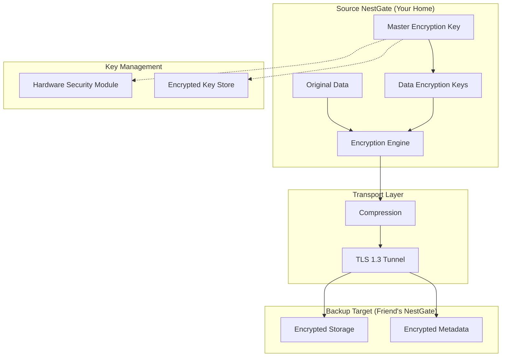

# NestGate Encryption Architecture for Offsite Backups

**Status**: 🎯 **ARCHITECTURE READY**  
**Priority**: CRITICAL (Business Requirement)  
**Security Level**: Enterprise-Grade  
**Integration**: Songbird Orchestrator + Future Encryption Project  

## 🎯 **Overview**

Design enterprise-grade encryption architecture for NestGate offsite backups where **only the data owner can decrypt**, even if backup storage is compromised. This ensures business-grade security for sensitive data while maintaining Songbird's orchestration capabilities.

## 🔐 **Encryption Requirements**

### **Business Security Model**
- **Owner-Only Decryption**: Only the original data owner can decrypt backups
- **Zero-Trust Storage**: Backup targets cannot access plaintext data
- **Key Isolation**: Encryption keys never leave the source system
- **Compliance Ready**: Support for GDPR, HIPAA, SOX requirements
- **Audit Trail**: Complete cryptographic audit logging

### **Threat Model**
```
Threats to Mitigate:
✅ Compromised backup target (friend's NestGate)
✅ Network interception (man-in-the-middle)
✅ Songbird orchestrator compromise
✅ Storage device theft/seizure
✅ Unauthorized access to backup files
✅ Insider threats at backup location
```

## 🏗️ **Encryption Architecture**

### **Multi-Layer Encryption Design**


### **Encryption Layers**

#### **Layer 1: Dataset-Level Encryption (ZFS Native)**
```rust
// Enhance: code/crates/nestgate-zfs/src/encryption.rs
#[derive(Debug, Clone)]
pub struct DatasetEncryption {
    pub encryption_algorithm: EncryptionAlgorithm,
    pub key_derivation: KeyDerivationFunction,
    pub master_key_id: String,
    pub dataset_key_wrapped: Vec<u8>, // Encrypted with master key
}

#[derive(Debug, Clone)]
pub enum EncryptionAlgorithm {
    Aes256Gcm,      // AES-256-GCM (default)
    ChaCha20Poly1305, // ChaCha20-Poly1305 (alternative)
    Aes256Xts,      // AES-256-XTS (block-level)
}

impl DatasetEncryption {
    /// Create encrypted dataset with owner-only access
    pub async fn create_encrypted_dataset(
        &self,
        dataset_name: &str,
        owner_key_id: &str,
        encryption_config: &EncryptionConfig,
    ) -> Result<EncryptedDataset> {
        // Generate unique dataset encryption key
        let dataset_key = self.generate_dataset_key()?;
        
        // Wrap dataset key with owner's master key
        let wrapped_key = self.wrap_key_with_master(&dataset_key, owner_key_id).await?;
        
        // Create ZFS encrypted dataset
        let zfs_props = vec![
            ("encryption".to_string(), "aes-256-gcm".to_string()),
            ("keyformat".to_string(), "raw".to_string()),
            ("keylocation".to_string(), format!("file://{}", wrapped_key.key_file_path)),
        ];
        
        Ok(EncryptedDataset {
            name: dataset_name.to_string(),
            encryption: self.clone(),
            wrapped_key,
            owner_id: owner_key_id.to_string(),
        })
    }
}
```

#### **Layer 2: Backup-Specific Encryption**
```rust
// New: code/crates/nestgate-zfs/src/backup_encryption.rs
#[derive(Debug)]
pub struct BackupEncryptionEngine {
    key_manager: Arc<dyn KeyManager>,
    encryption_config: BackupEncryptionConfig,
}

#[derive(Debug, Clone)]
pub struct BackupEncryptionConfig {
    pub algorithm: EncryptionAlgorithm,
    pub key_rotation_interval: Duration,
    pub compression_before_encryption: bool,
    pub metadata_encryption: bool,
    pub audit_logging: bool,
}

impl BackupEncryptionEngine {
    /// Encrypt backup stream for offsite storage
    pub async fn encrypt_backup_stream(
        &self,
        source_stream: impl Stream<Item = Vec<u8>>,
        owner_key_id: &str,
        backup_id: &str,
    ) -> Result<impl Stream<Item = EncryptedChunk>> {
        // Generate unique backup encryption key
        let backup_key = self.generate_backup_key(backup_id).await?;
        
        // Wrap backup key with owner's master key
        let wrapped_backup_key = self.key_manager
            .wrap_key(&backup_key, owner_key_id)
            .await?;
        
        // Create encrypted stream
        let encrypted_stream = source_stream.map(move |chunk| {
            self.encrypt_chunk(&chunk, &backup_key, backup_id)
        });
        
        // Store wrapped key metadata (encrypted)
        self.store_backup_key_metadata(backup_id, wrapped_backup_key).await?;
        
        Ok(encrypted_stream)
    }
    
    /// Only the owner can decrypt - backup target cannot
    pub async fn decrypt_backup_stream(
        &self,
        encrypted_stream: impl Stream<Item = EncryptedChunk>,
        owner_key_id: &str,
        backup_id: &str,
    ) -> Result<impl Stream<Item = Vec<u8>>> {
        // Retrieve wrapped backup key
        let wrapped_backup_key = self.get_backup_key_metadata(backup_id).await?;
        
        // Unwrap backup key with owner's master key (ONLY owner can do this)
        let backup_key = self.key_manager
            .unwrap_key(&wrapped_backup_key, owner_key_id)
            .await?;
        
        // Decrypt stream
        let decrypted_stream = encrypted_stream.map(move |encrypted_chunk| {
            self.decrypt_chunk(&encrypted_chunk, &backup_key)
        });
        
        Ok(decrypted_stream)
    }
}
```

#### **Layer 3: Key Management Architecture**
```rust
// New: code/crates/nestgate-zfs/src/key_management.rs
pub trait KeyManager: Send + Sync {
    async fn generate_master_key(&self, owner_id: &str) -> Result<MasterKey>;
    async fn wrap_key(&self, key: &[u8], master_key_id: &str) -> Result<WrappedKey>;
    async fn unwrap_key(&self, wrapped_key: &WrappedKey, master_key_id: &str) -> Result<Vec<u8>>;
    async fn rotate_keys(&self, owner_id: &str) -> Result<KeyRotationResult>;
    async fn backup_keys(&self, owner_id: &str) -> Result<KeyBackup>;
}

/// Hardware Security Module integration (future)
#[derive(Debug)]
pub struct HsmKeyManager {
    hsm_config: HsmConfig,
    key_store: Arc<dyn KeyStore>,
}

/// Software-based key management (current implementation)
#[derive(Debug)]
pub struct SoftwareKeyManager {
    key_derivation: KeyDerivationConfig,
    key_store: Arc<dyn KeyStore>,
    master_keys: Arc<RwLock<HashMap<String, MasterKey>>>,
}

#[derive(Debug, Clone)]
pub struct MasterKey {
    pub key_id: String,
    pub owner_id: String,
    pub algorithm: EncryptionAlgorithm,
    pub key_material: SecureBytes, // Zeroized on drop
    pub created_at: SystemTime,
    pub rotation_schedule: Option<Duration>,
}

#[derive(Debug, Clone)]
pub struct WrappedKey {
    pub wrapped_key_material: Vec<u8>,
    pub wrapping_key_id: String,
    pub algorithm: EncryptionAlgorithm,
    pub nonce: Vec<u8>,
    pub key_file_path: String, // For ZFS integration
}
```

## 🔧 **Integration with Songbird & Offsite Backup**

### **Enhanced Backup Orchestrator with Encryption**
```rust
// Enhance: code/crates/nestgate-zfs/src/backup_orchestrator.rs
impl OffsiteBackupOrchestrator {
    /// Enhanced orchestration with encryption
    async fn orchestrate_encrypted_backup(&self, dataset: &Dataset, target: &BackupTarget) -> Result<()> {
        let owner_id = self.get_dataset_owner(&dataset.name).await?;
        let backup_id = format!("{}_{}", dataset.name, target.node_id);
        
        // Verify owner has encryption keys
        if !self.key_manager.has_master_key(&owner_id).await? {
            return Err(BackupError::MissingEncryptionKey(owner_id));
        }
        
        // Create encrypted replication request
        let replication_request = EncryptedReplicationRequest {
            source_dataset: dataset.name.clone(),
            target_node: target.node_id.clone(),
            target_orchestrator: target.songbird_orchestrator.clone(),
            encryption_config: EncryptedReplicationConfig {
                owner_key_id: owner_id.clone(),
                backup_id: backup_id.clone(),
                algorithm: self.backup_config.encryption_algorithm.clone(),
                compress_before_encrypt: true,
                verify_integrity: true,
            },
            bandwidth_limit: target.backup_policies.bandwidth_limit_mbps,
        };
        
        // Execute encrypted replication via Songbird
        let task = self.execute_encrypted_songbird_replication(replication_request).await?;
        
        // Log encryption audit event
        self.audit_logger.log_backup_started(&owner_id, &backup_id, &target.node_id).await?;
        
        Ok(())
    }
    
    async fn execute_encrypted_songbird_replication(
        &self, 
        request: EncryptedReplicationRequest
    ) -> Result<ReplicationTask> {
        // Create Songbird request with encryption metadata
        let songbird_request = ServiceRequest {
            id: uuid::Uuid::new_v4().to_string(),
            service_type: "nestgate-encrypted".to_string(),
            target_node: Some(request.target_node.clone()),
            path: "/api/v1/zfs/replicate/encrypted".to_string(),
            method: "POST".to_string(),
            body: serde_json::to_vec(&request)?,
            headers: {
                let mut headers = HashMap::new();
                headers.insert("X-Encryption-Required".to_string(), "true".to_string());
                headers.insert("X-Owner-Key-Id".to_string(), request.encryption_config.owner_key_id.clone());
                headers
            },
        };
        
        // Route through Songbird with encryption requirements
        let orchestrator_url = format!("{}/orchestrate/encrypted", request.target_orchestrator);
        let response = self.discovery.client
            .post(&orchestrator_url)
            .json(&songbird_request)
            .send()
            .await?;
        
        if response.status().is_success() {
            let task: ReplicationTask = response.json().await?;
            info!("✅ Songbird orchestrated encrypted replication: {}", task.id);
            Ok(task)
        } else {
            Err(ZfsError::Internal(format!("Encrypted orchestration failed: {}", response.status())).into())
        }
    }
}
```

### **Songbird Integration with Encryption Awareness**
```rust
// Enhance: src/songbird_integration.rs
impl NestGateServiceInfo {
    pub fn with_encryption_capabilities(mut self, encryption_config: &EncryptionConfig) -> Self {
        // Add encryption-specific capabilities
        self.capabilities.extend(vec![
            "encrypted-backup-target".to_string(),
            "owner-only-decryption".to_string(),
            "key-isolation".to_string(),
            "audit-logging".to_string(),
        ]);
        
        // Add encryption metadata
        self.metadata.insert("encryption_required".to_string(), "true".to_string());
        self.metadata.insert("supported_algorithms".to_string(), 
            encryption_config.supported_algorithms.join(","));
        self.metadata.insert("key_management".to_string(), 
            encryption_config.key_management_type.to_string());
        self.metadata.insert("compliance_level".to_string(), 
            encryption_config.compliance_level.to_string());
        
        self
    }
}

/// Enhanced service registration for encrypted backups
#[derive(Debug, Clone, Serialize, Deserialize)]
pub struct EncryptedBackupCapabilities {
    pub accepts_encrypted_only: bool,
    pub supported_algorithms: Vec<EncryptionAlgorithm>,
    pub key_isolation_guaranteed: bool,
    pub audit_logging_enabled: bool,
    pub compliance_certifications: Vec<ComplianceStandard>,
}

#[derive(Debug, Clone, Serialize, Deserialize)]
pub enum ComplianceStandard {
    Gdpr,
    Hipaa,
    Sox,
    Pci,
    FedRamp,
}
```

## 📋 **Configuration Integration**

### **Enhanced Production Config with Encryption**
```toml
# production_config.toml - Enhanced with encryption
[offsite_backup]
enabled = true
encryption_required = true  # NEW: Force encryption for all backups
check_interval_seconds = 3600
bandwidth_limit_mbps = 100

[offsite_backup.encryption]
algorithm = "aes-256-gcm"
key_rotation_interval_days = 90
compression_before_encryption = true
metadata_encryption = true
audit_logging = true

[offsite_backup.encryption.compliance]
level = "business"  # Options: basic, business, enterprise, government
standards = ["gdpr", "hipaa"]
key_escrow_required = false
multi_party_approval = false

[offsite_backup.key_management]
type = "software"  # Options: software, hsm, cloud-hsm
key_derivation = "argon2id"
master_key_backup = true
key_recovery_shares = 3  # Shamir secret sharing for key recovery

[offsite_backup.discovery]
auto_discover = true
require_encryption_capability = true  # NEW: Only discover encryption-capable targets
known_songbird_endpoints = [
    "http://friend.example.com:8080",
    "http://business-backup.example.com:8080"
]

[offsite_backup.policies]
dataset_filters = [
    "tank/business/.*",    # Business data - always encrypted
    "tank/personal/.*",    # Personal data - encrypted
]
retention_days = 90
integrity_verification = true
```

### **Business vs Personal Encryption Policies**
```toml
# Different encryption requirements based on data classification
[offsite_backup.data_classification]
business_data = [
    "tank/business/.*",
    "tank/documents/contracts/.*",
    "tank/documents/financial/.*"
]

personal_data = [
    "tank/personal/.*",
    "tank/photos/.*",
    "tank/media/.*"
]

[offsite_backup.encryption_policies]
[offsite_backup.encryption_policies.business]
algorithm = "aes-256-gcm"
key_rotation_days = 30
compliance_audit = true
key_escrow = true
multi_factor_decrypt = true

[offsite_backup.encryption_policies.personal]
algorithm = "aes-256-gcm"
key_rotation_days = 90
compliance_audit = false
key_escrow = false
multi_factor_decrypt = false
```

## 🚀 **Implementation Phases**

### **Phase 1: Encryption Foundation (Sprint 4)**
```rust
// Implement basic encryption interfaces and configuration
// Files to create/enhance:
code/crates/nestgate-zfs/src/encryption.rs
code/crates/nestgate-zfs/src/backup_encryption.rs
code/crates/nestgate-zfs/src/key_management.rs

// Integration points:
src/songbird_integration.rs
  + with_encryption_capabilities()
  + EncryptedBackupCapabilities

production_config.toml
  + [offsite_backup.encryption] section
```

### **Phase 2: Future Encryption Project**
```rust
// Advanced encryption features (separate project):
- Hardware Security Module (HSM) integration
- Multi-party key approval workflows
- Advanced compliance reporting
- Key escrow and recovery systems
- Quantum-resistant algorithms preparation
```

## 🎯 **Business Benefits**

### **✅ Enterprise Security**
- **Data Sovereignty**: Your data, your keys, your control
- **Zero-Trust Architecture**: Backup targets cannot access plaintext
- **Compliance Ready**: GDPR, HIPAA, SOX support built-in
- **Audit Trail**: Complete cryptographic audit logging

### **✅ User-Friendly Security**
- **Transparent Encryption**: Users don't need to understand crypto
- **Automatic Key Management**: Keys generated and managed automatically
- **Songbird Integration**: Encryption works seamlessly with orchestration
- **Flexible Policies**: Different encryption for business vs personal data

### **✅ Future-Proof Architecture**
- **Pluggable Key Management**: Easy to integrate HSMs later
- **Algorithm Agility**: Support for multiple encryption algorithms
- **Compliance Extensibility**: Easy to add new compliance standards
- **Quantum Readiness**: Architecture ready for post-quantum crypto

## 🎯 **Example Usage Scenarios**

### **Business User Scenario**
```bash
# Business setup with mandatory encryption
nestgate --config business_config.toml

# All business data automatically encrypted before backup
# Only the business owner can decrypt, even if backup storage is compromised
# Full audit trail for compliance
```

### **Personal User Scenario**
```bash
# Personal setup with optional encryption
nestgate --config personal_config.toml

# Personal photos/documents encrypted before offsite backup
# Friend hosting backup cannot access your files
# Simple key management, no compliance overhead
```

### **Mixed Environment**
```bash
# Different policies for different data types
nestgate --config mixed_config.toml

# Business data: Strong encryption + compliance + audit
# Personal data: Standard encryption + simple key management
# Public data: Compression only, no encryption
```

This architecture ensures that **your encryption project will have a solid foundation** while delivering the offsite backup feature with enterprise-grade security from day one! 🔐🎼🏠➡️🏠🎼 