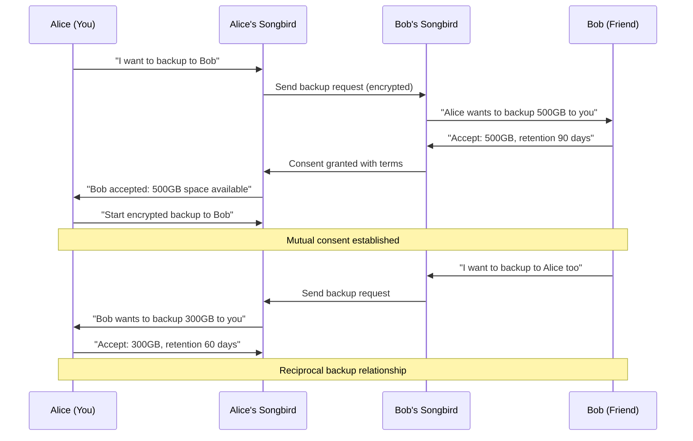

# NestGate Federation Consent & Distributed Sharding Architecture

**Status**: 🎯 **ARCHITECTURE READY**  
**Priority**: CRITICAL (User Control + Federation)  
**Model**: Consent-Based Federation with Distributed Sharding  
**Integration**: Songbird Orchestrator + Encryption + User Consent  

## 🎯 **Overview**

Design a **consent-based backup federation** where users explicitly control who they back up for, how much space they allocate, and participate in **encrypted distributed sharding** across federation members. This enables mutual backup relationships and resilient federation-wide storage pools.

## 🔐 **Federation Consent Model**

### **Core Principles**
- **Explicit Consent**: Users must explicitly agree to backup relationships
- **Granular Control**: Different space/policies for different users
- **Mutual Relationships**: Encourage reciprocal backup agreements
- **Federation Sharding**: Optional participation in distributed federation storage
- **Dynamic Modification**: Change consent and allocations on-the-fly

### **User Consent Flow**


## 🏗️ **Consent Management Architecture**

### **Backup Consent System**
```rust
// New: code/crates/nestgate-zfs/src/consent_manager.rs
#[derive(Debug)]
pub struct BackupConsentManager {
    consent_store: Arc<dyn ConsentStore>,
    space_allocator: Arc<SpaceAllocator>,
    federation_manager: Arc<FederationManager>,
}

#[derive(Debug, Clone, Serialize, Deserialize)]
pub struct BackupConsentRequest {
    pub requester_id: String,
    pub requester_name: String,
    pub requested_space_gb: u64,
    pub estimated_bandwidth_mbps: u32,
    pub retention_days: u32,
    pub data_classification: DataClassification,
    pub encryption_required: bool,
    pub message: Option<String>, // "Hey, can I backup my photos to your NestGate?"
}

#[derive(Debug, Clone, Serialize, Deserialize)]
pub struct BackupConsentResponse {
    pub request_id: String,
    pub status: ConsentStatus,
    pub allocated_space_gb: u64,
    pub retention_days: u32,
    pub bandwidth_limit_mbps: Option<u32>,
    pub allowed_data_types: Vec<DataClassification>,
    pub terms: BackupTerms,
}

#[derive(Debug, Clone, Serialize, Deserialize)]
pub enum ConsentStatus {
    Pending,
    Approved,
    Denied,
    Revoked,
    Modified,
}

#[derive(Debug, Clone, Serialize, Deserialize)]
pub struct BackupTerms {
    pub max_space_gb: u64,
    pub retention_days: u32,
    pub bandwidth_limit_mbps: Option<u32>,
    pub allowed_schedules: Vec<BackupSchedule>,
    pub cost_sharing: Option<CostSharing>, // For paid federation services
}

impl BackupConsentManager {
    /// Request backup space from another user
    pub async fn request_backup_consent(
        &self,
        target_user_id: &str,
        request: BackupConsentRequest,
    ) -> Result<String> {
        // Generate request ID
        let request_id = uuid::Uuid::new_v4().to_string();
        
        // Store pending request
        self.consent_store.store_request(&request_id, &request).await?;
        
        // Send request via Songbird orchestration
        let songbird_request = ServiceRequest {
            id: request_id.clone(),
            service_type: "nestgate-backup-consent".to_string(),
            target_node: Some(target_user_id.to_string()),
            path: "/api/v1/backup/consent/request".to_string(),
            method: "POST".to_string(),
            body: serde_json::to_vec(&request)?,
            headers: HashMap::new(),
        };
        
        // Route through Songbird
        self.send_consent_request_via_songbird(songbird_request).await?;
        
        info!("📤 Backup consent request sent to {}: {}", target_user_id, request_id);
        Ok(request_id)
    }
    
    /// Handle incoming backup consent request
    pub async fn handle_consent_request(
        &self,
        request: BackupConsentRequest,
    ) -> Result<()> {
        // Check if user has space available
        let available_space = self.space_allocator.get_available_space().await?;
        
        // Create notification for user
        let notification = ConsentNotification {
            request_id: request.requester_id.clone(),
            requester_name: request.requester_name.clone(),
            requested_space_gb: request.requested_space_gb,
            available_space_gb: available_space,
            message: request.message.clone(),
            urgency: if request.requested_space_gb > available_space {
                NotificationUrgency::High
            } else {
                NotificationUrgency::Normal
            },
        };
        
        // Notify user (UI, email, push notification)
        self.notify_user_of_consent_request(notification).await?;
        
        Ok(())
    }
    
    /// User approves/denies backup consent
    pub async fn respond_to_consent_request(
        &self,
        request_id: &str,
        response: BackupConsentResponse,
    ) -> Result<()> {
        // Store consent decision
        self.consent_store.store_response(request_id, &response).await?;
        
        // If approved, allocate space
        if matches!(response.status, ConsentStatus::Approved) {
            self.space_allocator.allocate_space(
                &response.request_id,
                response.allocated_space_gb,
                &response.terms,
            ).await?;
        }
        
        // Send response back to requester via Songbird
        self.send_consent_response_via_songbird(request_id, response).await?;
        
        Ok(())
    }
}
```

### **Space Allocation Management**
```rust
// New: code/crates/nestgate-zfs/src/space_allocator.rs
#[derive(Debug)]
pub struct SpaceAllocator {
    allocations: Arc<RwLock<HashMap<String, SpaceAllocation>>>,
    total_space_gb: u64,
    reserved_space_gb: u64,
}

#[derive(Debug, Clone, Serialize, Deserialize)]
pub struct SpaceAllocation {
    pub user_id: String,
    pub allocated_space_gb: u64,
    pub used_space_gb: u64,
    pub terms: BackupTerms,
    pub created_at: SystemTime,
    pub last_modified: SystemTime,
    pub status: AllocationStatus,
}

#[derive(Debug, Clone, Serialize, Deserialize)]
pub enum AllocationStatus {
    Active,
    Suspended,
    Revoked,
    Expired,
}

impl SpaceAllocator {
    /// Allocate space for a specific user
    pub async fn allocate_space(
        &self,
        user_id: &str,
        space_gb: u64,
        terms: &BackupTerms,
    ) -> Result<()> {
        let mut allocations = self.allocations.write().await;
        
        // Check if we have enough space
        let total_allocated: u64 = allocations.values()
            .map(|a| a.allocated_space_gb)
            .sum();
        
        if total_allocated + space_gb > self.total_space_gb - self.reserved_space_gb {
            return Err(SpaceError::InsufficientSpace {
                requested: space_gb,
                available: self.total_space_gb - self.reserved_space_gb - total_allocated,
            });
        }
        
        // Create allocation
        let allocation = SpaceAllocation {
            user_id: user_id.to_string(),
            allocated_space_gb: space_gb,
            used_space_gb: 0,
            terms: terms.clone(),
            created_at: SystemTime::now(),
            last_modified: SystemTime::now(),
            status: AllocationStatus::Active,
        };
        
        allocations.insert(user_id.to_string(), allocation);
        
        info!("💾 Allocated {}GB to user {}", space_gb, user_id);
        Ok(())
    }
    
    /// Modify existing allocation
    pub async fn modify_allocation(
        &self,
        user_id: &str,
        new_space_gb: u64,
        new_terms: Option<BackupTerms>,
    ) -> Result<()> {
        let mut allocations = self.allocations.write().await;
        
        if let Some(allocation) = allocations.get_mut(user_id) {
            allocation.allocated_space_gb = new_space_gb;
            allocation.last_modified = SystemTime::now();
            
            if let Some(terms) = new_terms {
                allocation.terms = terms;
            }
            
            info!("📝 Modified allocation for {}: {}GB", user_id, new_space_gb);
            Ok(())
        } else {
            Err(SpaceError::AllocationNotFound(user_id.to_string()))
        }
    }
    
    /// Revoke allocation
    pub async fn revoke_allocation(&self, user_id: &str) -> Result<()> {
        let mut allocations = self.allocations.write().await;
        
        if let Some(allocation) = allocations.get_mut(user_id) {
            allocation.status = AllocationStatus::Revoked;
            allocation.last_modified = SystemTime::now();
            
            // TODO: Notify user that their backup space has been revoked
            // TODO: Provide grace period for data retrieval
            
            info!("🚫 Revoked allocation for user {}", user_id);
            Ok(())
        } else {
            Err(SpaceError::AllocationNotFound(user_id.to_string()))
        }
    }
}
```

## 🌐 **Federation Distributed Sharding**

### **Federation Shard Management**
```rust
// New: code/crates/nestgate-zfs/src/federation_shards.rs
#[derive(Debug)]
pub struct FederationShardManager {
    federation_id: String,
    shard_config: ShardConfig,
    member_nodes: Arc<RwLock<HashMap<String, FederationMember>>>,
    shard_store: Arc<dyn ShardStore>,
}

#[derive(Debug, Clone, Serialize, Deserialize)]
pub struct ShardConfig {
    pub total_shards: u32,
    pub redundancy_factor: u32, // How many copies of each shard
    pub shard_size_mb: u64,
    pub encryption_algorithm: EncryptionAlgorithm,
    pub verification_interval: Duration,
}

#[derive(Debug, Clone, Serialize, Deserialize)]
pub struct FederationMember {
    pub node_id: String,
    pub name: String,
    pub contributed_space_gb: u64,
    pub reliability_score: f64,
    pub last_seen: SystemTime,
    pub shard_hosting_capacity: u32,
    pub consent_status: FederationConsentStatus,
}

#[derive(Debug, Clone, Serialize, Deserialize)]
pub enum FederationConsentStatus {
    Pending,
    Active,
    Limited, // Limited participation
    Suspended,
    Withdrawn,
}

impl FederationShardManager {
    /// Create encrypted shard for federation storage
    pub async fn create_federation_shard(
        &self,
        data: Vec<u8>,
        shard_id: &str,
    ) -> Result<EncryptedShard> {
        // Generate unique shard encryption key
        let shard_key = self.generate_shard_key().await?;
        
        // Encrypt data with shard key
        let encrypted_data = self.encrypt_shard_data(&data, &shard_key).await?;
        
        // Split shard key using Shamir's Secret Sharing
        let key_shares = self.split_shard_key(&shard_key, &self.shard_config).await?;
        
        // Create shard metadata
        let shard = EncryptedShard {
            shard_id: shard_id.to_string(),
            federation_id: self.federation_id.clone(),
            encrypted_data,
            key_shares,
            size_bytes: data.len() as u64,
            created_at: SystemTime::now(),
            redundancy_factor: self.shard_config.redundancy_factor,
        };
        
        Ok(shard)
    }
    
    /// Distribute shard across federation members
    pub async fn distribute_shard(
        &self,
        shard: EncryptedShard,
    ) -> Result<ShardDistribution> {
        // Select optimal nodes for shard storage
        let target_nodes = self.select_shard_storage_nodes(&shard).await?;
        
        let mut distribution = ShardDistribution {
            shard_id: shard.shard_id.clone(),
            storage_locations: Vec::new(),
            key_share_locations: Vec::new(),
        };
        
        // Distribute encrypted shard data
        for node in &target_nodes {
            let storage_result = self.store_shard_on_node(&shard, &node.node_id).await?;
            distribution.storage_locations.push(storage_result);
        }
        
        // Distribute key shares to different nodes
        for (i, key_share) in shard.key_shares.iter().enumerate() {
            let share_node = self.select_key_share_node(i, &target_nodes).await?;
            let share_result = self.store_key_share_on_node(key_share, &share_node.node_id).await?;
            distribution.key_share_locations.push(share_result);
        }
        
        info!("🌐 Distributed shard {} across {} nodes", shard.shard_id, target_nodes.len());
        Ok(distribution)
    }
    
    /// Reconstruct shard from federation
    pub async fn reconstruct_shard(
        &self,
        shard_id: &str,
    ) -> Result<Vec<u8>> {
        // Get shard distribution info
        let distribution = self.shard_store.get_distribution(shard_id).await?;
        
        // Retrieve encrypted shard data from any available location
        let encrypted_data = self.retrieve_shard_data(&distribution).await?;
        
        // Retrieve enough key shares to reconstruct the key
        let key_shares = self.retrieve_key_shares(&distribution).await?;
        
        // Reconstruct shard key from shares
        let shard_key = self.reconstruct_shard_key(&key_shares).await?;
        
        // Decrypt shard data
        let decrypted_data = self.decrypt_shard_data(&encrypted_data, &shard_key).await?;
        
        Ok(decrypted_data)
    }
}

#[derive(Debug, Clone, Serialize, Deserialize)]
pub struct EncryptedShard {
    pub shard_id: String,
    pub federation_id: String,
    pub encrypted_data: Vec<u8>,
    pub key_shares: Vec<KeyShare>,
    pub size_bytes: u64,
    pub created_at: SystemTime,
    pub redundancy_factor: u32,
}

#[derive(Debug, Clone, Serialize, Deserialize)]
pub struct KeyShare {
    pub share_id: u32,
    pub share_data: Vec<u8>,
    pub threshold: u32,
}
```

## 📋 **User Interface & Configuration**

### **Consent Management UI**
```bash
# CLI commands for consent management
nestgate consent requests                    # Show pending consent requests
nestgate consent approve <request-id> --space 500GB --retention 90d
nestgate consent deny <request-id> --reason "Not enough space"
nestgate consent modify <user-id> --space 300GB --retention 60d
nestgate consent revoke <user-id> --grace-period 30d

# Request backup space from others
nestgate backup request <friend-node-id> --space 500GB --message "Hey, can I backup my photos?"
nestgate backup status --show-consents

# Federation management
nestgate federation join <federation-id> --contribute 1TB
nestgate federation leave <federation-id> --download-shards
nestgate federation status --show-contributions
```

### **Configuration Examples**
```toml
# Enhanced production_config.toml with consent management
[backup_consent]
enabled = true
auto_approve_friends = false  # Require explicit approval
max_total_allocation_gb = 2000
reserved_space_gb = 200
notification_methods = ["ui", "email", "push"]

[backup_consent.default_terms]
max_space_per_user_gb = 500
default_retention_days = 90
bandwidth_limit_mbps = 50
allowed_data_types = ["personal", "business"]

[backup_consent.auto_approval]
# Optional: Auto-approve certain requests
enabled = false
trusted_users = ["friend1-id", "family-member-id"]
max_auto_approve_gb = 100

[federation]
enabled = true
max_federations = 3
contribution_space_gb = 1000
min_members = 3
max_members = 10

[federation.sharding]
redundancy_factor = 3
shard_size_mb = 100
verification_interval_hours = 24
encryption_algorithm = "aes-256-gcm"

[federation.consent]
require_unanimous_approval = false
member_vote_threshold = 0.6  # 60% approval needed
```

### **Friend Group Federation Example**
```toml
# 5-friend federation configuration
[federation.friends_group]
federation_id = "friends-backup-2024"
members = [
    { id = "alice-nestgate", name = "Alice", space_gb = 1000 },
    { id = "bob-nestgate", name = "Bob", space_gb = 500 },
    { id = "carol-nestgate", name = "Carol", space_gb = 2000 },
    { id = "dave-nestgate", name = "Dave", space_gb = 800 },
    { id = "eve-nestgate", name = "Eve", space_gb = 1200 }
]

# Total federation pool: 5.5TB
# Each member contributes space and gets distributed backup
# Data sharded across all members with encryption
```

## 🎯 **User Experience Scenarios**

### **Scenario 1: Requesting Backup Space**
```bash
# Alice wants to backup to Bob
alice@home:~$ nestgate backup request bob-nestgate \
  --space 500GB \
  --retention 90d \
  --message "Hey Bob, can I backup my family photos to your NestGate?"

📤 Backup request sent to bob-nestgate
📋 Request ID: req-alice-bob-2024-001
⏳ Status: Pending approval

# Bob receives notification
bob@home:~$ nestgate consent requests

📥 Pending Consent Requests:
┌─────────────────────┬───────────┬─────────┬─────────────┬─────────────────────┐
│ From                │ Space     │ Retention│ Available   │ Message             │
├─────────────────────┼───────────┼─────────┼─────────────┼─────────────────────┤
│ Alice (alice-nestgate)│ 500GB     │ 90 days │ 1.2TB       │ Hey Bob, can I...   │
└─────────────────────┴───────────┴─────────┴─────────────┴─────────────────────┘

# Bob approves with modifications
bob@home:~$ nestgate consent approve req-alice-bob-2024-001 \
  --space 400GB \
  --retention 120d \
  --bandwidth-limit 25mbps

✅ Consent approved for alice-nestgate
💾 Allocated 400GB with 120-day retention
🔄 Alice can now start encrypted backups
```

### **Scenario 2: Federation Participation**
```bash
# Alice creates a federation with friends
alice@home:~$ nestgate federation create friends-backup-2024 \
  --contribute 1TB \
  --invite bob-nestgate,carol-nestgate,dave-nestgate,eve-nestgate

🌐 Federation "friends-backup-2024" created
📤 Invitations sent to 4 friends
💾 Contributing 1TB to federation pool

# Friends join the federation
bob@home:~$ nestgate federation join friends-backup-2024 --contribute 500GB
carol@home:~$ nestgate federation join friends-backup-2024 --contribute 2TB
# ... etc

# Federation becomes active with distributed sharding
alice@home:~$ nestgate federation status

🌐 Federation: friends-backup-2024
👥 Members: 5/5 active
💾 Total Pool: 5.5TB
🔄 Sharding: Active (redundancy factor: 3)
📊 Your Data: 800GB sharded across federation
🔐 Encryption: AES-256-GCM with distributed keys
```

### **Scenario 3: Dynamic Consent Modification**
```bash
# Bob needs to reduce Alice's allocation
bob@home:~$ nestgate consent modify alice-nestgate \
  --space 200GB \
  --reason "Need space for other backups"

📝 Consent modified for alice-nestgate
💾 Space reduced: 400GB → 200GB
📤 Notification sent to Alice

# Alice receives notification and can respond
alice@home:~$ nestgate backup status --show-consents

📋 Backup Consent Status:
┌─────────────────┬─────────┬─────────┬────────────┬─────────────────┐
│ Target          │ Used    │ Allocated│ Status     │ Last Modified   │
├─────────────────┼─────────┼─────────┼────────────┼─────────────────┤
│ bob-nestgate    │ 180GB   │ 200GB ⚠️ │ Modified   │ 2 minutes ago   │
└─────────────────┴─────────┴─────────┴────────────┴─────────────────┘

⚠️  Bob reduced your allocation from 400GB to 200GB
💡 Reason: Need space for other backups
🔄 Consider federation backup for additional resilience
```

## 🎯 **Implementation Benefits**

### **✅ User Control & Consent**
- **Explicit consent required** - No automatic backup relationships
- **Granular space control** - Allocate different amounts to different users
- **Dynamic modification** - Change terms on-the-fly
- **Clear notifications** - Users always know what's happening

### **✅ Federation Resilience**
- **Distributed sharding** - Data spread across multiple nodes
- **Encrypted key sharing** - No single point of failure
- **Redundancy** - Multiple copies of each shard
- **Self-healing** - Automatic shard reconstruction

### **✅ Mutual Relationships**
- **Reciprocal backups** - Encourage mutual backup agreements
- **Federation pooling** - Shared resilience across friend groups
- **Fair resource sharing** - Contribute and benefit proportionally
- **Social backup networks** - Strengthen relationships through mutual aid

This architecture transforms backup from a technical problem into a **social collaboration tool** while maintaining enterprise-grade security and user control! 🤝🔐🌐 