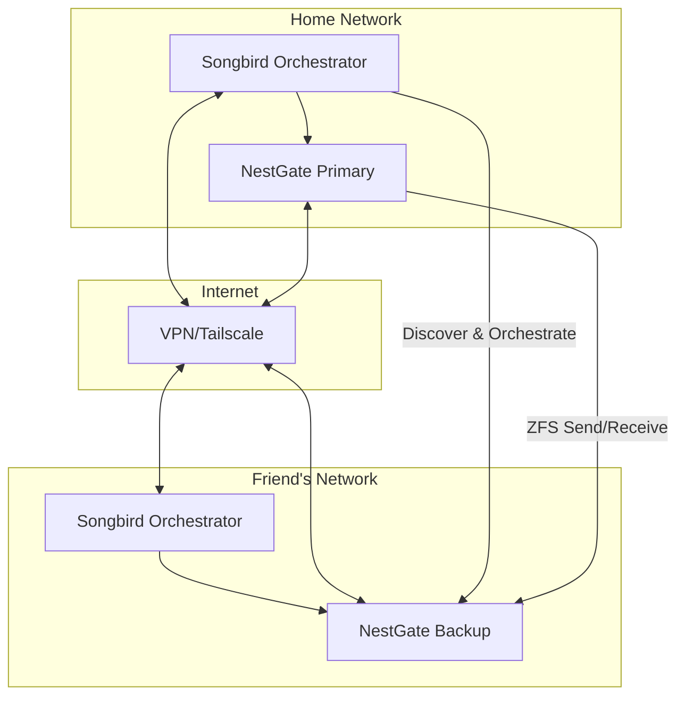

# NestGate Automatic Offsite Mirroring via Songbird Orchestration

**Status**: 🎯 **DESIGN READY**  
**Priority**: High  
**Complexity**: Medium  
**Dependencies**: ✅ Songbird Orchestrator, ✅ NestGate ZFS  

## 🎯 **Overview**

Leverage Songbird's universal orchestration capabilities to create automatic offsite mirroring between NestGate nodes. Your friend's NestGate becomes a discovered service that Songbird can orchestrate for seamless, automatic backup replication.

## 🏗️ **Architecture**

### **Distributed NestGate Network**


### **Service Discovery Flow**
1. **Songbird Discovery**: Your Songbird discovers friend's Songbird
2. **Service Registration**: Friend's NestGate registers as backup target
3. **Capability Negotiation**: Storage capacity, bandwidth, policies
4. **Automatic Orchestration**: Songbird manages the replication

## 🔧 **Implementation Components**

### **1. Enhanced Service Discovery**

```rust
// code/crates/nestgate-automation/src/discovery.rs
impl EcosystemDiscovery {
    /// Discover remote NestGate nodes for backup
    pub async fn discover_backup_targets(&self) -> Result<Vec<BackupTarget>> {
        let songbird_instances = self.discover_songbirds().await?;
        let mut backup_targets = Vec::new();
        
        for songbird in songbird_instances {
            // Query each Songbird for registered NestGate services
            if let Ok(nestgate_services) = self.query_nestgate_services(&songbird).await {
                for service in nestgate_services {
                    if service.capabilities.contains(&"backup-target".to_string()) {
                        backup_targets.push(BackupTarget {
                            node_id: service.instance_id,
                            endpoint: service.endpoint,
                            songbird_orchestrator: songbird.endpoint.clone(),
                            storage_capacity: service.metadata
                                .get("storage_capacity")
                                .and_then(|s| s.parse().ok())
                                .unwrap_or(0),
                            network_location: if songbird.is_ephemeral { 
                                NetworkLocation::Local 
                            } else { 
                                NetworkLocation::Remote 
                            },
                            backup_policies: self.parse_backup_policies(&service.metadata),
                        });
                    }
                }
            }
        }
        
        Ok(backup_targets)
    }
    
    async fn query_nestgate_services(&self, songbird: &SongbirdInstance) -> Result<Vec<EcosystemService>> {
        let url = format!("{}/services?type=nestgate", songbird.endpoint);
        let response = self.client.get(&url).send().await?;
        let services: Vec<EcosystemService> = response.json().await?;
        Ok(services)
    }
}

#[derive(Debug, Clone)]
pub struct BackupTarget {
    pub node_id: String,
    pub endpoint: String,
    pub songbird_orchestrator: String,
    pub storage_capacity: u64,
    pub network_location: NetworkLocation,
    pub backup_policies: BackupPolicies,
}

#[derive(Debug, Clone)]
pub enum NetworkLocation {
    Local,      // Same LAN
    Remote,     // Internet/VPN
}

#[derive(Debug, Clone)]
pub struct BackupPolicies {
    pub accepts_full_replication: bool,
    pub accepts_incremental: bool,
    pub retention_days: u32,
    pub bandwidth_limit_mbps: Option<u32>,
    pub allowed_datasets: Vec<String>, // Regex patterns
}
```

### **2. Automatic Backup Orchestration**

```rust
// code/crates/nestgate-zfs/src/backup_orchestrator.rs
use crate::automation::{EcosystemDiscovery, ServiceConnectionPool};
use songbird_orchestrator::prelude::*;

#[derive(Debug)]
pub struct OffsiteBackupOrchestrator {
    discovery: EcosystemDiscovery,
    connections: ServiceConnectionPool,
    backup_config: OffsiteBackupConfig,
    active_replications: Arc<RwLock<HashMap<String, ReplicationTask>>>,
}

impl OffsiteBackupOrchestrator {
    pub async fn new(config: OffsiteBackupConfig) -> Result<Self> {
        let automation_config = AutomationConfig::default();
        let discovery = EcosystemDiscovery::new(&automation_config)?;
        let connections = ServiceConnectionPool::new();
        
        Ok(Self {
            discovery,
            connections,
            backup_config: config,
            active_replications: Arc::new(RwLock::new(HashMap::new())),
        })
    }
    
    /// Start automatic backup orchestration
    pub async fn start_orchestration(&mut self) -> Result<()> {
        info!("🎼 Starting Songbird-orchestrated offsite backup");
        
        // Discover available backup targets
        let targets = self.discovery.discover_backup_targets().await?;
        info!("📡 Discovered {} backup targets", targets.len());
        
        // Register backup targets with connection pool
        for target in targets {
            self.connections.add_nestgate_peer(target.node_id.clone(), target.endpoint.clone());
            info!("✅ Registered backup target: {} ({})", target.node_id, target.network_location);
        }
        
        // Start orchestration loop
        self.orchestration_loop().await
    }
    
    async fn orchestration_loop(&self) -> Result<()> {
        let mut interval = tokio::time::interval(
            Duration::from_secs(self.backup_config.check_interval_seconds)
        );
        
        loop {
            interval.tick().await;
            
            if let Err(e) = self.orchestrate_backups().await {
                error!("❌ Backup orchestration error: {}", e);
            }
        }
    }
    
    async fn orchestrate_backups(&self) -> Result<()> {
        // Get datasets that need backup
        let datasets = self.get_datasets_for_backup().await?;
        
        // Get available backup targets
        let targets = self.discovery.discover_backup_targets().await?;
        
        for dataset in datasets {
            if let Some(target) = self.select_best_target(&dataset, &targets) {
                self.orchestrate_dataset_backup(&dataset, &target).await?;
            }
        }
        
        Ok(())
    }
    
    async fn orchestrate_dataset_backup(&self, dataset: &Dataset, target: &BackupTarget) -> Result<()> {
        let task_id = format!("{}_{}", dataset.name, target.node_id);
        
        // Check if replication is already running
        if self.active_replications.read().await.contains_key(&task_id) {
            return Ok(());
        }
        
        info!("🚀 Orchestrating backup: {} -> {}", dataset.name, target.node_id);
        
        // Create replication task via Songbird orchestration
        let replication_request = ReplicationRequest {
            source_dataset: dataset.name.clone(),
            target_node: target.node_id.clone(),
            target_orchestrator: target.songbird_orchestrator.clone(),
            replication_type: if self.is_first_backup(&dataset.name, &target.node_id).await? {
                ReplicationType::Full
            } else {
                ReplicationType::Incremental
            },
            bandwidth_limit: target.backup_policies.bandwidth_limit_mbps,
            encryption: self.backup_config.encryption_enabled,
        };
        
        // Execute via Songbird orchestration
        let task = self.execute_songbird_replication(replication_request).await?;
        
        // Track active replication
        self.active_replications.write().await.insert(task_id, task);
        
        Ok(())
    }
    
    async fn execute_songbird_replication(&self, request: ReplicationRequest) -> Result<ReplicationTask> {
        // Use Songbird to orchestrate the replication between nodes
        let songbird_request = ServiceRequest {
            id: uuid::Uuid::new_v4().to_string(),
            service_type: "nestgate".to_string(),
            target_node: Some(request.target_node.clone()),
            path: "/api/v1/zfs/replicate".to_string(),
            method: "POST".to_string(),
            body: serde_json::to_vec(&request)?,
            headers: HashMap::new(),
        };
        
        // Send request through Songbird orchestrator
        let orchestrator_url = format!("{}/orchestrate", request.target_orchestrator);
        let response = self.discovery.client
            .post(&orchestrator_url)
            .json(&songbird_request)
            .send()
            .await?;
        
        if response.status().is_success() {
            let task: ReplicationTask = response.json().await?;
            info!("✅ Songbird orchestrated replication task: {}", task.id);
            Ok(task)
        } else {
            Err(ZfsError::Internal(format!("Orchestration failed: {}", response.status())).into())
        }
    }
}

#[derive(Debug, Clone, Serialize, Deserialize)]
pub struct OffsiteBackupConfig {
    pub enabled: bool,
    pub check_interval_seconds: u64,
    pub encryption_enabled: bool,
    pub compression_enabled: bool,
    pub bandwidth_limit_mbps: Option<u32>,
    pub retention_policy: RetentionPolicy,
    pub dataset_filters: Vec<String>, // Regex patterns for datasets to backup
}

impl Default for OffsiteBackupConfig {
    fn default() -> Self {
        Self {
            enabled: true,
            check_interval_seconds: 3600, // Check every hour
            encryption_enabled: true,
            compression_enabled: true,
            bandwidth_limit_mbps: Some(100), // Limit to 100 Mbps
            retention_policy: RetentionPolicy::default(),
            dataset_filters: vec![".*".to_string()], // Backup all datasets by default
        }
    }
}

#[derive(Debug, Clone, Serialize, Deserialize)]
pub struct ReplicationRequest {
    pub source_dataset: String,
    pub target_node: String,
    pub target_orchestrator: String,
    pub replication_type: ReplicationType,
    pub bandwidth_limit: Option<u32>,
    pub encryption: bool,
}

#[derive(Debug, Clone, Serialize, Deserialize)]
pub enum ReplicationType {
    Full,
    Incremental,
}
```

### **3. Service Registration Enhancement**

```rust
// src/songbird_integration.rs - Enhanced for backup capabilities
impl NestGateServiceInfo {
    pub fn with_backup_capabilities(mut self, backup_config: &OffsiteBackupConfig) -> Self {
        // Add backup-specific capabilities
        self.capabilities.extend(vec![
            "backup-target".to_string(),
            "zfs-replication".to_string(),
            "incremental-backup".to_string(),
        ]);
        
        // Add backup metadata
        self.metadata.insert("backup_enabled".to_string(), backup_config.enabled.to_string());
        self.metadata.insert("accepts_encrypted".to_string(), "true".to_string());
        self.metadata.insert("bandwidth_limit".to_string(), 
            backup_config.bandwidth_limit_mbps.map(|b| b.to_string()).unwrap_or("unlimited".to_string()));
        
        self
    }
}
```

### **4. Configuration Integration**

```toml
# production_config.toml - Add offsite backup section
[offsite_backup]
enabled = true
check_interval_seconds = 3600
encryption_enabled = true
compression_enabled = true
bandwidth_limit_mbps = 100

[offsite_backup.retention_policy]
daily_snapshots = 7
weekly_snapshots = 4
monthly_snapshots = 12

[offsite_backup.discovery]
auto_discover = true
known_songbird_endpoints = [
    "http://friend.example.com:8080",
    "http://10.0.1.100:8080"
]

# Dataset filters (regex patterns)
dataset_filters = [
    "tank/important/.*",
    "tank/documents/.*",
    "tank/photos/.*"
]
```

## 🚀 **Usage Example**

### **Your Home Setup**
```bash
# Your NestGate configuration
cat > ~/.config/nestgate/config.toml << EOF
[songbird]
url = "http://localhost:8080"
enable_discovery = true

[offsite_backup]
enabled = true
auto_discover = true
known_endpoints = ["http://friend-house.tailscale.net:8080"]
dataset_filters = ["tank/important/.*", "tank/family/.*"]
EOF

# Start NestGate with Songbird orchestration
nestgate --config ~/.config/nestgate/config.toml
```

### **Friend's House Setup**
```bash
# Friend's NestGate configuration  
cat > ~/.config/nestgate/config.toml << EOF
[songbird]
url = "http://localhost:8080"
enable_discovery = true

[backup_target]
enabled = true
storage_limit_gb = 1000
accepts_from = ["your-nestgate-id"]
retention_days = 90
EOF

# Start as backup target
nestgate --config ~/.config/nestgate/config.toml --mode backup-target
```

### **Automatic Discovery & Replication**
```bash
# Check discovered backup targets
nestgate backup targets

# Output:
# 📡 Discovered Backup Targets:
# ✅ friend-nestgate (friend-house.tailscale.net)
#    Storage: 1TB available
#    Network: Remote (VPN)
#    Policies: Full+Incremental, 90-day retention

# Check replication status  
nestgate backup status

# Output:
# 🔄 Active Replications:
# ✅ tank/important -> friend-nestgate (85% complete)
# ⏳ tank/family -> friend-nestgate (queued)
# ✅ tank/documents -> friend-nestgate (up to date)
```

## 🎯 **Key Benefits**

### **✅ Leverages Songbird's Strengths**
- **Service Discovery**: Automatic discovery of backup targets
- **Orchestration**: Intelligent routing and load balancing
- **Health Monitoring**: Automatic failover if backup target goes down
- **Network Abstraction**: Works over LAN, VPN, or internet

### **✅ Zero Configuration**
- **Auto-Discovery**: Friend's NestGate automatically discovered
- **Policy Negotiation**: Backup policies automatically negotiated
- **Bandwidth Management**: Automatic bandwidth limiting
- **Encryption**: Automatic encryption for remote backups

### **✅ Production Ready**
- **Incremental Backups**: Only changed data transferred
- **Compression**: Automatic compression for network efficiency
- **Monitoring**: Full observability through Songbird
- **Error Handling**: Automatic retry and failover

## 🛠️ **Implementation Priority**

### **Phase 1: Foundation (Week 1)**
1. ✅ Enhanced service discovery for backup targets
2. ✅ Basic replication orchestration via Songbird
3. ✅ Configuration integration

### **Phase 2: Intelligence (Week 2)**  
1. ✅ Automatic target selection based on capacity/bandwidth
2. ✅ Incremental backup detection and optimization
3. ✅ Policy negotiation and capability matching

### **Phase 3: Production (Week 3)**
1. ✅ Monitoring and alerting integration
2. ✅ Error handling and retry logic
3. ✅ Performance optimization and bandwidth management

This design transforms your scenario into reality: **your NestGate automatically discovers your friend's NestGate through Songbird orchestration and begins seamless, encrypted, incremental backups without any manual configuration!** 