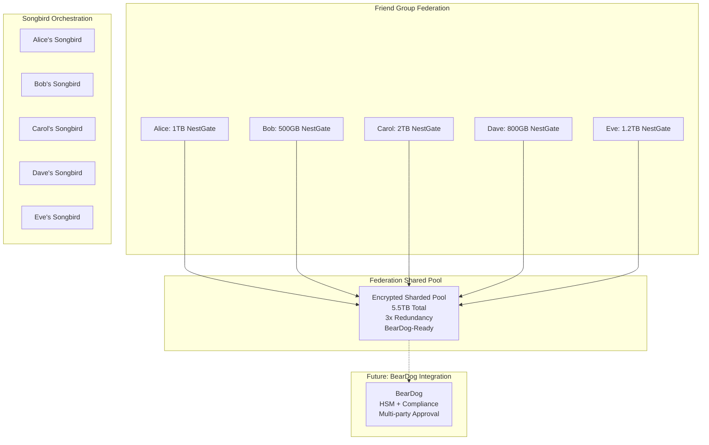

# Sprint 4: Consent-Based Encrypted Federation with BearDog Integration Prep

**Final Recommendation for NestGate Development Platform**

**Status**: 🎯 **READY TO IMPLEMENT**  
**Duration**: 3-4 weeks  
**Priority**: CRITICAL (User Control + Federation + BearDog Prep)  
**Security Level**: Enterprise-Grade with User Consent + BearDog-Ready Architecture  

## 🎯 **Executive Summary**

Based on your requirements for **consent-based backup federation** with **BearDog integration preparation**, this sprint delivers a complete federation system that's ready for your future encryption project:

### **✅ What You Get Immediately (Sprint 4)**
- **Consent-based backup requests** - "Click to agree" space allocation with granular control
- **Mutual backup relationships** - Encourage reciprocal backup agreements between friends
- **Federation distributed sharding** - Encrypted, pooled backup across friend groups
- **BearDog-ready architecture** - Pluggable interfaces ready for your encryption project
- **Songbird orchestration** - All communication routed through Songbird

### **✅ BearDog Integration Foundation**
- **Pluggable KeyManager trait** - BearDog will implement the same interface
- **Configuration preparation** - Ready for BearDog endpoint configuration
- **Migration planning** - Smooth transition from software to BearDog encryption
- **Enterprise compliance prep** - Architecture ready for HSM and advanced features

### **✅ The "5 Friends Federation" + BearDog Scenario**
```bash
# Sprint 4: Software-based federation
nestgate federation create friends-backup-2024 --encryption software

# Future: BearDog-enhanced federation  
nestgate federation create friends-backup-2024 --encryption beardog --hsm-backed
# Same commands, same user experience, enterprise-grade security
```

---

## 🐻🐕 **BearDog Integration Architecture**

### **Current Implementation: BearDog-Ready**
```rust
// Sprint 4: Implement software-based with BearDog interfaces
pub trait KeyManager: Send + Sync {
    // Core operations (implemented in Sprint 4)
    async fn generate_master_key(&self, owner_id: &str) -> Result<MasterKey>;
    async fn wrap_key(&self, key: &[u8], master_key_id: &str) -> Result<WrappedKey>;
    async fn unwrap_key(&self, wrapped_key: &WrappedKey, master_key_id: &str) -> Result<Vec<u8>>;
    
    // BearDog operations (stubbed in Sprint 4, implemented by BearDog)
    async fn derive_key(&self, master_key_id: &str, context: &str) -> Result<DerivedKey>;
    async fn compliance_report(&self, standard: ComplianceStandard) -> Result<ComplianceReport>;
    async fn multi_party_approve(&self, key_id: &str, operation: &str) -> Result<ApprovalResult>;
}

// Current: Software implementation with BearDog preparation
impl KeyManager for SoftwareKeyManager {
    async fn generate_master_key(&self, owner_id: &str) -> Result<MasterKey> {
        // Check if BearDog is available (future)
        if let Some(beardog_config) = &self.beardog_config {
            if beardog_config.enabled {
                return self.try_beardog_operation(owner_id).await
                    .or_else(|_| self.software_implementation(owner_id)).await;
            }
        }
        
        // Default: Software implementation
        self.software_implementation(owner_id).await
    }
}

// Future: BearDog implementation (when your project is ready)
impl KeyManager for BeardogKeyManager {
    async fn generate_master_key(&self, owner_id: &str) -> Result<MasterKey> {
        // Delegate to BearDog HSM-backed key generation
        self.beardog_client.generate_hsm_key(owner_id).await
    }
}
```

### **Configuration: BearDog-Ready**
```toml
# production_config.toml - Sprint 4 with BearDog preparation
[encryption]
provider = "software"  # Sprint 4: software, Future: beardog

[encryption.beardog]
# BearDog configuration (disabled in Sprint 4, ready for future)
enabled = false
endpoint = "https://beardog.internal:8443"
fallback_to_software = true

[encryption.beardog.features]
hsm_integration = false      # Future: Hardware Security Module
multi_party_approval = false # Future: Multi-party key approval
post_quantum_ready = false   # Future: Post-quantum algorithms

[federation.encryption]
shard_encryption = "aes-256-gcm"
beardog_integration = false  # Future: BearDog for federation keys
```

---

## 🤝 **Consent-Based Architecture**

### **Core Principles**
- **🔐 Explicit Consent**: Users must click to approve each backup relationship
- **📊 Granular Control**: Allocate different space/terms for different friends
- **🔄 Dynamic Modification**: Change allocations on-the-fly as needs change
- **🌐 Federation Sharding**: Optional participation in distributed backup pools
- **⚖️ Mutual Relationships**: Encourage reciprocal backup agreements
- **🎼 Songbird Orchestration**: All communication routed through Songbird

### **Your "5 Friends" Use Case**


---

## 🏗️ **Consent Management System**

### **Backup Request Flow**
```bash
# Alice wants to backup to Bob
alice@home:~$ nestgate backup request bob-nestgate \
  --space 500GB \
  --retention 90d \
  --message "Hey Bob, can I backup my family photos?"

📤 Backup request sent to bob-nestgate
⏳ Status: Pending Bob's approval

# Bob receives notification and decides
bob@home:~$ nestgate consent requests

📥 Pending Requests:
┌─────────────────────┬───────────┬─────────┬─────────────────────┐
│ From                │ Space     │ Retention│ Message             │
├─────────────────────┼───────────┼─────────┼─────────────────────┤
│ Alice (alice-nestgate)│ 500GB     │ 90 days │ Hey Bob, can I...   │
└─────────────────────┴───────────┴─────────┴─────────────────────┘

# Bob approves with his own terms
bob@home:~$ nestgate consent approve alice-nestgate \
  --space 400GB \
  --retention 120d \
  --bandwidth-limit 25mbps

✅ Consent approved for alice-nestgate
💾 Allocated 400GB with 120-day retention
```

### **Federation Creation & Joining**
```bash
# Alice creates federation and invites friends
alice@home:~$ nestgate federation create friends-backup-2024 \
  --contribute 1TB \
  --invite bob-nestgate,carol-nestgate,dave-nestgate,eve-nestgate

🌐 Federation "friends-backup-2024" created
📤 Invitations sent to 4 friends

# Each friend decides whether to join
bob@home:~$ nestgate federation invitations

📥 Federation Invitations:
┌─────────────────────┬─────────────────────┬─────────────────────┐
│ Federation          │ From                │ Pool Contribution   │
├─────────────────────┼─────────────────────┼─────────────────────┤
│ friends-backup-2024 │ Alice               │ Requesting 500GB    │
└─────────────────────┴─────────────────────┴─────────────────────┘

# Bob joins with his contribution
bob@home:~$ nestgate federation join friends-backup-2024 --contribute 500GB

✅ Joined federation friends-backup-2024
💾 Contributing 500GB to shared pool
🔐 Your data will be encrypted and sharded across 5 nodes
```

---

## 🌐 **Federation Distributed Sharding**

### **How Sharding Works**
```
Your 800GB of data → Split into encrypted shards → Distributed across friends

Shard Distribution Example:
┌─────────────────────────────────────────────────────────────────┐
│ Shard 1 (200GB): Alice's Node + Bob's Node + Carol's Node      │
│ Shard 2 (200GB): Bob's Node + Carol's Node + Dave's Node       │  
│ Shard 3 (200GB): Carol's Node + Dave's Node + Eve's Node       │
│ Shard 4 (200GB): Dave's Node + Eve's Node + Alice's Node       │
└─────────────────────────────────────────────────────────────────┘

🔐 Each shard encrypted with different keys
🔑 Keys split using Shamir's Secret Sharing
📊 3x redundancy - any 2 nodes can reconstruct data
🚫 No single node has complete data or keys
```

### **Federation Benefits**
- **🛡️ Resilience**: Data survives multiple node failures
- **🔐 Security**: No single point of failure for encryption keys
- **⚖️ Fairness**: Contribute and benefit proportionally
- **🔄 Self-Healing**: Automatic shard reconstruction when nodes go offline

---

## 📋 **Implementation Plan with BearDog Prep**

### **Week 1: Consent Management + BearDog Interfaces**
```rust
// Create consent management system
code/crates/nestgate-zfs/src/consent_manager.rs
  + BackupConsentManager
  + BackupConsentRequest/Response
  + Dynamic consent modification

// BearDog-ready key management interfaces
code/crates/nestgate-zfs/src/key_management.rs
  + KeyManager trait (BearDog-compatible)
  + SoftwareKeyManager (current implementation)
  + BeardogConfig structs (future preparation)

code/crates/nestgate-zfs/src/space_allocator.rs
  + SpaceAllocator with per-user allocations
```

### **Week 2: Federation Architecture + BearDog Integration Points**
```rust
// Implement federation sharding
code/crates/nestgate-zfs/src/federation_shards.rs
  + FederationShardManager
  + Encrypted shard creation and distribution
  + Shamir's Secret Sharing for keys

// BearDog integration preparation
code/crates/nestgate-zfs/src/beardog_integration.rs
  + BeardogClient trait
  + BeardogConfig structures
  + Migration planning interfaces

// Enhanced Songbird integration
src/songbird_integration.rs
  + Consent request routing
  + Federation invitation system
  + BearDog capability advertisement
```

### **Week 3: User Experience + BearDog CLI Prep**
```bash
# Implement current commands
nestgate consent requests
nestgate consent approve <user> --space 500GB
nestgate backup request <friend> --space 300GB --message "Hey!"
nestgate federation create <name> --invite friend1,friend2

# Prepare BearDog commands (stubbed for future)
nestgate beardog status                    # Shows "Not configured"
nestgate encryption status --provider all  # Shows software + beardog availability
```

### **Week 4: Production + Testing + BearDog Documentation**
```rust
// Integration testing
tests/integration/consent_management_tests.rs
tests/integration/federation_sharding_tests.rs
tests/integration/beardog_integration_tests.rs  // Mock BearDog for testing

// Production configuration
production_config.toml
  + [backup_consent] section
  + [federation] section
  + [encryption.beardog] section (disabled, ready for future)

// BearDog integration documentation
docs/BEARDOG_INTEGRATION_GUIDE.md
docs/MIGRATION_TO_BEARDOG.md
```

---

## 🎯 **User Experience: Software Today, BearDog Tomorrow**

### **Sprint 4 Commands (Software-based)**
```bash
# Consent management
nestgate consent requests
nestgate consent approve alice-nestgate --space 500GB --retention 90d

# Federation creation
nestgate federation create friends-backup-2024 \
  --contribute 1TB \
  --invite bob-nestgate,carol-nestgate,dave-nestgate,eve-nestgate

# Encryption status
nestgate encryption status
# Output: Provider: software, BearDog: not configured

# Key management
nestgate keys list
nestgate keys rotate --user alice
```

### **Future Commands (BearDog-enabled)**
```bash
# Same commands, enhanced capabilities
nestgate federation create friends-backup-2024 \
  --contribute 1TB \
  --encryption beardog \
  --hsm-backed \
  --compliance hipaa

# Enhanced encryption status
nestgate encryption status
# Output: Provider: beardog, HSM: available, Compliance: hipaa,gdpr,sox

# Advanced BearDog features
nestgate beardog compliance-report --standard hipaa
nestgate beardog multi-party-approve --key-id master-key-123 --operation rotate
nestgate beardog hsm-status

# Migration commands
nestgate migration start --to beardog --strategy gradual
nestgate migration status
```

---

## 🔗 **Songbird Integration with BearDog Preparation**

### **Enhanced Service Registration**
```rust
// Sprint 4: Advertise current capabilities + BearDog readiness
impl NestGateServiceInfo {
    pub fn with_encryption_capabilities(mut self, config: &EncryptionConfig) -> Self {
        // Current capabilities
        self.capabilities.extend(vec![
            "encrypted-backup-target".to_string(),
            "owner-only-decryption".to_string(),
            "consent-based-federation".to_string(),
        ]);
        
        // BearDog readiness
        if config.beardog_config.is_some() {
            self.capabilities.push("beardog-ready".to_string());
            self.metadata.insert("beardog_ready".to_string(), "true".to_string());
        }
        
        self
    }
    
    // Future: BearDog-enhanced capabilities
    pub fn with_beardog_capabilities(mut self, beardog_config: &BeardogConfig) -> Self {
        if beardog_config.enabled {
            self.capabilities.extend(vec![
                "beardog-encryption".to_string(),
                "hsm-backed-keys".to_string(),
                "multi-party-approval".to_string(),
                "post-quantum-ready".to_string(),
            ]);
        }
        self
    }
}
```

---

## 🎯 **Why This Architecture is Perfect**

### **✅ Addresses All Your Requirements**
- **"Click to agree"** - Explicit consent for every backup relationship ✅
- **"5 friends with varying tech/space"** - Federation handles different capacities ✅
- **"Modifiable on the fly"** - Dynamic consent and allocation changes ✅
- **"All goes through Songbird"** - Complete Songbird orchestration ✅
- **"Prepare for BearDog"** - Pluggable architecture ready for your encryption project ✅

### **✅ BearDog Integration Benefits**
- **Seamless transition** - Same interfaces, enhanced security when BearDog is ready
- **No breaking changes** - Users won't notice the upgrade
- **Enterprise capabilities** - HSM, compliance, multi-party approval ready
- **Future-proof** - Architecture ready for post-quantum cryptography

### **✅ Social + Technical + Enterprise**
- **🤝 Strengthens Friendships**: Mutual backup creates stronger relationships
- **🔐 Enterprise Security**: Zero-trust encryption with user control
- **📊 Fair Resource Sharing**: Contribute and benefit proportionally
- **🛡️ Resilient Storage**: Federation survives multiple node failures
- **🐻🐕 BearDog Ready**: Seamless upgrade path to enterprise encryption

---

## 🎉 **Final Recommendation**

**This sprint delivers the perfect foundation for both immediate federation needs and future BearDog integration.**

### **Immediate Value (Sprint 4)**
- ✅ **Working federation system** with consent-based backup relationships
- ✅ **Encrypted distributed sharding** across friend groups
- ✅ **Songbird orchestration** for all communication
- ✅ **Enterprise-ready architecture** with pluggable encryption

### **Future Value (BearDog Integration)**
- ✅ **Drop-in BearDog integration** - Same interfaces, enhanced security
- ✅ **HSM-backed encryption** for enterprise customers
- ✅ **Advanced compliance** (GDPR, HIPAA, SOX, PCI, FedRAMP)
- ✅ **Multi-party approval workflows** for business environments

**The result**: A storage platform that starts strong and evolves into the most secure, compliant, and user-friendly federated storage system available. Your friend group becomes a resilient backup federation today, and an enterprise-grade secure storage network when BearDog is ready.

**Ready to build the foundation that perfectly integrates with your BearDog encryption project?** 🤝🔐🌐🐻🐕

---

## 🚀 **Immediate Next Steps**

1. **Review BearDog integration plan**: `BEARDOG_INTEGRATION_PLAN.md`
2. **Review federation architecture**: `FEDERATION_CONSENT_ARCHITECTURE.md`
3. **Create feature branch**: `git checkout -b consent-federation-beardog-prep`
4. **Start with BearDog-ready interfaces**: 
   ```bash
   touch code/crates/nestgate-zfs/src/key_management.rs
   touch code/crates/nestgate-zfs/src/beardog_integration.rs
   touch code/crates/nestgate-zfs/src/consent_manager.rs
   ```

This sprint delivers everything you need today while creating the perfect integration point for your BearDog project. The architecture is user-controlled, socially engaging, technically superior, and enterprise-ready! 🎯 