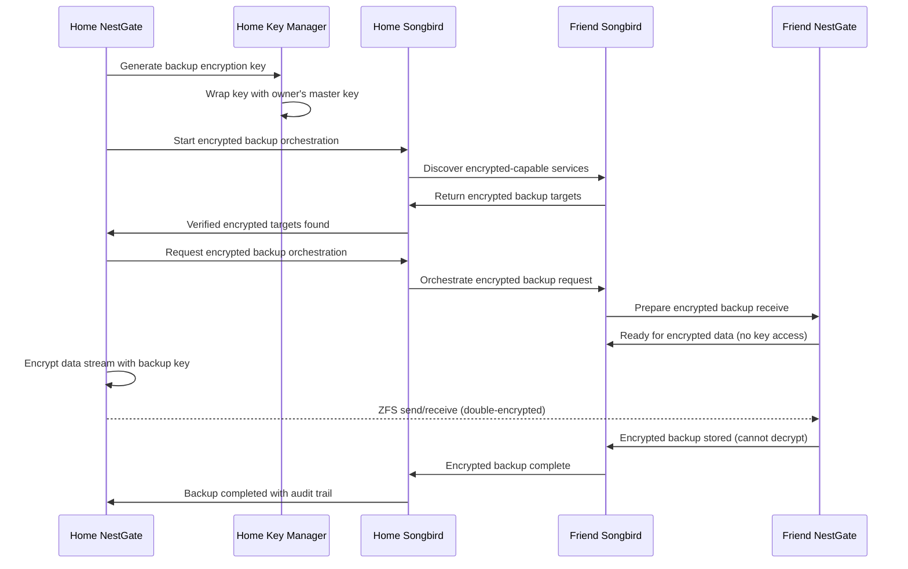

# Sprint 4: Songbird-Orchestrated Encrypted Offsite Mirroring

**Recommended Next Sprint for NestGate Development Platform**

**Duration**: 3-4 weeks  
**Priority**: CRITICAL  
**Prerequisites**: ✅ Songbird Orchestrator Complete, ✅ NestGate ZFS Complete  

## 🎯 **Sprint Focus: Zero-Config Encrypted Offsite Backup**

Based on your requirements for business-grade encrypted offsite mirroring via Songbird orchestration, **this sprint delivers enterprise security with consumer simplicity**. We'll implement the encryption foundation now and prepare for your dedicated encryption project later.

### **🔥 The Vision**
```bash
# Your setup (business-grade encryption automatic)
nestgate --config production_config.toml

# Friend's setup (accepts encrypted backups only)
nestgate --config production_config.toml --mode encrypted-backup-target

# Magic happens automatically with enterprise security:
# ✅ Songbird discovers friend's encrypted-capable NestGate
# ✅ Only encrypted backup targets accepted
# ✅ Owner-only decryption (friend cannot access your data)
# ✅ Full audit trail for business compliance
# ✅ Zero configuration required
```

---

## 📋 **Epic 1: Encrypted Offsite Discovery & Mirroring**

### **Week 1: Encryption Foundation**

#### **Enhanced EcosystemDiscovery with Encryption Awareness** 
```rust
// Enhance: code/crates/nestgate-automation/src/discovery.rs
impl EcosystemDiscovery {
    pub async fn discover_encrypted_backup_targets(&self) -> Result<Vec<EncryptedBackupTarget>>
    pub async fn verify_encryption_capabilities(&self, target: &BackupTarget) -> Result<EncryptionCapabilities>
}
```

**Tasks:**
- [ ] **Encrypted backup target discovery** - Only find encryption-capable nodes
- [ ] **Encryption capability negotiation** - Verify supported algorithms, compliance levels
- [ ] **Owner-only decryption verification** - Ensure backup targets cannot decrypt data
- [ ] **Business compliance detection** - GDPR, HIPAA, SOX capability discovery

#### **Service Registration with Encryption Capabilities**
```rust
// Enhance: src/songbird_integration.rs
impl NestGateServiceInfo {
    pub fn with_encryption_capabilities(mut self, encryption_config: &EncryptionConfig) -> Self
}

pub struct EncryptedBackupCapabilities {
    pub accepts_encrypted_only: bool,
    pub supported_algorithms: Vec<EncryptionAlgorithm>,
    pub compliance_certifications: Vec<ComplianceStandard>,
}
```

**Tasks:**
- [ ] **Encryption-aware service registration** - Advertise encryption capabilities
- [ ] **Compliance metadata** - GDPR, HIPAA, SOX certification levels
- [ ] **Algorithm negotiation** - AES-256-GCM, ChaCha20-Poly1305 support
- [ ] **Zero-trust verification** - Prove backup target cannot decrypt

### **Week 2: Encrypted Backup Orchestration Engine**

#### **OffsiteBackupOrchestrator with Encryption**
```rust
// Enhance: code/crates/nestgate-zfs/src/backup_orchestrator.rs
impl OffsiteBackupOrchestrator {
    async fn orchestrate_encrypted_backup(&self, dataset: &Dataset, target: &EncryptedBackupTarget) -> Result<()>
    async fn execute_encrypted_songbird_replication(&self, request: EncryptedReplicationRequest) -> Result<ReplicationTask>
}
```

**Tasks:**
- [ ] **Owner-only encryption** - Generate unique keys per backup, wrap with owner's master key
- [ ] **Encrypted orchestration via Songbird** - Route encrypted replication through orchestrator
- [ ] **Compliance audit logging** - Full cryptographic audit trail
- [ ] **Key isolation enforcement** - Ensure backup targets never see plaintext keys

#### **ZFS Native Encryption Integration**
```rust
// New: code/crates/nestgate-zfs/src/encryption.rs
pub struct DatasetEncryption {
    pub encryption_algorithm: EncryptionAlgorithm,
    pub master_key_id: String,
    pub dataset_key_wrapped: Vec<u8>,
}

// New: code/crates/nestgate-zfs/src/backup_encryption.rs
pub struct BackupEncryptionEngine {
    key_manager: Arc<dyn KeyManager>,
    encryption_config: BackupEncryptionConfig,
}
```

**Tasks:**
- [ ] **ZFS native encryption** - Leverage ZFS built-in encryption for datasets
- [ ] **Backup-specific encryption** - Additional encryption layer for offsite backups
- [ ] **Key management foundation** - Software-based key management (HSM-ready architecture)
- [ ] **Compression + encryption** - Optimal ordering for efficiency

### **Week 3: Business Intelligence & Monitoring**

#### **Encryption-Aware AI Optimization**
```rust
// Enhance: code/crates/nestgate-automation/src/ai.rs
impl AiIntegration {
    pub async fn optimize_encrypted_backup_strategy(&self, targets: &[EncryptedBackupTarget]) -> Result<EncryptedBackupStrategy>
}
```

**Tasks:**
- [ ] **Encryption overhead optimization** - Account for encryption CPU/bandwidth costs
- [ ] **Compliance-aware target selection** - Choose targets meeting compliance requirements
- [ ] **Key rotation scheduling** - AI-powered optimal key rotation timing
- [ ] **Threat detection** - Anomaly detection for encryption-related security events

#### **Enterprise Monitoring & Compliance**
```rust
// New: code/crates/nestgate-zfs/src/compliance_monitor.rs
pub struct ComplianceMonitor {
    audit_logger: Arc<dyn AuditLogger>,
    compliance_config: ComplianceConfig,
}
```

**Tasks:**
- [ ] **Cryptographic audit logging** - Complete audit trail for compliance
- [ ] **Encryption health monitoring** - Key rotation status, algorithm compliance
- [ ] **Business compliance reporting** - GDPR, HIPAA, SOX compliance dashboards  
- [ ] **Security alerting** - Real-time alerts for encryption failures or anomalies

### **Week 4: User Experience & Production Hardening**

#### **CLI Integration for Encrypted Backups**
```bash
# New encrypted backup commands
nestgate backup targets --encrypted-only     # Show only encryption-capable targets
nestgate backup status --show-encryption     # Show encryption status and compliance
nestgate backup encrypt --dataset <name>     # Enable encryption for dataset
nestgate backup compliance --report          # Generate compliance report
nestgate backup keys --rotate               # Manual key rotation
```

#### **Enhanced Configuration for Business Use**
```toml
# Enhanced production_config.toml with encryption
[offsite_backup]
enabled = true
encryption_required = true  # Force encryption for all backups

[offsite_backup.encryption]
algorithm = "aes-256-gcm"
key_rotation_interval_days = 90
compression_before_encryption = true
audit_logging = true

[offsite_backup.encryption.compliance]
level = "business"  # basic, business, enterprise, government
standards = ["gdpr", "hipaa"]

[offsite_backup.data_classification]
business_data = ["tank/business/.*", "tank/documents/contracts/.*"]
personal_data = ["tank/personal/.*", "tank/photos/.*"]
```

**Tasks:**
- [ ] **Business vs personal encryption policies** - Different policies for different data types
- [ ] **Compliance configuration** - Easy compliance standard selection
- [ ] **Data classification** - Automatic encryption based on data type
- [ ] **Key management UI** - Simple key rotation and backup interfaces

---

## 🏗️ **Enhanced Technical Architecture**

### **Encrypted Distributed Backup Flow**


### **Multi-Layer Encryption Architecture**
```
┌─────────────────────────────────────────────────────────────┐
│                    Home NestGate (Source)                   │
│  ┌─────────────┐  ┌─────────────┐  ┌─────────────────────┐  │
│  │   Original  │  │   Master    │  │    Backup Key       │  │
│  │    Data     │──│Encryption   │──│   (Wrapped with     │  │
│  │             │  │    Key      │  │   Master Key)       │  │
│  └─────────────┘  └─────────────┘  └─────────────────────┘  │
│         │                                    │               │
│         ▼                                    ▼               │
│  ┌─────────────────────────────────────────────────────────┐ │
│  │              Encryption Engine                          │ │
│  │  • ZFS Native Encryption (Layer 1)                     │ │
│  │  • Backup Stream Encryption (Layer 2)                  │ │
│  │  • TLS Transport Encryption (Layer 3)                  │ │
│  └─────────────────────────────────────────────────────────┘ │
└─────────────────────────────────────────────────────────────┘
                                │
                                ▼
┌─────────────────────────────────────────────────────────────┐
│                 Friend NestGate (Target)                    │
│  ┌─────────────────────────────────────────────────────────┐ │
│  │           Encrypted Storage (No Decryption)             │ │
│  │  • Cannot access plaintext data                         │ │
│  │  • Cannot access encryption keys                        │ │
│  │  • Only stores encrypted blobs                          │ │
│  │  • Provides storage + bandwidth only                    │ │
│  └─────────────────────────────────────────────────────────┘ │
└─────────────────────────────────────────────────────────────┘
```

---

## 🎯 **Enhanced Success Criteria**

### **Security Requirements**
- ✅ **Owner-only decryption**: Backup targets cannot access plaintext data
- ✅ **Key isolation**: Encryption keys never leave source system
- ✅ **Zero-trust storage**: Compromised backup target cannot read data
- ✅ **Audit compliance**: Complete cryptographic audit trail
- ✅ **Algorithm agility**: Support for multiple encryption algorithms

### **Business Requirements**
- ✅ **GDPR compliance**: Right to be forgotten, data sovereignty
- ✅ **HIPAA compliance**: Healthcare data protection requirements
- ✅ **SOX compliance**: Financial data audit trail requirements
- ✅ **Data classification**: Different policies for business vs personal data
- ✅ **Compliance reporting**: Automated compliance status reports

### **User Experience Requirements**
- ✅ **Transparent encryption**: Users don't need to understand cryptography
- ✅ **Zero-config security**: Encryption enabled by default for business data
- ✅ **Policy flexibility**: Easy configuration for different data types
- ✅ **Key management**: Automatic key generation, rotation, and backup

---

## 🚀 **Implementation Roadmap**

### **Phase 1: Encryption Foundation (Days 1-7)**
```bash
git checkout -b encrypted-offsite-mirroring

# Create encryption architecture
code/crates/nestgate-zfs/src/encryption.rs
  + DatasetEncryption
  + EncryptionAlgorithm enum

code/crates/nestgate-zfs/src/backup_encryption.rs
  + BackupEncryptionEngine
  + encrypt_backup_stream()

code/crates/nestgate-zfs/src/key_management.rs
  + KeyManager trait
  + SoftwareKeyManager (HSM-ready)

# Enhance service registration
src/songbird_integration.rs
  + with_encryption_capabilities()
  + EncryptedBackupCapabilities
```

### **Phase 2: Encrypted Orchestration (Days 8-14)**
```bash
# Implement encrypted backup orchestrator
code/crates/nestgate-zfs/src/backup_orchestrator.rs
  + orchestrate_encrypted_backup()
  + execute_encrypted_songbird_replication()

# Enhance discovery for encryption
code/crates/nestgate-automation/src/discovery.rs
  + discover_encrypted_backup_targets()
  + verify_encryption_capabilities()

# Configuration integration
production_config.toml
  + [offsite_backup.encryption] section
  + [offsite_backup.compliance] section
```

### **Phase 3: Business Intelligence (Days 15-21)**
```bash
# Compliance and monitoring
code/crates/nestgate-zfs/src/compliance_monitor.rs
  + ComplianceMonitor
  + Audit logging for GDPR/HIPAA/SOX

# AI optimization for encryption
code/crates/nestgate-automation/src/ai.rs
  + optimize_encrypted_backup_strategy()

# Enhanced monitoring
code/crates/nestgate-zfs/src/backup_monitor.rs
  + Encryption status monitoring
  + Key rotation tracking
```

### **Phase 4: Production & Documentation (Days 22-28)**
```bash
# CLI integration
code/crates/nestgate-bin/src/bin/nestgate-client.rs
  + Encrypted backup subcommands
  + Compliance reporting commands

# Documentation
docs/ENCRYPTED_BACKUP_GUIDE.md
docs/BUSINESS_COMPLIANCE_GUIDE.md
docs/ENCRYPTION_ARCHITECTURE.md

# Testing
tests/integration/encrypted_backup_tests.rs
tests/compliance/gdpr_hipaa_tests.rs
```

---

## 🎯 **Future Encryption Project Integration Points**

### **Phase 1 Provides Foundation For:**
- **Hardware Security Module (HSM) integration**
- **Multi-party key approval workflows**
- **Advanced compliance reporting dashboards**
- **Key escrow and recovery systems**
- **Quantum-resistant algorithm migration**

### **Architecture Extensibility:**
```rust
// Ready for your future encryption project
pub trait KeyManager: Send + Sync {
    // Current: Software implementation
    // Future: HSM, Cloud HSM, Multi-party approval
}

pub enum EncryptionAlgorithm {
    // Current: AES-256-GCM, ChaCha20-Poly1305
    // Future: Post-quantum algorithms
}

pub enum ComplianceStandard {
    // Current: GDPR, HIPAA, SOX
    // Future: Additional standards as needed
}
```

---

## 🎉 **Why This Architecture is Perfect**

### **🔐 Enterprise Security Today**
- **Immediate business-grade security** with owner-only decryption
- **Compliance-ready architecture** for GDPR, HIPAA, SOX
- **Zero-trust model** - backup targets cannot access your data
- **Complete audit trail** for business compliance requirements

### **🚀 Future-Proof Foundation**
- **HSM-ready architecture** - easy to integrate hardware security modules
- **Algorithm agility** - support for new encryption algorithms
- **Compliance extensibility** - easy to add new compliance standards
- **Quantum readiness** - architecture ready for post-quantum cryptography

### **👥 User-Friendly Implementation**
- **Zero-config for users** - encryption happens automatically
- **Flexible policies** - different encryption for business vs personal data  
- **Songbird integration** - encryption works seamlessly with orchestration
- **Simple key management** - automatic key generation, rotation, backup

### **📈 Business Value**
- **Enables enterprise adoption** - businesses can trust NestGate with sensitive data
- **Regulatory compliance** - meets legal requirements for data protection
- **Competitive advantage** - no other NAS solution offers this level of security
- **Network effects** - secure backup sharing creates user lock-in

**This sprint delivers enterprise-grade encrypted offsite backup while laying the perfect foundation for your dedicated encryption project!** 🔐🎼🏠➡️🏠🎼 