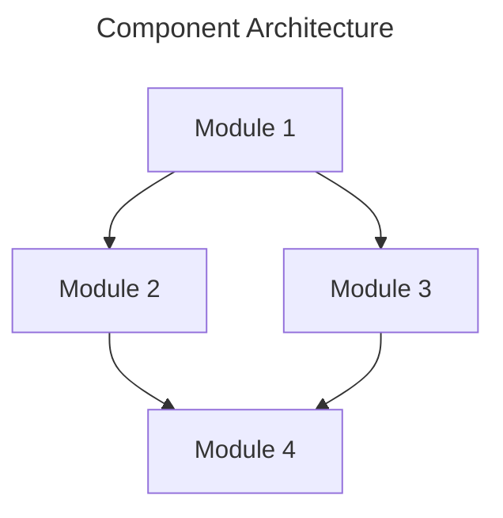
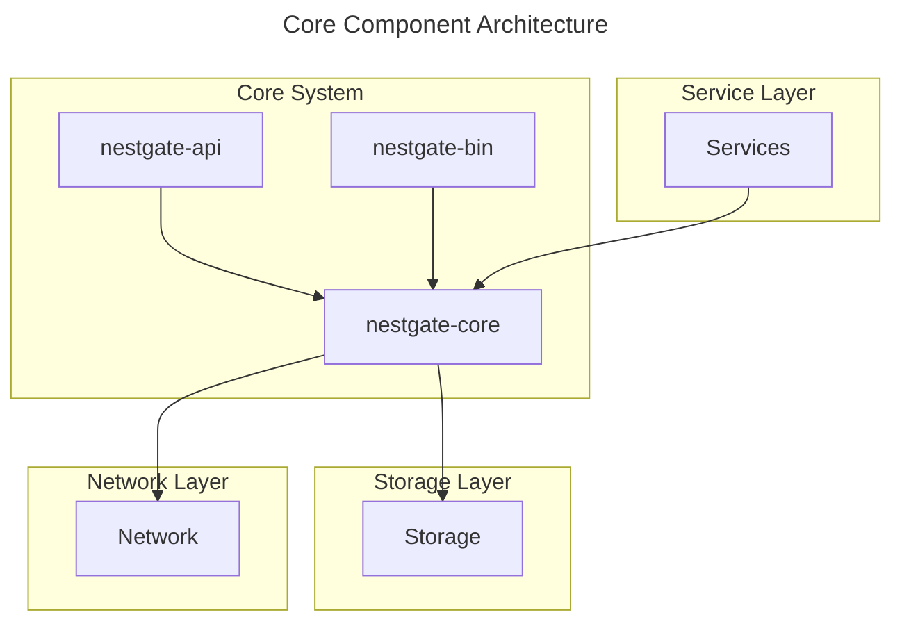

# Component Name Specification

**Component Type:** [Core|Service|Storage|Network|UI|Middleware|AI]  
**Version:** 0.1.0  
**Last Updated:** YYYY-MM-DD  
**Status:** [Draft|In Review|Approved|Implemented|Deprecated]  
**Author:** NestGate Team

## Overview

[Brief description of the component and its purpose]

## Goals and Objectives

- [Primary goal of the component]
- [Secondary objectives]
- [Success criteria]

## Requirements

### Functional Requirements

- [Requirement 1]
- [Requirement 2]
- [Requirement 3]

### Non-Functional Requirements

- **Performance:**
  - [Performance requirements]
  
- **Security:**
  - [Security requirements]
  
- **Reliability:**
  - [Reliability requirements]
  
- **Scalability:**
  - [Scalability requirements]

## Architecture

### Component Structure

[Description of the component's internal structure]



### Interfaces

| Interface | Type | Description |
|-----------|------|-------------|
| [Interface 1] | [REST/gRPC/WebSocket/etc.] | [Description] |
| [Interface 2] | [REST/gRPC/WebSocket/etc.] | [Description] |

### Dependencies

| Dependency | Version | Purpose |
|------------|---------|---------|
| [Dependency 1] | [Version] | [Purpose] |
| [Dependency 2] | [Version] | [Purpose] |

## Implementation Details

### Data Model

[Description of the data model]

```rust
struct Example {
    field1: String,
    field2: u32,
    field3: Option<Vec<String>>,
}
```

### Algorithms

[Description of key algorithms]

### Error Handling

| Error Condition | Response | Recovery |
|-----------------|----------|----------|
| [Condition 1] | [Response] | [Recovery] |
| [Condition 2] | [Response] | [Recovery] |

## Testing Strategy

### Unit Testing

[Description of unit testing approach]

### Integration Testing

[Description of integration testing approach]

### Performance Testing

[Description of performance testing approach]

## Deployment

### Requirements

[Deployment requirements]

### Configuration

[Configuration options]

## Example Usage

```rust
// Example code showing how to use the component
let component = Component::new();
component.do_something();
```

## Open Issues

- [Issue 1]
- [Issue 2]

## Future Enhancements

- [Enhancement 1]
- [Enhancement 2]

## References

- [Reference 1]
- [Reference 2] # Core Component Specifications

This directory contains specifications for the core components of the NestGate system.

## Components

- **nestgate-core**: Core system functionality and state management
- **nestgate-api**: API definition and implementation
- **nestgate-bin**: Binary executables and CLI tools

## Key Responsibilities

The core components are responsible for:

1. **System Management**
   - Managing system state
   - Coordinating between components
   - Handling system configuration

2. **API Interfaces**
   - Providing REST endpoints
   - Managing WebSocket connections
   - Handling authentication and authorization
   - Implementing rate limiting

3. **Command Line Tools**
   - Providing CLI utilities
   - Implementing administration commands
   - Offering configuration management

## Architecture

The core components form the foundation of the NestGate system:



## Implementation Status

| Component | Status | Version | Next Milestone |
|-----------|--------|---------|---------------|
| nestgate-core | Implemented | 0.8.0 | 1.0.0: Complete caching layer |
| nestgate-api | Implemented | 0.7.0 | 0.8.0: Add WebSocket event system |
| nestgate-bin | In Progress | 0.5.0 | 0.6.0: Add configuration commands |

## Integration Points

- **Storage**: Core components integrate with storage through the storage manager API
- **Network**: Core components use network protocols for communication
- **Services**: Services build upon core functionality for specific features
- **UI**: UI components communicate with the system through the API layer

## Documentation

- [API Documentation](./nestgate-api/README.md)
- [CLI Documentation](./nestgate-bin/README.md)
- [Core System Documentation](./nestgate-core/README.md)

## Technical Requirements

- Rust 1.70 or newer
- 64-bit operating system
- Root/Administrator access for certain operations # NestGate Specification Organization

This document defines the organization of specifications aligned with our crate-based architecture.

## Directory Structure

```
specs/
├── SPECS.md              # Master specification document
├── ORGANIZATION.md       # This file
├── README.md            # Overview and navigation
├── crates/              # Crate-specific specifications
│   ├── nestgate-core/   # Core system specifications
│   │   ├── README.md    # Component overview
│   │   ├── storage.md   # Storage management
│   │   ├── state.md     # State coordination
│   │   └── config.md    # Configuration management
│   │
│   ├── nestgate-mcp/    # MCP implementation specs
│   │   ├── README.md    # Component overview
│   │   ├── protocol.md  # Protocol specification
│   │   ├── ai.md        # AI/ML integration
│   │   └── session.md   # Session management
│   │
│   ├── nestgate-api/    # API specifications
│   │   ├── README.md    # Component overview
│   │   ├── rest.md      # REST API specs
│   │   ├── websocket.md # WebSocket specs
│   │   └── auth.md      # Authentication specs
│   │
│   ├── nestgate-network/ # Network specifications
│   │   ├── README.md    # Component overview
│   │   ├── protocols/   # Protocol specifications
│   │   └── security.md  # Network security
│   │
│   ├── nestgate-mesh/   # Mesh networking specs
│   │   ├── README.md    # Component overview
│   │   ├── topology.md  # Mesh topology
│   │   └── sync.md      # State synchronization
│   │
│   └── nestgate-bin/    # CLI and utilities specs
│       ├── README.md    # Component overview
│       ├── cli.md       # CLI interface specs
│       └── utils.md     # Utility specifications
│
├── cross-cutting/       # Cross-cutting concerns
│   ├── security/       # Security specifications
│   ├── monitoring/     # Monitoring specifications
│   ├── observability/  # Observability specs
│   └── sla/           # SLA/SLO definitions
│
└── shared/            # Shared specifications
    ├── hardware/      # Hardware requirements
    ├── performance/   # Performance targets
    ├── security/      # Security standards
    └── validation/    # Validation criteria
```

## Specification Format

Each specification file follows the 70/30 ratio:
- 70% Machine-parseable YAML configurations
- 30% Technical context and implementation notes

### File Structure

```yaml
metadata:
  title: "Component Name"
  description: "Brief description"
  version: "1.0.0"
  category: "crate/component"
  status: "draft|review|approved"

machine_configuration:
  # 70% - YAML configurations
  components: []
  interfaces: []
  requirements: []
  validation: []

technical_context:
  # 30% - Implementation notes
  overview: ""
  constraints: []
  dependencies: []
  notes: []
```

## Migration Plan

1. Create new directory structure
2. Move existing specs to appropriate locations
3. Update cross-references
4. Validate specification completeness
5. Archive obsolete specifications

## Validation Requirements

- All specifications must follow the defined format
- Cross-references must be valid
- Each crate must have complete specifications
- All required sections must be present
- Version control must be maintained

## Best Practices

1. Keep specifications atomic and focused
2. Maintain clear dependencies
3. Update specifications with code changes
4. Include validation criteria
5. Document cross-cutting concerns
6. Follow the 70/30 ratio rule
7. Use consistent terminology
8. Include practical examples
9. Reference implementation details
10. Keep documentation current 