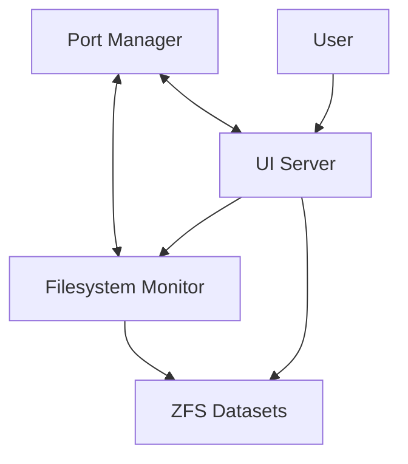

# NestGate Tiered Storage Integration

This document explains the architecture, components, and integration of the NestGate tiered storage system.

## Architecture Overview

The tiered storage system consists of the following components:

1. **Port Manager** - Central service that allocates ports and manages communication between components
2. **Filesystem Monitor** - Monitors file system events on ZFS datasets
3. **UI Server** - React-based user interface for managing tiered storage
4. **ZFS Datasets** - Storage tiers (hot, warm, cold) with different performance characteristics

### Component Interactions



## Components

### Port Manager

The port manager is a Rust-based service that allocates and manages ports for all components. It ensures consistent communication between services by providing a central registry.

**Key features:**
- Dynamic port allocation
- Service health monitoring
- Service discovery

### Filesystem Monitor

The filesystem monitor tracks file system events (create, modify, delete) on ZFS datasets and exposes an API for querying these events.

**Key features:**
- Real-time file event detection
- Filter events by type, path, or extension
- REST API for event queries

### UI Server

The React-based UI provides a user interface for managing tiered storage, viewing file system events, and configuring ZFS properties.

**Key components:**
- TieredStorageManager - Main component for managing storage tiers
- EventStream - Displays real-time file system events
- ZfsPropertyEditor - Configures ZFS dataset properties
- MigrationTool - Moves data between storage tiers

### ZFS Datasets

The system uses ZFS datasets configured with different performance characteristics for tiered storage:

1. **Hot Tier** - High-performance storage for frequently accessed data
   - Compression: lz4
   - Record Size: 128K

2. **Warm Tier** - Balanced storage for moderately accessed data
   - Compression: zstd
   - Record Size: 1M

3. **Cold Tier** - High-compression storage for infrequently accessed data
   - Compression: gzip-9
   - Record Size: 1M

## Integration

The integration between these components enables:

1. File system events to be detected by the filesystem monitor
2. Events to be displayed in real-time in the UI
3. ZFS properties to be viewed and modified through the UI
4. Data migration between tiers based on access patterns

## Scripts

### Development Environment

To start the development environment:

```bash
./start-tiered-storage-dev.sh
```

This script:
1. Starts the port manager
2. Starts the filesystem monitor with auto-detected ZFS datasets
3. Starts the UI development server
4. Sets up necessary environment variables

### Integration Test Setup

To set up a complete test environment with ZFS datasets:

```bash
sudo ./integration-test-setup.sh
```

This script:
1. Creates a ZFS test pool with hot, warm, and cold tiers
2. Builds all Rust components
3. Starts the port manager
4. Starts the filesystem monitor with the test datasets
5. Starts the UI server
6. Verifies the integration by creating a test file and checking for events

### UI-Only Mode

To start just the UI component:

```bash
./start-ui-only.sh
```

This script:
1. Checks if port manager and filesystem monitor are running
2. Sets up environment variables
3. Starts the UI development server

### Running Tests

To run the TieredStorageManager component tests:

```bash
./test-tiered-storage.sh
```

This script:
1. Checks if required services are running
2. Runs the TieredStorageManager integration tests
3. Tests file event detection

## Usage

### Viewing Tiered Storage

1. Start the system using one of the scripts above
2. Open a browser to http://localhost:3000
3. Navigate to the Storage Management section
4. View the hot, warm, and cold storage tiers

### Modifying ZFS Properties

1. Select a storage tier
2. Click on the "ZFS Properties" tab
3. Modify properties such as compression, record size, etc.

### Monitoring Events

1. Select a storage tier
2. Click on the "Event Monitor" tab
3. View real-time file system events

### Migrating Data

1. Select a source tier
2. Click on the "Migration" tab
3. Select files to migrate
4. Choose a target tier
5. Start the migration

## Troubleshooting

### Port Manager Issues

If the port manager fails to start:

1. Check the logs: `cat logs/port-manager.log`
2. Verify the binary exists: `ls -la target/debug/port-manager`
3. Ensure no other process is using port 9000: `netstat -tuln | grep 9000`

### Filesystem Monitor Issues

If the filesystem monitor fails to start:

1. Check the logs: `cat logs/fs-monitor.log`
2. Verify the binary exists: `ls -la target/debug/fsmonitor`
3. Ensure ZFS datasets are accessible

### UI Server Issues

If the UI server fails to start:

1. Check the logs: `cat logs/ui-server.log`
2. Verify npm dependencies: `cd crates/ui/nestgate-ui && npm install`
3. Check for TypeScript errors

## Next Steps

1. **Production Deployment** - Configure for production environments
2. **Access Controls** - Add user authentication and authorization
3. **Data Analysis** - Add analytics for storage usage patterns
4. **Automation** - Automate data migration based on access patterns
5. **Monitoring** - Add system monitoring and alerting # NestGate Component Specifications

This document provides a reference guide to the component specifications in the NestGate project. Each component has its own directory containing specifications related to that component.

## Core Components

The core components form the foundation of the NestGate system.

### `core/nestgate-core`

Core system functionality and state management.

**Key Specifications:**
- Storage management
- State coordination
- System configuration
- Resource management

### `core/nestgate-api`

API definition and implementation.

**Key Specifications:**
- REST endpoints
- WebSocket handlers
- Authentication
- Rate limiting

### `core/nestgate-bin`

Binary executables and CLI tools.

**Key Specifications:**
- CLI implementation
- Configuration tools
- Utility functions
- Installation tools

## Service Components

Service components provide specific functionality to the system.

### `services/nestgate-port-manager`

Manages port allocation and service discovery.

**Key Specifications:**
- Port allocation
- Service registration
- Port forwarding
- Conflict resolution

### `services/nestgate-fsmonitor`

Monitors file system changes.

**Key Specifications:**
- File system watching
- Change notification
- Event filtering
- Recursive monitoring

## Storage Components

Storage components handle data persistence and management.

### `storage/nestgate-zfs`

ZFS integration and management.

**Key Specifications:**
- ZFS pool management
- Dataset operations
- Snapshot management
- ZFS properties

## Network Components

Network components handle communication and protocols.

### `network/nestgate-mcp`

Machine Context Protocol implementation.

**Key Specifications:**
- Protocol implementation
- Session management
- Resource allocation
- State synchronization

### `network/nestgate-network`

Network utilities and interfaces.

**Key Specifications:**
- Protocol implementations
- Connection management
- Network security
- Traffic optimization

## UI Components

UI components handle user interaction.

### `ui/nestgate-ui`

User interface components and design.

**Key Specifications:**
- UI components
- Design system
- Interaction patterns
- Responsiveness

## Middleware Components

Middleware components provide cross-cutting functionality.

### `middleware/nestgate-middleware`

Middleware implementations and utilities.

**Key Specifications:**
- Authentication middleware
- Logging middleware
- Caching middleware
- Request processing

## AI Components

AI components handle machine learning and intelligent features.

### `ai/nestgate-ai-models`

AI model definitions and interfaces.

**Key Specifications:**
- Model architecture
- Training parameters
- Inference optimization
- Model versioning

### `ai/nestgate-ai-mock`

Mock AI implementations for testing.

**Key Specifications:**
- Mock behavior
- Test scenarios
- Performance simulation
- Predictable responses

## Integration Specifications

Integration specifications define how components work together.

**Key Specifications:**
- Component integration
- API contracts
- Event propagation
- Error handling

## Architecture Specifications

Architecture specifications define the overall system design.

**Key Specifications:**
- System architecture
- Design patterns
- Component relationships
- System boundaries

## How to Navigate

To find specifications for a specific component:

1. Identify the component category (core, services, storage, etc.)
2. Navigate to the corresponding directory
3. Look for the component-specific specifications

## How to Contribute

When adding or updating specifications:

1. Place specifications in the appropriate component directory
2. Follow the established format and style
3. Update related specifications as needed
4. Include examples and diagrams when helpful
5. Keep specifications focused and concise 