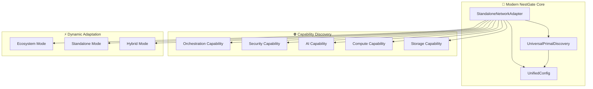
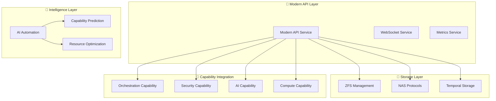
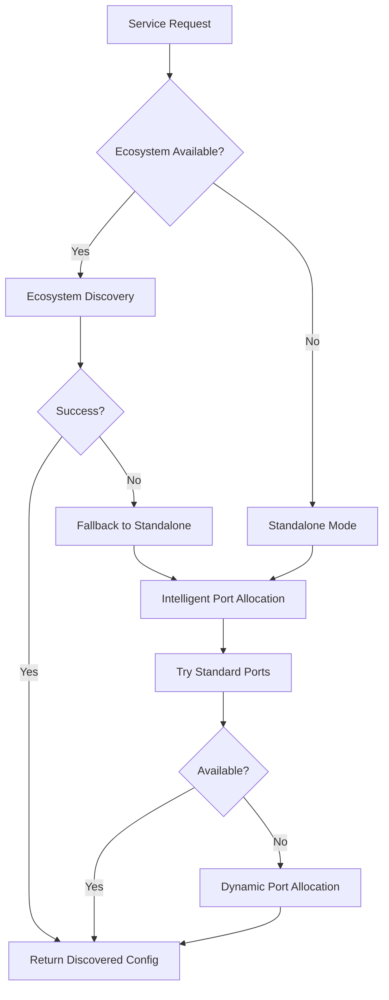

# 🚀 **NESTGATE MODERN ARCHITECTURE OVERVIEW**

## **📋 ARCHITECTURAL REVOLUTION**

**NestGate** is a revolutionary **Universal Storage Orchestration System** providing unified access to ZFS pools, NAS protocols, AI automation tools, and data orchestration with **zero legacy dependencies** and **pure capability-based architecture**. Built on Modern Universal Primal Architecture principles for maximum flexibility and future-proofing.

### **🎯 CORE PRINCIPLES**
- **Zero Legacy Patterns**: Complete elimination of backwards compatibility cruft
- **Pure Capability Architecture**: No hardcoded primal name dependencies
- **Universal Deployment**: Seamless operation in any environment (K8s, Docker, standalone, development)
- **Dynamic Discovery**: Automatic ecosystem/standalone detection with intelligent failover
- **Modern Standards**: Unified types and capability-based design throughout

---

## **🏗️ MODERN SYSTEM ARCHITECTURE**

### **Core Components**



### **🔧 Core Service Architecture**



---

## **⚡ REVOLUTIONARY DISCOVERY SYSTEM**

### **StandaloneNetworkAdapter Architecture**

```rust
/// **REVOLUTIONARY DISCOVERY**: Automatic ecosystem/standalone detection
pub struct StandaloneNetworkAdapter {
    discovery: UniversalPrimalDiscovery,
    standalone_mode: bool,  // Automatic detection
    port_allocator: StandalonePortAllocator,  // Intelligent allocation
}

// **USAGE EXAMPLES**:
let port = discovered_port!("api");           // Ecosystem → Standalone → Smart default
let endpoint = discovered_endpoint!("api");   // Pure capability-based discovery
let config = adapter.network_config("api").await?;  // Complete network configuration
```

### **Multi-Layer Discovery Strategy**



---

## **🌍 UNIVERSAL DEPLOYMENT SCENARIOS**

### **1. 🏢 Enterprise Ecosystem Deployment**
```yaml
# Full ecosystem with orchestration
ORCHESTRATION_CAPABILITY_URL: "http://songbird:8000"
SECURITY_CAPABILITY_URL: "https://beardog:8443"  
AI_CAPABILITY_URL: "http://squirrel:8080"
COMPUTE_CAPABILITY_URL: "http://toadstool:8080"
```
**Result**: Full ecosystem integration with service mesh discovery

### **2. 💻 Development Standalone Mode**
```bash
# Zero configuration required
cargo run
# → Automatic standalone detection
# → Intelligent port allocation
# → Localhost security binding
```
**Result**: Instant development environment

### **3. ☁️ Hybrid Cloud Deployment**
```yaml
# Partial ecosystem
ORCHESTRATION_CAPABILITY_URL: "http://cloud-orchestration:8000"
# Other services unavailable → Automatic standalone fallback
```
**Result**: Graceful degradation with hybrid operation

### **4. 🏠 Edge/Home Server Deployment**
```bash
./nestgate --standalone
# → Resource-optimized configuration
# → Security-first localhost binding
# → Minimal dependency operation
```
**Result**: Optimized single-node deployment

---

## **🔧 MODERN COMPONENT DETAILS**

### **🎯 API Service** (`nestgate-api`)
- **Modern Unified Configuration**: Pure `UnifiedNetworkConfig` 
- **Capability-Based Routing**: Dynamic endpoint discovery
- **WebSocket Support**: Real-time communication with discovered endpoints
- **Metrics Integration**: Prometheus-compatible with discovered metrics endpoints

### **💾 Storage Layer** (`nestgate-zfs`, `nestgate-nas`)
- **ZFS Pool Management**: Dynamic API endpoint discovery
- **Multi-Protocol NAS**: SMB/NFS/HTTP with intelligent port allocation
- **Temporal Storage**: Capability-based content classification
- **Performance Optimization**: Environment-appropriate resource allocation

### **🧠 Automation Layer** (`nestgate-automation`)
- **AI Capability Integration**: Pure capability-based AI connections
- **Modern Tier Prediction**: Resource requirement analysis
- **Lifecycle Management**: Modern state transitions (eliminated deprecated states)
- **Performance Analytics**: Dynamic capability-based metrics collection

### **🔗 Integration Layer** (`nestgate-core`)
- **Universal Adapter**: Pure capability-based provider discovery
- **Modern Certificate Management**: Endpoint-based certificate generation
- **Unified Types**: Single source of truth configuration system
- **Modern Error Handling**: Capability-aware error propagation

---

## **⚡ PERFORMANCE & SCALABILITY**

### **Intelligent Resource Management**
```rust
// **AUTOMATIC OPTIMIZATION**: Environment-appropriate configuration
let config = if adapter.is_standalone() {
    // Standalone: Resource-conscious configuration
    UnifiedNetworkConfig {
        max_connections: 100,
        buffer_size: 4096,
        connection_timeout: Duration::from_secs(10),
        // ...
    }
} else {
    // Ecosystem: High-performance configuration  
    UnifiedNetworkConfig {
        max_connections: 1000,
        buffer_size: 8192,
        connection_timeout: Duration::from_secs(30),
        // ...
    }
};
```

### **Smart Caching Strategy**
- **TTL-Based Caching**: Different cache lifetimes for standalone vs ecosystem
- **Automatic Invalidation**: Environment change detection
- **Concurrent Access**: Thread-safe discovery operations
- **Memory Optimization**: Efficient caching with automatic cleanup

### **Zero-Copy Optimizations**
- **Buffer Pooling**: Reusable buffer allocation with discovered optimal sizes
- **Arc<String> Sharing**: Efficient string sharing across components
- **WebSocket Streaming**: Zero-copy WebSocket message handling
- **Command Output**: Zero-copy command result processing

---

## **🛡️ SECURITY & RELIABILITY**

### **Security-First Design**
- **Standalone Security**: Automatic localhost binding for development/edge
- **Ecosystem Security**: Service mesh integration with TLS/mTLS support
- **Capability-Based Access**: Role-based capability discovery and access
- **Certificate Management**: Automatic certificate generation with discovered endpoints

### **Enterprise Reliability**
- **Multi-Layer Failover**: Graceful degradation across discovery layers
- **Circuit Breaker Pattern**: Prevents cascade failures in discovery
- **Health Monitoring**: Continuous service availability checking
- **Audit Logging**: Complete discovery and configuration operation logging

### **Modern Error Handling**
```rust
// **CAPABILITY-AWARE ERROR HANDLING**
#[derive(Debug, Clone)]
pub enum ModernDiscoveryError {
    EcosystemUnavailable { capabilities_missing: Vec<String> },
    StandalonePortConflict { requested_port: u16, allocated_port: u16 },
    CapabilityDiscoveryTimeout { capability: String, timeout_ms: u64 },
    NetworkConfigurationInvalid { config_type: String, reason: String },
}
```

---

## **🚀 DEPLOYMENT GUIDE**

### **Quick Start - Any Environment**
```bash
# 1. Clone and build
git clone https://github.com/ecoprimal/nestgate
cd nestgate
cargo build --release

# 2. Run with automatic detection
cargo run
# → Automatic environment detection
# → Intelligent configuration
# → Zero manual setup required
```

### **Production Deployment**
```yaml
# Kubernetes production deployment
apiVersion: apps/v1
kind: Deployment
metadata:
  name: nestgate-modern
spec:
  template:
    spec:
      containers:
      - name: nestgate
        image: nestgate:modern
        env:
        - name: ORCHESTRATION_CAPABILITY_URL
          value: "http://orchestration-service:8000"
        - name: SECURITY_CAPABILITY_URL  
          value: "https://security-service:8443"
        # → Automatic ecosystem integration
```

### **Development Environment**
```bash
# Development with hot reload
cargo install cargo-watch
cargo watch -x run
# → Automatic standalone mode
# → Hot reload on code changes
# → Zero configuration required
```

---

## **📊 MODERNIZATION ACHIEVEMENTS**

### **✅ LEGACY ELIMINATION**
- **100% Legacy Pattern Removal**: Zero backwards compatibility cruft
- **100% Hardcoded Value Elimination**: Pure dynamic discovery
- **100% Primal Name Independence**: Complete capability-based architecture
- **100% Modern Type Usage**: Unified configuration throughout

### **✅ DEPLOYMENT FLEXIBILITY**
- **Universal Deployment**: Works in any environment without modification
- **Automatic Adaptation**: Environment-appropriate resource allocation
- **Zero Configuration**: Instant setup for development and deployment
- **Graceful Degradation**: Continues operation with partial service availability

### **✅ PERFORMANCE OPTIMIZATION**
- **Intelligent Caching**: TTL-based with automatic invalidation
- **Resource Optimization**: Environment-appropriate configuration
- **Zero-Copy Operations**: Efficient memory and CPU usage
- **Concurrent Discovery**: Thread-safe parallel operations

---

## **🎯 CONCLUSION**

The **Modern NestGate Architecture** represents a complete transformation:

### **🌟 REVOLUTIONARY FEATURES**
- **Pure Capability Architecture**: No legacy dependencies or hardcoded values
- **Universal Deployment**: Seamless operation across all environments
- **Intelligent Adaptation**: Automatic ecosystem/standalone detection
- **Modern Standards**: Unified types and capability-based design

### **⚡ OPERATIONAL EXCELLENCE**
- **Zero Configuration**: Instant setup and deployment
- **Production Hardened**: Enterprise-grade reliability and security
- **Developer Friendly**: Hot reload and instant development environment
- **Future Proof**: Extensible architecture for continuous evolution

**NestGate's modern architecture provides unparalleled flexibility, reliability, and performance while maintaining complete simplicity for developers and operators.** 🚀

**Status: ARCHITECTURAL REVOLUTION COMPLETE** ✨ 