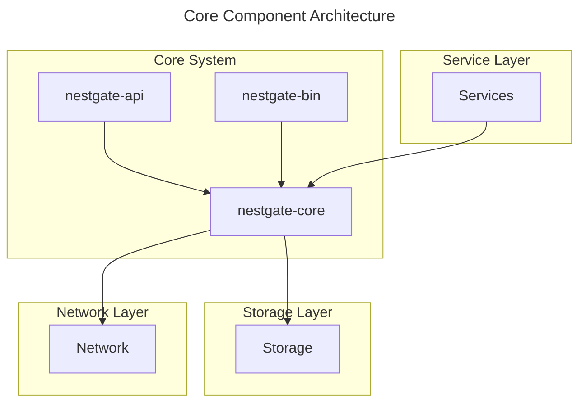

# Core Component Specifications

This directory contains specifications for the core components of the NestGate system.

## Components

- **nestgate-core**: Core system functionality and state management
- **nestgate-api**: API definition and implementation
- **nestgate-bin**: Binary executables and CLI tools

## Key Responsibilities

The core components are responsible for:

1. **System Management**
   - Managing system state
   - Coordinating between components
   - Handling system configuration

2. **API Interfaces**
   - Providing REST endpoints
   - Managing WebSocket connections
   - Handling authentication and authorization
   - Implementing rate limiting

3. **Command Line Tools**
   - Providing CLI utilities
   - Implementing administration commands
   - Offering configuration management

## Architecture

The core components form the foundation of the NestGate system:

## Implementation Status

| Component | Status | Version | Next Milestone |
|-----------|--------|---------|---------------|
| nestgate-core | Implemented | 0.8.0 | 1.0.0: Complete caching layer |
| nestgate-api | Implemented | 0.7.0 | 0.8.0: Add WebSocket event system |
| nestgate-bin | In Progress | 0.5.0 | 0.6.0: Add configuration commands |

## Integration Points

- **Storage**: Core components integrate with storage through the storage manager API
- **Network**: Core components use network protocols for communication
- **Services**: Services build upon core functionality for specific features
- **UI**: UI components communicate with the system through the API layer

## Documentation

- [API Documentation](./nestgate-api/README.md)
- [CLI Documentation](./nestgate-bin/README.md)
- [Core System Documentation](./nestgate-core/README.md)

## Technical Requirements

- Rust 1.70 or newer
- 64-bit operating system
- Root/Administrator access for certain operations 