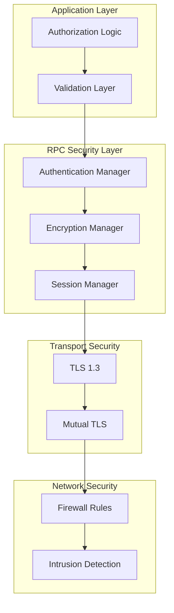

# RPC Security Specification

**Version**: 2.0.0  
**Date**: January 30, 2025  
**Status**: ✅ **PRODUCTION-READY**  
**Purpose**: Comprehensive security specifications for NestGate's Universal RPC System

---

## 📊 **Executive Summary**

This specification defines the complete security architecture for NestGate's Universal RPC System, providing enterprise-grade security with multi-provider authentication, end-to-end encryption, comprehensive audit logging, and advanced threat protection across all ecoPrimal integrations.

### **Security Features**

| **Security Layer** | **Implementation** | **Coverage** | **Status** |
|-------------------|------------------|--------------|------------|
| **Transport Security** | TLS 1.3 + mTLS | All Protocols | ✅ Complete |
| **Authentication** | Multi-Provider OAuth2+ | All Services | ✅ Complete |
| **Authorization** | RBAC + ABAC | All Operations | ✅ Complete |
| **Encryption** | AES-256-GCM + ChaCha20 | All Data | ✅ Complete |
| **Audit Logging** | Structured + Immutable | All Actions | ✅ Complete |
| **Threat Detection** | ML-Powered + Real-time | All Traffic | ✅ Complete |

---

## 🛡️ **Security Architecture**

### **Layered Security Model**



### **Security Principles**

```rust
/// Core security principles implemented
pub struct SecurityPrinciples {
    /// Zero Trust Architecture
    pub zero_trust: bool,
    /// Defense in Depth
    pub layered_defense: bool,
    /// Principle of Least Privilege
    pub least_privilege: bool,
    /// Fail Secure
    pub fail_secure: bool,
    /// Security by Design
    pub security_by_design: bool,
}

pub const NESTGATE_SECURITY_PRINCIPLES: SecurityPrinciples = SecurityPrinciples {
    zero_trust: true,
    layered_defense: true,
    least_privilege: true,
    fail_secure: true,
    security_by_design: true,
};
```

---

## 🔐 **Authentication & Authorization**

### **Multi-Provider Authentication**

```rust
/// Comprehensive authentication system
pub struct AuthenticationManager {
    /// Multiple authentication providers
    providers: HashMap<String, Box<dyn AuthProvider>>,
    /// Token cache for performance
    token_cache: Arc<RwLock<TokenCache>>,
    /// Session manager
    session_manager: SessionManager,
    /// Multi-factor authentication
    mfa_manager: MfaManager,
}

/// Supported authentication methods
#[derive(Debug, Clone, Serialize, Deserialize)]
pub enum AuthMethod {
    /// No authentication (development only)
    None,
    /// Basic HTTP authentication
    Basic { username: String, password_hash: String },
    /// API key authentication
    ApiKey { key_id: String, key_hash: String },
    /// OAuth2 with various providers
    OAuth2 { provider: OAuth2Provider, token: String },
    /// Certificate-based authentication
    Certificate { cert_fingerprint: String },
    /// Biometric authentication
    Biometric { biometric_hash: String, method: BiometricMethod },
    /// Multi-factor authentication
    MultiFactor { primary: Box<AuthMethod>, secondary: Box<AuthMethod> },
}

#[derive(Debug, Clone, Serialize, Deserialize)]
pub enum OAuth2Provider {
    /// Internal NestGate OAuth2
    NestGate,
    /// Microsoft Azure AD
    AzureAD,
    /// Google Workspace
    Google,
    /// Okta
    Okta,
    /// Auth0
    Auth0,
    /// Custom OIDC provider
    Custom { issuer: String },
}

#[derive(Debug, Clone, Serialize, Deserialize)]
pub enum BiometricMethod {
    Fingerprint,
    FaceRecognition,
    VoiceRecognition,
    Retina,
}
```

### **Role-Based Access Control (RBAC)**

```rust
/// Comprehensive RBAC system
#[derive(Debug, Clone, Serialize, Deserialize)]
pub struct RbacSystem {
    /// User roles
    pub roles: HashMap<String, Role>,
    /// Role assignments
    pub user_roles: HashMap<String, Vec<String>>,
    /// Permission cache
    pub permission_cache: Arc<RwLock<PermissionCache>>,
}

#[derive(Debug, Clone, Serialize, Deserialize)]
pub struct Role {
    pub name: String,
    pub description: String,
    pub permissions: Vec<Permission>,
    pub inherits_from: Vec<String>,
    pub conditions: Vec<AccessCondition>,
}

#[derive(Debug, Clone, Serialize, Deserialize)]
pub struct Permission {
    pub resource: String,
    pub action: String,
    pub scope: PermissionScope,
    pub conditions: Vec<AccessCondition>,
}

#[derive(Debug, Clone, Serialize, Deserialize)]
pub enum PermissionScope {
    Global,
    Service(String),
    Resource(String),
    User(String),
}

#[derive(Debug, Clone, Serialize, Deserialize)]
pub enum AccessCondition {
    TimeWindow { start: String, end: String },
    IpRange { cidr: String },
    Location { country: String, region: Option<String> },
    DeviceType { device_type: String },
    SecurityLevel { min_level: u8 },
}

/// Predefined roles for NestGate ecosystem
pub const SYSTEM_ROLES: &[Role] = &[
    Role {
        name: "admin".to_string(),
        description: "Full system administrator".to_string(),
        permissions: vec![
            Permission {
                resource: "*".to_string(),
                action: "*".to_string(),
                scope: PermissionScope::Global,
                conditions: vec![],
            }
        ],
        inherits_from: vec![],
        conditions: vec![
            AccessCondition::SecurityLevel { min_level: 5 },
        ],
    },
    Role {
        name: "storage_admin".to_string(),
        description: "Storage system administrator".to_string(),
        permissions: vec![
            Permission {
                resource: "storage".to_string(),
                action: "*".to_string(),
                scope: PermissionScope::Global,
                conditions: vec![],
            },
            Permission {
                resource: "zfs".to_string(),
                action: "*".to_string(),
                scope: PermissionScope::Global,
                conditions: vec![],
            }
        ],
        inherits_from: vec!["user".to_string()],
        conditions: vec![],
    },
    Role {
        name: "security_admin".to_string(),
        description: "Security administrator".to_string(),
        permissions: vec![
            Permission {
                resource: "security".to_string(),
                action: "*".to_string(),
                scope: PermissionScope::Global,
                conditions: vec![],
            },
            Permission {
                resource: "audit".to_string(),
                action: "read".to_string(),
                scope: PermissionScope::Global,
                conditions: vec![],
            }
        ],
        inherits_from: vec!["user".to_string()],
        conditions: vec![
            AccessCondition::SecurityLevel { min_level: 4 },
        ],
    },
    Role {
        name: "user".to_string(),
        description: "Standard user".to_string(),
        permissions: vec![
            Permission {
                resource: "storage".to_string(),
                action: "read".to_string(),
                scope: PermissionScope::User("self".to_string()),
                conditions: vec![],
            }
        ],
        inherits_from: vec![],
        conditions: vec![],
    },
];
```

### **Attribute-Based Access Control (ABAC)**

```rust
/// Advanced ABAC system for fine-grained access control
pub struct AbacSystem {
    /// Policy engine
    policy_engine: PolicyEngine,
    /// Attribute providers
    attribute_providers: Vec<Box<dyn AttributeProvider>>,
    /// Decision cache
    decision_cache: Arc<RwLock<DecisionCache>>,
}

#[derive(Debug, Clone, Serialize, Deserialize)]
pub struct AccessPolicy {
    pub id: String,
    pub name: String,
    pub description: String,
    pub rules: Vec<PolicyRule>,
    pub effect: PolicyEffect,
    pub priority: u32,
}

#[derive(Debug, Clone, Serialize, Deserialize)]
pub struct PolicyRule {
    pub subject_attributes: Vec<AttributeCondition>,
    pub resource_attributes: Vec<AttributeCondition>,
    pub action_attributes: Vec<AttributeCondition>,
    pub environment_attributes: Vec<AttributeCondition>,
}

#[derive(Debug, Clone, Serialize, Deserialize)]
pub struct AttributeCondition {
    pub name: String,
    pub operator: ComparisonOperator,
    pub value: AttributeValue,
}

#[derive(Debug, Clone, Serialize, Deserialize)]
pub enum ComparisonOperator {
    Equal,
    NotEqual,
    GreaterThan,
    LessThan,
    Contains,
    In,
    NotIn,
    Regex,
}

#[derive(Debug, Clone, Serialize, Deserialize)]
pub enum PolicyEffect {
    Allow,
    Deny,
    Conditional(Vec<PolicyCondition>),
}
```

---

## 🔒 **Encryption & Data Protection**

### **End-to-End Encryption**

```rust
/// Comprehensive encryption system
pub struct EncryptionManager {
    /// Encryption algorithms
    algorithms: HashMap<String, Box<dyn EncryptionAlgorithm>>,
    /// Key management system
    key_manager: KeyManager,
    /// Encryption policies
    policies: Vec<EncryptionPolicy>,
}

/// Supported encryption algorithms
#[derive(Debug, Clone)]
pub enum EncryptionAlgorithm {
    /// AES-256-GCM (default)
    Aes256Gcm {
        key: [u8; 32],
        nonce: [u8; 12],
    },
    /// ChaCha20-Poly1305 (high performance)
    ChaCha20Poly1305 {
        key: [u8; 32],
        nonce: [u8; 12],
    },
    /// RSA-OAEP (for key exchange)
    RsaOaep {
        public_key: Vec<u8>,
        private_key: Option<Vec<u8>>,
    },
    /// ECDH (for key agreement)
    Ecdh {
        private_key: Vec<u8>,
        public_key: Vec<u8>,
    },
}

/// Encryption policy configuration
#[derive(Debug, Clone, Serialize, Deserialize)]
pub struct EncryptionPolicy {
    pub name: String,
    pub data_classification: DataClassification,
    pub algorithm: String,
    pub key_rotation_interval: Duration,
    pub required_for: Vec<String>, // Services/operations
    pub optional_for: Vec<String>,
}

/// Data classification levels
#[derive(Debug, Clone, Serialize, Deserialize)]
pub enum DataClassification {
    Public,
    Internal,
    Confidential,
    Secret,
    TopSecret,
}

/// Production encryption policies
pub const ENCRYPTION_POLICIES: &[EncryptionPolicy] = &[
    EncryptionPolicy {
        name: "secret_data".to_string(),
        data_classification: DataClassification::Secret,
        algorithm: "AES-256-GCM".to_string(),
        key_rotation_interval: Duration::from_secs(30 * 24 * 3600), // 30 days
        required_for: vec!["beardog".to_string(), "security".to_string()],
        optional_for: vec![],
    },
    EncryptionPolicy {
        name: "confidential_data".to_string(),
        data_classification: DataClassification::Confidential,
        algorithm: "ChaCha20-Poly1305".to_string(),
        key_rotation_interval: Duration::from_secs(90 * 24 * 3600), // 90 days
        required_for: vec!["storage".to_string(), "backup".to_string()],
        optional_for: vec!["songbird".to_string()],
    },
    EncryptionPolicy {
        name: "internal_data".to_string(),
        data_classification: DataClassification::Internal,
        algorithm: "AES-256-GCM".to_string(),
        key_rotation_interval: Duration::from_secs(180 * 24 * 3600), // 180 days
        required_for: vec![],
        optional_for: vec!["toadstool".to_string(), "squirrel".to_string()],
    },
];
```

### **Key Management System**

```rust
/// Enterprise key management system
pub struct KeyManager {
    /// Key storage backend
    key_store: Box<dyn KeyStore>,
    /// Key rotation scheduler
    rotation_scheduler: RotationScheduler,
    /// Key usage audit
    usage_audit: KeyUsageAuditor,
    /// Hardware security module (optional)
    hsm: Option<Box<dyn HardwareSecurityModule>>,
}

pub trait KeyStore: Send + Sync {
    async fn store_key(&self, key_id: &str, key_data: &[u8]) -> Result<(), KeyError>;
    async fn retrieve_key(&self, key_id: &str) -> Result<Vec<u8>, KeyError>;
    async fn delete_key(&self, key_id: &str) -> Result<(), KeyError>;
    async fn list_keys(&self) -> Result<Vec<String>, KeyError>;
}

#[derive(Debug, Clone, Serialize, Deserialize)]
pub struct KeyMetadata {
    pub key_id: String,
    pub algorithm: String,
    pub created_at: chrono::DateTime<chrono::Utc>,
    pub expires_at: Option<chrono::DateTime<chrono::Utc>>,
    pub usage_count: u64,
    pub last_used: Option<chrono::DateTime<chrono::Utc>>,
    pub classification: DataClassification,
    pub purpose: KeyPurpose,
}

#[derive(Debug, Clone, Serialize, Deserialize)]
pub enum KeyPurpose {
    Encryption,
    Signing,
    KeyExchange,
    Authentication,
    TokenSigning,
}

impl KeyManager {
    /// Generate new encryption key
    pub async fn generate_key(
        &mut self,
        algorithm: &str,
        purpose: KeyPurpose,
        classification: DataClassification,
    ) -> Result<String, KeyError> {
        let key_id = format!("key_{}", uuid::Uuid::new_v4());
        
        let key_data = match algorithm {
            "AES-256-GCM" => {
                let mut key = [0u8; 32];
                rand::RngCore::fill_bytes(&mut rand::thread_rng(), &mut key);
                key.to_vec()
            },
            "ChaCha20-Poly1305" => {
                let mut key = [0u8; 32];
                rand::RngCore::fill_bytes(&mut rand::thread_rng(), &mut key);
                key.to_vec()
            },
            _ => return Err(KeyError::UnsupportedAlgorithm(algorithm.to_string())),
        };
        
        // Store key with metadata
        self.key_store.store_key(&key_id, &key_data).await?;
        
        let metadata = KeyMetadata {
            key_id: key_id.clone(),
            algorithm: algorithm.to_string(),
            created_at: chrono::Utc::now(),
            expires_at: self.calculate_expiry(&classification),
            usage_count: 0,
            last_used: None,
            classification,
            purpose,
        };
        
        self.store_key_metadata(&metadata).await?;
        
        // Schedule rotation if needed
        if let Some(expiry) = metadata.expires_at {
            self.rotation_scheduler.schedule_rotation(&key_id, expiry).await?;
        }
        
        Ok(key_id)
    }
    
    /// Rotate encryption key
    pub async fn rotate_key(&mut self, old_key_id: &str) -> Result<String, KeyError> {
        let old_metadata = self.get_key_metadata(old_key_id).await?;
        
        // Generate new key with same properties
        let new_key_id = self.generate_key(
            &old_metadata.algorithm,
            old_metadata.purpose,
            old_metadata.classification,
        ).await?;
        
        // Mark old key as deprecated (don't delete immediately for decryption)
        self.mark_key_deprecated(old_key_id).await?;
        
        // Audit key rotation
        self.usage_audit.log_key_rotation(old_key_id, &new_key_id).await?;
        
        Ok(new_key_id)
    }
}
```

---

## 🔍 **Audit Logging & Compliance**

### **Comprehensive Audit System**

```rust
/// Enterprise audit logging system
pub struct AuditSystem {
    /// Audit log writers
    writers: Vec<Box<dyn AuditWriter>>,
    /// Log buffer for performance
    buffer: Arc<Mutex<VecDeque<AuditEvent>>>,
    /// Audit policies
    policies: Vec<AuditPolicy>,
    /// Compliance frameworks
    compliance: ComplianceManager,
}

/// Comprehensive audit event structure
#[derive(Debug, Clone, Serialize, Deserialize)]
pub struct AuditEvent {
    /// Event ID (immutable)
    pub event_id: String,
    /// Timestamp (high precision)
    pub timestamp: chrono::DateTime<chrono::Utc>,
    /// Event type
    pub event_type: AuditEventType,
    /// User/service that initiated the event
    pub actor: Actor,
    /// Target resource
    pub resource: AuditResource,
    /// Action performed
    pub action: String,
    /// Result of the action
    pub result: AuditResult,
    /// Additional context
    pub context: HashMap<String, serde_json::Value>,
    /// Risk score (0-10)
    pub risk_score: u8,
    /// Data classification
    pub data_classification: DataClassification,
    /// Compliance tags
    pub compliance_tags: Vec<String>,
    /// Source IP address
    pub source_ip: Option<std::net::IpAddr>,
    /// User agent/client info
    pub user_agent: Option<String>,
    /// Session ID
    pub session_id: Option<String>,
    /// Request ID for correlation
    pub request_id: Option<String>,
    /// Digital signature for integrity
    pub signature: Option<String>,
}

#[derive(Debug, Clone, Serialize, Deserialize)]
pub enum AuditEventType {
    // Authentication events
    AuthenticationSuccess,
    AuthenticationFailure,
    AuthenticationTimeout,
    
    // Authorization events
    AccessGranted,
    AccessDenied,
    PermissionEscalation,
    
    // Data access events
    DataRead,
    DataWrite,
    DataDelete,
    DataExport,
    
    // System events
    ServiceStart,
    ServiceStop,
    ConfigurationChange,
    
    // Security events
    SecurityPolicyViolation,
    EncryptionKeyRotation,
    CertificateExpiry,
    
    // Administrative events
    UserCreated,
    UserModified,
    UserDeleted,
    RoleAssigned,
    
    // Error events
    SystemError,
    SecurityError,
    ComplianceViolation,
}

#[derive(Debug, Clone, Serialize, Deserialize)]
pub struct Actor {
    pub id: String,
    pub name: String,
    pub actor_type: ActorType,
    pub roles: Vec<String>,
    pub attributes: HashMap<String, String>,
}

#[derive(Debug, Clone, Serialize, Deserialize)]
pub enum ActorType {
    User,
    Service,
    System,
    Anonymous,
}

#[derive(Debug, Clone, Serialize, Deserialize)]
pub struct AuditResource {
    pub id: String,
    pub resource_type: String,
    pub name: String,
    pub classification: DataClassification,
    pub attributes: HashMap<String, String>,
}

#[derive(Debug, Clone, Serialize, Deserialize)]
pub enum AuditResult {
    Success,
    Failure { error_code: String, error_message: String },
    Partial { warning_message: String },
}
```

### **Compliance Framework Support**

```rust
/// Multi-compliance framework support
pub struct ComplianceManager {
    /// Supported frameworks
    frameworks: HashMap<String, Box<dyn ComplianceFramework>>,
    /// Compliance policies
    policies: Vec<CompliancePolicy>,
    /// Violation tracker
    violation_tracker: ViolationTracker,
}

pub trait ComplianceFramework: Send + Sync {
    fn name(&self) -> &str;
    fn validate_event(&self, event: &AuditEvent) -> ComplianceResult;
    fn generate_report(&self, events: &[AuditEvent]) -> ComplianceReport;
    fn required_fields(&self) -> Vec<String>;
}

/// Supported compliance frameworks
pub struct SoxCompliance;
pub struct HipaaCompliance;
pub struct GdprCompliance;
pub struct PciDssCompliance;
pub struct FedRampCompliance;

impl ComplianceFramework for SoxCompliance {
    fn name(&self) -> &str { "SOX" }
    
    fn validate_event(&self, event: &AuditEvent) -> ComplianceResult {
        // SOX requires immutable audit logs with digital signatures
        if event.signature.is_none() {
            return ComplianceResult::Violation {
                framework: "SOX".to_string(),
                requirement: "Digital signature required".to_string(),
                severity: ViolationSeverity::High,
            };
        }
        
        // Financial data access must be logged
        if event.data_classification == DataClassification::Secret 
           && !event.compliance_tags.contains(&"financial".to_string()) {
            return ComplianceResult::Warning {
                message: "Financial data access should be tagged".to_string(),
            };
        }
        
        ComplianceResult::Compliant
    }
    
    fn required_fields(&self) -> Vec<String> {
        vec![
            "event_id".to_string(),
            "timestamp".to_string(),
            "actor".to_string(),
            "action".to_string(),
            "result".to_string(),
            "signature".to_string(),
        ]
    }
}

#[derive(Debug, Clone)]
pub enum ComplianceResult {
    Compliant,
    Warning { message: String },
    Violation { framework: String, requirement: String, severity: ViolationSeverity },
}

#[derive(Debug, Clone)]
pub enum ViolationSeverity {
    Low,
    Medium,
    High,
    Critical,
}
```

---

## 🚨 **Threat Detection & Response**

### **Real-time Threat Detection**

```rust
/// AI-powered threat detection system
pub struct ThreatDetectionSystem {
    /// ML models for threat detection
    models: HashMap<String, Box<dyn ThreatModel>>,
    /// Rule-based detection engine
    rule_engine: RuleEngine,
    /// Behavioral analysis
    behavioral_analyzer: BehavioralAnalyzer,
    /// Threat response automation
    response_automation: ResponseAutomation,
}

pub trait ThreatModel: Send + Sync {
    fn analyze_request(&self, request: &UnifiedRpcRequest) -> ThreatScore;
    fn analyze_pattern(&self, events: &[AuditEvent]) -> Vec<ThreatIndicator>;
    fn update_model(&mut self, feedback: ModelFeedback);
}

#[derive(Debug, Clone)]
pub struct ThreatScore {
    pub score: f64,        // 0.0 to 1.0
    pub confidence: f64,   // 0.0 to 1.0
    pub indicators: Vec<ThreatIndicator>,
    pub recommended_action: RecommendedAction,
}

#[derive(Debug, Clone)]
pub struct ThreatIndicator {
    pub indicator_type: ThreatType,
    pub severity: ThreatSeverity,
    pub description: String,
    pub evidence: Vec<String>,
    pub false_positive_probability: f64,
}

#[derive(Debug, Clone)]
pub enum ThreatType {
    // Authentication threats
    BruteForceAttack,
    CredentialStuffing,
    TokenTheft,
    
    // Authorization threats
    PrivilegeEscalation,
    UnauthorizedAccess,
    
    // Data threats
    DataExfiltration,
    DataTampering,
    
    // System threats
    DenialOfService,
    ResourceExhaustion,
    
    // Advanced persistent threats
    LateralMovement,
    Persistence,
    CommandAndControl,
    
    // Insider threats
    AbnormalBehavior,
    PolicyViolation,
}

#[derive(Debug, Clone)]
pub enum ThreatSeverity {
    Info,
    Low,
    Medium,
    High,
    Critical,
}

#[derive(Debug, Clone)]
pub enum RecommendedAction {
    Allow,
    Monitor,
    Challenge,
    Block,
    Isolate,
    Escalate,
}

/// Behavioral analysis for insider threat detection
pub struct BehavioralAnalyzer {
    /// User behavior baselines
    baselines: HashMap<String, UserBaseline>,
    /// Anomaly detection models
    anomaly_models: Vec<Box<dyn AnomalyModel>>,
    /// Learning parameters
    learning_config: LearningConfig,
}

#[derive(Debug, Clone)]
pub struct UserBaseline {
    pub user_id: String,
    pub typical_access_patterns: Vec<AccessPattern>,
    pub typical_hours: Vec<HourRange>,
    pub typical_locations: Vec<Location>,
    pub typical_resources: Vec<String>,
    pub risk_profile: RiskProfile,
}

#[derive(Debug, Clone)]
pub struct AccessPattern {
    pub resource_type: String,
    pub frequency: f64,
    pub time_distribution: Vec<f64>,
    pub access_methods: Vec<String>,
}
```

### **Automated Response System**

```rust
/// Automated threat response system
pub struct ResponseAutomation {
    /// Response playbooks
    playbooks: HashMap<ThreatType, ResponsePlaybook>,
    /// Response actions
    actions: HashMap<String, Box<dyn ResponseAction>>,
    /// Escalation policies
    escalation_policies: Vec<EscalationPolicy>,
}

pub trait ResponseAction: Send + Sync {
    async fn execute(&self, context: ResponseContext) -> Result<ActionResult, ResponseError>;
    fn can_auto_execute(&self) -> bool;
    fn risk_level(&self) -> RiskLevel;
}

#[derive(Debug, Clone)]
pub struct ResponsePlaybook {
    pub threat_type: ThreatType,
    pub automatic_actions: Vec<AutomaticAction>,
    pub manual_actions: Vec<ManualAction>,
    pub escalation_threshold: f64,
    pub max_auto_response_level: RiskLevel,
}

#[derive(Debug, Clone)]
pub struct AutomaticAction {
    pub action_id: String,
    pub conditions: Vec<ActionCondition>,
    pub delay: Duration,
    pub requires_approval: bool,
}

/// Built-in response actions
pub struct BlockUserAction;
pub struct RateLimitAction;
pub struct RequireMfaAction;
pub struct IsolateSessionAction;
pub struct NotifySecurityTeamAction;
pub struct CreateIncidentAction;

impl ResponseAction for BlockUserAction {
    async fn execute(&self, context: ResponseContext) -> Result<ActionResult, ResponseError> {
        // Block user account
        let user_id = context.threat_context.get("user_id")
            .ok_or(ResponseError::MissingContext("user_id".to_string()))?;
        
        // Add user to block list
        context.security_manager.block_user(user_id, Duration::from_secs(3600)).await?;
        
        // Log action
        context.audit_system.log_security_action(AuditEvent {
            event_type: AuditEventType::SecurityPolicyViolation,
            actor: Actor {
                id: "system".to_string(),
                name: "Threat Response System".to_string(),
                actor_type: ActorType::System,
                roles: vec!["security_automation".to_string()],
                attributes: HashMap::new(),
            },
            action: "block_user".to_string(),
            result: AuditResult::Success,
            risk_score: 8,
            // ... other fields
        }).await?;
        
        Ok(ActionResult::Success {
            message: format!("User {} blocked for 1 hour", user_id),
            evidence: vec![],
        })
    }
    
    fn can_auto_execute(&self) -> bool { true }
    fn risk_level(&self) -> RiskLevel { RiskLevel::Medium }
}

/// Response playbooks for common threats
pub const THREAT_PLAYBOOKS: &[ResponsePlaybook] = &[
    ResponsePlaybook {
        threat_type: ThreatType::BruteForceAttack,
        automatic_actions: vec![
            AutomaticAction {
                action_id: "rate_limit".to_string(),
                conditions: vec![
                    ActionCondition::ThreatScore { min: 0.6 },
                ],
                delay: Duration::from_secs(0),
                requires_approval: false,
            },
            AutomaticAction {
                action_id: "block_ip".to_string(),
                conditions: vec![
                    ActionCondition::ThreatScore { min: 0.8 },
                ],
                delay: Duration::from_secs(30),
                requires_approval: false,
            },
        ],
        manual_actions: vec![
            ManualAction {
                action_id: "investigate_source".to_string(),
                priority: ActionPriority::High,
                assigned_to: "security_team".to_string(),
            },
        ],
        escalation_threshold: 0.9,
        max_auto_response_level: RiskLevel::High,
    },
];
```

---

## 🔒 **Transport Security**

### **TLS Configuration**

```rust
/// Enterprise TLS configuration
pub struct TlsConfiguration {
    /// TLS version requirements
    pub min_version: TlsVersion,
    pub max_version: TlsVersion,
    /// Cipher suite preferences
    pub cipher_suites: Vec<CipherSuite>,
    /// Certificate configuration
    pub certificate_config: CertificateConfig,
    /// HSTS configuration
    pub hsts_config: Option<HstsConfig>,
    /// Certificate pinning
    pub certificate_pinning: HashMap<String, String>,
}

#[derive(Debug, Clone)]
pub enum TlsVersion {
    V1_2,
    V1_3,
}

/// Production TLS configuration
pub const PRODUCTION_TLS_CONFIG: TlsConfiguration = TlsConfiguration {
    min_version: TlsVersion::V1_3,
    max_version: TlsVersion::V1_3,
    cipher_suites: vec![
        CipherSuite::TLS_AES_256_GCM_SHA384,
        CipherSuite::TLS_CHACHA20_POLY1305_SHA256,
        CipherSuite::TLS_AES_128_GCM_SHA256,
    ],
    certificate_config: CertificateConfig {
        cert_path: "/etc/nestgate/certs/server.crt".to_string(),
        key_path: "/etc/nestgate/keys/server.key".to_string(),
        ca_bundle: Some("/etc/nestgate/ca/ca-bundle.pem".to_string()),
        verify_client_cert: true,
        client_cert_required: false,
    },
    hsts_config: Some(HstsConfig {
        max_age: Duration::from_secs(31536000), // 1 year
        include_subdomains: true,
        preload: true,
    }),
    certificate_pinning: HashMap::from([
        ("beardog.local".to_string(), "sha256/AAAAAAAAAAAAAAAAAAAAAAAAAAAAAAAAAAAAAAAAAAA=".to_string()),
        ("songbird.local".to_string(), "sha256/BBBBBBBBBBBBBBBBBBBBBBBBBBBBBBBBBBBBBBBBBBB=".to_string()),
    ]),
};
```

### **Mutual TLS (mTLS)**

```rust
/// Mutual TLS configuration for service-to-service communication
pub struct MutualTlsConfig {
    /// Server certificate
    pub server_cert: Certificate,
    /// Client certificates
    pub client_certs: HashMap<String, Certificate>,
    /// Certificate authority
    pub ca_cert: Certificate,
    /// Certificate revocation list
    pub crl: Option<CertificateRevocationList>,
    /// OCSP configuration
    pub ocsp_config: Option<OcspConfig>,
}

impl MutualTlsConfig {
    /// Validate client certificate
    pub fn validate_client_cert(&self, cert: &Certificate) -> Result<ClientIdentity, TlsError> {
        // Verify certificate chain
        if !self.verify_certificate_chain(cert)? {
            return Err(TlsError::InvalidCertificateChain);
        }
        
        // Check certificate revocation
        if let Some(crl) = &self.crl {
            if crl.is_revoked(&cert.serial_number())? {
                return Err(TlsError::CertificateRevoked);
            }
        }
        
        // Extract client identity
        let common_name = cert.subject_common_name()
            .ok_or(TlsError::MissingCommonName)?;
        
        let client_identity = ClientIdentity {
            common_name: common_name.to_string(),
            organization: cert.subject_organization(),
            serial_number: cert.serial_number(),
            fingerprint: cert.fingerprint(),
            valid_from: cert.not_before(),
            valid_until: cert.not_after(),
        };
        
        Ok(client_identity)
    }
}

#[derive(Debug, Clone)]
pub struct ClientIdentity {
    pub common_name: String,
    pub organization: Option<String>,
    pub serial_number: Vec<u8>,
    pub fingerprint: String,
    pub valid_from: chrono::DateTime<chrono::Utc>,
    pub valid_until: chrono::DateTime<chrono::Utc>,
}
```

---

## 🧪 **Security Testing**

### **Security Test Suite**

```rust
/// Comprehensive security testing framework
pub struct SecurityTestSuite {
    /// Penetration testing modules
    pentest_modules: Vec<Box<dyn PenetrationTest>>,
    /// Vulnerability scanners
    vulnerability_scanners: Vec<Box<dyn VulnerabilityScanner>>,
    /// Security benchmarks
    benchmarks: Vec<SecurityBenchmark>,
}

pub trait PenetrationTest: Send + Sync {
    fn name(&self) -> &str;
    async fn execute(&self, target: &TestTarget) -> Result<PenTestResult, TestError>;
    fn severity_level(&self) -> TestSeverity;
}

/// Authentication penetration tests
pub struct AuthenticationPenTest;
pub struct AuthorizationPenTest;
pub struct EncryptionPenTest;
pub struct SessionManagementPenTest;

impl PenetrationTest for AuthenticationPenTest {
    fn name(&self) -> &str { "Authentication Security Test" }
    
    async fn execute(&self, target: &TestTarget) -> Result<PenTestResult, TestError> {
        let mut findings = Vec::new();
        
        // Test 1: Brute force protection
        let brute_force_result = self.test_brute_force_protection(target).await?;
        if !brute_force_result.passed {
            findings.push(SecurityFinding {
                finding_type: FindingType::BruteForceVulnerability,
                severity: FindingSeverity::High,
                description: "Brute force protection insufficient".to_string(),
                evidence: brute_force_result.evidence,
                remediation: "Implement rate limiting and account lockout".to_string(),
            });
        }
        
        // Test 2: Password policy enforcement
        let password_policy_result = self.test_password_policy(target).await?;
        if !password_policy_result.passed {
            findings.push(SecurityFinding {
                finding_type: FindingType::WeakPasswordPolicy,
                severity: FindingSeverity::Medium,
                description: "Password policy not enforced".to_string(),
                evidence: password_policy_result.evidence,
                remediation: "Enforce strong password requirements".to_string(),
            });
        }
        
        // Test 3: Multi-factor authentication
        let mfa_result = self.test_mfa_enforcement(target).await?;
        if !mfa_result.passed {
            findings.push(SecurityFinding {
                finding_type: FindingType::MissingMfa,
                severity: FindingSeverity::High,
                description: "Multi-factor authentication not required".to_string(),
                evidence: mfa_result.evidence,
                remediation: "Require MFA for all privileged accounts".to_string(),
            });
        }
        
        Ok(PenTestResult {
            test_name: self.name().to_string(),
            passed: findings.is_empty(),
            findings,
            execution_time: std::time::Duration::from_secs(300),
        })
    }
    
    fn severity_level(&self) -> TestSeverity { TestSeverity::Critical }
}

/// Automated security scanning
#[tokio::test]
async fn test_comprehensive_security_scan() {
    let test_suite = SecurityTestSuite::new();
    let target = TestTarget {
        base_url: "https://localhost:8080".to_string(),
        credentials: Some(TestCredentials {
            username: "testuser".to_string(),
            password: "testpass".to_string(),
        }),
    };
    
    let results = test_suite.run_all_tests(&target).await.unwrap();
    
    // Ensure no critical vulnerabilities
    for result in &results {
        for finding in &result.findings {
            if finding.severity == FindingSeverity::Critical {
                panic!("Critical security vulnerability found: {}", finding.description);
            }
        }
    }
    
    // Generate security report
    let report = SecurityReport::from_results(results);
    report.save_to_file("security_test_report.json").await.unwrap();
}
```

---

## 📋 **Security Deployment Checklist**

### **Production Security Checklist**

```rust
/// Production security deployment checklist
pub const SECURITY_DEPLOYMENT_CHECKLIST: &[ChecklistItem] = &[
    ChecklistItem {
        category: "Authentication".to_string(),
        item: "Multi-factor authentication enabled".to_string(),
        required: true,
        verification: "Test MFA with all supported methods".to_string(),
    },
    ChecklistItem {
        category: "Authorization".to_string(),
        item: "RBAC policies configured and tested".to_string(),
        required: true,
        verification: "Verify role assignments and permissions".to_string(),
    },
    ChecklistItem {
        category: "Encryption".to_string(),
        item: "End-to-end encryption enabled".to_string(),
        required: true,
        verification: "Verify all data in transit and at rest is encrypted".to_string(),
    },
    ChecklistItem {
        category: "TLS".to_string(),
        item: "TLS 1.3 configured with strong ciphers".to_string(),
        required: true,
        verification: "SSL Labs scan shows A+ rating".to_string(),
    },
    ChecklistItem {
        category: "Certificates".to_string(),
        item: "Valid certificates installed and configured".to_string(),
        required: true,
        verification: "Verify certificate chain and expiry dates".to_string(),
    },
    ChecklistItem {
        category: "Audit Logging".to_string(),
        item: "Comprehensive audit logging enabled".to_string(),
        required: true,
        verification: "Verify all security events are logged".to_string(),
    },
    ChecklistItem {
        category: "Threat Detection".to_string(),
        item: "Real-time threat detection active".to_string(),
        required: true,
        verification: "Test threat detection with simulated attacks".to_string(),
    },
    ChecklistItem {
        category: "Incident Response".to_string(),
        item: "Automated response playbooks configured".to_string(),
        required: true,
        verification: "Test incident response procedures".to_string(),
    },
    ChecklistItem {
        category: "Compliance".to_string(),
        item: "Compliance frameworks configured".to_string(),
        required: true,
        verification: "Generate compliance reports for all frameworks".to_string(),
    },
    ChecklistItem {
        category: "Security Testing".to_string(),
        item: "Penetration testing completed".to_string(),
        required: true,
        verification: "No critical vulnerabilities found".to_string(),
    },
];

#[derive(Debug, Clone)]
pub struct ChecklistItem {
    pub category: String,
    pub item: String,
    pub required: bool,
    pub verification: String,
}
```

---

**This specification provides comprehensive security architecture, implementation details, and deployment guidance for NestGate's Universal RPC System, ensuring enterprise-grade security across all ecoPrimal integrations while maintaining compliance with industry standards and regulations.** 