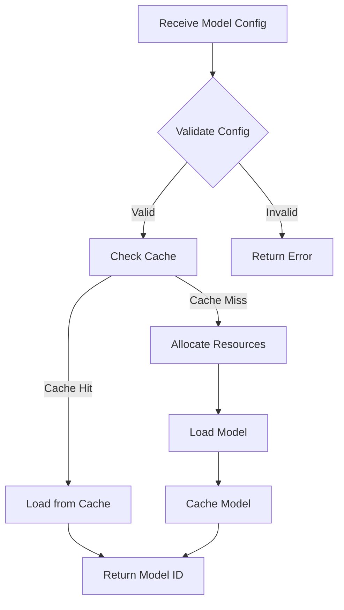
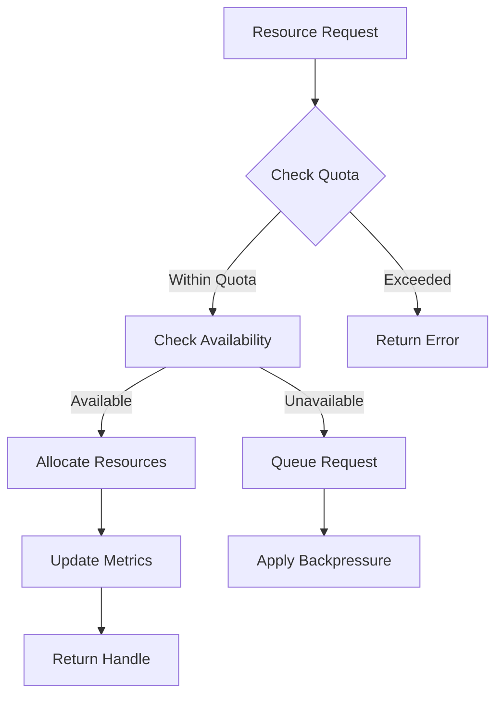

# AI Integration Specification

## Overview

The AI integration component of the MCP implementation handles model management, inference, and resource optimization.

## Specification

```yaml
metadata:
  title: "MCP AI Integration"
  description: "AI/ML model integration specification for MCP"
  version: "1.0.0"
  category: "component/ai"
  status: "draft"

machine_configuration:
  components:
    model_manager:
      description: "Manages AI model lifecycle"
      interfaces:
        - name: "ModelManager"
          methods:
            - name: "load_model"
              signature: "async fn load_model(&self, config: ModelConfig) -> Result<ModelId>"
              description: "Loads an AI model into memory"
            - name: "unload_model"
              signature: "async fn unload_model(&self, id: ModelId) -> Result<()>"
              description: "Unloads an AI model from memory"
            - name: "get_model"
              signature: "async fn get_model(&self, id: ModelId) -> Result<Model>"
              description: "Retrieves a loaded model"
    
    inference_engine:
      description: "Handles model inference"
      interfaces:
        - name: "InferenceEngine"
          methods:
            - name: "predict"
              signature: "async fn predict(&self, id: ModelId, input: Tensor) -> Result<Tensor>"
              description: "Runs inference on a model"
            - name: "batch_predict"
              signature: "async fn batch_predict(&self, id: ModelId, inputs: Vec<Tensor>) -> Result<Vec<Tensor>>"
              description: "Runs batch inference"
    
    resource_manager:
      description: "Manages compute resources"
      interfaces:
        - name: "ResourceManager"
          methods:
            - name: "allocate"
              signature: "async fn allocate(&self, requirements: ResourceConfig) -> Result<ResourceHandle>"
              description: "Allocates resources for a model"
            - name: "deallocate"
              signature: "async fn deallocate(&self, handle: ResourceHandle) -> Result<()>"
              description: "Releases allocated resources"
    
    cache_manager:
      description: "Manages model and inference caching"
      interfaces:
        - name: "CacheManager"
          methods:
            - name: "cache_model"
              signature: "async fn cache_model(&self, id: ModelId, data: ModelData) -> Result<()>"
              description: "Caches model data"
            - name: "cache_result"
              signature: "async fn cache_result(&self, key: CacheKey, result: Tensor) -> Result<()>"
              description: "Caches inference results"

  model_support:
    runtimes:
      - name: "ONNX Runtime"
        version: "1.15.0"
        features:
          - cpu_acceleration
          - gpu_support
          - quantization
      
      - name: "TensorFlow"
        version: "2.13.0"
        features:
          - keras_models
          - saved_models
          - tflite
      
      - name: "PyTorch"
        version: "2.0.0"
        features:
          - torchscript
          - cuda_support
          - distributed_training

  resource_management:
    allocation_strategy:
      - priority_based
      - fair_sharing
      - quota_enforcement
    
    resource_types:
      - cpu_cores
      - gpu_memory
      - system_memory
      - disk_space
    
    monitoring:
      metrics:
        - utilization
        - throughput
        - latency
        - cache_hits
      
      alerts:
        - resource_exhaustion
        - performance_degradation
        - error_rate_threshold

  optimization:
    techniques:
      - name: "Model Quantization"
        description: "Reduces model size and inference time"
        supported_types:
          - int8
          - float16
      
      - name: "Batch Processing"
        description: "Optimizes throughput for multiple requests"
        parameters:
          - batch_size
          - timeout
      
      - name: "Caching"
        description: "Caches frequent inference results"
        policies:
          - lru
          - time_based
          - size_based

technical_context:
  overview: |
    The AI integration component provides efficient model management and inference
    capabilities. It supports multiple ML frameworks, optimizes resource usage,
    and ensures high performance through various optimization techniques.

  constraints:
    - Models must be versioned and reproducible
    - Resource usage must be strictly controlled
    - Cache consistency must be maintained
    - Performance impact must be minimized

  dependencies:
    - onnxruntime: "ONNX Runtime integration"
    - tensorflow: "TensorFlow support"
    - torch: "PyTorch integration"
    - ndarray: "Tensor operations"

  notes:
    - "Framework support is pluggable"
    - "Resource management is critical"
    - "Caching strategy affects performance"
    - "Optimization techniques are configurable"
```

## Implementation Details

### Model Loading Process



### Resource Management



## Best Practices

1. **Model Management**
   - Version all models
   - Validate model compatibility
   - Implement graceful fallbacks
   - Monitor model performance

2. **Resource Optimization**
   - Use appropriate batch sizes
   - Implement efficient caching
   - Monitor resource usage
   - Apply quantization when possible

3. **Error Handling**
   - Provide detailed error messages
   - Implement retry mechanisms
   - Log all failures
   - Monitor error rates

4. **Performance**
   - Profile model performance
   - Optimize tensor operations
   - Monitor latency
   - Implement circuit breakers 